

  

<h3 align="center">
Universidad Peruana de Ciencias Aplicadas
</h3>

<h3 align="center">
Ingeniería de Software  
  
Ciclo: 2026-10
  
1ASI0728 - Arquitecturas de Software Emergentes
  
NRC: 17957
  
Profesor: Marino Humberto Jara Palacios  
  
<strong>Informe de Trabajo Final</strong>  
  
Startup: Apex Cybernetics
  
Producto: TaskMaster
  
<strong>Integrantes</strong>
  
</h3>

<table align="center">
  <tr>
    <th>Nombre</th>
    <th>Código</th>
  </tr>
  <tr>
    <td>Luquillas Asto, Omar</td>
    <td>U20211G641</td>
  </tr>
  <tr>
    <td>Peña Riofrio, Maria Fernanda</td>
    <td>U202113279</td>
  </tr>
  <tr>
    <td>Pilares Pocohuanca, Maria</td>
    <td>U202215528</td>
  </tr>
  <tr>
    <td>Sanchez Silva, Luciana Celeste</td>
    <td>U202215979</td>
  </tr>
  <tr>
    <td>Sandoval Paiva, Valentino</td>
    <td>U20211A962</td>
  </tr>
</table>

  

<h3 align="center">
Abril 2026
</h3>
 

## Registro de Versiones del Informe

| Versión | Fecha      | Autor                                       | Descripción de modificación                                                                                                                                                                                                                                                                                                                                                                                                          |
| ------- | ---------- | ------------------------------------------- | ------------------------------------------------------------------------------------------------------------------------------------------------------------------------------------------------------------------------------------------------------------------------------------------------------------------------------------------------------------------------------------------------------------------------------------ |
| TB1     | 09/04/2026 | Omar Luquillas Asto (U20211G641)            | Creación de la estructura inicial del informe. Strategic-Level Domain-Driven Design: EventStorming, Candidate Context Discovery, Domain Message Flows Modeling, Bounded Context Canvases, Context Mapping. Software Architecture: Software Architecture System Landscape Diagram, Software Architecture Context Level Diagrams, Software Architecture Container Level Diagrams, Software Architecture Deployment Diagrams.           |
| TB1     | 09/04/2026 | Sandoval Paiva, Valentino                   | To-Be Scenario Mapping: Definición del escenario futuro del sistema. User Stories: Redacción y estructuración de historias de usuario. Impact Mapping: Identificación de impactos y objetivos del producto. Product Backlog: Organización y priorización de funcionalidades del sistema.                                                                                                                                             |
| TB1     | 09/04/2026 | Sanchez Silva, Luciana Celeste (U202215979) | Startup Profile: Descripción de la Startup, Perfiles de integrantes del equipo. Solution Profile: Antecedentes y problemática. Lean UX Process: Lean UX Problem Statements, Lean UX Assumptions, Lean UX Hypothesis Statements, Lean UX Canvas. Segmentos objetivo: Definición del público objetivo del proyecto.                                                                                                                    |
| TB1     | 09/04/2026 | Pilares Pocohuanca, Maria (U202215528)      | Competidores: Identificación de competidores. Análisis competitivo: Evaluación de competidores. Estrategias y tácticas frente a competidores: Definición de acciones frente al mercado. Entrevistas: Diseño de entrevistas, Registro de entrevistas, Análisis de entrevistas. Needfinding: User Personas, User Task Matrix, Empathy Mapping, As-is Scenario Mapping. Ubiquitous Language: Definición del lenguaje común del dominio. |
| TB1     | 09/04/2026 | Peña Riofrio, Maria Fernanda (U202113279)   | Strategic-Level Attribute-Driven Design: Design Purpose, Attribute-Driven Design Inputs (Primary Functionality, Quality Attribute Scenarios, Constraints), Architectural Drivers Backlog, Architectural Design Decisions, Quality Attribute Scenario Refinements.                                                                                                                                                                    |

## Project Report Collaboration Insights

|  URL del repositorio del reporte  |
| :-----------------------------------: |
| [https://github.com/G2-Arqui-Emergentes/Report](https://github.com/G2-Arqui-Emergentes/Report) |

**TB1:**

**REPORT**

Luquillas Asto, Omar: 

Peña Riofrio, Maria Fernanda: 

Pilares Pocohuanca, Maria: 

Sanchez Silva, Luciana Celeste:	

Sandoval Paiva, Valentino: 

## Contenido

- [Student Outcome](#student-outcome)
- [Capítulo I: Introducción](#capítulo-i-introducción)
  - [1.1. Startup Profile](#11-startup-profile)
    - [1.1.1. Descripción de la Startup](#111-descripción-de-la-startup)
    - [1.1.2. Perfiles de integrantes del equipo](#112-perfiles-de-integrantes-del-equipo)
  - [1.2. Solution Profile](#12-solution-profile)
    - [1.2.1 Antecedentes y problemática](#121-antecedentes-y-problemática)
    - [1.2.2 Lean UX Process](#122-lean-ux-process)
        - [1.2.2.1 Lean UX Problem Statements](#1221-lean-ux-problem-statements)
        - [1.2.2.2 Lean UX Assumptions](#1222-lean-ux-assumptions)
        - [1.2.2.3 Lean UX Hypothesis Statements](#1223-lean-ux-hypothesis-statements)
        - [1.2.2.4 Lean UX Canvas](#1224-lean-ux-canvas)
  - [1.3. Segmentos objetivo](#13-segmentos-objetivo)

- [Capítulo II: Requirements Elicitation & Analysis](#capítulo-ii-requirements-elicitation--analysis)
  - [2.1. Competidores](#21-competidores)
    - [2.1.1. Análisis competitivo](#211-análisis-competitivo)
    - [2.1.2. Estrategias y tácticas frente a competidores](#212-estrategias-y-tácticas-frente-a-competidores)
  - [2.2. Entrevistas](#22-entrevistas)
    - [2.2.1. Diseño de entrevistas](#221-diseño-de-entrevistas)
    - [2.2.2. Registro de entrevistas](#222-registro-de-entrevistas)
    - [2.2.3. Análisis de entrevistas](#223-análisis-de-entrevistas)
  - [2.3. Needfinding](#23-needfinding)
    - [2.3.1. User Personas](#231-user-personas)
    - [2.3.2. User Task Matrix](#232-user-task-matrix)
    - [2.3.3. Empathy Mapping](#233-empathy-mapping)
    - [2.3.4. As-is Scenario Mapping](#234-as-is-scenario-mapping)
  - [2.4. Ubiquitous Language](#24-ubiquitous-language)

- [Capítulo III: Requirements Specification](#capítulo-iii-requirements-specification)
  - [3.1. To-Be Scenario Mapping](#31-to-be-scenario-mapping)
  - [3.2. User Stories](#32-user-stories)
  - [3.3. Impact Mapping](#33-impact-mapping)
  - [3.4. Product Backlog](#34-product-backlog)

- [Capítulo IV: Strategic-Level Software Design](#capítulo-iv-strategic-level-software-design)
  - [4.1. Strategic-Level Attribute-Driven Design](#41-strategic-level-attribute-driven-design)
    - [4.1.1. Design Purpose](#411-design-purpose)
    - [4.1.2. Attribute-Driven Design Inputs](#412-attribute-driven-design-inputs)
        - [4.1.2.1. Primary Functionality](#4121-primary-functionality-primary-user-stories)
        - [4.1.2.2. Quality Attribute Scenarios](#4122-quality-attribute-scenarios)
        - [4.1.2.3. Constraints](#4123-constraints)
    - [4.1.3. Architectural Drivers Backlog](#413-architectural-drivers-backlog)
    - [4.1.4. Architectural Design Decisions](#414-architectural-design-decisions)
    - [4.1.5. Quality Attribute Scenario Refinements](#415-quality-attribute-scenario-refinements)
  - [4.2. Strategic-Level Domain-Driven Design](#42-strategic-level-domain-driven-design)
    - [4.2.1. EventStorming](#421-eventstorming)
    - [4.2.2. Candidate Context Discovery](#422-candidate-context-discovery)
    - [4.2.3. Domain Message Flows Modeling](#423-domain-message-flows-modeling)
    - [4.2.4. Bounded Context Canvases](#424-bounded-context-canvases)
    - [4.2.5. Context Mapping](#425-context-mapping)
  - [4.3. Software Architecture](#43-software-architecture)
    - [4.3.1. System Landscape Diagram](#431-software-architecture-system-landscape-diagram)
    - [4.3.2. Context Level Diagrams](#432-software-architecture-context-level-diagrams)
    - [4.3.3. Container Level Diagrams](#433-software-architecture-container-level-diagrams)
    - [4.3.4. Deployment Diagrams](#434-software-architecture-deployment-diagrams)

- [Conclusiones](#conclusiones)
  - [Conclusiones y recomendaciones](#conclusiones-y-recomendaciones)

- [Bibliografía](#bibliografía)

- [Anexos](#anexos)

## Student Outcome

El curso contribuye al cumplimiento del Student Outcome ABET: 
**ABET – EAC - Student Outcome 3**

**Criterio:** *Capacidad de comunicarse efectivamente con un rango de audiencias.* 
En el siguiente cuadro se describe las acciones realizadas y enunciados de conclusiones por parte del grupo, que permiten sustentar el haber alcanzado el logro del ABET – EAC - Student Outcome 3.

<table>
  <thead>
    <tr>
      <th>Criterio específico</th>
      <th>Acciones realizadas</th>
      <th>Conclusiones</th>
    </tr>
  </thead>
  <tbody>
    <tr>
      <td><strong>Comunica oralmente sus ideas y/o resultados con objetividad a público de diferentes especialidades y niveles jerárquicos, en el marco del desarrollo de un proyecto en ingeniería.</strong></td>
      <td>
        Luquillas Asto, Omar 
        <em>TB1</em> Fortalecí la comunicación oral al explicar soluciones técnicas del sistema, argumentando el uso de tecnologías y proponiendo ideas de manera estructurada.   
        Peña Riofrio, Maria Fernanda 
        <em>TB1</em>  Reconocí la importancia de una comunicación oral efectiva al participar en la coordinación y explicación de ideas dentro del equipo, asegurando la comprensión de todos los integrantes.   
        Pilares Pocohuanca, Maria 
        <em>TB1</em>  Desarrollé habilidades de comunicación oral al exponer ideas del proyecto y colaborar en la organización de la información, facilitando su entendimiento en el equipo.   
        Sanchez Silva, Luciana Celeste 
        <em>TB1</em>  Desarrollé la capacidad de comunicar ideas de forma oral al exponer los objetivos y la estructura del proyecto, organizando la información de manera clara y comprensible para el equipo.   
        Sandoval Paiva, Valentino 
        <em>TB1</em>  Mejoré la comunicación de conceptos técnicos al explicar aspectos como bases de datos y herramientas utilizadas, adaptando el lenguaje según el nivel de conocimiento del público.
      </td>
      <td>
        TB1:  La elaboración del proyecto permitió fortalecer la capacidad del equipo para comunicar ideas y resultados de manera clara, objetiva y estructurada, adaptando el lenguaje según el nivel técnico del público. Asimismo, se desarrollaron habilidades de trabajo colaborativo y exposición de propuestas, facilitando la comprensión de soluciones de ingeniería y contribuyendo a una mejor toma de decisiones durante el desarrollo del proyecto.
      </td>
    </tr>
    <tr>
      <td><strong>Comunica en forma escrita ideas y/o resultados con objetividad a público de diferentes especialidades y niveles jerárquicos, en el marco del desarrollo de un proyecto en ingeniería.</strong></td>
      <td>
        Luquillas Asto, Omar 
        <em>TB1</em>  Fortalecí la comunicación escrita al documentar soluciones técnicas del sistema, explicando de manera objetiva el uso de tecnologías y procesos implementados.   
        Peña Riofrio, Maria Fernanda 
        <em>TB1</em>  Reconocí la importancia de la comunicación escrita efectiva al participar en la redacción y revisión del informe, asegurando coherencia, orden y comprensión del contenido.   
        Pilares Pocohuanca, Maria 
        <em>TB1</em>  Desarrollé habilidades de comunicación escrita al contribuir en la elaboración del documento final, organizando ideas de manera estructurada y accesible para diferentes niveles de conocimiento.   
        Sanchez Silva, Luciana Celeste 
        <em>TB1</em>  Desarrollé la capacidad de comunicar ideas de forma escrita al estructurar secciones del informe del proyecto, organizando la información de manera clara y coherente para distintos tipos de lectores.   
        Sandoval Paiva, Valentino 
        <em>TB1</em>  Mejoré la redacción técnica al describir componentes del sistema, como bases de datos y herramientas utilizadas, asegurando claridad y precisión en la información presentada.
      </td>
      <td>
        TB1:  La elaboración del proyecto permitió fortalecer la capacidad del equipo para comunicar ideas y resultados de forma escrita de manera clara, objetiva y estructurada, adaptando el nivel de detalle según el público. Asimismo, se consolidaron habilidades en la redacción técnica y organización de la información, facilitando la documentación de soluciones de ingeniería y mejorando la comprensión del proyecto en distintos niveles.
      </td>
    </tr>
  </tbody>
</table>

## Capítulo I: Introducción

### 1.1. Startup Profile

En el actual paradigma de la transformación digital, las organizaciones se enfrentan a un fenómeno crítico de fragmentación tecnológica. La dependencia sistémica de herramientas heterogéneas e inconexas, como hojas de cálculo de baja escala, protocolos de comunicación asíncronos (correos electrónicos) y plataformas de mensajería instantánea, ha derivado en un “ruido operativo” que limita la escalabilidad, duplica los esfuerzos y reduce la eficiencia de los equipos de trabajo. Esta falta de interoperabilidad compromete la integridad de los datos y la visibilidad transversal del ciclo de vida del proyecto.

Frente a esta problemática, nuestra startup Apex Cybernetics surge como una solución que va más allá de centralizar información. Nuestro objetivo es transformar los datos en inteligencia accionable. A través de la integración de Inteligencia Artificial (IA) y Automatización Robótica de Procesos (RPA), evolucionamos de una gestión reactiva basada en el pasado hacia una gestión predictiva, permitiendo a los equipos anticiparse a los escenarios futuros y mejorar la toma de decisiones en tiempo real.

#### 1.1.1. Descripción de la Startup

Nuestra empresa se dedica a crear herramientas digitales que ayudan a los equipos de trabajo a organizarse mejor y a cuidar sus recursos. Nos enfocamos en pequeñas y medianas empresas (pymes) que necesitan una solución efectiva para gestionar sus proyectos, pero sin la complicación o los altos costos de los programas tradicionales.

Para lograrlo, hemos desarrollado TaskMaster, una plataforma de gestión de proyectos que no solo sirve para organizar tareas, sino que utiliza tecnología avanzada para facilitar el trabajo diario:

**Objetivo:** Brindar a las empresas una solución centralizada que combine la planificación de tareas con el control financiero, mejorando la eficiencia y la comunicación mediante el uso de inteligencia y automatización.

**Misión:** Potenciar la productividad de las organizaciones mediante una plataforma que combine gestión humana y eficiencia tecnológica (IA/RPA) para asegurar la entrega exitosa de proyectos.

**Visión:** Ser el referente latinoamericano en software de gestión inteligente, liderando la adopción de automatización y analítica predictiva en el sector empresarial para 2030.

#### 1.1.2. Perfiles de integrantes del equipo

|  | Miembros del equipo | Codigo de estudiante | Descripción |
|-----------|-----------|-----------|-----------|
|     | Luciana Celeste Sanchez Silva   | U202215979    | Mi nombre es Luciana Celeste Sanchez Silva, tengo 20 años y vivo en Lima. En la actualidad, me encuentro estudiando el 5to ciclo de la carrera de ingeniería de software en la UPC debido a que desde una edad temprana tuve una fascinación relacionada con el uso de la tecnología y la programación. En mi tiempo libre trato de crecer y expandir mi conocimiento en todas las áreas posibles. De igual forma, me gusta nadar, escuchar música y tocar la guitarra. Me comprometo a colaborar en todo momento con la elaboración de esta startup, y llegar a un trabajo sobresaliente. Mis habilidades son: responsabilidad, resolución de problemas, y disciplina.    |
|     | Omar Luquillas Asto    | U20211G641    | Soy estudiante de la carrera de Ingeniería de Software. Elegí esta carrera porque me apasiona la tecnología, el desarrollo de software y la programación. Tengo conocimientos en lenguajes de programación como C++, Python y Java. Me considero una persona investigadora, ya que me gusta aprender cosas nuevas y siempre estoy en busca de soluciones creativas e innovadoras que generen un impacto positivo en la vida de las personas. Además, valoro el trabajo en equipo, soy responsable y me comprometo a cumplir con mis tareas de manera eficiente.    |
|    |  Valentino Sandoval Paiva   | U20211A962   | Soy Valentino Sandoval, tengo 20 años y soy estudiante de la carrera de Ingeniería de Software. Tengo conocimiento en lenguajes de programación como python y c++, y bases de datos como SQLServer y MongoDB. Desde pequeño me sentí atraído por la tecnología, por lo que me decidí a estudiar la carrera, además disfruto de jugar videojuegos con amigos en mi tiempo libre.   |
|     | Maria Fernanda Peña Riofrio   | U202113279   | Mi nombre es Maria Fernanda Peña Riofrio, tengo 21 años, estudio el 6to ciclo de la carrera de Ingeniería de Software en la Universidad Peruana de Ciencias Aplicadas (UPC). Soy una persona responsable y me gusta ayudar a las demás personas, esto sera evidenciado en el transcuros del proyecto ayudando a mis demás compañeros de equipo. En mis tiempos libres me gusta mucho leer, escuchar música e investigar sobre temas de mi interes.    |
|      | Maria Pilares Pocohuanca   | U202215528    | Mi nombre es Maria Pilares Pocohuanca tengo 22 años y estudio la carrera de ingeniería de software en la UPC. Desde niña tuve mucho interés por las matemáticas y la tecnología, motivo por el cual estudio una ingeniería enfocada más a la programación. Me considero una persona perseverante aunque algo impaciente. Sin embargo, como miembro del equipo me comprometo a colaborar con mis compañeros y realizar todas las indicaciones que se dicten, todo con el fin de presentar un buen proyecto.   |

### 1.2. Solution Profile

TaskMaster es una solución integral diseñada para eliminar el caos operativo causado por el uso de herramientas desconectadas. A diferencia de un gestor de tareas tradicional, nuestra plataforma actúa como un ecosistema inteligente que centraliza la comunicación, el avance técnico y el control financiero en un solo lugar.

**La solución se basa en tres pilares de innovación:**

- Centralización de la Gestión de Proyectos: Unificamos tareas, cronogramas y comunicación en un solo espacio digital. Esto elimina la necesidad de saltar entre múltiples aplicaciones, permitiendo que toda la información del proyecto esté siempre organizada y disponible.

- Colaboración Activa y en Tiempo Real: Facilitamos que los miembros del equipo actualicen sus avances de forma instantánea. Gracias a la Automatización con RPA, el sistema genera notificaciones inteligentes, recordatorios de vencimiento y alertas automáticas, asegurando que todos estén alineados sin esfuerzo manual.

- Asignación de Responsabilidades y Roles: Estructuramos el trabajo mediante roles definidos (jefes de proyecto y miembros). Esta base permite que nuestra IA de Analítica analice el rendimiento individual, detecte tareas atrasadas y sugiera una distribución justa de la carga de trabajo para evitar el agotamiento del equipo.

- Seguimiento Visual Avanzado: Proporcionamos una visibilidad total mediante tableros visuales y calendarios interactivos. Estos se complementan con Indicadores de Riesgo por IA, que funcionan como alertas inteligentes para identificar visualmente si un proyecto corre el riesgo de retrasarse o exceder su presupuesto.

**Restricciones y Alcance**

- Restricciones técnicas: la plataforma debe ser accesible desde dispositivos móvile, con una interfaz intuitiva y adaptable.
- Alcance inicial: orientada a pequeñas y medianas empresas que requieren optimizar la gestión de proyectos sin recurrir a soluciones costosas y complejas.

#### 1.2.1 Antecedentes y problemática

En el entorno empresarial actual, la dependencia de herramientas dispersas (Excel, correos, mensajería y sistemas aislados) genera una gestión fragmentada que reduce la productividad, desperdicia tiempo y afecta los resultados financieros. Un informe de Quickbase (2023) vincula esta fragmentación con pérdidas significativas de eficiencia, mientras que Atlassian (2024) señala que el 56 % de los trabajadores enfrenta flujos de trabajo desconectados, limitando la visibilidad y la colaboración.

Para comprender mejor esta problemática, la analizamos mediante el modelo 5W2H, incorporando además el impacto de la ausencia de tecnologías predictivas.

1. **What / ¿Qué?**

    -  *¿Cuál es el problema?* La gestión fragmentada en herramientas manuales (Excel, chats) provoca pérdida de datos y falta de previsión. Las empresas no saben que un proyecto fallará hasta que ya es tarde, debido a la ausencia de análisis predictivo.

   - *¿Cuál es la relación con la persona en cuestión?* Los líderes se saturan con tareas administrativas (hacer reportes, enviar recordatorios) y los equipos sufren por cargas de trabajo mal distribuidas.

2. **When / Cuándo?**

    - *¿Cuándo sucede el problema?* Durante todo el ciclo del proyecto, pero se vuelve crítico en las fechas de entrega, donde la falta de alertas automáticas (RPA) genera retrasos acumulados.

    - *¿Cuándo utiliza el cliente el producto?* Diariamente, como panel central para recibir instrucciones de la IA y actualizaciones de los bots de notificación.

3. ***Where / Dónde?***

    - *¿Dónde está el cliente cuando usa el producto?* En entornos de oficina, en modalidad híbrida o trabajo remoto. El producto se usa principalmente desde computadoras y dispositivos móviles.

    -*¿Dónde surge el problema?* En la dispersión digital: cuando la información está repartida en varias aplicaciones no integradas.

4. **Who / Quién?**

    - *¿Quiénes se ven involucrados en el problema?* Jefes de proyecto (PM) que necesitan visibilidad de riesgo y miembros del equipo que requieren claridad en sus prioridades.

    - *¿Cuáles son las causas del problema?* Uso de demasiadas aplicaciones sin integración, dependencia de procesos manuales y falta de una IA que analice el rendimiento en tiempo real.

5. **Why / ¿Por qué?**

    - *¿Por qué sucede el problema?* Porque las soluciones actuales solo registran información pasada y aislada (calendarios, chats, finanzas, gestión de tareas), pero no ayudan a predecir el futuro del proyecto. Esto genera duplicidad de trabajo y decisiones basadas en suposiciones, no en datos.

6. **How / Cómo?**

    - *¿En qué condiciones los clientes usan nuestro producto?* Equipos bajo presión con fechas límite estrictas y presupuestos limitados que no pueden permitirse el lujo de perder tiempo en tareas administrativas manuales.

    - *¿Cómo se diferencia el problema del estado normal (óptimo)?* En un estado óptimo, el sistema debería avisar de un retraso antes de que ocurra. Actualmente, la fricción entre sistemas impide esta proactividad.

7. **How Much / Cuánto?**

    - *¿Cuántos problemas se dan en un día, una semana o un mes?* Según Quickbase (2023), el 70 % de los empleados pierde hasta 20 horas por semana debido a sistemas fragmentados. Esto equivale a medio tiempo laboral desperdiciado por cada trabajador.

    - *¿Cuánto dinero están implicando?* Atlassian (2024) reporta que las organizaciones con ecosistemas desconectados tienen un 37 % menos probabilidad de cumplir sus metas de ingresos. Además, Forrester (2024) encontró que el 76 % de las PMOs usan cinco o más herramientas por proyecto, generando pérdidas de hasta un 23 % del tiempo semanal en tareas redundantes.

#### 1.2.2 Lean UX Process

Según Pragma (2021), el proceso Lean UX es la mezcla de metodologías ágiles y temas de usabilidad, donde se prioriza la experiencia de usuario por la creación de un producto. Teniendo en cuenta ello, hemos elaborado nuestro Lean UX process basándonos en sus cuatro pilares principales: problem statements, assumptions, hypothesis y canvas.

##### 1.2.2.1 Lean UX Problem Statements

**Problem Statement #1 – Líderes de Proyecto (Foco en Predicción) :**
Hemos identificado que los líderes de proyecto en pymes dedican excesivo tiempo al análisis manual de datos para identificar retrasos, lo que impide una reacción oportuna. El problema es que las herramientas actuales son reactivas (muestran lo que ya pasó). ¿Cómo podemos utilizar la IA de analítica predictiva  y los indicadores de riesgo  para que los líderes visualicen amenazas antes de que afecten el cronograma, permitiéndoles tomar decisiones estratégicas basadas en datos en lugar de suposiciones?

**Problem Statement #2 – Miembros de Equipo (Foco en Productividad) :**
Los colaboradores enfrentan confusión y agotamiento debido a cargas de trabajo desequilibradas y al constante "ruido" de mensajes manuales para reportar avances. ¿Cómo podemos implementar un sistema de notificaciones inteligentes mediante RPA que automatice el seguimiento y una IA que equilibre las tareas, para que el equipo se enfoque exclusivamente en la ejecución técnica sin distracciones administrativas?

##### 1.2.2.2 Lean UX Assumptions

**Business Assumptions (Suposiciones de Negocio)**

- Creo que mis clientes tienen la necesidad de: Centralizar la gestión de proyectos en una sola plataforma, evitando el uso disperso de herramientas como Excel, correos y chats, y eliminando la carga administrativa de realizar reportes y seguimientos manuales.

- Estas necesidades se pueden resolver con: Una plataforma digital colaborativa que integre tableros Kanban, calendarios, asignación de tareas, un módulo financiero básico y, fundamentalmente, tecnologías inteligentes (IA y RPA) para la analítica de rendimiento y la automatización de notificaciones.

- Mis clientes iniciales son (o serán): Pequeñas y medianas empresas (pymes) con equipos de desarrollo o áreas de proyectos que buscan mejorar la organización, el control de sus recursos y la previsión de riesgos mediante datos en tiempo real.

- El valor principal que los clientes quieren obtener de mi servicio es: Mayor eficiencia y visibilidad en la planificación y ejecución de proyectos. Beneficios adicionales: Mejor colaboración entre miembros, reducción de errores mediante alertas de riesgo (IA), control preciso de presupuestos y reportes automáticos para decisiones estratégicas.

- Adquiriré a la mayoría de mis clientes a través de: Estrategias de marketing digital (redes sociales, LinkedIn), demostraciones gratuitas de la plataforma enfocadas en la automatización y recomendaciones entre contactos en el sector empresarial tecnológico.

- Ganaré dinero mediante: Un modelo de licenciamiento (SaaS), con una versión gratuita limitada y planes de pago escalables según el tamaño de la empresa, el número de miembros y el nivel de acceso a las herramientas de analítica avanzada.

- Mi principal competencia en el mercado será: Plataformas similares como Trello, Asana o Jira. Los superaremos debido a: Un enfoque en la integración financiera simple, el uso de IA predictiva y RPA nativo para reducir el trabajo operativo, precios más accesibles para pymes y una interfaz móvil intuitiva que no requiere capacitación extensa.

- Mi mayor riesgo de producto es: Que las empresas perciban a **name** como una herramienta redundante frente a soluciones ya conocidas. Lo resolveremos mediante: Una diferenciación clara en la propuesta de valor (finanzas integradas + automatización inteligente) y versiones de prueba gratuitas que demuestren el ahorro real de tiempo.

- Otras suposiciones que, si resultan falsas, harán que nuestro proyecto fracase:

  - Que las pymes estén dispuestas a invertir en una solución digital pagada en lugar de continuar con herramientas gratuitas y procesos manuales.

  - Que los usuarios puedan adoptar rápidamente las funciones de IA y RPA sin percibir complejidad técnica en la plataforma.

**User Assumptions (Suposiciones de Usuario)**

- ¿Quién es el usuario?: Nuestros usuarios son líderes o gerentes de empresas con roles como Product Owners, Scrum Masters o jefes de proyectos, así como los miembros de los equipos de desarrollo y colaboradores que ejecutan las tareas técnicas y operativas.

- ¿Dónde encaja nuestro producto en su trabajo o vida?: Dentro del entorno laboral diario, funcionando no solo como un registro de tareas, sino como un asistente inteligente que ayuda en la planificación, asignación y el seguimiento preventivo de los proyectos.

- ¿Qué problemas resuelve nuestro producto?:

  - La dispersión de información entre múltiples canales (Excel, chats, correos).

  - La falta de visibilidad en tiempo real sobre el progreso y los posibles riesgos de retraso.

  - La carga administrativa de realizar reportes manuales y enviar recordatorios constantes.

  - Las dificultades para controlar presupuestos y plazos de forma integrada.

- ¿Cuándo y cómo se usa nuestro producto?: Se utiliza de forma continua durante la jornada laboral. Los líderes lo consultan para revisar indicadores de riesgo y métricas de rendimiento (IA), mientras que los colaboradores lo usan en dispositivos móviles para recibir notificaciones inteligentes (RPA), registrar avances y gestionar sus tareas pendientes.

- ¿Qué características son importantes?:

  - Seguimiento visual mediante tableros Kanban y calendarios.

  - Analítica predictiva : Reportes automáticos de rendimiento y carga de trabajo.

  - Alertas de riesgo : Indicadores inteligentes que anticipan retrasos.

  - Automatización : Notificaciones y recordatorios autónomos mediante RPA.

- ¿Cómo debería verse y comportarse nuestro producto?: Debe tener una interfaz moderna, intuitiva y fácil de aprender. Su comportamiento debe ser proactivo: en lugar de solo esperar datos, el sistema debe alertar al usuario sobre eventos importantes (como un riesgo de atraso o una sobrecarga de tareas) de manera visual y clara, con un diseño totalmente adaptable a móviles.

##### 1.2.2.3 Lean UX Hypothesis Statements

- **Hypothesis Statement 01 (Centralización e IA):**
Creemos que centralizar tareas, cronogramas y comunicación en una sola plataforma potenciada por IA para pymes aumentará la eficiencia operativa.
Sabremos que estamos en lo correcto cuando veamos que más del 70 % de los usuarios reporten una migración total desde herramientas externas como Excel o chats dispersos hacia la plataforma.

- **Hypothesis Statement 02 (Visibilidad de Riesgo):**
Creemos que implementar tableros Kanban con indicadores de riesgo basados en IA mejorará la capacidad de reacción de los líderes.
Sabremos que estamos en lo correcto cuando recibamos retroalimentación positiva en encuestas de usabilidad y veamos un incremento del 40 % en la interacción con los módulos de alerta temprana.

- **Hypothesis Statement 03 (Control Financiero):**
Creemos que ofrecer un módulo financiero básico integrado con alertas de presupuesto facilitará el control de recursos a los gerentes.
Sabremos que estamos en lo correcto cuando observemos que al menos el 60 % de los clientes activos utilicen semanalmente el módulo de estados de pago y presupuestos.

- **Hypothesis Statement 04 (Adopción de Tecnología):**
Creemos que una interfaz intuitiva permitirá que los usuarios adopten las funciones de IA y RPA sin necesidad de capacitación técnica.
Sabremos que estamos en lo correcto cuando nuevos usuarios completen su primera tarea y configuren su primera alerta automática en menos de 10 minutos.

- **Hypothesis Statement 05 (Conversión):**
Creemos que ofrecer una versión de prueba gratuita que incluya funciones básicas de analítica atraerá a clientes de pago.
Sabremos que estamos en lo correcto cuando al menos el 30 % de los usuarios de prueba realicen el "upgrade" a un plan premium tras probar la automatización.

- **Hypothesis Statement 06 (Toma de Decisiones):**
Creemos que integrar métricas de desempeño generadas por IA mejorará la toma de decisiones estratégicas.
Sabremos que estamos en lo correcto cuando el 80 % de los líderes reporten mayor confianza y rapidez al presentar reportes de avance a sus superiores.

- **Hypothesis Statement 07 (Gestión de Carga):**
Creemos que el análisis de la carga de trabajo por IA  permitirá una asignación de roles y tareas más equitativa.
Sabremos que estamos en lo correcto cuando las métricas internas muestren una reducción del 50 % en tareas duplicadas o miembros de equipo con sobrecarga crítica.

- **Hypothesis Statement 08 (Movilidad):**
Creemos que priorizar el acceso móvil incrementará la frecuencia de actualización de tareas en tiempo real.
Sabremos que estamos en lo correcto cuando veamos que más del 50 % de las interacciones con notificaciones inteligentes provengan de dispositivos móviles.

- **Hypothesis Statement 09 (Competitividad):**
Creemos que un precio escalable junto a funciones de IA nativas atraerá a pymes que hoy ven a Jira o Asana como herramientas costosas o complejas.
Sabremos que estamos en lo correcto cuando los clientes destaquen la relación costo-automatización en entrevistas cualitativas.

- **Hypothesis Statement 10 ( Reducción Administrativa):**
Creemos que brindar reportes automáticos de rendimiento eliminará el trabajo manual de los líderes de proyecto.
Sabremos que estamos en lo correcto cuando los usuarios indiquen que han sustituido por completo la generación manual de reportes en Excel por las exportaciones de nuestra IA.

- **Hypothesis Statement 11 (Retención):**
Creemos que un diseño visual moderno y una experiencia de usuario fluida motivarán un uso constante de la plataforma.
Sabremos que estamos en lo correcto cuando los usuarios activos diarios (DAU) se conecten al menos 3 veces por semana para revisar sus indicadores.

- **Hypothesis Statement 12 (Automatización RPA):**
Creemos que los recordatorios automáticos y alertas por vencimiento  mediante RPA reducirán los retrasos en las entregas.
Sabremos que estamos en lo correcto cuando el porcentaje de tareas finalizadas en la fecha establecida aumente un 15 % mes a mes.

- **Hypothesis Statement 13 (Satisfacción):**
Creemos que un soporte técnico integrado y accesible aumentará la lealtad del cliente hacia la plataforma.
Sabremos que estamos en lo correcto cuando el CSAT (Customer Satisfaction Score) de soporte sea superior a 4.5/5.

- **Hypothesis Statement 14 (Escalabilidad Interna):**
Creemos que la segmentación de proyectos por áreas facilitará la gestión en empresas con múltiples equipos de desarrollo.
Sabremos que estamos en lo correcto cuando las empresas clientes gestionen más de 3 proyectos simultáneos utilizando nuestras funciones de analítica cruzada.

- **Hypothesis Statement 15 (Seguridad de Datos):**
Creemos que la seguridad en el manejo de datos financieros y de rendimiento incrementará la confianza de los niveles gerenciales.
Sabremos que estamos en lo correcto cuando la tasa de abandono por preocupaciones de privacidad sea 0 % y los usuarios den feedback positivo sobre la encriptación de sus presupuestos.

##### 1.2.2.4 Lean UX Canvas

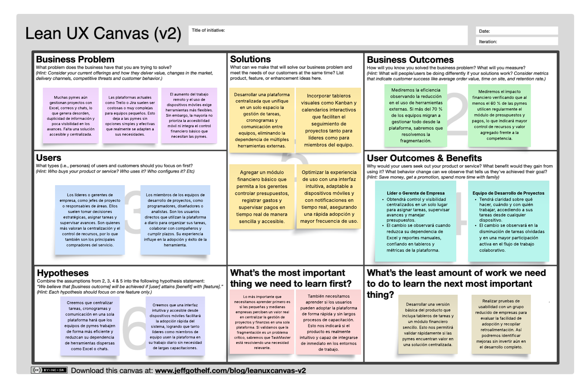

### 1.3. Segmentos objetivo

**Segmento Objetivo 1: Líder o Gerente de Empresa**

Este segmento corresponde a profesionales que ocupan cargos de liderazgo dentro de organizaciones del sector tecnológico o empresarial, tales como gerentes de proyectos, jefes de innovación o líderes de área. Su rol principal consiste en tomar decisiones estratégicas, gestionar recursos y coordinar equipos en proyectos de desarrollo ágil.

- **Características Demográficas:**
En general, suelen encontrarse en el rango de edad de 30 a 50 años, cuentan con estudios universitarios o de posgrado, y residen principalmente en centros urbanos como Lima, Arequipa o Trujillo, donde se concentra la mayor cantidad de empresas con proyectos tecnológicos.

- **Información Estadística de Sustento:**
Según el Informe del INEI (2023), el 65 % de las empresas medianas y grandes del Perú se ubican en Lima Metropolitana, siendo estas las que mayormente adoptan metodologías de gestión de proyectos ágiles. Asimismo, un estudio de Everis y EY (2022) señala que más del 40 % de las empresas peruanas del sector financiero y tecnológico ya han implementado roles asociados a Scrum Master y Product Owner, lo que refleja la creciente relevancia de este segmento para proyectos de desarrollo ágil.

**Segmento Objetivo 2: Equipo de Desarrollo de Proyectos**

Este segmento está conformado por profesionales que se desempeñan como programadores, diseñadores, analistas de sistemas o testers. Su rol es implementar soluciones técnicas, colaborar en la construcción de software y adaptarse a metodologías ágiles bajo la guía de los líderes de proyecto.

- **Características Demográficas:**
En su mayoría, son profesionales jóvenes entre 22 y 35 años, muchos de ellos egresados recientes o estudiantes de los últimos ciclos de carreras de ingeniería de software, sistemas o afines. Están ubicados principalmente en Lima y en regiones con polos tecnológicos como Cusco, Arequipa y La Libertad. Se caracterizan por un alto nivel de adopción tecnológica y el uso frecuente de herramientas colaborativas.

- **Información Estadística de Sustento:**
De acuerdo con el Banco Interamericano de Desarrollo (BID, 2021), en el Perú se proyecta una demanda de más de 30,000 profesionales de tecnologías de la información hacia el 2025. Asimismo, la Encuesta Nacional de Innovación en la Industria (INEI, 2022) señala que un 37 % de las empresas que desarrollan proyectos de innovación tecnológica han incorporado equipos de desarrollo de software en su estructura, lo cual evidencia la importancia de este grupo como segmento objetivo.

## Capítulo II: Requirements Elicitation & Analysis

### 2.1. Competidores

En esta sección se expone un análisis de los principales competidores de WorkHub, poniendo el foco en aquellos que operan bajo modelos de negocio digitales similares o que, aunque no coincida por completo, ofrecen productos o servicios que se solapan parcialmente con nuestra propuesta. Se consideran tanto los competidores directos, que actúan en el mismo segmento de mercado, como los indirectos, que abarcan ámbitos relacionados con la organización de tareas, la planificación de actividades y la gestión colaborativa de equipos.

**1. Wrike**

**Descripción:**

Wrike es una plataforma de gestión de proyectos y trabajo colaborativo diseñada para equipos de distintos tamaños. Permite planificar, priorizar y dar seguimiento a tareas en tiempo real, con funcionalidades orientadas a mejorar la visibilidad del flujo de trabajo y la comunicación entre los miembros del equipo.

**Características principales:**
- Organización de proyectos mediante diagramas de Gantt, tableros Kanban, calendarios y listas.

- Creación de tareas, subtareas y dependencias para una planificación detallada.

- Colaboración centralizada con comentarios, menciones, archivos adjuntos y aprobaciones en línea.

- Automatización de flujos de trabajo y recordatorios para reducir tareas repetitivas.

- Reportes personalizables con métricas de desempeño y paneles de control en tiempo real.

- Integraciones con más de 400 herramientas, incluyendo Slack, Salesforce, Microsoft Teams y Google Workspace.

- Aplicación móvil con acceso a tareas, notificaciones y actualización de proyectos desde cualquier lugar.

**2. Trello**

**Descripción:**

Trello es una herramienta de gestión de proyectos basada en tableros Kanban, diseñada para facilitar la organización visual de tareas y proyectos. Su interfaz intuitiva y flexible lo convierte en una opción popular para equipos que buscan simplicidad y colaboración en tiempo real.

**Características principales:**

- Tableros, listas y tarjetas para organizar proyectos y tareas de forma visual.

- Personalización de tarjetas con etiquetas, fechas de vencimiento, checklists y archivos adjuntos.

- Colaboración en equipo mediante comentarios, menciones y notificaciones.

- Automatización de tareas con Butler (reglas, recordatorios y acciones automáticas).

- Integraciones con herramientas como Slack, Google Drive, Jira, Dropbox y más.

- Plantillas predefinidas para distintos tipos de proyectos y flujos de trabajo.

- Aplicación móvil con acceso completo a tableros y colaboración en cualquier lugar.

**3. ClickUp**

**Descripción:**

ClickUp es una plataforma de productividad y gestión de proyectos todo en uno que busca centralizar tareas, documentos, comunicación y seguimiento de objetivos en un solo lugar. Está pensada para equipos que necesitan una solución flexible y personalizable, adaptándose tanto a proyectos simples como a flujos de trabajo complejos.

**Características principales:**

- Organización de proyectos mediante listas, tableros Kanban, calendarios, cronogramas y diagramas de Gantt.

-Gestión detallada de tareas con subtareas, prioridades, dependencias y asignaciones múltiples.

- Colaboración en tiempo real con comentarios, menciones, chat integrado y documentos compartidos.

- Paneles de control e informes personalizables para monitorear productividad y avances.

- Funcionalidades de seguimiento de tiempo y estimaciones de esfuerzo.

- Automatización de procesos para reducir tareas repetitivas.

- Amplia integración con herramientas como Slack, GitHub, Zoom, Google Workspace, entre otras.

- Aplicación móvil y de escritorio con sincronización completa para trabajar desde cualquier dispositivo.

#### 2.1.1. Análisis competitivo

En esta sección se expone un análisis de los principales competidores de WorkHub, poniendo el foco en aquellos que operan bajo modelos de negocio digitales similares o que, aunque no coincida por completo, ofrecen productos o servicios que se solapan parcialmente con nuestra propuesta. Se consideran tanto los competidores directos, que actúan en el mismo segmento de mercado, como los indirectos, que abarcan ámbitos relacionados con la organización de tareas, la planificación de actividades y la gestión colaborativa de equipos.

**1. Wrike**

**Descripción:**

Wrike es una plataforma de gestión de proyectos y trabajo colaborativo diseñada para equipos de distintos tamaños. Permite planificar, priorizar y dar seguimiento a tareas en tiempo real, con funcionalidades orientadas a mejorar la visibilidad del flujo de trabajo y la comunicación entre los miembros del equipo.

**Características principales:**
- Organización de proyectos mediante diagramas de Gantt, tableros Kanban, calendarios y listas.

- Creación de tareas, subtareas y dependencias para una planificación detallada.

- Colaboración centralizada con comentarios, menciones, archivos adjuntos y aprobaciones en línea.

- Automatización de flujos de trabajo y recordatorios para reducir tareas repetitivas.

- Reportes personalizables con métricas de desempeño y paneles de control en tiempo real.

- Integraciones con más de 400 herramientas, incluyendo Slack, Salesforce, Microsoft Teams y Google Workspace.

- Aplicación móvil con acceso a tareas, notificaciones y actualización de proyectos desde cualquier lugar.

**2. Trello**

**Descripción:**

Trello es una herramienta de gestión de proyectos basada en tableros Kanban, diseñada para facilitar la organización visual de tareas y proyectos. Su interfaz intuitiva y flexible lo convierte en una opción popular para equipos que buscan simplicidad y colaboración en tiempo real.

**Características principales:**

- Tableros, listas y tarjetas para organizar proyectos y tareas de forma visual.

- Personalización de tarjetas con etiquetas, fechas de vencimiento, checklists y archivos adjuntos.

- Colaboración en equipo mediante comentarios, menciones y notificaciones.

- Automatización de tareas con Butler (reglas, recordatorios y acciones automáticas).

- Integraciones con herramientas como Slack, Google Drive, Jira, Dropbox y más.

- Plantillas predefinidas para distintos tipos de proyectos y flujos de trabajo.

- Aplicación móvil con acceso completo a tableros y colaboración en cualquier lugar.

**3. ClickUp**

**Descripción:**

ClickUp es una plataforma de productividad y gestión de proyectos todo en uno que busca centralizar tareas, documentos, comunicación y seguimiento de objetivos en un solo lugar. Está pensada para equipos que necesitan una solución flexible y personalizable, adaptándose tanto a proyectos simples como a flujos de trabajo complejos.

**Características principales:**

- Organización de proyectos mediante listas, tableros Kanban, calendarios, cronogramas y diagramas de Gantt.

-Gestión detallada de tareas con subtareas, prioridades, dependencias y asignaciones múltiples.

- Colaboración en tiempo real con comentarios, menciones, chat integrado y documentos compartidos.

- Paneles de control e informes personalizables para monitorear productividad y avances.

- Funcionalidades de seguimiento de tiempo y estimaciones de esfuerzo.

- Automatización de procesos para reducir tareas repetitivas.

- Amplia integración con herramientas como Slack, GitHub, Zoom, Google Workspace, entre otras.

- Aplicación móvil y de escritorio con sincronización completa para trabajar desde cualquier dispositivo.

#### 2.1.2. Estrategias y tácticas frente a competidores

### 2.2. Entrevistas

#### 2.2.1. Diseño de entrevistas

#### 2.2.2. Registro de entrevistas

#### 2.2.3. Análisis de entrevistas

### 2.3. Needfinding

#### 2.3.1. User Personas

#### 2.3.2. User Task Matrix

#### 2.3.3. Empathy Mapping

#### 2.3.4. As-is Scenario Mapping

### 2.4. Ubiquitous Language

## Capítulo III: Requirements Specification

La presente sección describe la especificación de requisitos del sistema propuesto, elaborada a partir del análisis de la información obtenida durante la etapa de investigación. Su objetivo es definir de manera clara las funcionalidades y características que deberá cumplir el producto digital, considerando las necesidades de los usuarios y el contexto del problema identificado.

Esta sección incluye el desarrollo de distintos artefactos que permiten estructurar la solución, tales como el To-Be Scenario Mapping, las User Stories, el Impact Map y el Product Backlog. Estos elementos facilitan la comprensión del comportamiento esperado del sistema, así como la priorización y organización de los requerimientos, permitiendo orientar el desarrollo bajo un enfoque ágil y centrado en el usuario.

### 3.1. To-Be Scenario Mapping

En esta sección se presenta el To-Be Scenario Mapping, el cual describe el escenario futuro de interacción de los usuarios con el sistema propuesto. Para su elaboración, el equipo siguió un proceso estructurado que incluyó la preparación del análisis, la generación de ideas mediante lluvia de ideas individual, la revisión y consolidación de actividades, así como la identificación y definición de las fases principales del proceso, organizadas como columnas.

Asimismo, se consideraron las dimensiones de Doing, Thinking y Feeling para cada User Persona, permitiendo comprender no solo las acciones que realizan, sino también sus percepciones y emociones durante la interacción con el sistema. Finalmente, el mapa To-Be fue contrastado conceptualmente con el escenario actual (As-Is), identificando mejoras significativas como la incorporación de analítica inteligente y automatización de procesos, las cuales optimizan la gestión de proyectos y la toma de decisiones.

**Segmento 1: Líder o gerente de proyectos de software**

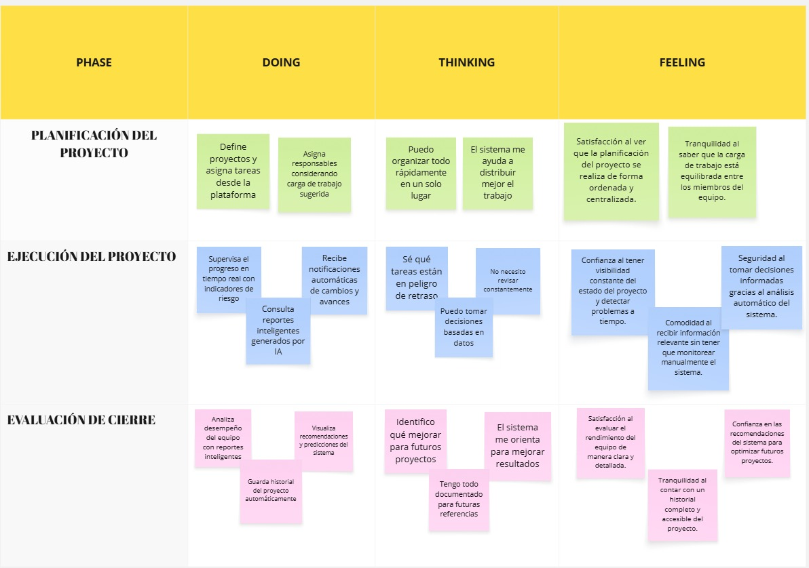

**Segmento 2: Miembro de un equipo de desarrollo de software**

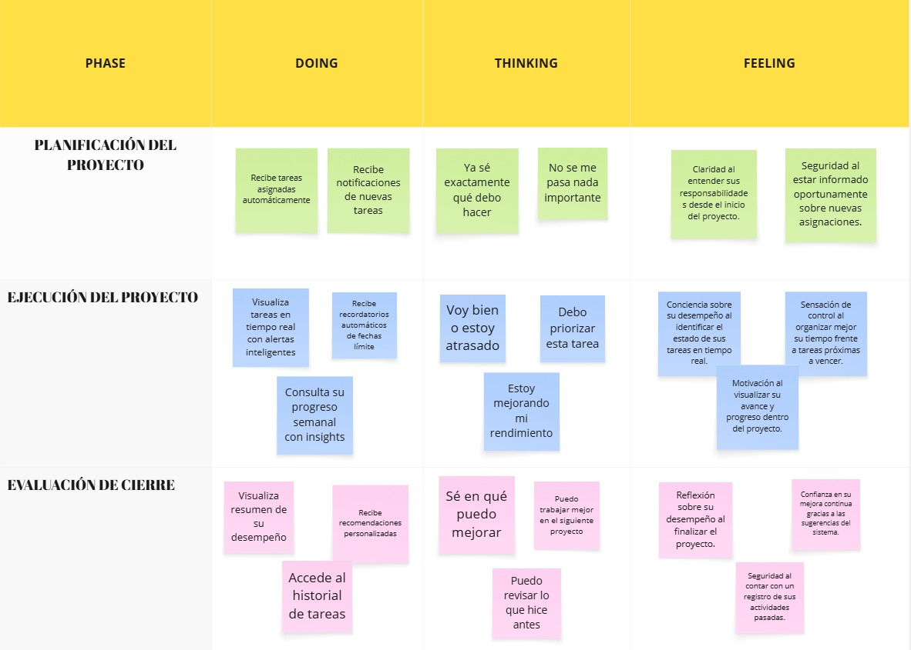

### 3.2. User Stories

Las User Stories fueron definidas siguiendo el enfoque ágil, describiendo funcionalidades desde la perspectiva del usuario e incluyendo criterios de aceptación bajo el formato Given-When-Then.

| **EPIC(ID)** | **Título**                              | **Descripción**                                                                                                                                                        |
| ------------ | --------------------------------------- | ---------------------------------------------------------------------------------------------------------------------------------------------------------------------- |
| **EP01**     | **Landing Page**                        | Como visitante, quiero acceder a una página de inicio clara que explique los beneficios de TaskMaster, para evaluar si es adecuado para mis necesidades.               |
| **EP02**     | **Registro y autentificacion de usuario** | Como trabajador, quiero registrarme y verificar mi identidad para acceder a TaskMaster, garantizando que solo personal autorizado pueda acceder a las funcionalidades. |
| **EP03**     | **Gestión de Proyectos y Tareas**       | Como líder de equipo, quiero gestionar proyectos y asignar tareas a los miembros del equipo para distribuir el trabajo de manera organizada.                           |
| **EP04**     | **Visualización y Seguimiento**         | Como miembro del equipo, quiero ver el progreso de mis tareas en tiempo real con indicadores inteligentes de riesgo y alertas, para anticipar retrasos y gestionar mejor mis responsabilidades.                                       |
| **EP05**     | **Analítica y Reportes**                | Como líder de equipo, quiero generar reportes inteligentes mediante inteligencia artificial para analizar el desempeño, predecir riesgos y mejorar la toma de decisiones.                  |
| **EP06**     | **Notificaciones**                      | Como miembro del equipo, quiero recibir notificaciones automatizadas basadas en eventos del sistema, para mantenerme informado y priorizar mi trabajo de manera eficiente.      |
| **EP07**     | **Integraciones Técnicas**              | Como desarrollador, quiero implementar un backend con servicios CRUD (crear, leer, actualizar y eliminar) para proyectos, tareas, usuarios y reportes, de modo que la lógica central de TaskMaster esté estructurada y mantenible  |
| **EP08**     | **Investigación y Validación Técnica**  | Como miembro del equipo de desarrollo, quiero validar la seguridad de TaskMaster mediante pruebas técnicas para garantizar la protección de los datos de los usuarios. |

| **Epic / User Story ID** | **Título**                                   | **Descripción**                                                                                                                                 | **Criterios de Aceptación**                                                                                                                                                                                                                                                                                                                                                                                                                             | **Relacionado con (Epic ID)** |
| ----------------------- | ------------------------------------------- | ----------------------------------------------------------------------------------------------------------------------------------------------- | --------------------------------------------------------------------------------------------------------------------------------------------------------------------------------------------------------------------------------------------------------------------------------------------------------------------------------------------------------------------------------------------------------------------------------------------------- | ----------------------------- |
| **US01**                | Información general sobre TaskMaster         | Como visitante, quiero entender rápidamente los beneficios y características de TaskMaster, para evaluar si se ajusta a mis necesidades.      | **ESCENARIO 01:** **DADO** que el visitante accede a la página principal, **CUANDO** hace scroll hacia la sección Características clave, **Y** el sistema carga la información correspondiente, **Y** las animaciones se activan al entrar en pantalla, **ENTONCES** el sistema muestra una lista visual destacada con las funciones principales de la aplicación, **Y** el visitante puede identificar fácilmente los beneficios del producto. | EP01 |
| **US02**                | Llamado a la acción para descargar la aplicación | Como visitante, quiero tener un botón de registro claro y accesible para descargar la aplicación.                                              | **ESCENARIO 01:** **DADO** que el visitante accede a la landing page, **CUANDO** visualiza el botón de registro ubicado en la parte superior o inferior, **Y** el botón está resaltado visualmente, **Y** hace clic sobre él, **ENTONCES** el sistema redirige al visitante a la tienda de aplicaciones correspondiente, **Y** se abre la página de descarga de TaskMaster. | EP01 |
| **US03**                | Testimonios de usuarios                      | Como visitante, quiero ver testimonios de usuarios reales de TaskMaster para confiar en su efectividad.                                       | **ESCENARIO 01:** **DADO** que el visitante se encuentra en la página de inicio, **CUANDO** baja hasta la sección de Testimonios, **Y** el sistema carga las reseñas de usuarios, **Y** las imágenes y textos se muestran correctamente, **ENTONCES** el sistema presenta los testimonios con texto y fotos de usuarios reales, **Y** genera confianza en la efectividad de la aplicación. | EP01 |
| **US04**                | Muestra de planes y precios                  | Como visitante, quiero ver las opciones de planes y precios de TaskMaster para poder elegir el más adecuado.                                  | **ESCENARIO 01:** **DADO** que el visitante accede a la página principal, **CUANDO** navega hasta la sección de Planes de suscripción, **Y** los datos de los planes están disponibles, **Y** el usuario visualiza la comparación entre ellos, **ENTONCES** el sistema muestra los distintos planes con sus características, **Y** cada plan incluye un botón para comparar o seleccionar. | EP01 |
| **US05**                | Adaptabilidad móvil                          | Como usuario móvil, quiero navegar la landing page sin problemas, para acceder a la información desde cualquier dispositivo.                  | **ESCENARIO 01:** **DADO** que el usuario accede desde un dispositivo móvil, **CUANDO** hace clic en el ícono del menú principal, **Y** el sistema detecta el tamaño de pantalla reducido, **Y** activa la versión responsive, **ENTONCES** se despliegan las opciones principales en un panel lateral, **Y** el fondo se oscurece para mejorar el contraste. | EP01 |
| **US06**                | Navegación mediante encabezado               | Como usuario, quiero un menú de navegación claro en el encabezado, para acceder fácilmente a las diferentes secciones de la página.          | **ESCENARIO 01:** **DADO** que el visitante explora la plataforma informativa, **CUANDO** utiliza las opciones de navegación del encabezado, **Y** selecciona una sección, **Y** el encabezado permanece visible durante el desplazamiento, **ENTONCES** el sistema redirige al usuario a la sección seleccionada, **Y** mantiene accesible el menú para navegación continua. | EP01 |
| **US07**                | Misión y visión                              | Como visitante interesado, quiero conocer la visión y misión de la empresa, para entender sus objetivos a largo plazo y su proyección de futuro. | **ESCENARIO 01:** **DADO** que el visitante navega por la sección Sobre la empresa, **CUANDO** busca información sobre las metas futuras y actuales, **Y** la sección se despliega correctamente, **Y** el contenido es legible, **ENTONCES** el sistema muestra claramente la declaración de Misión y Visión, **Y** permite al visitante comprender los objetivos de la empresa. | EP01 |
| **US08**                | About the Team                               | Como visitante quiero acceder a la sección About the Team para conocer quiénes son los integrantes y su rol en el proyecto.                  | **ESCENARIO 01:** **DADO** que el visitante accede a la landing page, **CUANDO** hace scroll o selecciona el enlace About the Team, **Y** el sistema carga la información del equipo, **Y** las imágenes y textos se renderizan correctamente, **ENTONCES** se muestra una sección con nombres, fotos, roles y una breve descripción de cada integrante, **Y** el visitante puede conocer quiénes conforman el equipo. | EP01 |
| **US09**                | Pie de página                                | Como visitante quiero visualizar un pie de página con enlaces a secciones clave para encontrar fácilmente información adicional y mantenerme conectado con la plataforma. | **ESCENARIO 01:** **DADO** que el visitante llega al final de la landing page, **CUANDO** visualiza el pie de página, **Y** el sistema carga los enlaces de contacto, políticas y redes sociales, **Y** el visitante hace clic sobre uno de ellos, **ENTONCES** el sistema redirige a la sección o recurso correspondiente, **Y** mantiene visible el pie de página en futuras visitas. | EP01 |
| **US10**                | Registro de usuario                          | Como visitante quiero registrarme en la plataforma proporcionando mis datos básicos para crear una cuenta y acceder a las funcionalidades de TaskMaster. | **ESCENARIO 01:** DADO que un visitante proporciona datos válidos en el formulario de registro, CUANDO completa todos los campos requeridos, Y presiona el botón de registro, Y el sistema valida que la información sea correcta, ENTONCES se crea una nueva cuenta en la plataforma, Y el usuario obtiene acceso a las funcionalidades básicas.    **ESCENARIO 02:** DADO que un visitante intenta registrarse con un correo ya existente, CUANDO completa el formulario de registro, Y el sistema detecta la duplicidad del correo, Y valida los datos ingresados, ENTONCES el sistema rechaza la acción, Y muestra un mensaje informando que el correo ya está en uso. | EP02 |
| **US11**                | Inicio de sesión                            | Como usuario registrado quiero autenticarme con mis credenciales para acceder a mi cuenta y gestionar mis proyectos.                          | **ESCENARIO 01:** DADO que un usuario proporciona credenciales válidas, CUANDO solicita autenticación, Y el sistema valida correctamente los datos, Y verifica que la cuenta esté activa, ENTONCES se concede el acceso al sistema, Y el usuario puede gestionar sus proyectos.    **ESCENARIO 02:** DADO que un usuario proporciona credenciales inválidas, CUANDO solicita autenticación, Y el sistema verifica los datos, Y detecta inconsistencias, ENTONCES el sistema rechaza la acción, Y muestra un mensaje informando que los datos no son correctos. | EP02 |
| **US12**                | Recuperación de contraseña                  | Como usuario registrado quiero restablecer mi contraseña en caso de olvido para poder acceder nuevamente a la plataforma.                    | **ESCENARIO 01:** DADO que un usuario solicita restablecer su contraseña con un correo válido, CUANDO ingresa su correo electrónico en la sección de recuperación, Y el sistema valida que esté registrado, Y genera un enlace o código de recuperación, ENTONCES el sistema envía el método de restablecimiento, Y el usuario puede actualizar su contraseña.    **ESCENARIO 02:** DADO que un usuario solicita restablecer su contraseña con un correo no registrado, CUANDO el sistema valida la información ingresada, Y no encuentra coincidencias, Y verifica la inexistencia de la cuenta, ENTONCES el sistema rechaza la acción, Y muestra un mensaje informando que no existe cuenta asociada. | EP02 |
| **US13**                | Cierre de sesión                            | Como usuario registrado quiero finalizar mi sesión para garantizar la seguridad de mi cuenta en cualquier dispositivo.                       | **ESCENARIO 01:** DADO que un usuario tiene una sesión activa, CUANDO solicita cerrar sesión, Y el sistema recibe la solicitud, Y verifica las credenciales activas, ENTONCES invalida el token de autenticación, Y finaliza la sesión correctamente.    **ESCENARIO 02:** DADO que un usuario no tiene una sesión activa, CUANDO solicita cerrar sesión, Y el sistema valida el estado de autenticación, Y detecta la ausencia de sesión, ENTONCES el sistema rechaza la acción, Y muestra un mensaje indicando que no hay sesión activa. | EP02 |
| **US14**                | Invitación de usuarios con código de acceso | Como Team Leader, quiero invitar a los usuarios a través de un código de acceso para que se registren y luego puedan ser asignados a tareas dentro de los proyectos, asegurando que solo los usuarios autorizados puedan colaborar. | **ESCENARIO 01:** DADO que el Team Leader genera un código de acceso único, CUANDO el usuario recibe el código, Y ingresa a la plataforma, Y lo introduce durante el registro, ENTONCES el sistema valida el código, Y permite que el usuario se una al proyecto.    **ESCENARIO 02:** DADO que el usuario se ha unido al proyecto mediante el código, CUANDO el Team Leader desea asignar tareas, Y selecciona participantes del proyecto, Y revisa la lista de usuarios válidos, ENTONCES el sistema solo muestra a los usuarios que ingresaron con un código de invitación, Y permite asignarles tareas.    **ESCENARIO 03:** DADO que el Team Leader intenta invitar a un usuario mediante un código, CUANDO el código es inválido o ha caducado, Y el sistema verifica su estado, Y detecta la invalidez, ENTONCES el sistema notifica que el código no es válido, Y evita el registro del usuario. | EP02 |
| **US015**               | Registro de nuevos proyectos                 | Como líder de equipo quiero crear un nuevo proyecto para organizar las tareas y asignar responsables de manera estructurada.                 | **ESCENARIO 01:** DADO que el líder accede a la opción Crear Proyecto, CUANDO completa los campos requeridos (nombre, descripción y fechas), Y revisa que toda la información esté correcta, Y presiona el botón Guardar, ENTONCES el sistema registra el nuevo proyecto en la base de datos, Y lo muestra automáticamente en el tablero del líder.    **ESCENARIO 02:** DADO que el líder intenta crear un proyecto sin nombre, CUANDO hace clic en Guardar, Y el sistema valida los campos obligatorios, Y detecta que el campo nombre está vacío, ENTONCES el sistema muestra un mensaje de error, Y no permite continuar con el registro. | EP03 |
| **US016**               | Asignación de usuarios a proyectos           | Como líder de equipo quiero asignar usuarios a un proyecto para que puedan colaborar en sus tareas y actividades.                            | **ESCENARIO 01:** DADO que el líder abre la opción Asignar Usuarios, CUANDO selecciona varios usuarios del listado, Y confirma la acción, Y guarda los cambios, ENTONCES el sistema asocia a los usuarios seleccionados con el proyecto, Y les envía una notificación de incorporación.    **ESCENARIO 02:** DADO que el líder intenta asignar a un usuario que ya pertenece al proyecto, CUANDO guarda los cambios, Y el sistema valida duplicados, Y detecta coincidencia, ENTONCES el sistema evita la duplicación, Y mantiene la lista correcta de participantes. | EP03 |
| **US017**               | Asignar tareas para los usuarios             | Como líder de equipo quiero asignar tareas específicas a los miembros para distribuir la carga de trabajo de forma clara.                   | **ESCENARIO 01:** DADO que el líder selecciona una tarea en el tablero, CUANDO asigna un usuario responsable, Y guarda los cambios, Y el sistema valida la existencia del usuario, ENTONCES el sistema registra la asignación, Y muestra el nombre del responsable en el tablero.    **ESCENARIO 02:** DADO que el líder intenta asignar una tarea a un usuario inexistente, CUANDO confirma la acción, Y el sistema busca el usuario, Y no encuentra coincidencias, ENTONCES el sistema muestra un mensaje de error, Y no guarda la asignación. | EP03 |
| **US018**               | Establecer prioridad de tareas               | Como líder de equipo quiero asignar prioridades a las tareas dentro de un proyecto para garantizar que las tareas más importantes se hagan primero. | **ESCENARIO 01:** DADO que el usuario agrega una nueva tarea, CUANDO selecciona una prioridad entre alta, media o baja, Y guarda la tarea, Y el sistema valida la selección, ENTONCES el sistema ordena las tareas del tablero según su nivel de prioridad, Y mantiene la organización visual según el valor asignado. | EP03 |
| **US019**               | Notificaciones de tareas asignadas           | Como miembro del equipo, quiero recibir una notificación cuando se me asigna una nueva tarea, para estar al tanto de mis responsabilidades. | **ESCENARIO 01:** DADO que el líder asigna una tarea a un miembro del equipo, CUANDO la asignación se confirma, Y el sistema registra la tarea, Y asocia al responsable, ENTONCES el sistema envía una notificación dentro de la aplicación, Y también un correo electrónico informando la nueva asignación. | EP03 |
| **US020**               | Modificación de fechas límite de tareas      | Como líder de equipo quiero modificar la fecha límite de las tareas para ajustar los plazos según las necesidades del proyecto.             | **ESCENARIO 01:** DADO que el líder accede a una tarea existente, CUANDO modifica la fecha límite, Y guarda los cambios, Y el sistema valida que la nueva fecha sea posterior a la actual, ENTONCES el sistema actualiza la fecha límite de la tarea, Y notifica al usuario asignado.    **ESCENARIO 02:** DADO que el líder intenta establecer una fecha límite anterior a la fecha actual, CUANDO confirma el cambio, Y el sistema compara ambas fechas, Y detecta que la nueva es inválida, ENTONCES el sistema muestra un mensaje de error, Y mantiene la fecha original sin cambios. | EP03 |
| **US021**               | Modificación de la prioridad de tareas       | Como Lider del equipo quiero modificar la prioridad de una tarea para organizar mejor el trabajo según su urgencia e importancia.          | **ESCENARIO 01:** DADO que el usuario accede a la configuración de una tarea, CUANDO cambia la prioridad a alta, media o baja, Y confirma la acción, Y el sistema valida la modificación, ENTONCES el sistema actualiza la prioridad de la tarea, Y reordena el tablero según el nuevo criterio.    **ESCENARIO 02:** DADO que el usuario intenta guardar una tarea sin seleccionar prioridad, CUANDO confirma la acción, Y el sistema valida los campos, Y detecta ausencia de selección, ENTONCES el sistema asigna por defecto la prioridad “Media”, Y guarda la tarea exitosamente. | EP03 |
| **US022**               | Actualización de estado de tareas            | Como miembro del equipo quiero actualizar el estado de una tarea a completada o pendiente para reflejar con precisión su progreso.         | **ESCENARIO 01:** DADO que un miembro del equipo accede a una tarea asignada, CUANDO marca la tarea como completada, Y el sistema guarda el cambio, Y actualiza el estado, ENTONCES el sistema cambia el estado de la tarea a “Completada”, Y refleja el cambio visualmente en el tablero.    **ESCENARIO 02:** DADO que un miembro del equipo accede a una tarea, CUANDO la desmarca como completada, Y el sistema procesa la acción, Y actualiza el registro, ENTONCES el sistema cambia su estado a “Pendiente”, Y lo muestra actualizado en el tablero. | EP03 |
| **US023**               | Ver progreso de tareas en tiempo real con indicadores inteligentes | Como miembro del equipo, quiero ver el progreso de las tareas en tiempo real con indicadores inteligentes, para identificar posibles retrasos y actuar a tiempo. | **ESCENARIO 01:** DADO que el usuario accede al tablero de tareas, CUANDO consulta las tareas listadas, Y visualiza sus estados actuales, Y hay cambios en tiempo real, Y el sistema analiza el estado de las tareas mediante lógica inteligente, ENTONCES el sistema muestra los indicadores de estado (Pendiente, En progreso, Completada) Y resalta tareas con riesgo de retraso o próximas a vencer Y actualiza los avances automáticamente.    **ESCENARIO 02:** DADO que un miembro del equipo cambia el estado de una tarea (por ejemplo, de “En progreso” a “Completada”), CUANDO guarda el cambio, Y el sistema procesa la actualización, Y recalcula el riesgo de la tarea, ENTONCES el progreso se refleja en tiempo real Y se actualizan los indicadores de riesgo para todos los usuarios. | EP04 |
| **US024**               | Ver métricas de rendimiento con indicadores de riesgo | Como líder de equipo, quiero ver métricas de rendimiento con indicadores de riesgo, para identificar posibles problemas en el progreso del proyecto. | **ESCENARIO 01:** DADO que el líder accede a la sección de métricas, CUANDO solicita un reporte de desempeño, Y selecciona un proyecto, Y el sistema recopila los datos Y evalúa el comportamiento de las tareas, , ENTONCES se genera un gráfico o reporte con tareas completadas, retrasadas y porcentaje de avance Y se muestran indicadores de riesgo (alto, medio, bajo) Y los resultados en pantalla.    **ESCENARIO 02:** DADO que el líder selecciona un periodo específico (por ejemplo, mensual), CUANDO el sistema filtra los datos, Y recalcula las métricas, Y reanaliza el nivel de riesgo, ENTONCES se muestran las métricas actualizadas Y los indicadores de riesgo ajustados al periodo. | EP04 |
| **US025**               | Visualizar calendario de tareas con alertas inteligentes | Como miembro del equipo, quiero ver un calendario con mis tareas y alertas inteligentes, para anticipar entregas y evitar retrasos. | **ESCENARIO 01:** DADO que el miembro tiene tareas con fechas límite, CUANDO consulta el calendario, Y el sistema carga las tareas, Y evalúa la proximidad de los plazos, ENTONCES se muestran las tareas distribuidas en el calendario Y se resaltan aquellas próximas a vencer o en riesgo.    **ESCENARIO 02:** DADO que el usuario consulta el calendario, CUANDO pasa el cursor sobre una tarea, Y el sistema detecta la interacción, Yanaliza el estado de la tarea, ENTONCES se muestra un resumen Y se incluye una alerta si la tarea presenta riesgo de retraso. | EP04 |
| **US026**               | Generar reporte inteligente de desempeño por miembro | Como líder de equipo, quiero generar un reporte inteligente de desempeño por cada miembro del equipo, para identificar áreas de mejora, riesgos y recibir recomendaciones basadas en el análisis de datos. | **ESCENARIO 01:** DADO que el líder selecciona la opción “Generar reporte de desempeño”, CUANDO el sistema procesa la solicitud, Y recopila las métricas de cada miembro, Y calcula el estado de sus tareas (completadas, en progreso y retrasadas) Y analiza los patrones de desempeño utilizando inteligencia artificial, ENTONCES el sistema muestra un reporte detallado Y destaca riesgos, nivel de productividad y recomendaciones por integrante.    **ESCENARIO 02:** DADO que el líder solicita el reporte de desempeño, CUANDO el sistema finaliza la generación, Y genera insights automáticos, ENTONCES el sistema permite exportar el reporte en formato PDF o Excel Y mantiene las recomendaciones generadas por IA. | EP05 |
| **US027**               | Reporte inteligente de tareas cumplidas y retrasadas | Como líder de equipo, quiero recibir un reporte inteligente de tareas cumplidas y retrasadas, para identificar problemas críticos y anticipar retrasos en el proyecto. | **ESCENARIO 01:** DADO que el líder accede a la sección de reportes, CUANDO selecciona “Reporte inteligente de tareas”, Y el sistema filtra la información, Y organiza los datos por estado, Y analiza tendencias de retraso utilizando inteligencia artificial, ENTONCES se genera un reporte Y se muestra el nivel de riesgo del proyecto y predicción de cumplimiento.    **ESCENARIO 02:** DADO que el reporte se encuentra generado, CUANDO el líder selecciona la opción de exportar, Y el sistema prepara el archivo, ENTONCES el sistema permite exportar el reporte en PDF o Excel Y conserva los indicadores de riesgo y predicciones generadas por IA. | EP05 |
| **US028**               | Visualizar resumen semanal inteligente de avances | Como miembro del equipo, quiero ver un resumen semanal inteligente de mis avances, para entender mi rendimiento y recibir sugerencias de mejora. | **ESCENARIO 01:** DADO que el usuario accede a la sección de reportes, CUANDO selecciona la opción “Resumen semanal”, Y el sistema obtiene las tareas Y calcula los resultados, Y analiza el progreso mediante inteligencia artificial, ENTONCES el sistema muestra un resumen Y proporciona recomendaciones personalizadas para mejorar el desempeño.    **ESCENARIO 02:** DADO que el usuario selecciona un periodo específico (por ejemplo, de lunes a viernes), CUANDO el sistema ajusta el rango de fechas, Y filtra las tareas, Y recalcula las métricas, Y reanaliza los datos con IA, ENTONCES el sistema actualiza el reporte con los datos del periodo elegido Y muestra insights adaptados al periodo seleccionado. | EP05 |
| **US029**               | Notificación automatizada de tarea asignada  | Como miembro del equipo, quiero recibir una notificación automatizada cuando se me asigne una nueva tarea, para estar al tanto de mis responsabilidades sin intervención manual. | **ESCENARIO 01:** DADO que un Team Leader asigna una nueva tarea, CUANDO la asignación se confirma, Y el sistema valida al usuario destinatario, Y la tarea se registra correctamente, Y se ejecuta el flujo automatizado de notificaciones, ENTONCES el sistema envía una notificación dentro de la app y por correo electrónico al miembro asignado Y actualiza su bandeja de notificaciones.    **ESCENARIO 02:** DADO que un Team Leader asigna una tarea, CUANDO revisa la bandeja de notificaciones, Y el sistema sincroniza la información, ENTONCES se muestra la tarea asignada Y se prioriza como notificación reciente. | EP06 |
| **US030**               | Notificación automatizada de fecha límite cercana | Como miembro del equipo, quiero recibir notificaciones automatizadas cuando una tarea esté próxima a vencer, para priorizar mis actividades. | **ESCENARIO 01:** DADO que una tarea tiene una fecha límite próxima, CUANDO la fecha límite esté a menos de 24 horas, Y el sistema ejecuta un proceso automático programado, Y detecte la proximidad, ENTONCES el sistema envía una notificación dentro de la app y por correo electrónico Y marca la tarea como prioritaria automáticamente.    **ESCENARIO 02:** DADO que una tarea está cerca de su fecha límite, CUANDO el sistema analiza los plazos, Y detecta tareas críticas automáticamente, ENTONCES el sistema resalta las tareas Y envía una notificación de recordatorio sin intervención del usuario. | EP06 |
| **US031**               | Notificación automatizada de tarea completada | Como líder de equipo, quiero recibir notificaciones automatizadas cuando una tarea se complete, para hacer seguimiento del progreso en tiempo real. | **ESCENARIO 01:** DADO que un Team Member marca una tarea como completada, CUANDO el sistema procesa el cambio, Y actualiza la base de datos, Y dispara automáticamente el evento de notificación, ENTONCES el sistema envía una notificación dentro de la app y por correo electrónico al Team Leader Y registra el progreso.    **ESCENARIO 02:** DADO que una tarea ha sido completada, CUANDO el sistema sincroniza el tablero, Y actualiza el estado automáticamente, ENTONCES el líder visualiza el cambio Y recibe una notificación en tiempo real. | EP06 |
| **US032**               | Notificación automatizada de mensajes en proyecto | Como miembro del equipo, quiero recibir notificaciones automáticas cuando haya nuevos mensajes, para mantenerme actualizado sin revisar constantemente. | **ESCENARIO 01:** DADO que un nuevo mensaje es agregado en el proyecto, CUANDO el sistema procesa la comunicación, Y guarda el mensaje, Y ejecuta el flujo automático de notificación, ENTONCES se envía una notificación Y actualiza el historial.    **ESCENARIO 02:** DADO que existen mensajes nuevos, CUANDO el usuario ingresa a la plataforma, Y el sistema carga las notificaciones, ENTONCES muestra “nuevo mensaje” Y gestiona automáticamente el estado leído/no leído. | EP06 |
| **US033**               | Notificación automatizada de actualización de tareas | Como miembro del equipo, quiero recibir notificaciones automatizadas cuando una tarea cambie, para estar informado sin necesidad de revisiones manuales. | **ESCENARIO 01:** DADO que el Team Leader actualiza una tarea, CUANDO el sistema registra el cambio, Y detecta automáticamente la modificación, ENTONCES el sistema envía una notificación Y resalta los cambios en la interfaz.    **ESCENARIO 02:** DADO que una tarea es modificada, CUANDO el sistema sincroniza el tablero, Y genera indicadores automáticos, ENTONCES las tareas se resaltan Y se notifica al usuario en tiempo real. | EP06 |
| **TS01**                | Validación de seguridad en la API            | Como desarrollador, quiero verificar que la API de TaskMaster esté segura para proteger los datos de los usuarios.                            | DADO que el equipo de desarrollo realiza pruebas de seguridad sobre la API, CUANDO se envían solicitudes con credenciales y datos sensibles, Y el sistema procesa dichas solicitudes, Y aplica protocolos de encriptación, ENTONCES las credenciales deben mantenerse protegidas, Y no debe haber filtraciones de información. | EP07 |
| **TS02**                | Optimización del rendimiento de la base de datos | Como desarrollador, quiero mejorar el rendimiento de las consultas en la base de datos para que TaskMaster funcione más rápido.              | DADO que el sistema tiene múltiples consultas activas, CUANDO se ejecutan pruebas de carga, Y se aplican optimizaciones en los índices y consultas SQL, Y se eliminan cuellos de botella, ENTONCES el tiempo de respuesta de la base de datos disminuye, Y la aplicación responde de manera más eficiente. | EP07 |
| **TS03**                | Gestión de Proyectos                         | Como desarrollador, quiero implementar la creación, modificación y eliminación de proyectos, para mantener la información organizada y coherente. | DADO que un usuario envía una solicitud válida para crear un proyecto, CUANDO la API procesa la petición, Y valida los datos, Y registra el proyecto en la base de datos, ENTONCES el sistema devuelve la información del nuevo proyecto, Y confirma su creación exitosa. | EP07 |
| **TS04**                | Gestión de Tareas                            | Como desarrollador, quiero implementar operaciones para registrar, actualizar estados o prioridades, y eliminar tareas, para reflejar el flujo de trabajo. | DADO que un usuario modifica el estado o prioridad de una tarea, CUANDO la API recibe y procesa la solicitud, Y actualiza la información en la base de datos, Y mantiene la integridad de los datos, ENTONCES el sistema refleja el nuevo estado en la interfaz, Y confirma la actualización al usuario. | EP07 |
| **TS05**                | Administración de Usuarios                   | Como desarrollador, quiero implementar el manejo de alta, edición y baja de usuarios, para que roles y permisos se mantengan alineados con los proyectos. | DADO que un administrador solicita eliminar un usuario, CUANDO la API procesa la petición, Y verifica que el usuario no tenga proyectos activos, Y actualiza su estado a inactivo, ENTONCES el usuario pierde acceso al sistema, Y sus permisos quedan deshabilitados. | EP07 |
| **TS06**                | Manejo de Reportes                           | Como desarrollador, quiero implementar la generación, actualización y almacenamiento de reportes, para que los líderes accedan a información consistente. | DADO que un líder solicita un reporte de desempeño, CUANDO la API procesa la petición, Y consulta las métricas más recientes, Y genera el archivo en formato descargable, ENTONCES el sistema devuelve el reporte actualizado, Y lo almacena para futuras referencias. | EP07 |
| **SS1**                 | Integración con herramientas de comunicación | Como miembro del equipo, quiero que TaskMaster se integre con Slack para recibir actualizaciones sobre mis tareas, para mantenerme al tanto de los cambios importantes sin tener que acceder continuamente a la plataforma. | DADO que el usuario vincula su cuenta de Slack con TaskMaster, CUANDO una tarea es asignada o actualizada, Y el sistema detecta el cambio, Y envía la notificación correspondiente, ENTONCES Slack muestra la alerta en el canal indicado, Y el usuario se mantiene informado sin ingresar al sistema. | EP08 |
| **SS2**                 | Integración con Google Calendar              | Como miembro del equipo, quiero que TaskMaster sincronice mis tareas con Google Calendar para no olvidar mis plazos.                         | DADO que el usuario conecta su cuenta de Google Calendar con TaskMaster, CUANDO se crean o modifican tareas con fechas límite, Y el sistema valida la autenticación con Google, Y ejecuta la sincronización, ENTONCES las tareas aparecen en su calendario, Y se actualizan automáticamente ante cualquier cambioo. | EP08 |

### 3.3. Impact Mapping

**Segmento Team leader**

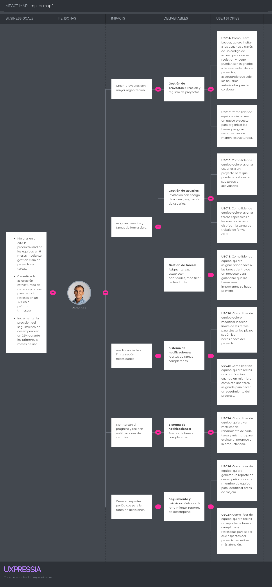

**Segmento Team member**

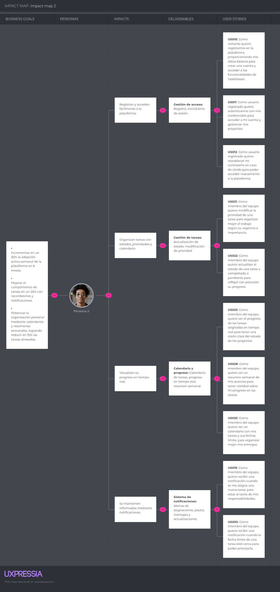

### 3.4. Product Backlog

El Product Backlog organiza todas las funcionalidades identificadas, priorizadas según su valor para el usuario y el negocio.

| Orden | User Story Id | Título                                      | Descripción                                                                                                                      | Story Points |
| ----- | ------------- | ------------------------------------------- | -------------------------------------------------------------------------------------------------------------------------------- | ------------ |
| 1     | US014         | Invitación de usuarios con código de acceso | Como Team Leader, deseo invitar usuarios mediante un código de acceso para que puedan registrarse y colaborar en los proyectos.  | 8            |
| 2     | US015         | Registro de nuevos proyectos                | Como líder de equipo, deseo crear nuevos proyectos para organizar tareas y asignar responsables de manera estructurada.          | 8            |
| 3     | US016         | Asignación de usuarios a proyectos          | Como líder de equipo, deseo asignar usuarios a proyectos para que puedan colaborar en las tareas.                                | 8            |
| 4     | US017         | Asignar tareas a usuarios                   | Como líder de equipo, deseo asignar tareas específicas a los miembros para distribuir la carga de trabajo.                       | 8            |
| 5     | US019         | Notificaciones de tareas asignadas          | Como miembro del equipo, deseo recibir notificaciones cuando se me asignen tareas para estar informado de mis responsabilidades. | 8            |
| 6     | US023         | Progreso de tareas en tiempo real           | Como miembro del equipo, deseo visualizar el progreso de tareas con indicadores inteligentes para identificar retrasos.          | 8            |
| 7     | US024         | Métricas de rendimiento con riesgo          | Como líder de equipo, deseo visualizar métricas con indicadores de riesgo para detectar problemas en el proyecto.                | 8            |
| 8     | US026         | Reporte inteligente por miembro             | Como líder de equipo, deseo generar reportes de desempeño por miembro para identificar mejoras y riesgos.                        | 8            |
| 9     | US027         | Reporte de tareas cumplidas y retrasadas    | Como líder de equipo, deseo obtener reportes de tareas para anticipar retrasos del proyecto.                                     | 8            |
| 10    | US029         | Notificación automatizada de tarea asignada | Como miembro del equipo, deseo recibir notificaciones automáticas al asignarse tareas para no depender de revisión manual.       | 8            |
| 11    | US030         | Notificación de fecha límite cercana        | Como miembro del equipo, deseo recibir alertas cuando una tarea esté por vencer para priorizar mi trabajo.                       | 8            |
| 12    | US031         | Notificación de tarea completada            | Como líder de equipo, deseo recibir notificaciones cuando una tarea se complete para hacer seguimiento del progreso.             | 8            |
| 13    | TS01          | Validación de seguridad en la API           | Como desarrollador, deseo validar la seguridad de la API para proteger los datos de los usuarios.                                | 8            |
| 14    | TS02          | Optimización de base de datos               | Como desarrollador, deseo optimizar consultas para mejorar el rendimiento del sistema.                                           | 8            |
| 15    | TS03          | Gestión de proyectos (backend)              | Como desarrollador, deseo implementar CRUD de proyectos para mantener la información organizada.                                 | 8            |
| 16    | TS04          | Gestión de tareas (backend)                 | Como desarrollador, deseo implementar operaciones de tareas para reflejar el flujo de trabajo.                                   | 8            |
| 17    | SS1           | Integración con Slack                       | Como miembro del equipo, deseo integrar TaskMaster con Slack para recibir notificaciones externas.                               | 8            |
| 18    | SS2           | Integración con Google Calendar             | Como miembro del equipo, deseo sincronizar tareas con Google Calendar para gestionar plazos.                                     | 8            |
| 19    | US010         | Registro de usuario                         | Como visitante, deseo registrarme en la plataforma para acceder a sus funcionalidades.                                           | 8            |
| 20    | US011         | Inicio de sesión                            | Como usuario, deseo autenticarme para acceder a mi cuenta y gestionar proyectos.                                                 | 8            |
| 21    | US012         | Recuperación de contraseña                  | Como usuario, deseo recuperar mi contraseña para volver a acceder a la plataforma.                                               | 5            |
| 22    | US018         | Establecer prioridad de tareas              | Como líder de equipo, deseo definir prioridades para organizar mejor el trabajo.                                                 | 5            |
| 23    | US020         | Modificación de fechas límite               | Como líder de equipo, deseo modificar fechas límite para ajustar plazos del proyecto.                                            | 5            |
| 24    | US021         | Modificación de prioridad                   | Como líder de equipo, deseo cambiar la prioridad de tareas según su importancia.                                                 | 5            |
| 25    | US022         | Actualización de estado de tareas           | Como miembro del equipo, deseo actualizar el estado de tareas para reflejar el progreso.                                         | 5            |
| 26    | US025         | Calendario con alertas inteligentes         | Como miembro del equipo, deseo visualizar tareas en un calendario con alertas para evitar retrasos.                              | 5            |
| 27    | US028         | Resumen semanal inteligente                 | Como miembro del equipo, deseo ver un resumen semanal de avances con recomendaciones.                                            | 5            |
| 28    | US032         | Notificación de mensajes                    | Como miembro del equipo, deseo recibir notificaciones de nuevos mensajes para estar actualizado.                                 | 5            |
| 29    | US033         | Notificación de cambios en tareas           | Como miembro del equipo, deseo recibir notificaciones cuando una tarea cambie.                                                   | 5            |
| 30    | TS05          | Administración de usuarios                  | Como desarrollador, deseo gestionar usuarios para mantener roles y permisos adecuados.                                           | 5            |
| 31    | TS06          | Manejo de reportes                          | Como desarrollador, deseo gestionar reportes para ofrecer información consistente.                                               | 5            |
| 32    | US013         | Cierre de sesión                            | Como usuario, deseo cerrar sesión para proteger mi cuenta.                                                                       | 3            |
| 33    | US05          | Adaptabilidad móvil                         | Como usuario, deseo navegar en móvil para acceder desde cualquier dispositivo.                                                   | 3            |
| 34    | US06          | Navegación por encabezado                   | Como usuario, deseo un menú claro para acceder a secciones fácilmente.                                                           | 3            |
| 35    | US09          | Pie de página                               | Como usuario, deseo ver enlaces útiles en el footer para acceder a información adicional.                                        | 3            |
| 36    | US01          | Información general                         | Como visitante, deseo conocer las características de TaskMaster para evaluar su uso.                                             | 8            |
| 37    | US02          | Llamado a la acción                         | Como visitante, deseo un botón claro para registrarme o descargar la app.                                                        | 8            |
| 38    | US08          | About the Team                              | Como visitante, deseo conocer al equipo para generar confianza en la plataforma.                                                 | 8            |
| 39    | US03          | Testimonios                                 | Como visitante, deseo ver opiniones de usuarios para confiar en el producto.                                                     | 5            |
| 40    | US04          | Planes y precios                            | Como visitante, deseo ver planes disponibles para elegir el más adecuado.                                                        | 5            |
| 41    | US07          | Misión y visión                             | Como visitante, deseo conocer la misión y visión para entender la empresa.                                                       | 5            |

LINK: https://trello.com/invite/b/69deac0397d45ae667e9bdc4/ATTI76344d0809c09e954f74835bddd259248D3D43FC/g2-arqui-emergentes

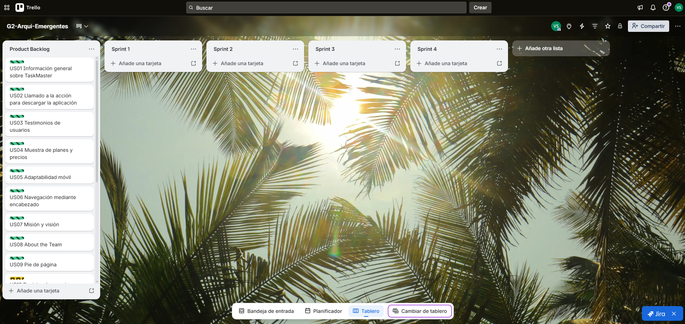

## Capítulo IV: Strategic-Level Software Design

### 4.1. Strategic-Level Attribute-Driven Design

#### 4.1.1. Design Purpose

#### 4.1.2. Attribute-Driven Design Inputs

##### 4.1.2.1. Primary Functionality (Primary User Stories)

##### 4.1.2.2. Quality Attribute Scenarios

##### 4.1.2.3. Constraints

#### 4.1.3. Architectural Drivers Backlog

#### 4.1.4. Architectural Design Decisions

#### 4.1.5. Quality Attribute Scenario Refinements

### 4.2. Strategic-Level Domain-Driven Design

En esta sección se describe el proceso seguido por el equipo para la toma de decisiones a nivel estratégico aplicando Domain-Driven Design (DDD). El objetivo fue comprender el dominio del sistema de gestión de proyectos, identificar sus principales subdominios y definir límites claros mediante Bounded Contexts.

Para ello, se utilizaron técnicas como EventStorming para explorar los eventos y flujos clave del negocio, así como el descubrimiento de contextos candidatos, el modelado de flujos de mensajes y la elaboración de Bounded Context Canvases. Finalmente, se estableció un Context Map que define las relaciones e interacciones entre los distintos contextos.

#### 4.2.1. EventStorming

El equipo realizó una sesión de EventStorming con una duración aproximada de entre 1 y 2 horas, con el objetivo de obtener una primera aproximación al modelado del dominio del sistema de gestión de proyectos. Esta actividad permitió identificar los eventos principales del negocio y establecer un punto de partida para comprender la dinámica de la aplicación.

Durante esta fase inicial, se llevó a cabo una lluvia de ideas, en la que se identificaron los eventos más significativos del dominio. Estos hechos, representados mediante post-its de color naranja, se redactaron en tiempo pasado para describir acciones que ya han ocurrido, tales como la creación de proyectos, el registro de tareas o la asignación de prioridades.

Este ejercicio facilitó la detección de conceptos clave y las primeras interacciones entre los roles de Team Leader y Team Member, estableciendo una base sólida para el posterior descubrimiento de subdominios y la definición de Bounded Contexts. A continuación, se presentan las capturas correspondientes a esta primera etapa de exploración.

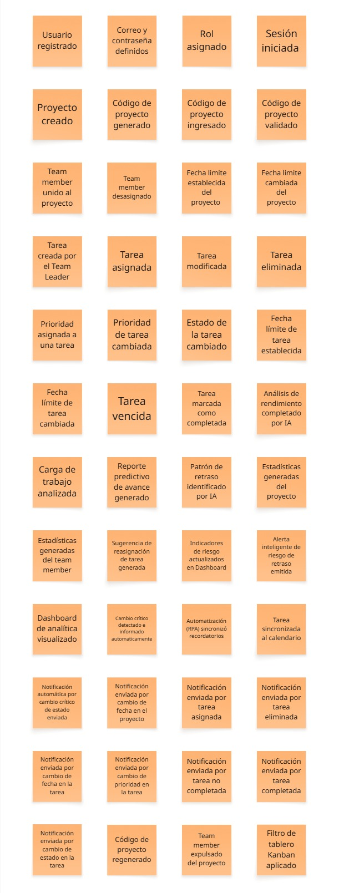

#### 4.2.2. Candidate Context Discovery

Tras la fase de exploración inicial, el equipo procedió a refinar el modelo del dominio mediante un proceso iterativo de diseño estratégico. Esta etapa se enfocó en dar estructura a los eventos identificados, analizando las causas, las reglas de negocio y las interacciones necesarias para consolidar la arquitectura del sistema de gestión de proyectos. A través de este refinamiento, se logró una transición fluida desde una lluvia de ideas desorganizada hacia la definición de límites de contexto claros y consistentes.

Inicialmente, los eventos de dominio se organizaron de forma cronológica para establecer el flujo de valor del sistema. Se priorizó el diseño del "happy path", representando el escenario ideal donde el líder crea el proyecto y los miembros completan sus tareas sin contratiempos. Posteriormente, se integraron flujos alternativos para cubrir casos como la expulsión de miembros o el vencimiento de tareas, asegurando que la línea de tiempo reflejara la realidad operativa del negocio.

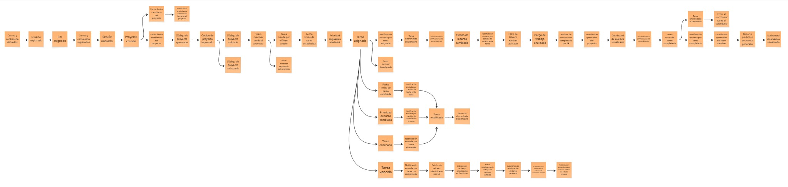

Una vez establecida la línea de tiempo, se analizaron los puntos de fricción o incertidumbre conocidos como pain points. En esta fase se identificaron cuellos de botella y riesgos potenciales, como la posible expiración de códigos de acceso o la sobrecarga de trabajo de los integrantes. Este análisis permitió detectar qué partes del proceso requerían una mayor atención a nivel de diseño o una automatización más robusta.

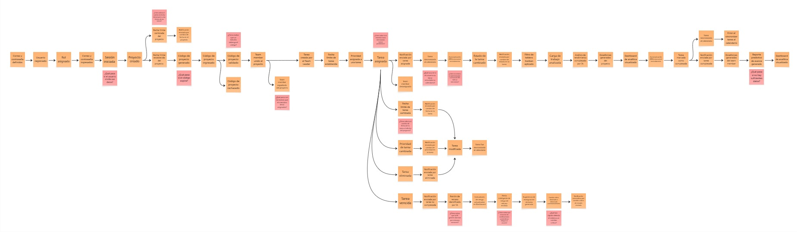

Posteriormente, se identificaron los eventos pivotales que marcan cambios significativos en el estado o contexto del negocio. Estos hitos sirvieron para dividir el flujo en fases lógicas, separando claramente el momento de configuración del proyecto del periodo de ejecución y seguimiento. Estos puntos de quiebre facilitaron la visualización de los límites naturales entre las diferentes etapas del ciclo de vida del software.

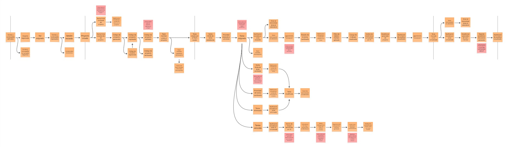

Con el flujo estructurado, se definieron los comandos que representan las intenciones de los usuarios y disparan los eventos del sistema. Estas acciones se formularon en modo imperativo, vinculándolas a los actores específicos, como el Team Leader o el Team Member. Este paso fue fundamental para entender qué operaciones debe exponer el sistema en cada interfaz para que los usuarios puedan interactuar con el dominio.

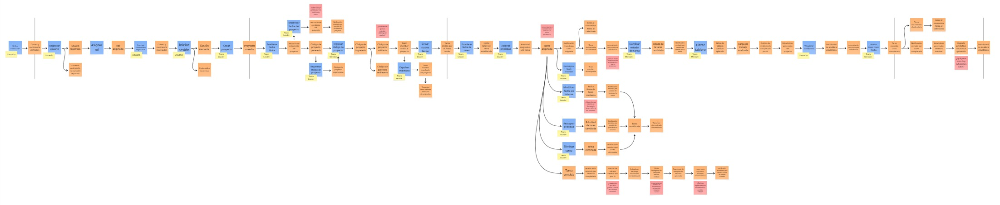

Para gestionar la lógica automática, se establecieron políticas de automatización que conectan eventos con comandos sin intervención humana directa. Estas reglas permiten que, ante un hecho específico como el cambio de estado de una tarea, el sistema responda automáticamente ejecutando análisis de rendimiento o enviando notificaciones, lo que garantiza una respuesta proactiva ante las dinámicas del equipo.

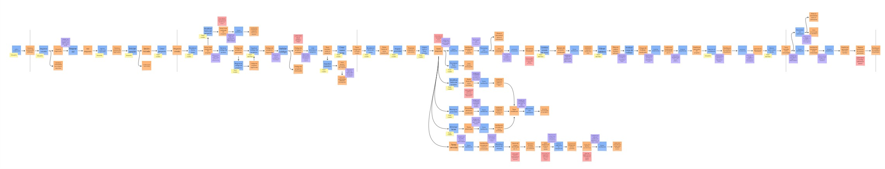

Asimismo, se identificaron los modelos de lectura o vistas necesarias para que los actores puedan tomar decisiones informadas. Estos representan la información visual, como el tablero Kanban o los dashboards de analítica, que los usuarios consultan antes de ejecutar cualquier comando. La definición de estos modelos asegura que el sistema proporcione los datos adecuados en el momento preciso del flujo.

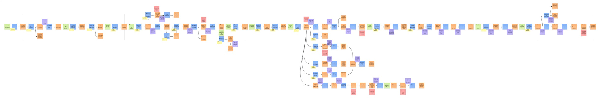

El modelo se complementó mediante la integración de sistemas externos que interactúan con el dominio pero no forman parte de su núcleo. Se mapearon servicios de terceros para la sincronización de calendarios y el envío de correos electrónicos, identificando cómo estos servicios externos reaccionan a los eventos internos o cómo inyectan información relevante hacia nuestro sistema.

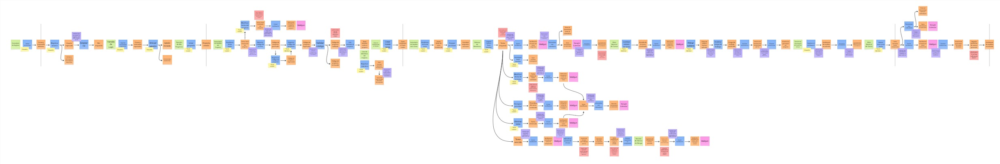

En una etapa avanzada de refinamiento, los elementos se organizaron en agregados para garantizar la consistencia y la integridad de los datos. Estos grupos de objetos de dominio actúan como una unidad, recibiendo comandos y produciendo eventos bajo reglas de negocio estrictas. Esto permitió encapsular la lógica relacionada con entidades clave como el proyecto, las tareas y la gestión de usuarios.

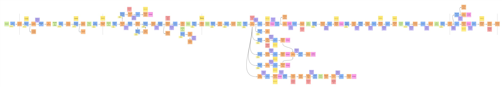

Finalmente, se determinaron los límites de los contextos delimitados analizando la cohesión entre los agregados y la influencia de las políticas de automatización. Esta agrupación final permitió segmentar el dominio en unidades lógicas independientes y manejables, resultando en la identificación de los cinco Bounded Contexts que estructuran la solución tecnológica.

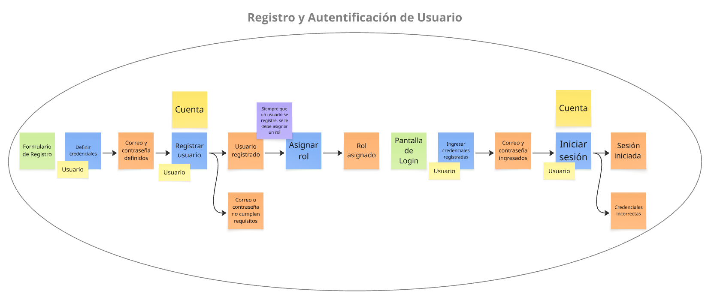
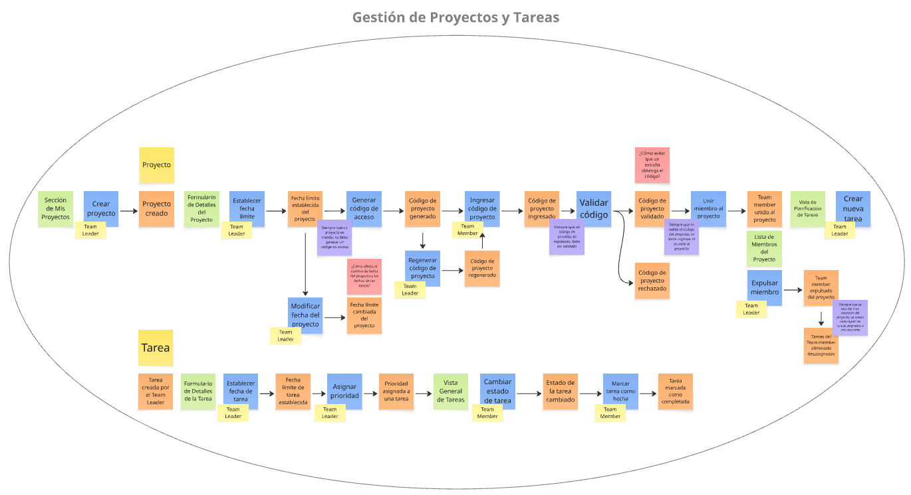
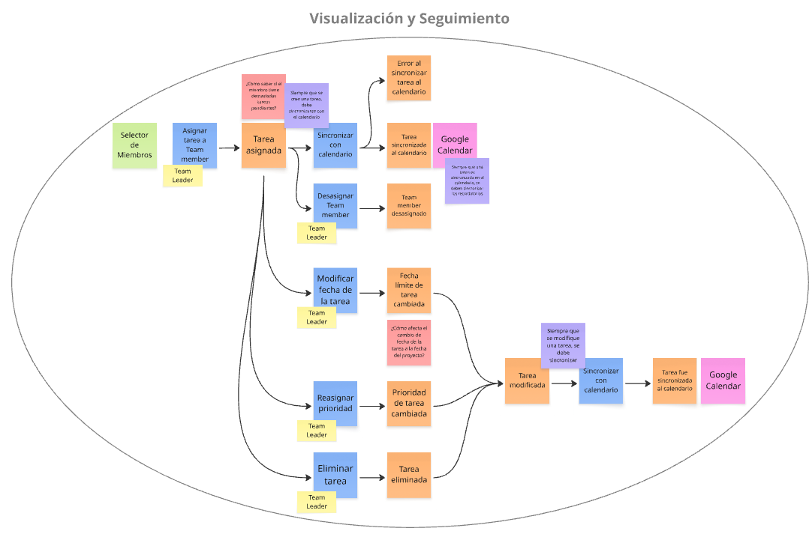
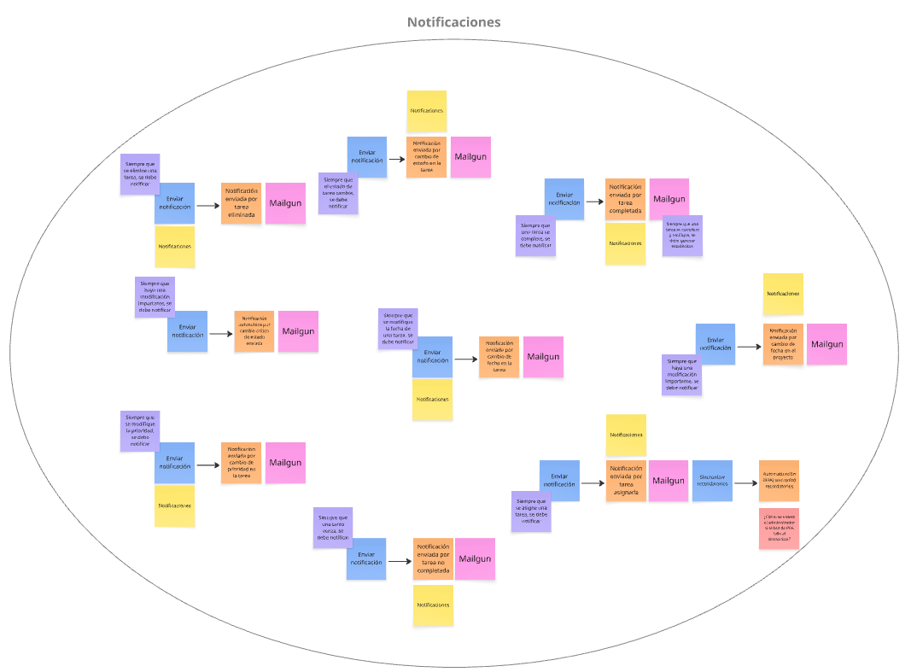
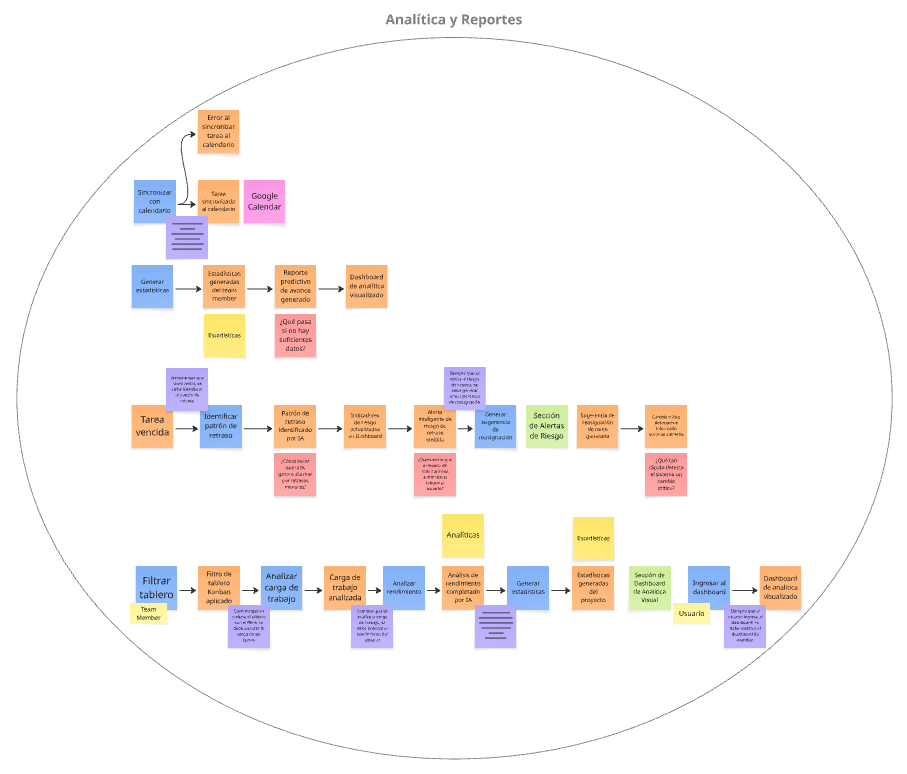

#### 4.2.3. Domain Message Flows Modeling

En esta sección se describe el proceso seguido para modelar la interacción entre los distintos Bounded Contexts del sistema, con el objetivo de entender cómo colaboran para resolver los principales escenarios del negocio. Para ello, se utilizó la técnica de Domain Storytelling, representando el flujo de mensajes mediante diagramas de tipo Domain Message Flow.

Estos diagramas permiten visualizar cómo se intercambian commands y events entre actores, sistemas y bounded contexts, facilitando la comprensión de la comunicación y reduciendo el acoplamiento entre componentes. A continuación, se presentan los escenarios más representativos del sistema.

**Escenario 1: Create and Assign Task**

Este escenario describe el proceso mediante el cual un Team Leader crea y asigna una nueva tarea dentro del sistema. El flujo inicia cuando el usuario envía un comando desde la aplicación, el cual es procesado por el bounded context de Gestión de Proyectos y Tareas, generando el evento Task Created.

A partir de este evento, otros bounded contexts reaccionan de forma independiente: Notificaciones envía alertas al usuario asignado, Visualización y Seguimiento actualiza los tableros de tareas, y Analítica y Reportes actualiza las métricas relacionadas con la carga de trabajo. Este escenario muestra claramente un flujo basado en eventos, donde un cambio en el dominio se propaga hacia otros contextos sin generar un fuerte acoplamiento.

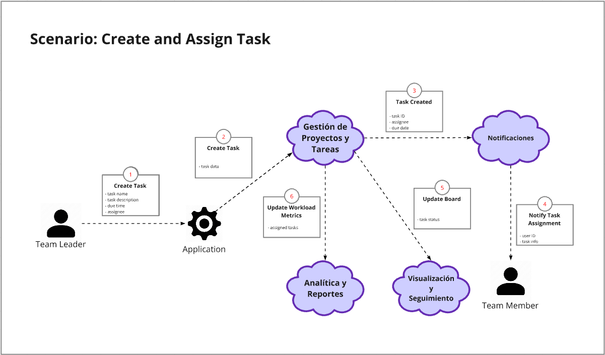

Escenario 2: Complete Task

En este escenario, un Team Member actualiza el estado de una tarea a completada. Esta acción genera un comando que es procesado por el bounded context de Gestión de Proyectos y Tareas, produciendo el evento Task Completed.

Como consecuencia, el bounded context de Analítica y Reportes recalcula las métricas de desempeño, Visualización y Seguimiento actualiza los dashboards para reflejar el nuevo estado de la tarea, y Notificaciones informa al líder del proyecto sobre la finalización. Este flujo evidencia cómo múltiples contextos colaboran a partir de un único evento de negocio.

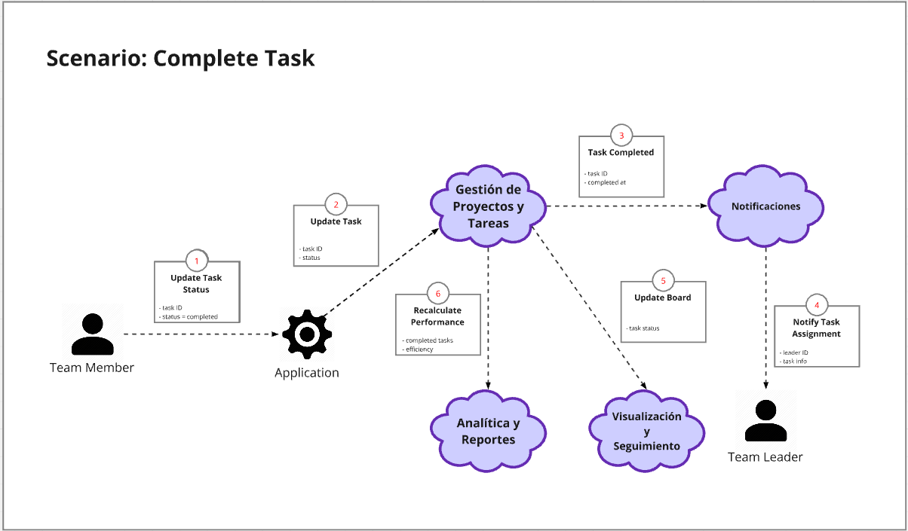

Escenario 3: Task Overdue Detection

Este escenario representa la detección automática de tareas vencidas dentro del sistema. El flujo es iniciado por un proceso interno (scheduler), que verifica periódicamente las fechas límite de las tareas. Cuando se detecta que una tarea ha superado su fecha de vencimiento, el bounded context de Gestión de Proyectos y Tareas emite el evento Task Overdue.

Este evento es consumido por Analítica y Reportes, que actualiza los indicadores de riesgo, por Visualización y Seguimiento, que muestra alertas en la interfaz, y por Notificaciones, que envía avisos a los usuarios correspondientes. Este escenario demuestra la automatización del sistema y la reacción de múltiples contextos ante eventos críticos.

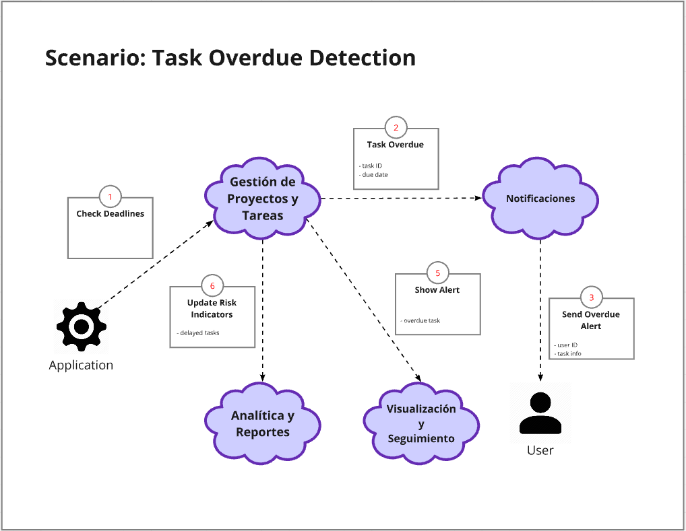

#### 4.2.4. Bounded Context Canvases

Con el fin de estructurar el dominio del sistema y delimitar responsabilidades claras, el equipo diseñó los Bounded Context Canvases correspondientes a cada contexto identificado. Para ello, se siguió un proceso iterativo que incluyó la definición del contexto, la identificación de reglas de negocio, el análisis de capacidades, el reconocimiento de dependencias y la evaluación del diseño.

Cada bounded context fue analizado considerando su propósito dentro del sistema, su lenguaje ubicuo, los mensajes que intercambia con otros contextos y las decisiones de negocio que gobiernan su comportamiento.

La separación en bounded contexts permite reducir la complejidad, facilitar la escalabilidad y mantener la coherencia del modelo, asegurando que cada parte del sistema responda a objetivos específicos con bajo acoplamiento.

A continuación, se describe cada uno de estos contextos, resaltando su propósito, responsabilidades y su rol dentro de la arquitectura del sistema.

**Registro y Autenticación de Usuario**

Este bounded context es responsable de la gestión de identidades dentro del sistema. Permite el registro de usuarios, el inicio de sesión y la validación de credenciales, así como la asignación de roles según el tipo de usuario.

Su función principal es garantizar que solo usuarios autorizados puedan acceder al sistema y realizar acciones dentro de él. Además, proporciona la información necesaria para que otros contextos puedan identificar correctamente a los actores involucrados en cada proceso.

**Gestión de Proyectos y Tareas**

Este bounded context representa el núcleo del sistema, ya que se encarga de la creación, organización y gestión de proyectos y tareas. Permite a los Team Leaders definir fechas, prioridades y asignar responsables, mientras que los Team Members pueden actualizar el estado de sus tareas.

Asimismo, este contexto genera eventos clave del dominio, como la creación, actualización o vencimiento de tareas, los cuales son consumidos por otros bounded contexts. De esta manera, actúa como el principal emisor de información dentro del sistema y como punto central de coordinación de procesos.

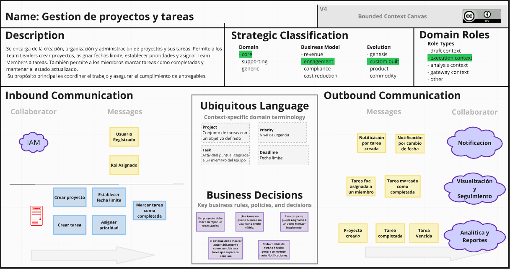

**Visualización y Seguimiento**

Este contexto se encarga de presentar la información del sistema de manera clara y organizada, utilizando herramientas visuales como tableros y calendarios. Su objetivo principal es facilitar el monitoreo del progreso de las tareas y proyectos por parte de los usuarios.

Adicionalmente, integra indicadores visuales que permiten identificar situaciones relevantes, como retrasos o posibles riesgos en la ejecución de tareas. Para ello, consume información tanto del contexto de Gestión de Proyectos y Tareas como de Analítica y Reportes.

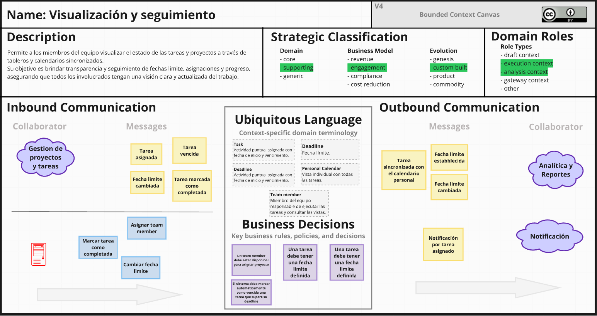

**Notificaciones**

Este bounded context gestiona la comunicación entre el sistema y los usuarios. Recibe eventos relevantes generados en otros contextos y los transforma en notificaciones que son enviadas en tiempo real.

Asimismo, incorpora mecanismos de automatización que permiten generar recordatorios automáticos, alertas por vencimiento y notificaciones inteligentes sin intervención manual. Esto asegura que los usuarios se mantengan informados de manera oportuna sobre los cambios y eventos importantes dentro del sistema.

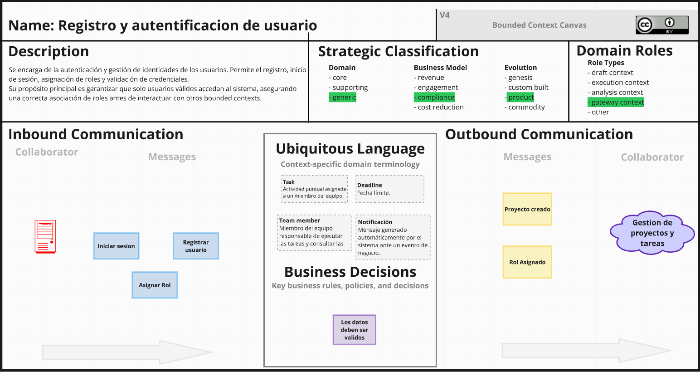

**Analítica y Reportes**

Este bounded context tiene como finalidad procesar la información generada por el sistema para transformarla en métricas y reportes útiles para la toma de decisiones. A partir de los eventos recibidos, calcula indicadores relacionados con el desempeño del equipo y el estado de los proyectos.

Además, incorpora capacidades de análisis que permiten evaluar el rendimiento de los miembros, identificar tareas atrasadas y analizar la carga de trabajo. Estos resultados pueden ser utilizados por otros contextos, como Visualización y Seguimiento, para mejorar la interpretación de la información por parte de los usuarios.

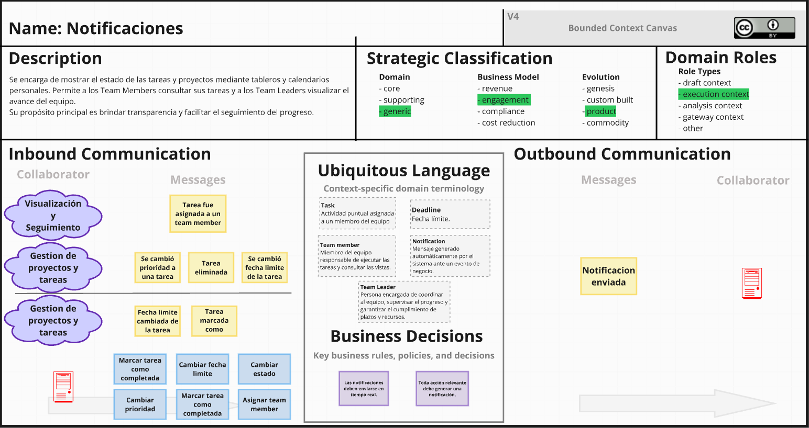

#### 4.2.5. Context Mapping

En esta sección, el equipo describe el proceso seguido para definir las relaciones entre los distintos Bounded Contexts del sistema, utilizando Context Mapping como herramienta para visualizar la interacción estructural entre ellos.

A partir de la información obtenida en las etapas anteriores, se analizaron múltiples alternativas de organización del dominio, evaluando cómo distribuir las responsabilidades y capacidades entre los contextos. Durante este proceso, se plantearon preguntas como: qué ocurriría si ciertas funcionalidades se movieran a otro contexto, si algunos contextos se dividieran en partes más pequeñas o si se centralizaran ciertas capacidades compartidas.

Inicialmente, se consideró la posibilidad de integrar funcionalidades como la visualización y la analítica dentro del contexto de Gestión de Proyectos y Tareas. Sin embargo, esto generaba un alto acoplamiento y dificultaba la escalabilidad del sistema. Por ello, se decidió separar estas capacidades en contextos independientes, permitiendo una mayor modularidad.

Asimismo, se evaluó la opción de centralizar la generación de notificaciones dentro del contexto principal. No obstante, se determinó que mantener un contexto independiente de Notificaciones permite desacoplar la lógica de comunicación del resto del sistema, facilitando su evolución y automatización.

También se analizó la posibilidad de compartir directamente modelos entre contextos. Sin embargo, esto podría generar dependencias fuertes, por lo que se optó por una comunicación basada en eventos, reduciendo el impacto de cambios entre contextos.

Como resultado de este proceso, se definieron las siguientes relaciones entre bounded contexts:

**Relaciones entre Bounded Contexts**

| Destino (Downstream)            | Origen (Upstream)              | Tipo de Relación   | Descripción                                                                 |
|--------------------------------|--------------------------------|--------------------|-----------------------------------------------------------------------------|
| Visualización y Seguimiento    | Gestión de Proyectos y Tareas  | Customer/Supplier  | Consume información de tareas y proyectos para mostrar el estado en tableros y calendarios. |
| Analítica y Reportes           | Gestión de Proyectos y Tareas  | Customer/Supplier  | Utiliza los eventos generados para calcular métricas y reportes.             |
| Notificaciones                 | Gestión de Proyectos y Tareas  | Customer/Supplier  | Recibe eventos para generar notificaciones en tiempo real.                  |
| Visualización y Seguimiento    | Analítica y Reportes           | Customer/Supplier  | Muestra métricas e indicadores generados por el contexto analítico.         |
| Notificaciones                 | Analítica y Reportes           | Partnership        | Colabora para generar alertas inteligentes basadas en métricas.             |
| Gestión de Proyectos y Tareas  | Registro y Autenticación       | Conformist         | Depende de este contexto para validar usuarios y roles sin modificar su modelo. |
| Todos los contextos            | Registro y Autenticación       | Shared Kernel      | Comparten información básica de usuarios y roles para garantizar consistencia. |

Finalmente, se consideró el uso de patrones de diseño de Domain-Driven Design, como Customer/Supplier, Conformist, Partnership y Shared Kernel, con el fin de definir claramente las responsabilidades y dependencias entre los contextos.

El resultado de este análisis se representa en el siguiente Context Map, el cual muestra de manera visual las relaciones estructurales entre los bounded contexts del sistema.

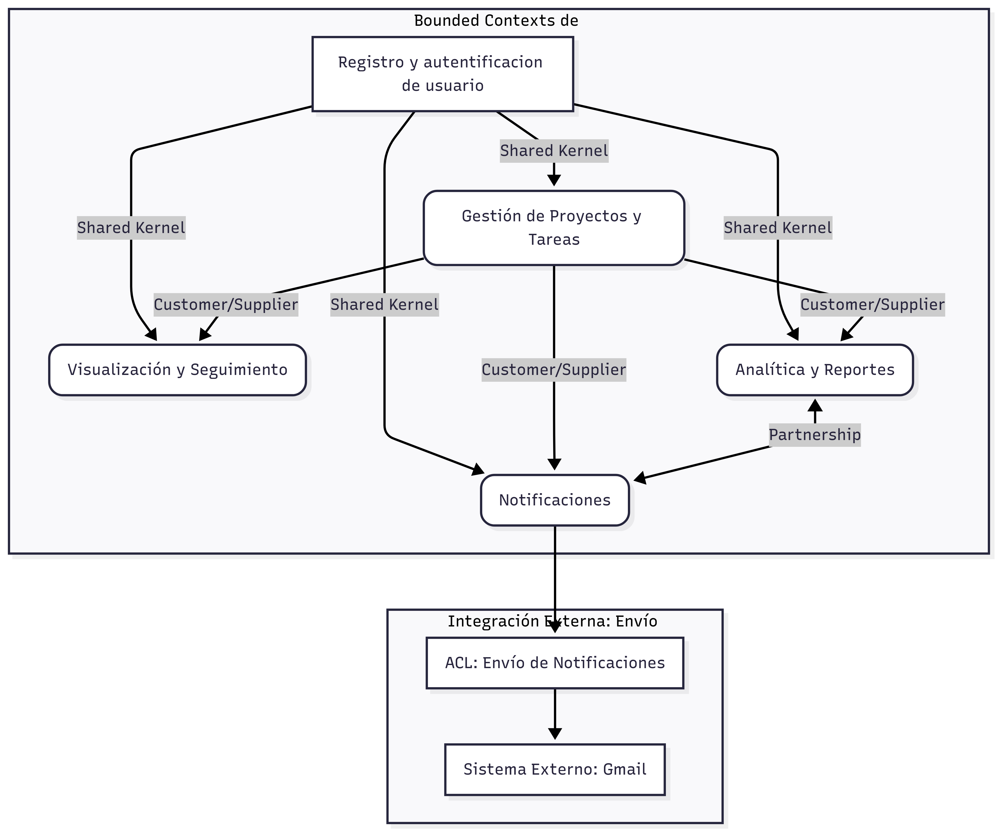

### 4.3. Software Architecture

En la arquitectura de software primero nos enfocamos en aterrizar la estructura técnica de TaskMaster. Para lograrlo, decidimos utilizar el Modelo C4, ya que nos permite explicar la arquitectura de forma progresiva, desde lo más general hasta los detalles técnicos. A través de estos diagramas mostramos cómo se ve el sistema por fuera y también cómo hemos dividido las responsabilidades internamente para que la solución sea escalable y eficiente.

#### 4.3.1. Software Architecture System Landscape Diagram

En esta sección se presenta el System Landscape Diagram, el cual permite visualizar el sistema dentro de un entorno más amplio, considerando no solo a los usuarios que interactúan con la solución, sino también a otros sistemas externos relevantes. Este diagrama ofrece una perspectiva general del ecosistema en el que se encuentra la aplicación, mostrando cómo se relaciona con actores y servicios externos. De esta manera, se facilita la comprensión del alcance del sistema, sus dependencias y las posibles integraciones con otros sistemas dentro del entorno digital.

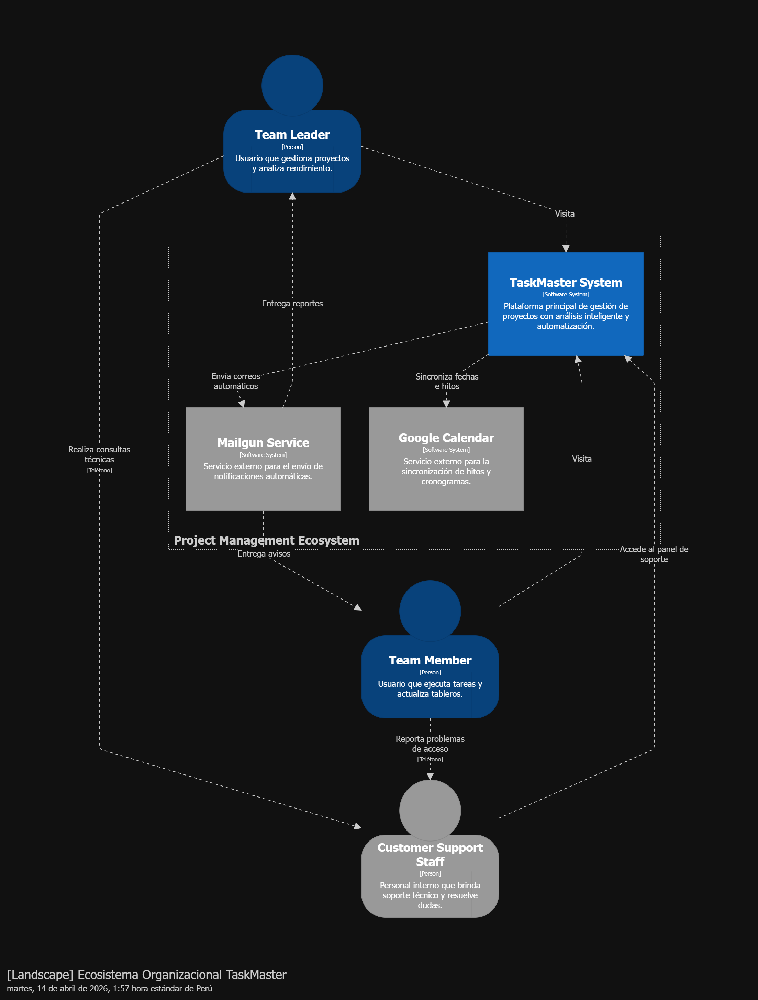

#### 4.3.2. Software Architecture Context Level Diagrams

El diagrama muestra a TaskMaster System en el centro de la interacción. Los usuarios gestionan proyectos y consultan análisis directamente en la plataforma, mientras que el sistema se encarga de orquestar la comunicación con servicios externos. La relación con Mailgun permite que el usuario reciba notificaciones automáticas, y la integración con Google Calendar garantiza que los hitos del proyecto estén siempre sincronizados fuera de la aplicación.

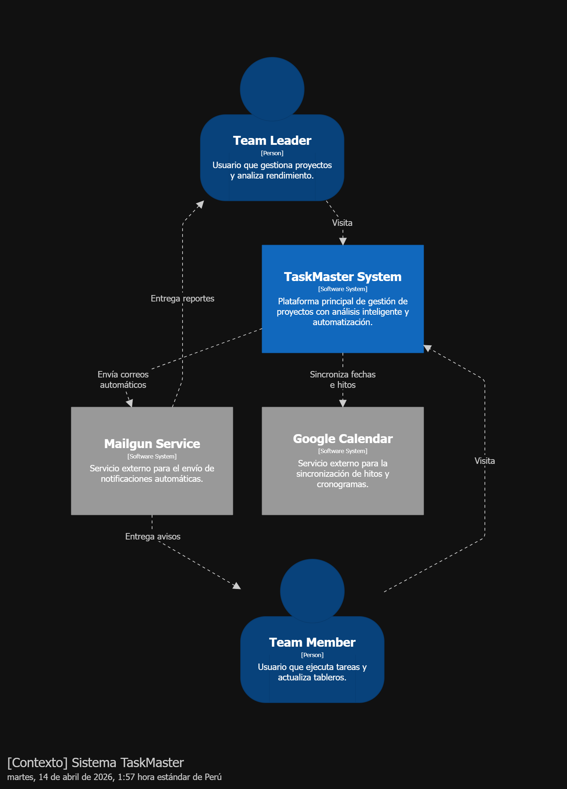

#### 4.3.3. Software Architecture Container Level Diagrams

En este nivel, se observa cómo el tráfico entra a través de una Landing Page o directamente a las aplicaciones (Angular para web y Flutter para móvil). Todas las peticiones pasan por un API Gateway que las redirige a los servicios correspondientes de Spring Boot. Todos estos servicios comparten una base de datos central en PostgreSQL, asegurando la integridad de la información mientras se mantiene una arquitectura modular y fácil de mantener.

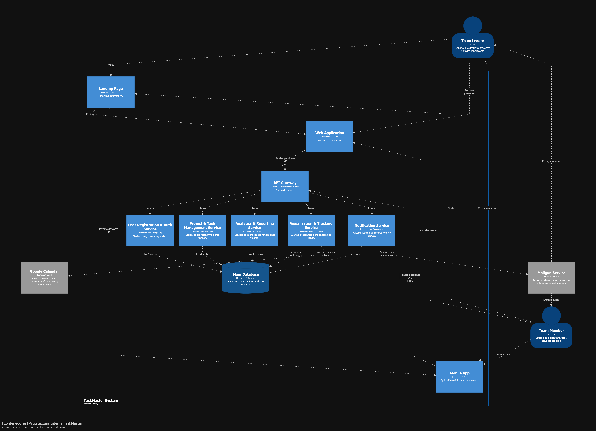

#### 4.3.4. Software Architecture Deployment Diagrams

Finalmente, presentamos el Diagrama de Despliegue, que ilustra cómo se distribuyen nuestros contenedores en la infraestructura real. Para esta solución, hemos optado por un ecosistema en la nube aprovechando la versatilidad de Vercel para el frontend, GitHub Pages para la landing informativa y Render para alojar tanto nuestros servicios de backend como la base de datos gestionada. Este esquema refleja una configuración de producción pensada en la disponibilidad y facilidad de despliegue continuo.

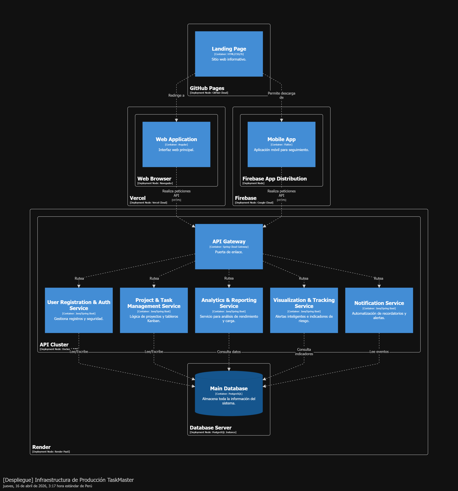

## Conclusiones

**TB1**

- El desarrollo de TaskMaster demuestra que la centralización de la gestión de proyectos, junto con el uso de metodologías modernas como Lean UX y Domain-Driven Design, permite abordar eficazmente los problemas de fragmentación, baja visibilidad y desorganización en equipos de trabajo; además, la incorporación de tecnologías emergentes como inteligencia artificial para analítica y alertas, y RPA para automatización de notificaciones, posiciona la solución como innovadora y competitiva. Se recomienda continuar fortaleciendo estas capacidades mediante una mayor integración de IA y automatización, validaciones constantes con usuarios reales y mejoras progresivas en la experiencia de usuario, con el fin de asegurar una adopción efectiva y escalabilidad del producto en el mercado.

## Bibliografía

-Chandrasekaran, P. (2024, 9 agosto). Remote EventStorming in Practice. Domain-driven Design: A Practitioner’s Guide. https://ddd-practitioners.com/2023/03/20/remote-eventstorming-workshop/

-Ddd-Crew. (s. f.). GitHub - ddd-crew/bounded-context-canvas: A structured approach to designing and documenting each of your bounded contexts. GitHub. https://github.com/ddd-crew/bounded-context-canvas

Miro. (n.d.). Miro | Bounded context Canvas. Miro. Recuperado el 19 de septiembre de 2025, de https://miro.com/app/board/uXjVJHX-IGk=/

Miro. (n.d.). Miro | Event storming. Miro. Recuperado el 19 de septiembre de 2025, de https://miro.com/app/board/uXjVJIJqxgg=/

-Biblioteca UPC. (2024). Biblioteca virtual de la Universidad Peruana de Ciencias Aplicadas. https://biblioteca.upc.edu.pe

-Miro. (2024). Miro. Miro Corporation. https://miro.com

-LucidChart. (2024). LucidChart. Lucid Software Inc. https://www.lucidchart.com

-Cohn, M. (2006). Historias de usuario: Un enfoque ágil. Pearson Educación. https://www.scrummanager.com/files/scrum_manager_historias_usuario.pdf

-Pressman, R. S. (2010). Ingeniería de Software: Un enfoque práctico. McGraw-Hill. https://www.javier8a.com/itc/bd1/ld-Ingenieria.de.software.enfoque.practico.7ed.Pressman.PDF

-The C4 model for visualising software architecture. (2024). https://c4model.com/.

-Structurizr. (2024). https://www.structurizr.com/

-Nielsen Norman Group. (2023). 10 Usability Heuristics for User Interface Design. https://www.nngroup.com.

-Interaction Design Foundation. (2022). What is User Interface (UI) Design. https://www.interaction-design.org

## Anexos

