<div align="center">

<p align="center">
  
</p>

<h3 align="center">
Universidad Peruana de Ciencias Aplicadas
</h3>

<h3 align="center">
Ingeniería de Software  
<br><br>
Ciclo: 2027-10
<br><br>
1ASI0728 - Arquitecturas de Software Emergentes
<br><br>
NRC: 17957
<br><br>
Profesor: Marino Humberto Jara Palacios  
<br><br>
<strong>Informe de Trabajo Final</strong>  
<br><br>
Startup: Apex Cybernetics
<br><br>
Producto: TaskMaster
<br><br>
<strong>Integrantes</strong>
<br><br>
</h3>

<table align="center">
  <tr>
    <th>Nombre</th>
    <th>Código</th>
  </tr>
  <tr>
    <td>Luquillas Asto, Omar</td>
    <td>U20211G641</td>
  </tr>
  <tr>
    <td>Peña Riofrio, Maria Fernanda</td>
    <td>U202113279</td>
  </tr>
  <tr>
    <td>Pilares Pocohuanca, Maria</td>
    <td>U202215528</td>
  </tr>
  <tr>
    <td>Sanchez Silva, Luciana Celeste</td>
    <td>U202215979</td>
  </tr>
  <tr>
    <td>Sandoval Paiva, Valentino</td>
    <td>U20211A962</td>
  </tr>
</table>

<br><br>

<h3 align="center">
Abril 2026
</h3>
<br>
</div>

<br>
<br>
<br>
<br>
<br>
<br>
<br>
<br>
<br>
<br>
<br>
<br>
<br>
<br>
<br>
<br>
<br>
<br>
<br>
<br>
<br>
<br>
<br>
<br>
<br>
<br>
<br>
<br>
<br>

## Registro de Versiones del Informe


| Versión | Fecha      | Autor                                       | Descripción de modificación                                                                                                                                                                                                                                                                                                                                                                                                          |
| ------- | ---------- | ------------------------------------------- | ------------------------------------------------------------------------------------------------------------------------------------------------------------------------------------------------------------------------------------------------------------------------------------------------------------------------------------------------------------------------------------------------------------------------------------ |
| TB1     | 09/04/2026 | Omar Luquillas Asto (U20211G641)            | Creación de la estructura inicial del informe. Strategic-Level Domain-Driven Design: EventStorming, Candidate Context Discovery, Domain Message Flows Modeling, Bounded Context Canvases, Context Mapping. Software Architecture: Software Architecture System Landscape Diagram, Software Architecture Context Level Diagrams, Software Architecture Container Level Diagrams, Software Architecture Deployment Diagrams.           |
| TB1     | 09/04/2026 | Sandoval Paiva, Valentino                   | To-Be Scenario Mapping: Definición del escenario futuro del sistema. User Stories: Redacción y estructuración de historias de usuario. Impact Mapping: Identificación de impactos y objetivos del producto. Product Backlog: Organización y priorización de funcionalidades del sistema.                                                                                                                                             |
| TB1     | 09/04/2026 | Sanchez Silva, Luciana Celeste (U202215979) | Startup Profile: Descripción de la Startup, Perfiles de integrantes del equipo. Solution Profile: Antecedentes y problemática. Lean UX Process: Lean UX Problem Statements, Lean UX Assumptions, Lean UX Hypothesis Statements, Lean UX Canvas. Segmentos objetivo: Definición del público objetivo del proyecto.                                                                                                                    |
| TB1     | 09/04/2026 | Pilares Pocohuanca, Maria (U202215528)      | Competidores: Identificación de competidores. Análisis competitivo: Evaluación de competidores. Estrategias y tácticas frente a competidores: Definición de acciones frente al mercado. Entrevistas: Diseño de entrevistas, Registro de entrevistas, Análisis de entrevistas. Needfinding: User Personas, User Task Matrix, Empathy Mapping, As-is Scenario Mapping. Ubiquitous Language: Definición del lenguaje común del dominio. |
| TB1     | 09/04/2026 | Peña Riofrio, Maria Fernanda (U202113279)   | Strategic-Level Attribute-Driven Design: Design Purpose, Attribute-Driven Design Inputs (Primary Functionality, Quality Attribute Scenarios, Constraints), Architectural Drivers Backlog, Architectural Design Decisions, Quality Attribute Scenario Refinements.                                                                                                                                                                    |
| TP      | 30/04/2026 | Omar Luquillas Asto (U20211G641)            | Solution UX Design: Definición de Style Guidelines (general, web, mobile & devices), Information Architecture (labeling, searching, SEO y navigation systems), Landing Page UI Design (wireframe y mockup), Applications UX/UI Design (wireframes, wireflows, mockups, user flows) y prototyping de la aplicación. |
| TP      | 30/04/2026 | Sandoval Paiva, Valentino                   | Solution UX Design: Desarrollo de lineamientos de diseño y experiencia de usuario, arquitectura de información, diseño de landing page (wireframe y mockup), diseño de aplicaciones (wireframes, wireflows, mockups, user flows) y prototipado de la solución. |
| TP      | 30/04/2026 | Sanchez Silva, Luciana Celeste (U202215979) | Solution UX Design: Elaboración de guías de estilo, arquitectura de información, sistemas de navegación y búsqueda, diseño de interfaces (landing page y aplicaciones), diagramas de flujo de usuario y prototipos interactivos centrados en la experiencia del usuario. |
| TP      | 30/04/2026 | Pilares Pocohuanca, Maria (U202215528)      | Tactical-Level Software Design: Definición de Bounded Contexts y estructuración en capas (Domain, Interface, Application, Infrastructure), elaboración de diagramas a nivel de componentes y código, diagramas de clases del dominio y diseño de base de datos. |
| TP      | 30/04/2026 | Peña Riofrio, Maria Fernanda (U202113279)   | Tactical-Level Software Design: Desarrollo de la arquitectura a nivel táctico mediante Bounded Contexts, definición de capas del sistema, diagramas de componentes y código, modelado del dominio con diagramas de clases y diseño de la base de datos. |
| TB2     | 08/06/2026 | Omar Luquillas Asto (U20211G641)            | Solution UX Design: Desarrollo de Applications Mock-ups, Applications User Flow Diagrams y Applications Prototyping. Participación en el avance de la implementación del Backend y Frontend Web de la solución.                                                                                                                                  |
| TB2     | 08/06/2026 | Sandoval Paiva, Valentino                   | Product Implementation, Validation & Deployment: Elaboración de Software Configuration Management, Software Development Environment Configuration, Source Code Management, Source Code Style Guide & Conventions y Software Deployment Configuration. Participación en el avance de la implementación del Backend y Frontend Web de la solución. |
| TB2     | 08/06/2026 | Sanchez Silva, Luciana Celeste (U202215979) | Validation Interviews: Diseño de entrevistas, registro de entrevistas y evaluaciones según heurísticas. Desarrollo de la sección Video About-the-Product y avance de Conclusiones, Bibliografía y Anexos. Participación en el avance de la implementación de la aplicación móvil de la solución.                                                 |
| TB2     | 08/06/2026 | Pilares Pocohuanca, Maria (U202215528)      | Solution Implementation: Desarrollo del Sprint 1, incluyendo Sprint Planning 1, Sprint Backlog 1, evidencias de desarrollo, pruebas, ejecución, documentación de servicios, despliegue de software y colaboración del equipo durante el Sprint. Participación en el avance de la implementación de la aplicación móvil de la solución.           |
| TB2     | 08/06/2026 | Peña Riofrio, Maria Fernanda (U202113279)   | Validation Interviews: Diseño de entrevistas, registro de entrevistas y evaluaciones según heurísticas. Desarrollo de la sección Video About-the-Product y avance de Conclusiones, Bibliografía y Anexos. Participación en el avance de la implementación de la aplicación móvil de la solución.                                                 |


## Project Report Collaboration Insights

|  URL del repositorio del reporte  |
| :-----------------------------------: |
| [https://github.com/G2-Arqui-Emergentes/Report](https://github.com/G2-Arqui-Emergentes/Report) |

**TB1:**

**REPORT**

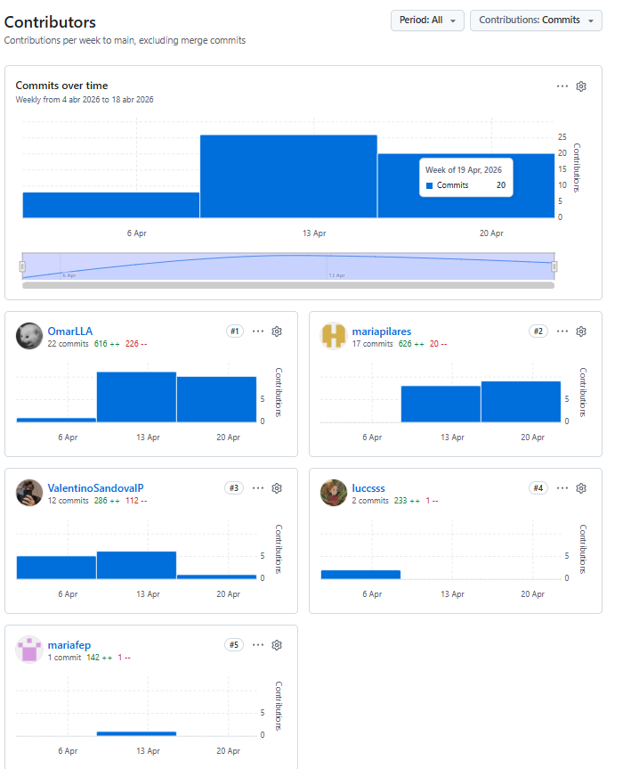

COMMITS:

Luquillas Asto, Omar: 22

Peña Riofrio, Maria Fernanda: 1

Pilares Pocohuanca, Maria: 17

Sanchez Silva, Luciana Celeste:	2

Sandoval Paiva, Valentino: 12

**TP:**

**REPORT**

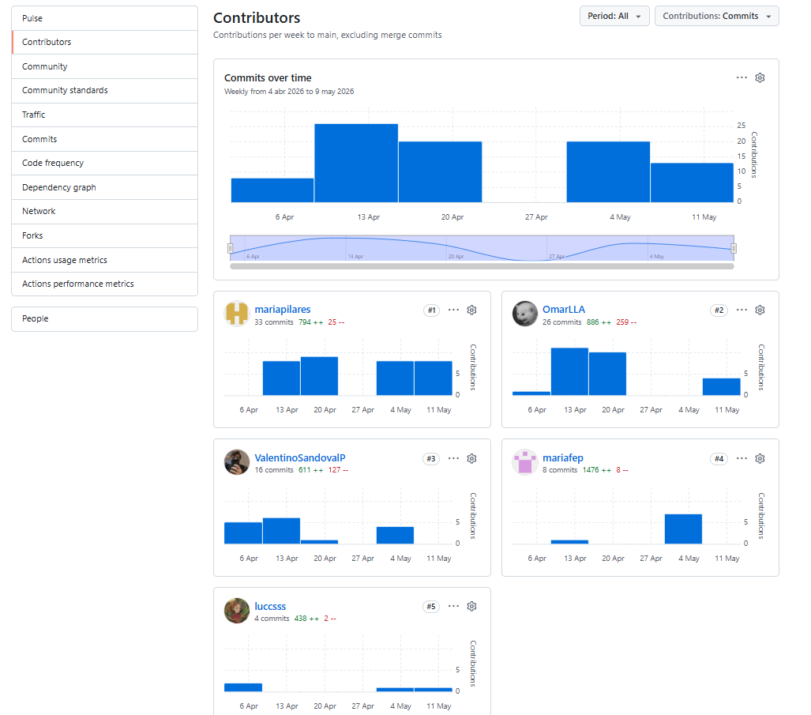

COMMITS:

Luquillas Asto, Omar: 26

Peña Riofrio, Maria Fernanda: 8

Pilares Pocohuanca, Maria: 33

Sanchez Silva, Luciana Celeste:	4

Sandoval Paiva, Valentino: 16

**TB2:**

**REPORT**

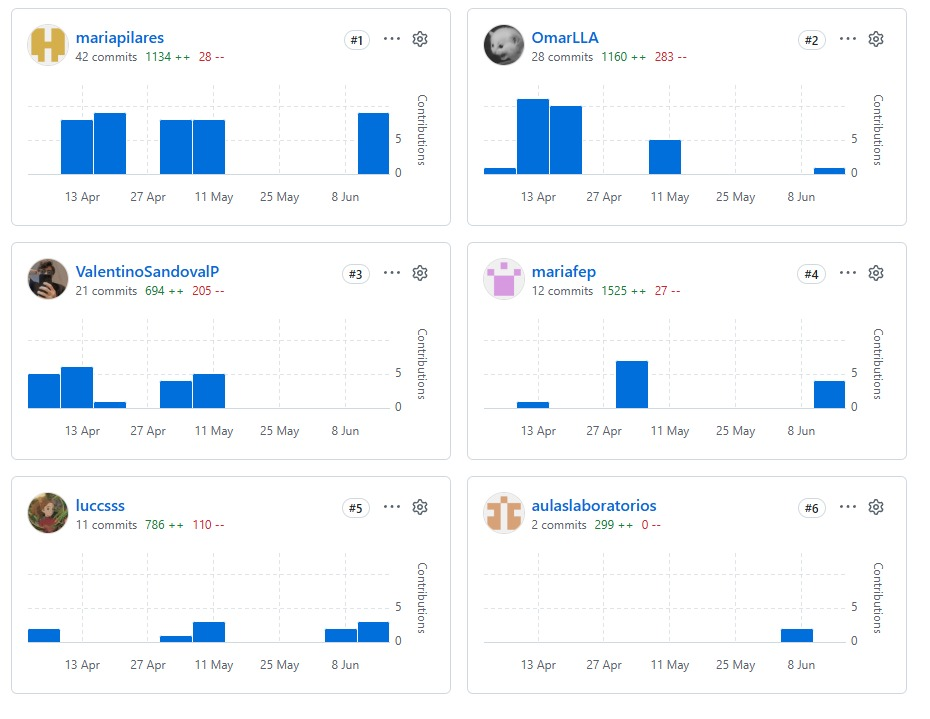

COMMITS:

Luquillas Asto, Omar: 28

Peña Riofrio, Maria Fernanda: 12

Pilares Pocohuanca, Maria: 42

Sanchez Silva, Luciana Celeste:	11

Sandoval Paiva, Valentino: 21

**TF:**

**REPORT**


COMMITS:

Luquillas Asto, Omar: 

Peña Riofrio, Maria Fernanda: 

Pilares Pocohuanca, Maria: 

Sanchez Silva, Luciana Celeste:	

Sandoval Paiva, Valentino: 


## Contenido

- [Student Outcome](#student-outcome)
- [Capítulo I: Introducción](#capítulo-i-introducción)
  - [1.1. Startup Profile](#11-startup-profile)
    - [1.1.1. Descripción de la Startup](#111-descripción-de-la-startup)
    - [1.1.2. Perfiles de integrantes del equipo](#112-perfiles-de-integrantes-del-equipo)
  - [1.2. Solution Profile](#12-solution-profile)
    - [1.2.1 Antecedentes y problemática](#121-antecedentes-y-problemática)
    - [1.2.2 Lean UX Process](#122-lean-ux-process)
        - [1.2.2.1 Lean UX Problem Statements](#1221-lean-ux-problem-statements)
        - [1.2.2.2 Lean UX Assumptions](#1222-lean-ux-assumptions)
        - [1.2.2.3 Lean UX Hypothesis Statements](#1223-lean-ux-hypothesis-statements)
        - [1.2.2.4 Lean UX Canvas](#1224-lean-ux-canvas)
  - [1.3. Segmentos objetivo](#13-segmentos-objetivo)

- [Capítulo II: Requirements Elicitation & Analysis](#capítulo-ii-requirements-elicitation--analysis)
  - [2.1. Competidores](#21-competidores)
    - [2.1.1. Análisis competitivo](#211-análisis-competitivo)
    - [2.1.2. Estrategias y tácticas frente a competidores](#212-estrategias-y-tácticas-frente-a-competidores)
  - [2.2. Entrevistas](#22-entrevistas)
    - [2.2.1. Diseño de entrevistas](#221-diseño-de-entrevistas)
    - [2.2.2. Registro de entrevistas](#222-registro-de-entrevistas)
    - [2.2.3. Análisis de entrevistas](#223-análisis-de-entrevistas)
  - [2.3. Needfinding](#23-needfinding)
    - [2.3.1. User Personas](#231-user-personas)
    - [2.3.2. User Task Matrix](#232-user-task-matrix)
    - [2.3.3. Empathy Mapping](#233-empathy-mapping)
    - [2.3.4. As-is Scenario Mapping](#234-as-is-scenario-mapping)
  - [2.4. Ubiquitous Language](#24-ubiquitous-language)

- [Capítulo III: Requirements Specification](#capítulo-iii-requirements-specification)
  - [3.1. To-Be Scenario Mapping](#31-to-be-scenario-mapping)
  - [3.2. User Stories](#32-user-stories)
  - [3.3. Impact Mapping](#33-impact-mapping)
  - [3.4. Product Backlog](#34-product-backlog)

- [Capítulo IV: Strategic-Level Software Design](#capítulo-iv-strategic-level-software-design)
  - [4.1. Strategic-Level Attribute-Driven Design](#41-strategic-level-attribute-driven-design)
    - [4.1.1. Design Purpose](#411-design-purpose)
    - [4.1.2. Attribute-Driven Design Inputs](#412-attribute-driven-design-inputs)
        - [4.1.2.1. Primary Functionality](#4121-primary-functionality-primary-user-stories)
        - [4.1.2.2. Quality Attribute Scenarios](#4122-quality-attribute-scenarios)
        - [4.1.2.3. Constraints](#4123-constraints)
    - [4.1.3. Architectural Drivers Backlog](#413-architectural-drivers-backlog)
    - [4.1.4. Architectural Design Decisions](#414-architectural-design-decisions)
    - [4.1.5. Quality Attribute Scenario Refinements](#415-quality-attribute-scenario-refinements)
  - [4.2. Strategic-Level Domain-Driven Design](#42-strategic-level-domain-driven-design)
    - [4.2.1. EventStorming](#421-eventstorming)
    - [4.2.2. Candidate Context Discovery](#422-candidate-context-discovery)
    - [4.2.3. Domain Message Flows Modeling](#423-domain-message-flows-modeling)
    - [4.2.4. Bounded Context Canvases](#424-bounded-context-canvases)
    - [4.2.5. Context Mapping](#425-context-mapping)
  - [4.3. Software Architecture](#43-software-architecture)
    - [4.3.1. System Landscape Diagram](#431-software-architecture-system-landscape-diagram)
    - [4.3.2. Context Level Diagrams](#432-software-architecture-context-level-diagrams)
    - [4.3.3. Container Level Diagrams](#433-software-architecture-container-level-diagrams)
    - [4.3.4. Deployment Diagrams](#434-software-architecture-deployment-diagrams)

- [Capítulo V: Tactical-Level Software Design](#capítulo-v-tactical-level-software-design)
  - [5.1. Bounded Context:  Registro y Autenticación de Usuario](#51bounded-context--registro-y-autenticación-de-usuario)
    - [5.1.1.	Domain Layer](#511domain-layer)
    - [5.1.2. Interface Layer.](#512-interface-layer)
    - [5.1.3. Application Layer.](#513-application-layer)
    - [5.1.4. Infrastructure Layer.](#514-infrastructure-layer)
    - [5.1.6. Bounded Context Software Architecture Component Level Diagrams.](#516-bounded-context-software-architecture-component-level-diagrams)
    - [5.1.7. Bounded Context Software Architecture Code Level Diagrams.](#517-bounded-context-software-architecture-code-level-diagrams)
      - [5.1.7.1. Bounded Context Domain Layer Class Diagrams.](#5171-bounded-context-domain-layer-class-diagrams)
      - [5.1.7.2. Bounded Context Database Design Diagram.](#5172-bounded-context-database-design-diagram)
  - [5.2.	Bounded Context: Gestión de Proyectos y Tareas](#52bounded-context--gestión-de-proyectos-y-tareas)
    - [5.2.1.	Domain Layer](#521domain-layer)
    - [5.2.2.	Interface Layer](#522interface-layer)
    - [5.2.3.	Application Layer](#523application-layer)
    - [5.2.4.	Infrastructure Layer](#524infrastructure-layer)
    - [5.2.6.	Bounded Context Software Architecture Component Level Diagrams](#526bounded-context-software-architecture-component-level-diagrams)
    - [5.2.7.	Bounded Context Software Architecture Code Level Diagrams](#527bounded-context-software-architecture-code-level-diagrams)
      - [5.2.7.1.	Bounded Context Domain Layer Class Diagrams](#5271bounded-context-domain-layer-class-diagrams)
      - [5.2.7.2.	Bounded Context Database Design Diagram](#5272bounded-context-database-design-diagram)
  - [5.3. Bounded Context: Visualización y Seguimiento](#53bounded-context--visualización-y-seguimiento)
    - [5.3.1.	Domain Layer](#531domain-layer)
    - [5.3.2.	Interface Layer](#532interface-layer)
    - [5.3.3.	Application Layer](#533application-layer)
    - [5.3.4.	Infrastructure Layer](#534infrastructure-layer)
    - [5.3.6.	Bounded Context Software Architecture Component Level Diagrams](#536bounded-context-software-architecture-component-level-diagrams)
    - [5.3.7.	Bounded Context Software Architecture Code Level Diagrams](#537bounded-context-software-architecture-code-level-diagrams)
      - [5.3.7.1.	Bounded Context Domain Layer Class Diagrams](#5371bounded-context-domain-layer-class-diagrams)
      - [5.3.7.2.	Bounded Context Database Design Diagram](#5372bounded-context-database-design-diagram)
  - [5.4. Bounded Context: Notificaciones](#54bounded-context--notificaciones)
    - [5.4.1.	Domain Layer](#541domain-layer)
    - [5.4.2.	Interface Layer](#542interface-layer)
    - [5.4.3.	Application Layer](#543application-layer)
    - [5.4.4.	Infrastructure Layer](#544infrastructure-layer)
    - [5.4.6.	Bounded Context Software Architecture Component Level Diagrams](#546bounded-context-software-architecture-component-level-diagrams)
    - [5.4.7.	Bounded Context Software Architecture Code Level Diagrams](#547bounded-context-software-architecture-code-level-diagrams)
      - [5.4.7.1.	Bounded Context Domain Layer Class Diagrams](#5471bounded-context-domain-layer-class-diagrams)
      - [5.4.7.2.	Bounded Context Database Design Diagram](#5472bounded-context-database-design-diagram)
  - [5.5. Bounded Context: Analítica y Reportes](#55bounded-context--analítica-y-reportes)
    - [5.5.1.	Domain Layer](#551domain-layer)
    - [5.5.2.	Interface Layer](#552interface-layer)
    - [5.5.3.	Application Layer](#553application-layer)
    - [5.5.4.	Infrastructure Layer](#554infrastructure-layer)
    - [5.5.6.	Bounded Context Software Architecture Component Level Diagrams](#556bounded-context-software-architecture-component-level-diagrams)
    - [5.5.7.	Bounded Context Software Architecture Code Level Diagrams](#557bounded-context-software-architecture-code-level-diagrams)
      - [5.5.7.1.	Bounded Context Domain Layer Class Diagrams](#5571bounded-context-domain-layer-class-diagrams)
      - [5.5.7.2.	Bounded Context Database Design Diagram](#5572bounded-context-database-design-diagram)


- [Capítulo VI: Solution UX Design](#capítulo-vi-solution-ux-design)
  - [6.1.	Style Guidelines](#61style-guidelines)
    - [6.1.1.	General Style Guidelines.](#611general-style-guidelines)
    - [6.1.2.	Web, Mobile & Devices Style Guidelines.](#612web-mobile--devices-style-guidelines)
  - [6.2.	Information Architecture.](#62information-architecture)
    - [6.2.2.	Labeling Systems.](#622labeling-systems)
    - [6.2.3.	Searching Systems.](#623searching-systems)
    - [6.2.5.	Navigation Systems.](#625navigation-systems)
    - [6.2.4.	SEO Tags and Meta Tags.](#624seo-tags-and-meta-tags)
  - [6.3.	Landing Page UI Design.](#63landing-page-ui-design)
    - [6.3.1.	Landing Page Wireframe.](#631landing-page-wireframe)
    - [6.3.2.	Landing Page Mock-up.](#632landing-page-mock-up)

  - [6.4.	Applications UX/UI Design.](#64applications-uxui-design)
    - [6.4.1.	Applications Wireframes.](#641applications-wireframes)
    - [6.4.2.	Applications Wireflow Diagrams.](#642applications-wireflow-diagrams)
    - [6.4.3.	Applications Mock-ups.](#643applications-mock-ups)
    - [6.4.4.	Applications User Flow Diagrams.](#644applications-user-flow-diagrams)
  - [6.5.	Applications Prototyping.](#65applications-prototyping)


- [Capítulo VII: Product Implementation, Validation & Deployment](#capítulo-vii-product-implementation-validation--deployment)


  - [7.3. Validation Interviews.](#73validation-interviews)
  - [7.3.1. Diseño de Entrevistas.](#731diseño-de-entrevistas)
  - [7.3.2. Registro de Entrevistas.](#732registro-de-entrevistas)
  - [7.3.3. Evaluación según heurísticas.](#733evaluaciones-según-heurísticas)
  - [7.4. Video About-the-Product.](#74video-about-the-product)


- [Conclusiones](#conclusiones)
  - [Conclusiones y recomendaciones](#conclusiones-y-recomendaciones)

- [Bibliografía](#bibliografía)

- [Anexos](#anexos)


## Student Outcome

El curso contribuye al cumplimiento del Student Outcome ABET:<br>
**ABET – EAC - Student Outcome 3**

**Criterio:** *Capacidad de comunicarse efectivamente con un rango de audiencias.*<br>
En el siguiente cuadro se describe las acciones realizadas y enunciados de conclusiones por parte del grupo, que permiten sustentar el haber alcanzado el logro del ABET – EAC - Student Outcome 3.

<table>
  <thead>
    <tr>
      <th>Criterio específico</th>
      <th>Acciones realizadas</th>
      <th>Conclusiones</th>
    </tr>
  </thead>
  <tbody>
    <tr>
      <td><strong>Comunica oralmente sus ideas y/o resultados con objetividad a público de diferentes especialidades y niveles jerárquicos, en el marco del desarrollo de un proyecto en ingeniería.</strong></td>
      <td>
      <br><br><strong>TB1</strong><br><br>
        Luquillas Asto, Omar<br>
        Fortalecí la comunicación oral al explicar soluciones técnicas del sistema, argumentando el uso de tecnologías y proponiendo ideas de manera estructurada. <br><br>
        Peña Riofrio, Maria Fernanda<br>
        Reconocí la importancia de una comunicación oral efectiva al participar en la coordinación y explicación de ideas dentro del equipo, asegurando la comprensión de todos los integrantes. <br><br>
        Pilares Pocohuanca, Maria<br>
        Desarrollé habilidades de comunicación oral al exponer ideas del proyecto y colaborar en la organización de la información, facilitando su entendimiento en el equipo. <br><br>
        Sanchez Silva, Luciana Celeste<br>
        Desarrollé la capacidad de comunicar ideas de forma oral al exponer los objetivos y la estructura del proyecto, organizando la información de manera clara y comprensible para el equipo. <br><br>
        Sandoval Paiva, Valentino<br>
        Mejoré la comunicación de conceptos técnicos al explicar aspectos como bases de datos y herramientas utilizadas, adaptando el lenguaje según el nivel de conocimiento del público.
        <br><br><strong>TP</strong><br><br>
        Luquillas Asto, Omar<br>
        Reforcé la comunicación oral al presentar propuestas de diseño UX/UI, explicando con claridad decisiones de usabilidad, estructura visual y navegación, adaptando el discurso según el nivel técnico del público. <br><br>
        Peña Riofrio, Maria Fernanda<br>
        Fortalecí la comunicación oral al explicar la arquitectura táctica del sistema, detallando los Bounded Contexts y su organización en capas, asegurando una comprensión clara tanto para perfiles técnicos como no técnicos. <br><br>
        Pilares Pocohuanca, Maria<br>
        Mejoré la exposición de ideas al explicar la estructura por capas (Domain, Application, Interface, Infrastructure) y los diagramas del sistema, organizando la información de forma lógica y comprensible. <br><br>
        Sanchez Silva, Luciana Celeste<br>
        Fortalecí la comunicación oral al presentar flujos de usuario, wireflows y decisiones de diseño UX, explicando de manera estructurada cómo interactúan los usuarios con el sistema. <br><br>
        Sandoval Paiva, Valentino<br>
        Reforcé la comunicación oral al sustentar decisiones de diseño UX/UI y arquitectura de navegación, explicando la experiencia del usuario de forma clara, objetiva y adaptada a distintos niveles de conocimiento.
     <br><br><strong>TB2</strong><br><br>

Luquillas Asto, Omar<br>
Fortalecí la comunicación oral al presentar los mockups, flujos de usuario y prototipos de la aplicación, explicando las decisiones de diseño y funcionalidad de manera clara para públicos con distintos niveles de conocimiento. Asimismo, participé en la sustentación de los avances del backend y frontend web, comunicando el progreso técnico del proyecto de forma estructurada y objetiva. <br><br>

Peña Riofrio, Maria Fernanda<br>
Fortalecí la comunicación oral al participar en la presentación de las entrevistas de validación, evaluaciones heurísticas y resultados obtenidos, explicando los hallazgos de manera comprensible para el equipo y otros interesados. Asimismo, sustenté los avances de la versión móvil y las conclusiones preliminares del proyecto. <br><br>

Pilares Pocohuanca, Maria<br>
Mejoré mis habilidades de comunicación oral al exponer el desarrollo del Sprint 1, incluyendo la planificación, backlog, evidencias de implementación, pruebas y despliegue del sistema. Además, participé en la presentación de los avances de la aplicación móvil, explicando el trabajo realizado y los resultados alcanzados durante el sprint. <br><br>

Sanchez Silva, Luciana Celeste<br>
Fortalecí la comunicación oral al presentar los resultados de las entrevistas de validación y las evaluaciones heurísticas, explicando de manera objetiva las observaciones y oportunidades de mejora identificadas. Asimismo, participé en la exposición de los avances de la aplicación móvil y del video About-the-Product. <br><br>

Sandoval Paiva, Valentino<br>
Reforcé la comunicación oral al sustentar la configuración del entorno de desarrollo, la gestión del código fuente y el proceso de despliegue del software. Además, participé en la presentación de los avances del backend y frontend web, explicando aspectos técnicos de la implementación de forma clara y adaptada al público.
      <br><br><strong>TF</strong><br><br>
        Luquillas Asto, Omar<br>
        . <br><br>
        Peña Riofrio, Maria Fernanda<br>
        . <br><br>
        Pilares Pocohuanca, Maria<br>
        . <br><br>
        Sanchez Silva, Luciana Celeste<br>
        Reconocí la importancia de la comunicación oral al compartir ideas argumentar la priorización de algunas historias de usuario de acuerdo al core del negocio para el desarrollo de la versión mobile de las aplicaciones para Leader y Team member. <br><br>
        Sandoval Paiva, Valentino<br>
        .
      </td>
      <td>
        TB1:<br> La elaboración del proyecto permitió fortalecer la capacidad del equipo para comunicar ideas y resultados de manera clara, objetiva y estructurada, adaptando el lenguaje según el nivel técnico del público. Asimismo, se desarrollaron habilidades de trabajo colaborativo y exposición de propuestas, facilitando la comprensión de soluciones de ingeniería y contribuyendo a una mejor toma de decisiones durante el desarrollo del proyecto.
        <br><br><strong>TP:</strong><br>
        En esta fase se consolidó la capacidad del equipo para comunicar ideas de manera oral integrando tanto aspectos técnicos como de diseño, logrando explicar de forma clara la arquitectura del sistema y la experiencia de usuario. Esto permitió una comunicación más efectiva entre distintos niveles jerárquicos y especialidades, fortaleciendo la argumentación y la claridad en la presentación de soluciones de ingeniería.
        <br><br><strong>TB2:</strong><br>
Durante esta etapa se fortaleció la capacidad del equipo para comunicar resultados de implementación y validación del proyecto, integrando aspectos técnicos, funcionales y de experiencia de usuario. La exposición de avances de desarrollo, despliegue, validación y prototipado permitió mejorar la claridad, objetividad y adaptación del mensaje hacia públicos de diferentes especialidades y niveles jerárquicos.
      </td>
    </tr>
    <tr>
      <td><strong>Comunica en forma escrita ideas y/o resultados con objetividad a público de diferentes especialidades y niveles jerárquicos, en el marco del desarrollo de un proyecto en ingeniería.</strong></td>
      <td>
      <br><br><strong>TB1</strong><br><br>
        Luquillas Asto, Omar<br>
        Fortalecí la comunicación escrita al documentar soluciones técnicas del sistema, explicando de manera objetiva el uso de tecnologías y procesos implementados. <br><br>
        Peña Riofrio, Maria Fernanda<br>
        Reconocí la importancia de la comunicación escrita efectiva al participar en la redacción y revisión del informe, asegurando coherencia, orden y comprensión del contenido. <br><br>
        Pilares Pocohuanca, Maria<br>
        Desarrollé habilidades de comunicación escrita al contribuir en la elaboración del documento final, organizando ideas de manera estructurada y accesible para diferentes niveles de conocimiento. <br><br>
        Sanchez Silva, Luciana Celeste<br>
        Desarrollé la capacidad de comunicar ideas de forma escrita al estructurar secciones del informe del proyecto, organizando la información de manera clara y coherente para distintos tipos de lectores. <br><br>
        Sandoval Paiva, Valentino<br>
        Mejoré la redacción técnica al describir componentes del sistema, como bases de datos y herramientas utilizadas, asegurando claridad y precisión en la información presentada.
        <br><br><strong>TP</strong><br><br>
        Luquillas Asto, Omar<br>
        Mejoré la comunicación escrita al desarrollar secciones de UX Design, describiendo lineamientos de estilo, arquitectura de información y decisiones de diseño de forma clara y estructurada. <br><br>
        Peña Riofrio, Maria Fernanda<br>
        Fortalecí la redacción técnica al documentar el diseño táctico del sistema, incluyendo la organización en capas, diagramas y la relación entre componentes. <br><br>
        Pilares Pocohuanca, Maria<br>
        Mejoré la documentación al estructurar y detallar los Bounded Contexts, diagramas de clases y diseño de base de datos, asegurando coherencia y claridad en la información técnica. <br><br>
        Sanchez Silva, Luciana Celeste<br>
        Fortalecí la comunicación escrita al documentar wireframes, user flows y componentes de experiencia de usuario, organizando la información de manera comprensible para distintos perfiles. <br><br>
        Sandoval Paiva, Valentino<br>
        Reforcé la redacción técnica al detallar prototipos, navegación y estructura UX/UI, explicando de manera clara cómo se relacionan los elementos del sistema.
        <br><br><strong>TB2</strong><br><br>

Luquillas Asto, Omar<br>
Fortalecí la comunicación escrita al documentar los mockups, diagramas de flujo de usuario y prototipos de la aplicación, describiendo de forma clara las decisiones de diseño y funcionalidad. Asimismo, participé en la documentación de los avances del backend y frontend web del sistema. <br><br>

Peña Riofrio, Maria Fernanda<br>
Mejoré la redacción técnica al documentar las entrevistas de validación, evaluaciones heurísticas y resultados obtenidos, organizando la información de forma clara y estructurada. Además, contribuí en la elaboración de conclusiones, bibliografía y anexos del proyecto, así como en la documentación de avances de la aplicación móvil. <br><br>

Pilares Pocohuanca, Maria<br>
Fortalecí la comunicación escrita al documentar las actividades del Sprint 1, incluyendo planificación, backlog, evidencias de desarrollo, pruebas, despliegue y colaboración del equipo. Asimismo, participé en la documentación de los avances de la versión móvil del sistema. <br><br>

Sanchez Silva, Luciana Celeste<br>
Mejoré la comunicación escrita al registrar entrevistas de validación, evaluaciones heurísticas y hallazgos obtenidos durante el proceso de validación. También contribuí en la elaboración del contenido del video About-the-Product y en la documentación de avances de la aplicación móvil. <br><br>

Sandoval Paiva, Valentino<br>
Reforcé la redacción técnica al documentar la configuración del entorno de desarrollo, la gestión del código fuente, las convenciones de programación y el despliegue del software. Además, participé en la documentación de los avances del backend y frontend web de la solución.
        <br><br><strong>TF</strong><br><br>
        Luquillas Asto, Omar<br>
        . <br><br>
        Peña Riofrio, Maria Fernanda<br>
        . <br><br>
        Pilares Pocohuanca, Maria<br>
        . <br><br>
        Sanchez Silva, Luciana Celeste<br>
        Reconocí de forma escrita la importancia de recopilar toda la documentación actualizada con la mejora continua de los artefactos moviles desarrollados en este último sprint. <br><br>
        Sandoval Paiva, Valentino<br>
        .
      </td>
      <td>
        TB1:<br> La elaboración del proyecto permitió fortalecer la capacidad del equipo para comunicar ideas y resultados de forma escrita de manera clara, objetiva y estructurada, adaptando el nivel de detalle según el público. Asimismo, se consolidaron habilidades en la redacción técnica y organización de la información, facilitando la documentación de soluciones de ingeniería y mejorando la comprensión del proyecto en distintos niveles.
        <br><br><strong>TP:</strong><br>
        En esta etapa se consolidó la comunicación escrita del equipo al integrar documentación detallada de arquitectura de software y diseño UX/UI, logrando un informe más completo, coherente y comprensible para distintos tipos de público. Esto permitió presentar soluciones de ingeniería con mayor claridad, precisión y organización.
        <br><br><strong>TB2:</strong><br>
En esta fase se consolidó la capacidad del equipo para documentar procesos de implementación, validación y despliegue de manera clara y estructurada. La elaboración de documentación técnica, evidencias de desarrollo, resultados de validación y configuraciones del sistema permitió fortalecer la redacción profesional y garantizar una adecuada comunicación escrita de las soluciones de ingeniería hacia diferentes tipos de público.
      </td>
    </tr>
  </tbody>
</table>


## Capítulo I: Introducción

### 1.1. Startup Profile

En el actual paradigma de la transformación digital, las organizaciones se enfrentan a un fenómeno crítico de fragmentación tecnológica. La dependencia sistémica de herramientas heterogéneas e inconexas, como hojas de cálculo de baja escala, protocolos de comunicación asíncronos (correos electrónicos) y plataformas de mensajería instantánea, ha derivado en un “ruido operativo” que limita la escalabilidad, duplica los esfuerzos y reduce la eficiencia de los equipos de trabajo. Esta falta de interoperabilidad compromete la integridad de los datos y la visibilidad transversal del ciclo de vida del proyecto.

Frente a esta problemática, nuestra startup Apex Cybernetics surge como una solución que va más allá de centralizar información. Nuestro objetivo es transformar los datos en inteligencia accionable. A través de la integración de Inteligencia Artificial (IA) y Automatización Robótica de Procesos (RPA), evolucionamos de una gestión reactiva basada en el pasado hacia una gestión predictiva, permitiendo a los equipos anticiparse a los escenarios futuros y mejorar la toma de decisiones en tiempo real.

#### 1.1.1. Descripción de la Startup

Nuestra empresa se dedica a crear herramientas digitales que ayudan a los equipos de trabajo a organizarse mejor y a cuidar sus recursos. Nos enfocamos en pequeñas y medianas empresas (pymes) que necesitan una solución efectiva para gestionar sus proyectos, pero sin la complicación o los altos costos de los programas tradicionales.

Para lograrlo, hemos desarrollado TaskMaster, una plataforma de gestión de proyectos que no solo sirve para organizar tareas, sino que utiliza tecnología avanzada para facilitar el trabajo diario:

**Objetivo:** Brindar a las empresas una solución centralizada que combine la planificación de tareas con el control financiero, mejorando la eficiencia y la comunicación mediante el uso de inteligencia y automatización.

**Misión:** Potenciar la productividad de las organizaciones mediante una plataforma que combine gestión humana y eficiencia tecnológica (IA/RPA) para asegurar la entrega exitosa de proyectos.

**Visión:** Ser el referente latinoamericano en software de gestión inteligente, liderando la adopción de automatización y analítica predictiva en el sector empresarial para 2030.

#### 1.1.2. Perfiles de integrantes del equipo

|  | Miembros del equipo | Codigo de estudiante | Descripción |
|-----------|-----------|-----------|-----------|
|     | Luciana Celeste Sanchez Silva   | U202215979    | Mi nombre es Luciana Celeste Sanchez Silva, tengo 20 años y vivo en Lima. En la actualidad, me encuentro estudiando el 5to ciclo de la carrera de ingeniería de software en la UPC debido a que desde una edad temprana tuve una fascinación relacionada con el uso de la tecnología y la programación. En mi tiempo libre trato de crecer y expandir mi conocimiento en todas las áreas posibles. De igual forma, me gusta nadar, escuchar música y tocar la guitarra. Me comprometo a colaborar en todo momento con la elaboración de esta startup, y llegar a un trabajo sobresaliente. Mis habilidades son: responsabilidad, resolución de problemas, y disciplina.    |
|     | Omar Luquillas Asto    | U20211G641    | Soy estudiante de la carrera de Ingeniería de Software. Elegí esta carrera porque me apasiona la tecnología, el desarrollo de software y la programación. Tengo conocimientos en lenguajes de programación como C++, Python y Java. Me considero una persona investigadora, ya que me gusta aprender cosas nuevas y siempre estoy en busca de soluciones creativas e innovadoras que generen un impacto positivo en la vida de las personas. Además, valoro el trabajo en equipo, soy responsable y me comprometo a cumplir con mis tareas de manera eficiente.    |
|    |  Valentino Sandoval Paiva   | U20211A962   | Soy Valentino Sandoval, tengo 20 años y soy estudiante de la carrera de Ingeniería de Software. Tengo conocimiento en lenguajes de programación como python y c++, y bases de datos como SQLServer y MongoDB. Desde pequeño me sentí atraído por la tecnología, por lo que me decidí a estudiar la carrera, además disfruto de jugar videojuegos con amigos en mi tiempo libre.   |
|     | Maria Fernanda Peña Riofrio   | U202113279   | Mi nombre es Maria Fernanda Peña Riofrio, tengo 22 años, estudio el 8vo ciclo de la carrera de Ingeniería de Software en la Universidad Peruana de Ciencias Aplicadas (UPC). Soy una persona responsable y me gusta ayudar a las demás personas, esto sera evidenciado en el transcuros del proyecto ayudando a mis demás compañeros de equipo. En mis tiempos libres me gusta mucho leer, escuchar música e investigar sobre temas de mi interes.    |
|      | Maria Pilares Pocohuanca   | U202215528    | Mi nombre es Maria Pilares Pocohuanca tengo 22 años y estudio la carrera de ingeniería de software en la UPC. Desde niña tuve mucho interés por las matemáticas y la tecnología, motivo por el cual estudio una ingeniería enfocada más a la programación. Me considero una persona perseverante aunque algo impaciente. Sin embargo, como miembro del equipo me comprometo a colaborar con mis compañeros y realizar todas las indicaciones que se dicten, todo con el fin de presentar un buen proyecto.   |

### 1.2. Solution Profile

TaskMaster es una solución integral diseñada para eliminar el caos operativo causado por el uso de herramientas desconectadas. A diferencia de un gestor de tareas tradicional, nuestra plataforma actúa como un ecosistema inteligente que centraliza la comunicación, el avance técnico y el control financiero en un solo lugar.

**La solución se basa en tres pilares de innovación:**

- Centralización de la Gestión de Proyectos: Unificamos tareas, cronogramas y comunicación en un solo espacio digital. Esto elimina la necesidad de saltar entre múltiples aplicaciones, permitiendo que toda la información del proyecto esté siempre organizada y disponible.

- Colaboración Activa y en Tiempo Real: Facilitamos que los miembros del equipo actualicen sus avances de forma instantánea. Gracias a la Automatización con RPA, el sistema genera notificaciones inteligentes, recordatorios de vencimiento y alertas automáticas, asegurando que todos estén alineados sin esfuerzo manual.

- Asignación de Responsabilidades y Roles: Estructuramos el trabajo mediante roles definidos (jefes de proyecto y miembros). Esta base permite que nuestra IA de Analítica analice el rendimiento individual, detecte tareas atrasadas y sugiera una distribución justa de la carga de trabajo para evitar el agotamiento del equipo.

- Seguimiento Visual Avanzado: Proporcionamos una visibilidad total mediante tableros visuales y calendarios interactivos. Estos se complementan con Indicadores de Riesgo por IA, que funcionan como alertas inteligentes para identificar visualmente si un proyecto corre el riesgo de retrasarse o exceder su presupuesto.

**Restricciones y Alcance**

- Restricciones técnicas: la plataforma debe ser accesible desde dispositivos móvile, con una interfaz intuitiva y adaptable.
- Alcance inicial: orientada a pequeñas y medianas empresas que requieren optimizar la gestión de proyectos sin recurrir a soluciones costosas y complejas.

#### 1.2.1 Antecedentes y problemática

En el entorno empresarial actual, la dependencia de herramientas dispersas (Excel, correos, mensajería y sistemas aislados) genera una gestión fragmentada que reduce la productividad, desperdicia tiempo y afecta los resultados financieros. Un informe de Quickbase (2023) vincula esta fragmentación con pérdidas significativas de eficiencia, mientras que Atlassian (2024) señala que el 56 % de los trabajadores enfrenta flujos de trabajo desconectados, limitando la visibilidad y la colaboración.

Para comprender mejor esta problemática, la analizamos mediante el modelo 5W2H, incorporando además el impacto de la ausencia de tecnologías predictivas.

1. **What / ¿Qué?**

    -  *¿Cuál es el problema?* La gestión fragmentada en herramientas manuales (Excel, chats) provoca pérdida de datos y falta de previsión. Las empresas no saben que un proyecto fallará hasta que ya es tarde, debido a la ausencia de análisis predictivo.

   - *¿Cuál es la relación con la persona en cuestión?* Los líderes se saturan con tareas administrativas (hacer reportes, enviar recordatorios) y los equipos sufren por cargas de trabajo mal distribuidas.

2. **When / Cuándo?**

    - *¿Cuándo sucede el problema?* Durante todo el ciclo del proyecto, pero se vuelve crítico en las fechas de entrega, donde la falta de alertas automáticas (RPA) genera retrasos acumulados.

    - *¿Cuándo utiliza el cliente el producto?* Diariamente, como panel central para recibir instrucciones de la IA y actualizaciones de los bots de notificación.

3. ***Where / Dónde?***

    - *¿Dónde está el cliente cuando usa el producto?* En entornos de oficina, en modalidad híbrida o trabajo remoto. El producto se usa principalmente desde computadoras y dispositivos móviles.

    -*¿Dónde surge el problema?* En la dispersión digital: cuando la información está repartida en varias aplicaciones no integradas.

4. **Who / Quién?**

    - *¿Quiénes se ven involucrados en el problema?* Jefes de proyecto (PM) que necesitan visibilidad de riesgo y miembros del equipo que requieren claridad en sus prioridades.

    - *¿Cuáles son las causas del problema?* Uso de demasiadas aplicaciones sin integración, dependencia de procesos manuales y falta de una IA que analice el rendimiento en tiempo real.

5. **Why / ¿Por qué?**

    - *¿Por qué sucede el problema?* Porque las soluciones actuales solo registran información pasada y aislada (calendarios, chats, finanzas, gestión de tareas), pero no ayudan a predecir el futuro del proyecto. Esto genera duplicidad de trabajo y decisiones basadas en suposiciones, no en datos.

6. **How / Cómo?**

    - *¿En qué condiciones los clientes usan nuestro producto?* Equipos bajo presión con fechas límite estrictas y presupuestos limitados que no pueden permitirse el lujo de perder tiempo en tareas administrativas manuales.

    - *¿Cómo se diferencia el problema del estado normal (óptimo)?* En un estado óptimo, el sistema debería avisar de un retraso antes de que ocurra. Actualmente, la fricción entre sistemas impide esta proactividad.

7. **How Much / Cuánto?**

    - *¿Cuántos problemas se dan en un día, una semana o un mes?* Según Quickbase (2023), el 70 % de los empleados pierde hasta 20 horas por semana debido a sistemas fragmentados. Esto equivale a medio tiempo laboral desperdiciado por cada trabajador.

    - *¿Cuánto dinero están implicando?* Atlassian (2024) reporta que las organizaciones con ecosistemas desconectados tienen un 37 % menos probabilidad de cumplir sus metas de ingresos. Además, Forrester (2024) encontró que el 76 % de las PMOs usan cinco o más herramientas por proyecto, generando pérdidas de hasta un 23 % del tiempo semanal en tareas redundantes.

#### 1.2.2 Lean UX Process

Según Pragma (2021), el proceso Lean UX es la mezcla de metodologías ágiles y temas de usabilidad, donde se prioriza la experiencia de usuario por la creación de un producto. Teniendo en cuenta ello, hemos elaborado nuestro Lean UX process basándonos en sus cuatro pilares principales: problem statements, assumptions, hypothesis y canvas.

##### 1.2.2.1 Lean UX Problem Statements

**Problem Statement #1 – Líderes de Proyecto (Foco en Predicción) :**
Hemos identificado que los líderes de proyecto en pymes dedican excesivo tiempo al análisis manual de datos para identificar retrasos, lo que impide una reacción oportuna. El problema es que las herramientas actuales son reactivas (muestran lo que ya pasó). ¿Cómo podemos utilizar la IA de analítica predictiva  y los indicadores de riesgo  para que los líderes visualicen amenazas antes de que afecten el cronograma, permitiéndoles tomar decisiones estratégicas basadas en datos en lugar de suposiciones?

**Problem Statement #2 – Miembros de Equipo (Foco en Productividad) :**
Los colaboradores enfrentan confusión y agotamiento debido a cargas de trabajo desequilibradas y al constante "ruido" de mensajes manuales para reportar avances. ¿Cómo podemos implementar un sistema de notificaciones inteligentes mediante RPA que automatice el seguimiento y una IA que equilibre las tareas, para que el equipo se enfoque exclusivamente en la ejecución técnica sin distracciones administrativas?

##### 1.2.2.2 Lean UX Assumptions

**Business Assumptions (Suposiciones de Negocio)**

- Creo que mis clientes tienen la necesidad de: Centralizar la gestión de proyectos en una sola plataforma, evitando el uso disperso de herramientas como Excel, correos y chats, y eliminando la carga administrativa de realizar reportes y seguimientos manuales.

- Estas necesidades se pueden resolver con: Una plataforma digital colaborativa que integre tableros Kanban, calendarios, asignación de tareas, un módulo financiero básico y, fundamentalmente, tecnologías inteligentes (IA y RPA) para la analítica de rendimiento y la automatización de notificaciones.

- Mis clientes iniciales son (o serán): Pequeñas y medianas empresas (pymes) con equipos de desarrollo o áreas de proyectos que buscan mejorar la organización, el control de sus recursos y la previsión de riesgos mediante datos en tiempo real.

- El valor principal que los clientes quieren obtener de mi servicio es: Mayor eficiencia y visibilidad en la planificación y ejecución de proyectos. Beneficios adicionales: Mejor colaboración entre miembros, reducción de errores mediante alertas de riesgo (IA), control preciso de presupuestos y reportes automáticos para decisiones estratégicas.

- Adquiriré a la mayoría de mis clientes a través de: Estrategias de marketing digital (redes sociales, LinkedIn), demostraciones gratuitas de la plataforma enfocadas en la automatización y recomendaciones entre contactos en el sector empresarial tecnológico.

- Ganaré dinero mediante: Un modelo de licenciamiento (SaaS), con una versión gratuita limitada y planes de pago escalables según el tamaño de la empresa, el número de miembros y el nivel de acceso a las herramientas de analítica avanzada.

- Mi principal competencia en el mercado será: Plataformas similares como Trello, Asana o Jira. Los superaremos debido a: Un enfoque en la integración financiera simple, el uso de IA predictiva y RPA nativo para reducir el trabajo operativo, precios más accesibles para pymes y una interfaz móvil intuitiva que no requiere capacitación extensa.

- Mi mayor riesgo de producto es: Que las empresas perciban a **name** como una herramienta redundante frente a soluciones ya conocidas. Lo resolveremos mediante: Una diferenciación clara en la propuesta de valor (finanzas integradas + automatización inteligente) y versiones de prueba gratuitas que demuestren el ahorro real de tiempo.

- Otras suposiciones que, si resultan falsas, harán que nuestro proyecto fracase:

  - Que las pymes estén dispuestas a invertir en una solución digital pagada en lugar de continuar con herramientas gratuitas y procesos manuales.

  - Que los usuarios puedan adoptar rápidamente las funciones de IA y RPA sin percibir complejidad técnica en la plataforma.

**User Assumptions (Suposiciones de Usuario)**

- ¿Quién es el usuario?: Nuestros usuarios son líderes o gerentes de empresas con roles como Product Owners, Scrum Masters o jefes de proyectos, así como los miembros de los equipos de desarrollo y colaboradores que ejecutan las tareas técnicas y operativas.

- ¿Dónde encaja nuestro producto en su trabajo o vida?: Dentro del entorno laboral diario, funcionando no solo como un registro de tareas, sino como un asistente inteligente que ayuda en la planificación, asignación y el seguimiento preventivo de los proyectos.

- ¿Qué problemas resuelve nuestro producto?:

  - La dispersión de información entre múltiples canales (Excel, chats, correos).

  - La falta de visibilidad en tiempo real sobre el progreso y los posibles riesgos de retraso.

  - La carga administrativa de realizar reportes manuales y enviar recordatorios constantes.

  - Las dificultades para controlar presupuestos y plazos de forma integrada.

- ¿Cuándo y cómo se usa nuestro producto?: Se utiliza de forma continua durante la jornada laboral. Los líderes lo consultan para revisar indicadores de riesgo y métricas de rendimiento (IA), mientras que los colaboradores lo usan en dispositivos móviles para recibir notificaciones inteligentes (RPA), registrar avances y gestionar sus tareas pendientes.

- ¿Qué características son importantes?:

  - Seguimiento visual mediante tableros Kanban y calendarios.

  - Analítica predictiva : Reportes automáticos de rendimiento y carga de trabajo.

  - Alertas de riesgo : Indicadores inteligentes que anticipan retrasos.

  - Automatización : Notificaciones y recordatorios autónomos mediante RPA.

- ¿Cómo debería verse y comportarse nuestro producto?: Debe tener una interfaz moderna, intuitiva y fácil de aprender. Su comportamiento debe ser proactivo: en lugar de solo esperar datos, el sistema debe alertar al usuario sobre eventos importantes (como un riesgo de atraso o una sobrecarga de tareas) de manera visual y clara, con un diseño totalmente adaptable a móviles.

##### 1.2.2.3 Lean UX Hypothesis Statements

- **Hypothesis Statement 01 (Centralización e IA):**
Creemos que centralizar tareas, cronogramas y comunicación en una sola plataforma potenciada por IA para pymes aumentará la eficiencia operativa.
Sabremos que estamos en lo correcto cuando veamos que más del 70 % de los usuarios reporten una migración total desde herramientas externas como Excel o chats dispersos hacia la plataforma.

- **Hypothesis Statement 02 (Visibilidad de Riesgo):**
Creemos que implementar tableros Kanban con indicadores de riesgo basados en IA mejorará la capacidad de reacción de los líderes.
Sabremos que estamos en lo correcto cuando recibamos retroalimentación positiva en encuestas de usabilidad y veamos un incremento del 40 % en la interacción con los módulos de alerta temprana.

- **Hypothesis Statement 03 (Control Financiero):**
Creemos que ofrecer un módulo financiero básico integrado con alertas de presupuesto facilitará el control de recursos a los gerentes.
Sabremos que estamos en lo correcto cuando observemos que al menos el 60 % de los clientes activos utilicen semanalmente el módulo de estados de pago y presupuestos.

- **Hypothesis Statement 04 (Adopción de Tecnología):**
Creemos que una interfaz intuitiva permitirá que los usuarios adopten las funciones de IA y RPA sin necesidad de capacitación técnica.
Sabremos que estamos en lo correcto cuando nuevos usuarios completen su primera tarea y configuren su primera alerta automática en menos de 10 minutos.

- **Hypothesis Statement 05 (Conversión):**
Creemos que ofrecer una versión de prueba gratuita que incluya funciones básicas de analítica atraerá a clientes de pago.
Sabremos que estamos en lo correcto cuando al menos el 30 % de los usuarios de prueba realicen el "upgrade" a un plan premium tras probar la automatización.

- **Hypothesis Statement 06 (Toma de Decisiones):**
Creemos que integrar métricas de desempeño generadas por IA mejorará la toma de decisiones estratégicas.
Sabremos que estamos en lo correcto cuando el 80 % de los líderes reporten mayor confianza y rapidez al presentar reportes de avance a sus superiores.

- **Hypothesis Statement 07 (Gestión de Carga):**
Creemos que el análisis de la carga de trabajo por IA  permitirá una asignación de roles y tareas más equitativa.
Sabremos que estamos en lo correcto cuando las métricas internas muestren una reducción del 50 % en tareas duplicadas o miembros de equipo con sobrecarga crítica.

- **Hypothesis Statement 08 (Movilidad):**
Creemos que priorizar el acceso móvil incrementará la frecuencia de actualización de tareas en tiempo real.
Sabremos que estamos en lo correcto cuando veamos que más del 50 % de las interacciones con notificaciones inteligentes provengan de dispositivos móviles.

- **Hypothesis Statement 09 (Competitividad):**
Creemos que un precio escalable junto a funciones de IA nativas atraerá a pymes que hoy ven a Jira o Asana como herramientas costosas o complejas.
Sabremos que estamos en lo correcto cuando los clientes destaquen la relación costo-automatización en entrevistas cualitativas.

- **Hypothesis Statement 10 ( Reducción Administrativa):**
Creemos que brindar reportes automáticos de rendimiento eliminará el trabajo manual de los líderes de proyecto.
Sabremos que estamos en lo correcto cuando los usuarios indiquen que han sustituido por completo la generación manual de reportes en Excel por las exportaciones de nuestra IA.

- **Hypothesis Statement 11 (Retención):**
Creemos que un diseño visual moderno y una experiencia de usuario fluida motivarán un uso constante de la plataforma.
Sabremos que estamos en lo correcto cuando los usuarios activos diarios (DAU) se conecten al menos 3 veces por semana para revisar sus indicadores.

- **Hypothesis Statement 12 (Automatización RPA):**
Creemos que los recordatorios automáticos y alertas por vencimiento  mediante RPA reducirán los retrasos en las entregas.
Sabremos que estamos en lo correcto cuando el porcentaje de tareas finalizadas en la fecha establecida aumente un 15 % mes a mes.

- **Hypothesis Statement 13 (Satisfacción):**
Creemos que un soporte técnico integrado y accesible aumentará la lealtad del cliente hacia la plataforma.
Sabremos que estamos en lo correcto cuando el CSAT (Customer Satisfaction Score) de soporte sea superior a 4.5/5.

- **Hypothesis Statement 14 (Escalabilidad Interna):**
Creemos que la segmentación de proyectos por áreas facilitará la gestión en empresas con múltiples equipos de desarrollo.
Sabremos que estamos en lo correcto cuando las empresas clientes gestionen más de 3 proyectos simultáneos utilizando nuestras funciones de analítica cruzada.

- **Hypothesis Statement 15 (Seguridad de Datos):**
Creemos que la seguridad en el manejo de datos financieros y de rendimiento incrementará la confianza de los niveles gerenciales.
Sabremos que estamos en lo correcto cuando la tasa de abandono por preocupaciones de privacidad sea 0 % y los usuarios den feedback positivo sobre la encriptación de sus presupuestos.

##### 1.2.2.4 Lean UX Canvas

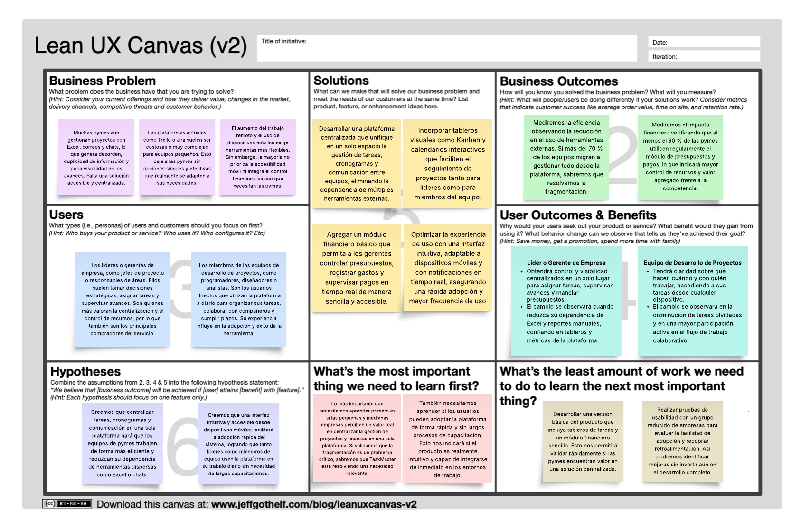

### 1.3. Segmentos objetivo

**Segmento Objetivo 1: Líder o Gerente de Empresa**

Este segmento corresponde a profesionales que ocupan cargos de liderazgo dentro de organizaciones del sector tecnológico o empresarial, tales como gerentes de proyectos, jefes de innovación o líderes de área. Su rol principal consiste en tomar decisiones estratégicas, gestionar recursos y coordinar equipos en proyectos de desarrollo ágil.

- **Características Demográficas:**
En general, suelen encontrarse en el rango de edad de 30 a 50 años, cuentan con estudios universitarios o de posgrado, y residen principalmente en centros urbanos como Lima, Arequipa o Trujillo, donde se concentra la mayor cantidad de empresas con proyectos tecnológicos.

- **Información Estadística de Sustento:**
Según el Informe del INEI (2023), el 65 % de las empresas medianas y grandes del Perú se ubican en Lima Metropolitana, siendo estas las que mayormente adoptan metodologías de gestión de proyectos ágiles. Asimismo, un estudio de Everis y EY (2022) señala que más del 40 % de las empresas peruanas del sector financiero y tecnológico ya han implementado roles asociados a Scrum Master y Product Owner, lo que refleja la creciente relevancia de este segmento para proyectos de desarrollo ágil.

**Segmento Objetivo 2: Equipo de Desarrollo de Proyectos**

Este segmento está conformado por profesionales que se desempeñan como programadores, diseñadores, analistas de sistemas o testers. Su rol es implementar soluciones técnicas, colaborar en la construcción de software y adaptarse a metodologías ágiles bajo la guía de los líderes de proyecto.

- **Características Demográficas:**
En su mayoría, son profesionales jóvenes entre 22 y 35 años, muchos de ellos egresados recientes o estudiantes de los últimos ciclos de carreras de ingeniería de software, sistemas o afines. Están ubicados principalmente en Lima y en regiones con polos tecnológicos como Cusco, Arequipa y La Libertad. Se caracterizan por un alto nivel de adopción tecnológica y el uso frecuente de herramientas colaborativas.

- **Información Estadística de Sustento:**
De acuerdo con el Banco Interamericano de Desarrollo (BID, 2021), en el Perú se proyecta una demanda de más de 30,000 profesionales de tecnologías de la información hacia el 2025. Asimismo, la Encuesta Nacional de Innovación en la Industria (INEI, 2022) señala que un 37 % de las empresas que desarrollan proyectos de innovación tecnológica han incorporado equipos de desarrollo de software en su estructura, lo cual evidencia la importancia de este grupo como segmento objetivo.

## Capítulo II: Requirements Elicitation & Analysis

### 2.1. Competidores


En esta sección se expone un análisis de los principales competidores de WorkHub, poniendo el foco en aquellos que operan bajo modelos de negocio digitales similares o que, aunque no coincida por completo, ofrecen productos o servicios que se solapan parcialmente con nuestra propuesta. Se consideran tanto los competidores directos, que actúan en el mismo segmento de mercado, como los indirectos, que abarcan ámbitos relacionados con la organización de tareas, la planificación de actividades y la gestión colaborativa de equipos.

**1. Wrike**

**Descripción:**

Wrike es una plataforma de gestión de proyectos y trabajo colaborativo diseñada para equipos de distintos tamaños. Permite planificar, priorizar y dar seguimiento a tareas en tiempo real, con funcionalidades orientadas a mejorar la visibilidad del flujo de trabajo y la comunicación entre los miembros del equipo.

**Características principales:**
- Organización de proyectos mediante diagramas de Gantt, tableros Kanban, calendarios y listas.

- Creación de tareas, subtareas y dependencias para una planificación detallada.

- Colaboración centralizada con comentarios, menciones, archivos adjuntos y aprobaciones en línea.

- Automatización de flujos de trabajo y recordatorios para reducir tareas repetitivas.

- Reportes personalizables con métricas de desempeño y paneles de control en tiempo real.

- Integraciones con más de 400 herramientas, incluyendo Slack, Salesforce, Microsoft Teams y Google Workspace.

- Aplicación móvil con acceso a tareas, notificaciones y actualización de proyectos desde cualquier lugar.

**2. Trello**

**Descripción:**

Trello es una herramienta de gestión de proyectos basada en tableros Kanban, diseñada para facilitar la organización visual de tareas y proyectos. Su interfaz intuitiva y flexible lo convierte en una opción popular para equipos que buscan simplicidad y colaboración en tiempo real.

**Características principales:**

- Tableros, listas y tarjetas para organizar proyectos y tareas de forma visual.

- Personalización de tarjetas con etiquetas, fechas de vencimiento, checklists y archivos adjuntos.

- Colaboración en equipo mediante comentarios, menciones y notificaciones.

- Automatización de tareas con Butler (reglas, recordatorios y acciones automáticas).

- Integraciones con herramientas como Slack, Google Drive, Jira, Dropbox y más.

- Plantillas predefinidas para distintos tipos de proyectos y flujos de trabajo.

- Aplicación móvil con acceso completo a tableros y colaboración en cualquier lugar.

**3. ClickUp**

**Descripción:**

ClickUp es una plataforma de productividad y gestión de proyectos todo en uno que busca centralizar tareas, documentos, comunicación y seguimiento de objetivos en un solo lugar. Está pensada para equipos que necesitan una solución flexible y personalizable, adaptándose tanto a proyectos simples como a flujos de trabajo complejos.

**Características principales:**

- Organización de proyectos mediante listas, tableros Kanban, calendarios, cronogramas y diagramas de Gantt.

-Gestión detallada de tareas con subtareas, prioridades, dependencias y asignaciones múltiples.

- Colaboración en tiempo real con comentarios, menciones, chat integrado y documentos compartidos.

- Paneles de control e informes personalizables para monitorear productividad y avances.

- Funcionalidades de seguimiento de tiempo y estimaciones de esfuerzo.

- Automatización de procesos para reducir tareas repetitivas.

- Amplia integración con herramientas como Slack, GitHub, Zoom, Google Workspace, entre otras.

- Aplicación móvil y de escritorio con sincronización completa para trabajar desde cualquier dispositivo.


#### 2.1.1. Análisis competitivo


| **Competitive Analysis Landscape** |  |  |  |  |
|----------------------------------|--|--|--|--|
| **¿Por qué llevar a cabo este análisis?** | Permite identificar la posición de WorkHub frente a sus competidores, entender sus ventajas y desventajas, y detectar oportunidades estratégicas dentro del mercado de herramientas colaborativas. |  |  |  |
|  | **WorkHub**  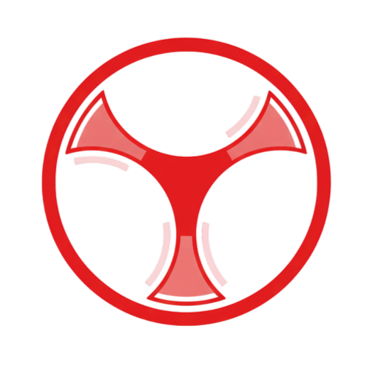 | **Wrike**  | **Trello**  | **ClickUp**  |
| **Perfil** | Overview | Plataforma colaborativa enfocada en equipos de desarrollo de software. | Plataforma de gestión de proyectos para equipos de distintos tamaños. | Herramienta visual basada en Kanban para gestión de tareas. | Plataforma todo-en-uno para productividad y gestión. |
|  | Ventaja competitiva ¿Qué valor ofrece? | Interfaz intuitiva y sencilla, diseñada para todo el ciclo de desarrollo. | Automatización avanzada y análisis predictivo. | Simplicidad y facilidad de uso. | Alta personalización y solución integral. |
| **Perfil de Marketing** | Mercado objetivo | Startups de tecnología. | Empresas medianas y grandes. | Equipos pequeños y startups. | Startups, pymes y empresas. |
|  | Estrategias de marketing | Marketing digital, pruebas gratuitas y alianzas. | Enfoque en robustez e integraciones. | Simplicidad y accesibilidad. | Enfoque en precio y personalización. |
| **Perfil de Producto** | Productos & Servicios | Plataforma colaborativa con edición en tiempo real. | Gestión completa de proyectos con múltiples herramientas. | Tableros Kanban visuales. | Gestión de tareas, tiempo y automatización. |
|  | Precios & Costos | Planes escalables con versión gratuita. | Desde $9.80 por usuario/mes. | Desde $5 por usuario/mes. | Desde $5 por usuario/mes. |
|  | Canales de distribución (Web y/o Móvil) | Web con integraciones. | Web y apps móviles. | Web y apps móviles. | Web, móvil y extensiones. |
| **Análisis SWOT** | Fortalezas | Innovación y enfoque en startups. | Funcionalidad robusta. | Interfaz simple. | Alta personalización. |
|  | Debilidades | Base de usuarios limitada. | Curva de aprendizaje. | Pocas funciones avanzadas. | Puede ser complejo. |
|  | Oportunidades | Expansión en mercados emergentes. | Nuevas funciones de IA. | Nuevas integraciones. | Crecimiento global. |
|  | Amenazas | Competencia fuerte. | Herramientas más económicas. | Competidores más completos. | Competidores con usuarios fieles. |


#### 2.1.2. Estrategias y tácticas frente a competidores


Nuestra estrategia se basará en potenciar nuestras fortalezas y capitalizar las debilidades de la competencia, mientras aprovechamos las oportunidades del mercado y mitigamos las amenazas identificadas.

**Fortalezas propias y cómo las aprovecharemos:**

- **Interfaz intuitiva y colaboración en tiempo real:** destacaremos estas características como diferenciadores frente a competidores más complejos como Wrike y ClickUp, posicionándonos como la opción más ágil y accesible para startups tecnológicas.

- **Enfoque en startups:** dirigiremos nuestras campañas de marketing digital hacia comunidades tecnológicas, incubadoras y hubs de innovación, donde nuestro producto puede generar mayor impacto inicial.


**Debilidades de la competencia y tácticas para aprovecharlas:**

- La curva de aprendizaje de Wrike y la complejidad de ClickUp representan una barrera para nuevos usuarios; en contraste, resaltaremos nuestra simplicidad y eficiencia.

- Trello, aunque intuitivo, tiene limitaciones en funciones avanzadas, lo que nos permite diferenciarnos con un sistema que combina facilidad de uso con integraciones relevantes.

**Oportunidades del mercado y acciones concretas:**

- Aprovecharemos el crecimiento de las startups tecnológicas y de los equipos distribuidos, ofreciendo planes escalables y accesibles, desde versiones gratuitas hasta opciones premium.

- Incorporaremos integraciones con herramientas ampliamente utilizadas (Slack, Google Workspace, Microsoft Teams), fortaleciendo la conectividad con el ecosistema digital de nuestros clientes.

- Implementaremos mejoras continuas basadas en retroalimentación, con especial foco en automatización de tareas y en el desarrollo de funcionalidades innovadoras que mantengan vigente nuestra propuesta.

**Amenazas y medidas de mitigación:**

- Frente a la fuerte competencia de plataformas consolidadas, mantendremos precios flexibles y competitivos que atraigan a equipos en crecimiento.

- Para contrarrestar la lealtad de usuarios hacia otras herramientas, nos enfocaremos en ofrecer una experiencia de usuario excepcional y soporte cercano, creando una comunidad que impulse la fidelización.

- Adoptaremos un enfoque proactivo de innovación para mantenernos al día con las tendencias del sector y responder rápidamente a cambios en las demandas del mercado.

Con este enfoque integral, WorkHub podrá diferenciarse en el mercado, consolidar su presencia entre startups y escalar progresivamente hacia segmentos más amplios, garantizando relevancia y competitividad sostenida.


### 2.2. Entrevistas

#### 2.2.1. Diseño de entrevistas


**Segmentos encontrados:**

- Líder o Gerente de Empresa (Product Owner y Scrum Master)

- Equipo de Desarrollo de proyectos

Antes de poder realizar las entrevistas, consideramos prudente poder concretar un análisis previo para poder realizar las entrevistas de una mejor manera. Es por ello, que para cada uno de nuestros segmentos proponemos estas preguntas para poder conocer un poco más sobre nuestro público objetivo.

Preguntas :

preguntas ordenadas para entrevistar a los dos segmentos objetivos de la startup **"TASKMASTER"**:

**Segmento: Líder o Gerente de Empresa (Product Owner y Scrum Master)**

**Principales:**

1. **Introducción al Rol**: ¿Podría describir su rol en la empresa y las principales responsabilidades que tiene en el área e?

2. **Contexto Empresarial**: ¿Cuál es el enfoque principal de su empresa en términos de productos o servicios de software?

3. **Crecimiento y Desafíos**: ¿Cuáles son los mayores desafíos que enfrenta su empresa actualmente en términos de crecimiento y gestión de proyectos?

4. **Experiencias Pasadas**: ¿Ha tenido alguna experiencia negativa con las herramientas actuales de gestión de proyectos que utiliza?

5. **Necesidades Específicas**: ¿Qué características considera esenciales en una herramienta de gestión de proyectos para apoyar el crecimiento y la eficiencia de su equipo?

6. **Colaboración y Comunicación**: ¿Cómo maneja actualmente la colaboración y la comunicación entre los diferentes equipos dentro de su empresa?

7. **Evaluación de Soluciones Actuales**: ¿Siente que las herramientas actuales limitan su capacidad para innovar y liderar en su sector?

8. **Visión Futura**: ¿Cómo imagina la evolución de sus procesos de gestión de proyectos en los próximos 5 años?

9. **Interés en Nuevas Soluciones**: ¿Qué tan abierto estaría a explorar y adoptar una nueva herramienta de gestión de proyectos que ofrezca características avanzadas y personalizables?

10. **Experiencia con Proveedores Externos**: ¿Cuál ha sido su experiencia al trabajar con proveedores externos de soluciones de software? ¿Qué busca en un socio estratégico?

11. **Expectativas a Largo Plazo**: ¿Qué expectativas tendría para una colaboración a largo plazo con una empresa que ofrezca soluciones de gestión de proyectos?

12. **Adaptabilidad y Personalización**: ¿Qué tan importante es para usted que una herramienta de gestión se adapte específicamente a las necesidades y procesos de su empresa?

13. **Consideraciones de Seguridad**: ¿Qué preocupaciones o requisitos de seguridad tiene al implementar nuevas herramientas de software?

14. **Disposición a Colaborar**: Si encuentra que una herramienta cumple con sus expectativas, ¿estaría dispuesto a colaborar con la empresa desarrolladora para ajustar la herramienta a las necesidades emergentes de su equipo?

**Complementarias:**

1. **Integración con Herramientas Existentes**: ¿Qué tan importante es para usted que la nueva herramienta de gestión de proyectos se integre sin problemas con las herramientas de software que ya utiliza su equipo?

2. **Medición del Éxito del Proyecto**: ¿Cuáles son los indicadores clave que utiliza para medir el éxito de un proyecto? ¿Cómo una nueva herramienta podría ayudar a mejorar estos indicadores?

3. **Gestión de Riesgos**: ¿Cómo maneja actualmente los riesgos en los proyectos de desarrollo de software? ¿Qué características le gustaría ver en una herramienta de gestión para facilitar este proceso?

4. **Personalización de Flujos de Trabajo**: ¿Qué tan crucial es para usted la capacidad de personalizar los flujos de trabajo dentro de una herramienta de gestión de proyectos?

5. **Soporte y Actualizaciones**: ¿Qué expectativas tiene respecto al soporte técnico y la frecuencia de actualizaciones de una herramienta de gestión de proyectos?

**Segmento: Equipo de Desarrollo de proyectos**

**Principales:**

1. **Introducción al Rol**: ¿Podría compartirnos un poco sobre su rol en el equipo de desarrollo y las tareas diarias que realiza?

2. **Contexto del Equipo**: ¿Cómo describiría la estructura de su equipo y el tipo de proyectos en los que trabajan habitualmente?

3. **Desafíos en el Desarrollo**: ¿Cuáles son los principales desafíos que enfrenta su equipo en la gestión del flujo de trabajo y la colaboración?

4. **Experiencias Pasadas**: ¿Han tenido alguna experiencia negativa con las herramientas actuales que utilizan para la gestión de proyectos?

5. **Necesidades Específicas**: ¿Qué funcionalidades cree que le facilitarían a su equipo la colaboración y la gestión del trabajo diario?

6. **Impacto en la Productividad**: ¿Cómo afecta la falta de herramientas adecuadas en la eficiencia y productividad del equipo?

7. **Visibilidad y Supervisión**: ¿Qué tan importante es para su equipo tener visibilidad sobre el progreso de los proyectos y el trabajo de cada miembro?

8. **Satisfacción con Soluciones Actuales**: ¿Sienten que las herramientas actuales limitan su capacidad de entregar proyectos de alta calidad en tiempo y forma?

9. **Visión Futura**: ¿Cómo imagina que podrían mejorar los procesos de desarrollo con una herramienta que optimice la gestión y la colaboración?

10. **Evaluación de Nuevas Soluciones**: ¿Qué factores considera cruciales al evaluar una nueva herramienta de gestión para su equipo?

11. **Experiencia con Proveedores Externos**: ¿Han trabajado anteriormente con proveedores de herramientas de software? ¿Cómo fue esa experiencia?

12. **Expectativas a Largo Plazo**: ¿Qué espera de una colaboración a largo plazo con un proveedor de soluciones de gestión de proyectos?

13. **Personalización y Flexibilidad**: ¿Qué tan importante es para su equipo que una herramienta de gestión sea flexible y personalizable según sus necesidades?

14. **Disposición a Adoptar Nuevas Herramientas**: Si una nueva herramienta satisface las necesidades del equipo, ¿estaría dispuesto a adoptarla y colaborar con la empresa desarrolladora para su mejora continua?

**Complementarias:**

1. **Interfaz de Usuario**: ¿Qué tan importante es para usted que la interfaz de la herramienta de gestión sea intuitiva y fácil de usar? ¿Cómo influiría esto en la adopción por parte del equipo?

2. **Colaboración entre Equipos**: ¿Cómo podría una nueva herramienta de gestión mejorar la colaboración no solo dentro de su equipo, sino también con otros departamentos de la empresa?

3. **Manejo de Prioridades**: ¿Cómo maneja actualmente su equipo las prioridades de tareas y proyectos? ¿Qué funcionalidades en una herramienta de gestión podrían facilitar este proceso?

4. **Capacitación y Adaptación**: ¿Qué tan fácil o difícil le resulta a su equipo adaptarse a nuevas herramientas? ¿Qué tipo de soporte o capacitación considera necesario para una transición exitosa?

5. **Retroalimentación Continua**: ¿Cómo se maneja actualmente la retroalimentación dentro del equipo? ¿Qué tan útil sería una herramienta que facilite la retroalimentación continua sobre el progreso y la calidad del trabajo?


#### 2.2.2. Registro de entrevistas


**Segmento 1:** **Líder o Gerente de Empresa**

| **ENTREVISTA 1** | |
|------------------|----------------------------|
| **Nombre entrevistado** |  Juan de la Cruz  |
| **Edad** | 25 |
| **Profesión** | Ingeniero de Software |
| **Departamento** | Lima  |
| **Inicio del video** | 0:00 |
| **Fin del video** | 8:23 |
| **Link del video** | [https://upcedupe-my.sharepoint.com/:v:/g/personal/u20211a962_upc_edu_pe/IQDPKwC3T17dTIFuN-sGoMHfAZQ7C9A2ug6KuDGvwmoSWrY](https://upcedupe-my.sharepoint.com/:v:/g/personal/u20211a962_upc_edu_pe/IQDPKwC3T17dTIFuN-sGoMHfAZQ7C9A2ug6KuDGvwmoSWrY) |
| **Foto entrevista** |  |
| **Resumen** | La entrevista con Juan de la Cruz, lidel del Grupo JPSP, reveló aspectos clave sobre la gestión de proyectos y el impacto de las herramientas que existen actualmente. El destacó que su principal responsabilidad es supervisar al equipo de desarrollo para cumplir con los plazos y estándares de calidad, mientras maneja el crecimiento rápido y los desafíos de integración tecnológica. Aunque también menciono que ha tenido experiencias mixtas con las herramientas actuales, principalmente debido a problemas de integración y personalización, considera esencial que las nuevas soluciones ofrezcan flexibilidad, integración fluida y capacidades avanzadas. La incorporación de tecnologías emergentes es vista como crucial para mejorar la eficiencia y la toma de decisiones. Además, se busca una solución que facilite la colaboración y la comunicación centralizada, y que esté dispuesta a adaptarse a las necesidades cambiantes del equipo. El entrevistado enfatiza la importancia de la seguridad y prioriza a los proveedores que brindan soporte confiable y pueden adaptar sus soluciones a los requisitos individuales. En el futuro, se espera una evolución hacia mayor automatización y herramientas que se adapten rápidamente a los cambios en los proyectos. |


---


**Segmento 2: Equipo de Desarrollo de proyectos**

| **ENTREVISTA 1** |  |
|------------------|----------------------------|
| **Nombre entrevistado** | Josep Melgarejo |
| **Edad** | 23 |
| **Profesión** | Ingeniero de Software |
| **Departamento** | Lima |
| **Inicio del video** |  00:00|
| **Fin del video** | 7:44 |
| **Link del video** | [https://upcedupe-my.sharepoint.com/:v:/g/personal/u20211a962_upc_edu_pe/IQCgMP1dXuc9TpgXSvT86bSQAVbpXL81nMVDeHWljXJQj5w](https://upcedupe-my.sharepoint.com/:v:/g/personal/u20211a962_upc_edu_pe/IQCgMP1dXuc9TpgXSvT86bSQAVbpXL81nMVDeHWljXJQj5w) |
| **Foto entrevista** |  |
| **Resumen** | Josep menciona que la compañía se especializa en crear plataformas web para pequeñas y medianas empresas, así como para start-ups. La persona entrevistada tiene un papel orientado a la gestión de productos y a la implementación de metodologías ágiles, liderando la coordinación de equipos y la definición de prioridades. Uno de los retos más grandes que enfrentan es crecer sin perder velocidad de respuesta, por lo que están enfocados en perfeccionar la planificación de sus proyectos. Destaca que las herramientas que utilizan deben ser simples de implementar, intuitivas y adaptables. Sus experiencias anteriores con proveedores de software no han sido del todo positivas, pues las soluciones ofrecidas no encajan con su manera de trabajar. Por ello, considera esencial disponer de una plataforma que pueda ajustarse a los procesos particulares de cada organización. |


---


| **ENTREVISTA 2** | |
|------------------|----------------------------|
| **Nombre entrevistado** | Jhon Chuchon |
| **Edad** | 22 |
| **Profesión** | Ingeniero de Software |
| **Departamento** | Lima |
| **Inicio del video** | 7:45 |
| **Fin del video** | 18:09  |
| **Link del video** | [https://upcedupe-my.sharepoint.com/:v:/g/personal/u20211a962_upc_edu_pe/IQCgMP1dXuc9TpgXSvT86bSQAVbpXL81nMVDeHWljXJQj5w](https://upcedupe-my.sharepoint.com/:v:/g/personal/u20211a962_upc_edu_pe/IQCgMP1dXuc9TpgXSvT86bSQAVbpXL81nMVDeHWljXJQj5w) |
| **Foto entrevista** |  |
| **Resumen** | El entrevistado forma parte de un equipo de desarrollo de proyectos, donde apoya en la programación de módulos y pruebas de nuevas funcionalidades. Su equipo está conformado por programadores juniors y seniors, diseñadores UX, QA testers y analistas de requerimientos, trabajando bajo metodologías ágiles. Entre los principales desafíos mencionó la comunicación, ya que al trabajar de forma remota no siempre están conectados al mismo tiempo, así como los cambios repentinos de prioridades que generan desorden al pausar tareas en curso. Sobre herramientas anteriores como Trello, Slack, Excel y Drive, señaló que fueron un dolor de cabeza porque la información estaba dispersa y en ocasiones se duplicaban tareas por falta de claridad. Considera que sería de gran ayuda contar con una plataforma unificada que les permita ahorrar tiempo, ser más eficientes, automatizar procesos con alertas, y que además sea fácil de aprender, rápida, ligera e integrable con aplicaciones externas. |


#### 2.2.3. Análisis de entrevistas


**Análisis Segmento 1:** **Líder o Gerente de Empresa (Product Owner y Scrum Master)**

Las entrevistas con líderes de empresas destacan una urgente necesidad de modernizar las herramientas de gestión de proyectos. Un 75% de los entrevistados enfatiza la importancia de integrar tecnologías emergentes, mientras que 85% considera que estas herramientas deben ser intuitivas y adaptables a diversos dispositivos.

La mayoría de los líderes, aproximadamente 67%, ha tenido experiencias mixtas con las soluciones actuales, citando problemas de integración y personalización. La flexibilidad y una buena relación costo-beneficio son cruciales, con un 70% de los encuestados indicando que las nuevas soluciones deben adaptarse a las necesidades del equipo. Además, la seguridad de los datos es prioritaria para el 80%, quienes buscan proveedores confiables.

Los líderes están enfocados en encontrar herramientas modernas que no solo mejoren la eficiencia y la colaboración, sino que también respondan a las cambiantes demandas de los proyectos. La integración de la IA y la personalización de las herramientas son vistas como esenciales para el éxito futuro en sus organizaciones.


---


**Análisis Segmento 2: Equipo de Desarrollo de proyectos**

Las entrevistas con integrantes de equipos de desarrollo de proyectos revelan desafíos significativos con las herramientas de gestión actuales. Un 78% menciona la falta de flexibilidad y adaptabilidad, lo que limita la colaboración y la eficiencia. Estas herramientas son a menudo percibidas como poco intuitivas y difíciles de personalizar. Los entrevistados coinciden en que es crucial contar con herramientas innovadoras con una interfaz de usuario mejorada y seguimiento constante del progreso. Un 70% sostiene que las soluciones ideales deben ser precisas y adaptables a distintos modelos de negocio. Fabricio destaca que la falta de herramientas innovadoras afecta la colaboración. Agustín señala que herramientas como GitHub son poco intuitivas y que la comunicación podría mejorar con mejores programas de gestión. Rodrigo menciona que la falta de seguimiento y flexibilidad ralentiza el trabajo y espera que futuras herramientas integren tecnologías emergentes. En resumen, los equipos de desarrollo buscan soluciones que mejoren la eficiencia y la colaboración, priorizando la adaptabilidad y la facilidad de uso.


### 2.3. Needfinding

#### 2.3.1. User Personas


A continuación, se presentan las User Personas que representan a nuestros dos segmentos principales.

**Semento 1: Líderes de proyectos:**

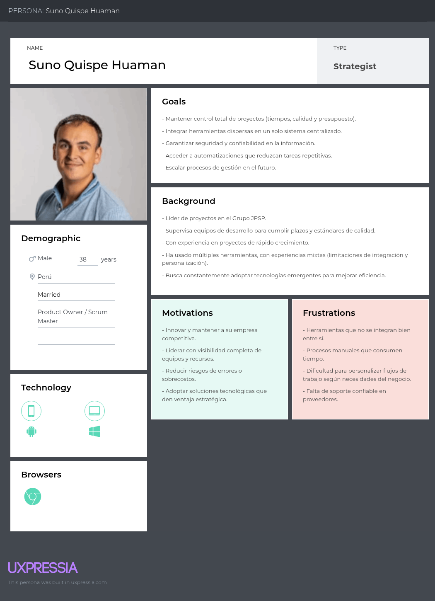

**Semento 2: Equipo de Desarrollo de Proyectos:**

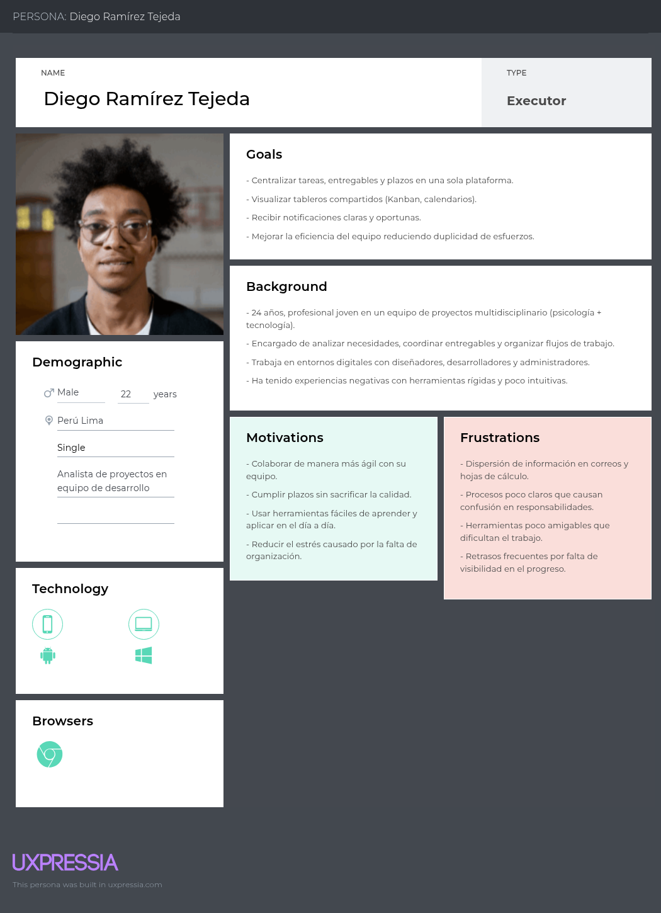


#### 2.3.2. User Task Matrix


**Semento 1: Líderes de projecto:**

<table>
  <thead>
    <tr>
      <th>Actividades</th>
      <th colspan="2">Suno Quispe Huaman</th>
    </tr>
    <tr>
      <th></th>
      <th>Frecuencia</th>
      <th>Importancia</th>
    </tr>
  </thead>
  <tbody>
    <tr>
      <td>Supervisar avance de proyectos en tiempo real</td>
      <td>Diario</td>
      <td>Alta</td>
    </tr>
    <tr>
      <td>Asignar tareas y definir roles</td>
      <td>Diario/Semanal</td>
      <td>Alta</td>
    </tr>
    <tr>
      <td>Revisar reportes financieros (presupuestos, pagos básicos)</td>
      <td>Semanal</td>
      <td>Alta</td>
    </tr>
    <tr>
      <td>Coordinar comunicación entre áreas y equipos</td>
      <td>Diario</td>
      <td>Alta</td>
    </tr>
    <tr>
      <td>Generar reportes de progreso para la dirección</td>
      <td>Semanal/Mensual</td>
      <td>Alta</td>
    </tr>
    <tr>
      <td>Personalizar flujos de trabajo según el proyecto</td>
      <td>Según necesidad</td>
      <td>Media</td>
    </tr>
    <tr>
      <td>Recibir alertas de retrasos o riesgos en proyectos</td>
      <td>Diario</td>
      <td>Alta</td>
    </tr>
    <tr>
      <td>Evaluar desempeño del equipo mediante métricas</td>
      <td>Mensual</td>
      <td>Media</td>
    </tr>
  </tbody>
</table>


**Semento 2: Equipo de Desarrollo de Proyectos:**

<table>
  <thead>
    <tr>
      <th>Actividades</th>
      <th colspan="2">Diego Ramírez Tejeda</th>
    </tr>
    <tr>
      <th></th>
      <th>Frecuencia</th>
      <th>Importancia</th>
    </tr>
  </thead>
  <tbody>
    <tr>
      <td>Visualizar tareas asignadas en tableros Kanban</td>
      <td>Diario</td>
      <td>Alta</td>
    </tr>
    <tr>
      <td>Registrar avances y actualizar estado de tareas</td>
      <td>Diario</td>
      <td>Alta</td>
    </tr>
    <tr>
      <td>Revisar plazos en calendarios compartidos</td>
      <td>Diario/Semanal</td>
      <td>Alta</td>
    </tr>
    <tr>
      <td>Colaborar con otros miembros mediante comentarios/chat</td>
      <td>Diario</td>
      <td>Alta</td>
    </tr>
    <tr>
      <td>Recibir notificaciones de cambios en prioridades</td>
      <td>Diario</td>
      <td>Alta</td>
    </tr>
    <tr>
      <td>Gestionar prioridades personales de trabajo</td>
      <td>Diario/Semanal</td>
      <td>Alta</td>
    </tr>
    <tr>
      <td>Revisar entregables del equipo para asegurar calidad</td>
      <td>Semanal</td>
      <td>Media</td>
    </tr>
    <tr>
      <td>Adaptarse a nuevas herramientas o procesos internos</td>
      <td>Según necesidad</td>
      <td>Media</td>
    </tr>
    <tr>
      <td>Acceder a tutoriales o soporte técnico de la herramienta</td>
      <td>Según necesidad</td>
      <td>Media</td>
    </tr>
  </tbody>
</table>


#### 2.3.3. Empathy Mapping

El Empathy Map nos permite identificar las emociones, pensamientos y acciones de nuestros usuarios, para comprender mejor sus necesidades y motivaciones. Con este propósito, se elaboraron los siguientes cuadros para los segmentos objetivo definidos:


**Segmento 1: Líderes de proyecto:**
<br>
<br>

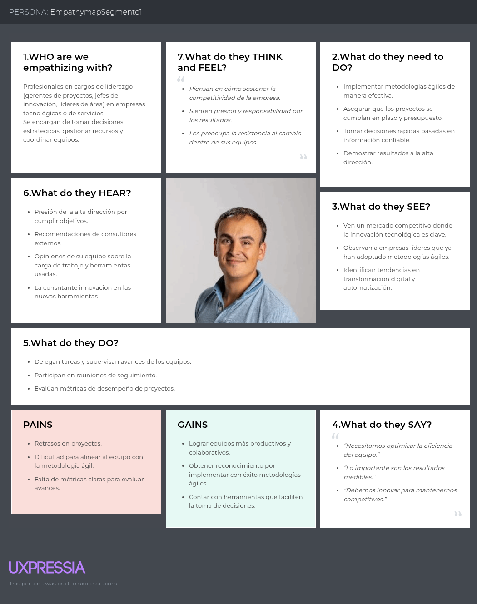

<br>
<br>

**Segmento 2: Equipo de Desarrollo de proyectos:**

<br>
<br>

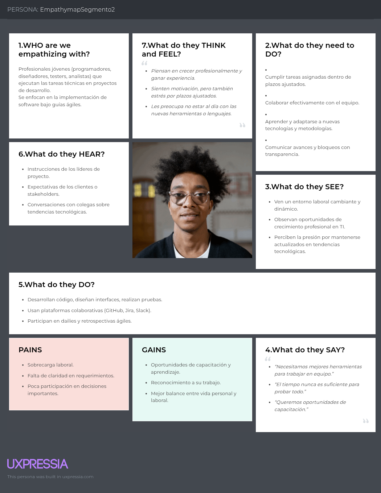

<br>
<br>


### 2.4. Ubiquitous Language

En el proyecto, es fundamental contar con un lenguaje común que nos permita comunicarnos de manera clara y sin ambigüedades. Por ello, definimos un Ubiquitous Language, compuesto por términos clave que utilizaremos para describir tareas, roles y procesos. De esta forma, aseguramos que todos los involucrados compartan la misma comprensión y podamos trabajar de manera más organizada y eficiente.

| Término (Inglés)        | Traducción (Español)   | Definición                                                                 |
|--------------------------|------------------------|----------------------------------------------------------------------------|
| Project                 | Proyecto               | Conjunto de actividades planificadas con un objetivo específico, un tiempo definido y recursos asignados. |
| Task                    | Tarea                  | Actividad puntual asignada a un miembro del equipo, con fecha de inicio y vencimiento. |
| Task Board              | Tablero de tareas      | Vista visual tipo Trello que organiza y gestiona las tareas asignadas según su estado (pendiente, en progreso, completada). |
| Kanban Board            | Tablero Kanban         | Herramienta visual que organiza las tareas en columnas según su estado (pendiente, en progreso, completada). |
| Milestone               | Hito                   | Evento clave dentro del proyecto que marca un avance importante o un entregable crítico. |
| Budget                  | Presupuesto            | Estimación financiera destinada a la ejecución de un proyecto, que incluye gastos, pagos y recursos. |
| Expense                 | Gasto                  | Registro de salida de dinero asociada a un proyecto. |
| Team Member             | Miembro de equipo      | Profesional responsable de ejecutar tareas asignadas dentro del proyecto. |
| Team Leader             | Líder de proyecto      | Persona encargada de coordinar al equipo, supervisar el progreso y garantizar el cumplimiento de plazos y recursos. |
| Collaboration           | Colaboración           | Interacción en tiempo real entre los miembros del equipo para avanzar en el desarrollo del proyecto. |
| Progress Tracking       | Seguimiento del progreso | Monitoreo continuo de tareas, métricas y resultados para evaluar el avance del proyecto. |
| Notification            | Notificación           | Mensaje automático que informa a los usuarios sobre actualizaciones, vencimientos o cambios relevantes en el proyecto. |
| Report                  | Reporte                | Documento o visualización que muestra el estado de un proyecto, métricas de desempeño y cumplimiento de objetivos. |
| Project Dashboard       | Tablero del proyecto   | Vista de métricas y estadísticas globales del proyecto, accesible por el Team Leader. |
| Member Dashboard        | Tablero del miembro    | Vista de métricas y estadísticas individuales de los miembros, accesible por el Team Leader. |
| Progress Report         | Reporte de avance      | Documento solicitado por un Team Member que muestra su propio progreso en las tareas asignadas. |
| User List               | Lista de usuarios      | Vista que muestra todos los usuarios que forman parte de un proyecto, incluyendo su rol y estado de participación. |
| Personal Calendar       | Calendario personal    | Vista individual del calendario de un miembro, con sus tareas, fechas límite y hitos asignados. |
| Role                    | Rol                    | Función asignada dentro del proyecto (ejemplo: líder, miembro, supervisor). |
| Deadline                | Fecha límite           | Día y hora máxima en la que debe completarse una tarea o entregable. |
| Workspace               | Espacio de trabajo     | Área digital dentro de la plataforma donde un equipo gestiona sus proyectos y tareas. |
| Sprint                  | Iteración / Sprint     | Periodo corto de trabajo (1-4 semanas) en el que se completan entregables definidos dentro de metodologías ágiles. |
| Backlog                 | Lista de pendientes    | Conjunto priorizado de tareas, historias de usuario o requerimientos que deben desarrollarse en el proyecto. |
| User Story              | Historia de usuario    | Descripción breve y clara de una funcionalidad desde la perspectiva del usuario final. |
| Deliverable             | Entregable             | Resultado tangible o intangible que debe ser completado y entregado en el marco de un proyecto. |
| Dependency              | Dependencia            | Relación entre tareas o actividades en la que una no puede comenzar o finalizar hasta que otra se haya completado. |
| Project Board           | Tablero de proyectos   | Vista que muestra todos los proyectos en los que participa un usuario, con información resumida como nombre, estado, fecha límite y rol asignado. |


## Capítulo III: Requirements Specification

La presente sección describe la especificación de requisitos del sistema propuesto, elaborada a partir del análisis de la información obtenida durante la etapa de investigación. Su objetivo es definir de manera clara las funcionalidades y características que deberá cumplir el producto digital, considerando las necesidades de los usuarios y el contexto del problema identificado.

Esta sección incluye el desarrollo de distintos artefactos que permiten estructurar la solución, tales como el To-Be Scenario Mapping, las User Stories, el Impact Map y el Product Backlog. Estos elementos facilitan la comprensión del comportamiento esperado del sistema, así como la priorización y organización de los requerimientos, permitiendo orientar el desarrollo bajo un enfoque ágil y centrado en el usuario.

### 3.1. To-Be Scenario Mapping

En esta sección se presenta el To-Be Scenario Mapping, el cual describe el escenario futuro de interacción de los usuarios con el sistema propuesto. Para su elaboración, el equipo siguió un proceso estructurado que incluyó la preparación del análisis, la generación de ideas mediante lluvia de ideas individual, la revisión y consolidación de actividades, así como la identificación y definición de las fases principales del proceso, organizadas como columnas.

Asimismo, se consideraron las dimensiones de Doing, Thinking y Feeling para cada User Persona, permitiendo comprender no solo las acciones que realizan, sino también sus percepciones y emociones durante la interacción con el sistema. Finalmente, el mapa To-Be fue contrastado conceptualmente con el escenario actual (As-Is), identificando mejoras significativas como la incorporación de analítica inteligente y automatización de procesos, las cuales optimizan la gestión de proyectos y la toma de decisiones.

**Segmento 1: Líder o gerente de proyectos de software**

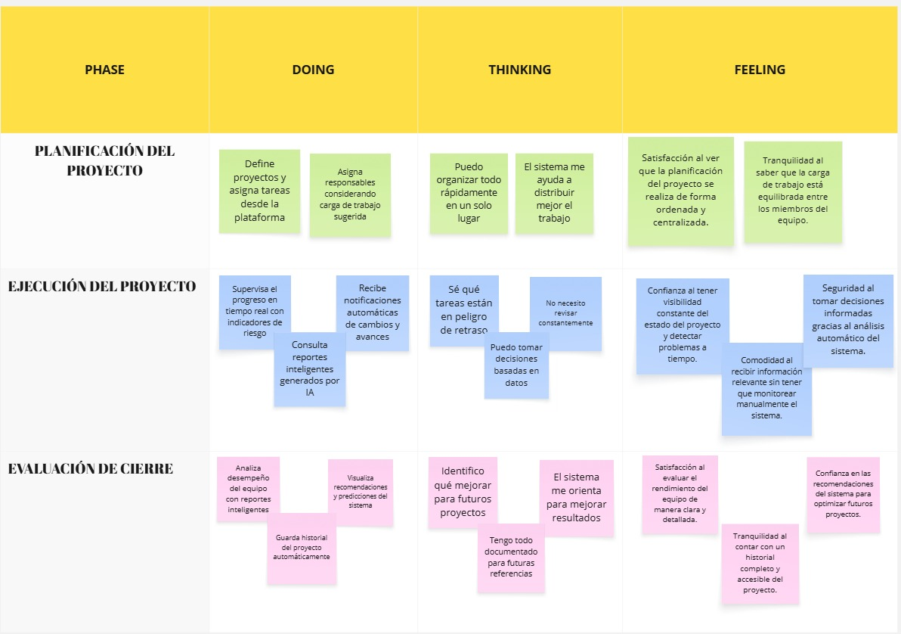

**Segmento 2: Miembro de un equipo de desarrollo de software**

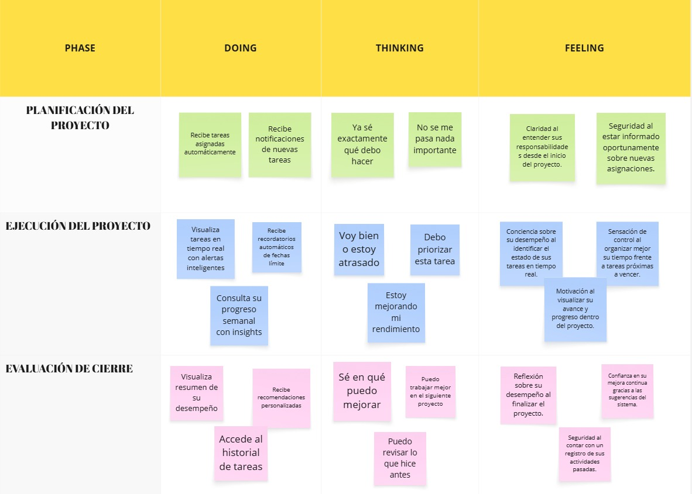

### 3.2. User Stories

Las User Stories fueron definidas siguiendo el enfoque ágil, describiendo funcionalidades desde la perspectiva del usuario e incluyendo criterios de aceptación bajo el formato Given-When-Then.

| **EPIC(ID)** | **Título**                              | **Descripción**                                                                                                                                                        |
| ------------ | --------------------------------------- | ---------------------------------------------------------------------------------------------------------------------------------------------------------------------- |
| **EP01**     | **Landing Page**                        | Como visitante, quiero acceder a una página de inicio clara que explique los beneficios de TaskMaster, para evaluar si es adecuado para mis necesidades.               |
| **EP02**     | **Registro y autentificacion de usuario** | Como trabajador, quiero registrarme y verificar mi identidad para acceder a TaskMaster, garantizando que solo personal autorizado pueda acceder a las funcionalidades. |
| **EP03**     | **Gestión de Proyectos y Tareas**       | Como líder de equipo, quiero gestionar proyectos y asignar tareas a los miembros del equipo para distribuir el trabajo de manera organizada.                           |
| **EP04**     | **Visualización y Seguimiento**         | Como miembro del equipo, quiero ver el progreso de mis tareas en tiempo real con indicadores inteligentes de riesgo y alertas, para anticipar retrasos y gestionar mejor mis responsabilidades.                                       |
| **EP05**     | **Analítica y Reportes**                | Como líder de equipo, quiero generar reportes inteligentes mediante inteligencia artificial para analizar el desempeño, predecir riesgos y mejorar la toma de decisiones.                  |
| **EP06**     | **Notificaciones**                      | Como miembro del equipo, quiero recibir notificaciones automatizadas basadas en eventos del sistema, para mantenerme informado y priorizar mi trabajo de manera eficiente.      |
| **EP07**     | **Integraciones Técnicas**              | Como desarrollador, quiero implementar un backend con servicios CRUD (crear, leer, actualizar y eliminar) para proyectos, tareas, usuarios y reportes, de modo que la lógica central de TaskMaster esté estructurada y mantenible  |
| **EP08**     | **Investigación y Validación Técnica**  | Como miembro del equipo de desarrollo, quiero validar la seguridad de TaskMaster mediante pruebas técnicas para garantizar la protección de los datos de los usuarios. |

| **Epic / User Story ID** | **Título**                                   | **Descripción**                                                                                                                                 | **Criterios de Aceptación**                                                                                                                                                                                                                                                                                                                                                                                                                             | **Relacionado con (Epic ID)** |
| ----------------------- | ------------------------------------------- | ----------------------------------------------------------------------------------------------------------------------------------------------- | --------------------------------------------------------------------------------------------------------------------------------------------------------------------------------------------------------------------------------------------------------------------------------------------------------------------------------------------------------------------------------------------------------------------------------------------------- | ----------------------------- |
| **US01**                | Información general sobre TaskMaster         | Como visitante, quiero entender rápidamente los beneficios y características de TaskMaster, para evaluar si se ajusta a mis necesidades.      | **ESCENARIO 01:** **DADO** que el visitante accede a la página principal, **CUANDO** hace scroll hacia la sección Características clave, **Y** el sistema carga la información correspondiente, **Y** las animaciones se activan al entrar en pantalla, **ENTONCES** el sistema muestra una lista visual destacada con las funciones principales de la aplicación, **Y** el visitante puede identificar fácilmente los beneficios del producto. | EP01 |
| **US02**                | Llamado a la acción para descargar la aplicación | Como visitante, quiero tener un botón de registro claro y accesible para descargar la aplicación.                                              | **ESCENARIO 01:** **DADO** que el visitante accede a la landing page, **CUANDO** visualiza el botón de registro ubicado en la parte superior o inferior, **Y** el botón está resaltado visualmente, **Y** hace clic sobre él, **ENTONCES** el sistema redirige al visitante a la tienda de aplicaciones correspondiente, **Y** se abre la página de descarga de TaskMaster. | EP01 |
| **US03**                | Testimonios de usuarios                      | Como visitante, quiero ver testimonios de usuarios reales de TaskMaster para confiar en su efectividad.                                       | **ESCENARIO 01:** **DADO** que el visitante se encuentra en la página de inicio, **CUANDO** baja hasta la sección de Testimonios, **Y** el sistema carga las reseñas de usuarios, **Y** las imágenes y textos se muestran correctamente, **ENTONCES** el sistema presenta los testimonios con texto y fotos de usuarios reales, **Y** genera confianza en la efectividad de la aplicación. | EP01 |
| **US04**                | Muestra de planes y precios                  | Como visitante, quiero ver las opciones de planes y precios de TaskMaster para poder elegir el más adecuado.                                  | **ESCENARIO 01:** **DADO** que el visitante accede a la página principal, **CUANDO** navega hasta la sección de Planes de suscripción, **Y** los datos de los planes están disponibles, **Y** el usuario visualiza la comparación entre ellos, **ENTONCES** el sistema muestra los distintos planes con sus características, **Y** cada plan incluye un botón para comparar o seleccionar. | EP01 |
| **US05**                | Adaptabilidad móvil                          | Como usuario móvil, quiero navegar la landing page sin problemas, para acceder a la información desde cualquier dispositivo.                  | **ESCENARIO 01:** **DADO** que el usuario accede desde un dispositivo móvil, **CUANDO** hace clic en el ícono del menú principal, **Y** el sistema detecta el tamaño de pantalla reducido, **Y** activa la versión responsive, **ENTONCES** se despliegan las opciones principales en un panel lateral, **Y** el fondo se oscurece para mejorar el contraste. | EP01 |
| **US06**                | Navegación mediante encabezado               | Como usuario, quiero un menú de navegación claro en el encabezado, para acceder fácilmente a las diferentes secciones de la página.          | **ESCENARIO 01:** **DADO** que el visitante explora la plataforma informativa, **CUANDO** utiliza las opciones de navegación del encabezado, **Y** selecciona una sección, **Y** el encabezado permanece visible durante el desplazamiento, **ENTONCES** el sistema redirige al usuario a la sección seleccionada, **Y** mantiene accesible el menú para navegación continua. | EP01 |
| **US07**                | Misión y visión                              | Como visitante interesado, quiero conocer la visión y misión de la empresa, para entender sus objetivos a largo plazo y su proyección de futuro. | **ESCENARIO 01:** **DADO** que el visitante navega por la sección Sobre la empresa, **CUANDO** busca información sobre las metas futuras y actuales, **Y** la sección se despliega correctamente, **Y** el contenido es legible, **ENTONCES** el sistema muestra claramente la declaración de Misión y Visión, **Y** permite al visitante comprender los objetivos de la empresa. | EP01 |
| **US08**                | About the Team                               | Como visitante quiero acceder a la sección About the Team para conocer quiénes son los integrantes y su rol en el proyecto.                  | **ESCENARIO 01:** **DADO** que el visitante accede a la landing page, **CUANDO** hace scroll o selecciona el enlace About the Team, **Y** el sistema carga la información del equipo, **Y** las imágenes y textos se renderizan correctamente, **ENTONCES** se muestra una sección con nombres, fotos, roles y una breve descripción de cada integrante, **Y** el visitante puede conocer quiénes conforman el equipo. | EP01 |
| **US09**                | Pie de página                                | Como visitante quiero visualizar un pie de página con enlaces a secciones clave para encontrar fácilmente información adicional y mantenerme conectado con la plataforma. | **ESCENARIO 01:** **DADO** que el visitante llega al final de la landing page, **CUANDO** visualiza el pie de página, **Y** el sistema carga los enlaces de contacto, políticas y redes sociales, **Y** el visitante hace clic sobre uno de ellos, **ENTONCES** el sistema redirige a la sección o recurso correspondiente, **Y** mantiene visible el pie de página en futuras visitas. | EP01 |
| **US10**                | Registro de usuario                          | Como visitante quiero registrarme en la plataforma proporcionando mis datos básicos para crear una cuenta y acceder a las funcionalidades de TaskMaster. | **ESCENARIO 01:** DADO que un visitante proporciona datos válidos en el formulario de registro, CUANDO completa todos los campos requeridos, Y presiona el botón de registro, Y el sistema valida que la información sea correcta, ENTONCES se crea una nueva cuenta en la plataforma, Y el usuario obtiene acceso a las funcionalidades básicas. <br><br> **ESCENARIO 02:** DADO que un visitante intenta registrarse con un correo ya existente, CUANDO completa el formulario de registro, Y el sistema detecta la duplicidad del correo, Y valida los datos ingresados, ENTONCES el sistema rechaza la acción, Y muestra un mensaje informando que el correo ya está en uso. | EP02 |
| **US11**                | Inicio de sesión                            | Como usuario registrado quiero autenticarme con mis credenciales para acceder a mi cuenta y gestionar mis proyectos.                          | **ESCENARIO 01:** DADO que un usuario proporciona credenciales válidas, CUANDO solicita autenticación, Y el sistema valida correctamente los datos, Y verifica que la cuenta esté activa, ENTONCES se concede el acceso al sistema, Y el usuario puede gestionar sus proyectos. <br><br> **ESCENARIO 02:** DADO que un usuario proporciona credenciales inválidas, CUANDO solicita autenticación, Y el sistema verifica los datos, Y detecta inconsistencias, ENTONCES el sistema rechaza la acción, Y muestra un mensaje informando que los datos no son correctos. | EP02 |
| **US12**                | Recuperación de contraseña                  | Como usuario registrado quiero restablecer mi contraseña en caso de olvido para poder acceder nuevamente a la plataforma.                    | **ESCENARIO 01:** DADO que un usuario solicita restablecer su contraseña con un correo válido, CUANDO ingresa su correo electrónico en la sección de recuperación, Y el sistema valida que esté registrado, Y genera un enlace o código de recuperación, ENTONCES el sistema envía el método de restablecimiento, Y el usuario puede actualizar su contraseña. <br><br> **ESCENARIO 02:** DADO que un usuario solicita restablecer su contraseña con un correo no registrado, CUANDO el sistema valida la información ingresada, Y no encuentra coincidencias, Y verifica la inexistencia de la cuenta, ENTONCES el sistema rechaza la acción, Y muestra un mensaje informando que no existe cuenta asociada. | EP02 |
| **US13**                | Cierre de sesión                            | Como usuario registrado quiero finalizar mi sesión para garantizar la seguridad de mi cuenta en cualquier dispositivo.                       | **ESCENARIO 01:** DADO que un usuario tiene una sesión activa, CUANDO solicita cerrar sesión, Y el sistema recibe la solicitud, Y verifica las credenciales activas, ENTONCES invalida el token de autenticación, Y finaliza la sesión correctamente. <br><br> **ESCENARIO 02:** DADO que un usuario no tiene una sesión activa, CUANDO solicita cerrar sesión, Y el sistema valida el estado de autenticación, Y detecta la ausencia de sesión, ENTONCES el sistema rechaza la acción, Y muestra un mensaje indicando que no hay sesión activa. | EP02 |
| **US14**                | Invitación de usuarios con código de acceso | Como Team Leader, quiero invitar a los usuarios a través de un código de acceso para que se registren y luego puedan ser asignados a tareas dentro de los proyectos, asegurando que solo los usuarios autorizados puedan colaborar. | **ESCENARIO 01:** DADO que el Team Leader genera un código de acceso único, CUANDO el usuario recibe el código, Y ingresa a la plataforma, Y lo introduce durante el registro, ENTONCES el sistema valida el código, Y permite que el usuario se una al proyecto. <br><br> **ESCENARIO 02:** DADO que el usuario se ha unido al proyecto mediante el código, CUANDO el Team Leader desea asignar tareas, Y selecciona participantes del proyecto, Y revisa la lista de usuarios válidos, ENTONCES el sistema solo muestra a los usuarios que ingresaron con un código de invitación, Y permite asignarles tareas. <br><br> **ESCENARIO 03:** DADO que el Team Leader intenta invitar a un usuario mediante un código, CUANDO el código es inválido o ha caducado, Y el sistema verifica su estado, Y detecta la invalidez, ENTONCES el sistema notifica que el código no es válido, Y evita el registro del usuario. | EP02 |
| **US015**               | Registro de nuevos proyectos                 | Como líder de equipo quiero crear un nuevo proyecto para organizar las tareas y asignar responsables de manera estructurada.                 | **ESCENARIO 01:** DADO que el líder accede a la opción Crear Proyecto, CUANDO completa los campos requeridos (nombre, descripción y fechas), Y revisa que toda la información esté correcta, Y presiona el botón Guardar, ENTONCES el sistema registra el nuevo proyecto en la base de datos, Y lo muestra automáticamente en el tablero del líder. <br><br> **ESCENARIO 02:** DADO que el líder intenta crear un proyecto sin nombre, CUANDO hace clic en Guardar, Y el sistema valida los campos obligatorios, Y detecta que el campo nombre está vacío, ENTONCES el sistema muestra un mensaje de error, Y no permite continuar con el registro. | EP03 |
| **US016**               | Asignación de usuarios a proyectos           | Como líder de equipo quiero asignar usuarios a un proyecto para que puedan colaborar en sus tareas y actividades.                            | **ESCENARIO 01:** DADO que el líder abre la opción Asignar Usuarios, CUANDO selecciona varios usuarios del listado, Y confirma la acción, Y guarda los cambios, ENTONCES el sistema asocia a los usuarios seleccionados con el proyecto, Y les envía una notificación de incorporación. <br><br> **ESCENARIO 02:** DADO que el líder intenta asignar a un usuario que ya pertenece al proyecto, CUANDO guarda los cambios, Y el sistema valida duplicados, Y detecta coincidencia, ENTONCES el sistema evita la duplicación, Y mantiene la lista correcta de participantes. | EP03 |
| **US017**               | Asignar tareas para los usuarios             | Como líder de equipo quiero asignar tareas específicas a los miembros para distribuir la carga de trabajo de forma clara.                   | **ESCENARIO 01:** DADO que el líder selecciona una tarea en el tablero, CUANDO asigna un usuario responsable, Y guarda los cambios, Y el sistema valida la existencia del usuario, ENTONCES el sistema registra la asignación, Y muestra el nombre del responsable en el tablero. <br><br> **ESCENARIO 02:** DADO que el líder intenta asignar una tarea a un usuario inexistente, CUANDO confirma la acción, Y el sistema busca el usuario, Y no encuentra coincidencias, ENTONCES el sistema muestra un mensaje de error, Y no guarda la asignación. | EP03 |
| **US018**               | Establecer prioridad de tareas               | Como líder de equipo quiero asignar prioridades a las tareas dentro de un proyecto para garantizar que las tareas más importantes se hagan primero. | **ESCENARIO 01:** DADO que el usuario agrega una nueva tarea, CUANDO selecciona una prioridad entre alta, media o baja, Y guarda la tarea, Y el sistema valida la selección, ENTONCES el sistema ordena las tareas del tablero según su nivel de prioridad, Y mantiene la organización visual según el valor asignado. | EP03 |
| **US019**               | Notificaciones de tareas asignadas           | Como miembro del equipo, quiero recibir una notificación cuando se me asigna una nueva tarea, para estar al tanto de mis responsabilidades. | **ESCENARIO 01:** DADO que el líder asigna una tarea a un miembro del equipo, CUANDO la asignación se confirma, Y el sistema registra la tarea, Y asocia al responsable, ENTONCES el sistema envía una notificación dentro de la aplicación, Y también un correo electrónico informando la nueva asignación. | EP03 |
| **US020**               | Modificación de fechas límite de tareas      | Como líder de equipo quiero modificar la fecha límite de las tareas para ajustar los plazos según las necesidades del proyecto.             | **ESCENARIO 01:** DADO que el líder accede a una tarea existente, CUANDO modifica la fecha límite, Y guarda los cambios, Y el sistema valida que la nueva fecha sea posterior a la actual, ENTONCES el sistema actualiza la fecha límite de la tarea, Y notifica al usuario asignado. <br><br> **ESCENARIO 02:** DADO que el líder intenta establecer una fecha límite anterior a la fecha actual, CUANDO confirma el cambio, Y el sistema compara ambas fechas, Y detecta que la nueva es inválida, ENTONCES el sistema muestra un mensaje de error, Y mantiene la fecha original sin cambios. | EP03 |
| **US021**               | Modificación de la prioridad de tareas       | Como Lider del equipo quiero modificar la prioridad de una tarea para organizar mejor el trabajo según su urgencia e importancia.          | **ESCENARIO 01:** DADO que el usuario accede a la configuración de una tarea, CUANDO cambia la prioridad a alta, media o baja, Y confirma la acción, Y el sistema valida la modificación, ENTONCES el sistema actualiza la prioridad de la tarea, Y reordena el tablero según el nuevo criterio. <br><br> **ESCENARIO 02:** DADO que el usuario intenta guardar una tarea sin seleccionar prioridad, CUANDO confirma la acción, Y el sistema valida los campos, Y detecta ausencia de selección, ENTONCES el sistema asigna por defecto la prioridad “Media”, Y guarda la tarea exitosamente. | EP03 |
| **US022**               | Actualización de estado de tareas            | Como miembro del equipo quiero actualizar el estado de una tarea a completada o pendiente para reflejar con precisión su progreso.         | **ESCENARIO 01:** DADO que un miembro del equipo accede a una tarea asignada, CUANDO marca la tarea como completada, Y el sistema guarda el cambio, Y actualiza el estado, ENTONCES el sistema cambia el estado de la tarea a “Completada”, Y refleja el cambio visualmente en el tablero. <br><br> **ESCENARIO 02:** DADO que un miembro del equipo accede a una tarea, CUANDO la desmarca como completada, Y el sistema procesa la acción, Y actualiza el registro, ENTONCES el sistema cambia su estado a “Pendiente”, Y lo muestra actualizado en el tablero. | EP03 |
| **US023**               | Ver progreso de tareas en tiempo real con indicadores inteligentes | Como miembro del equipo, quiero ver el progreso de las tareas en tiempo real con indicadores inteligentes, para identificar posibles retrasos y actuar a tiempo. | **ESCENARIO 01:** DADO que el usuario accede al tablero de tareas, CUANDO consulta las tareas listadas, Y visualiza sus estados actuales, Y hay cambios en tiempo real, Y el sistema analiza el estado de las tareas mediante lógica inteligente, ENTONCES el sistema muestra los indicadores de estado (Pendiente, En progreso, Completada) Y resalta tareas con riesgo de retraso o próximas a vencer Y actualiza los avances automáticamente. <br><br> **ESCENARIO 02:** DADO que un miembro del equipo cambia el estado de una tarea (por ejemplo, de “En progreso” a “Completada”), CUANDO guarda el cambio, Y el sistema procesa la actualización, Y recalcula el riesgo de la tarea, ENTONCES el progreso se refleja en tiempo real Y se actualizan los indicadores de riesgo para todos los usuarios. | EP04 |
| **US024**               | Ver métricas de rendimiento con indicadores de riesgo | Como líder de equipo, quiero ver métricas de rendimiento con indicadores de riesgo, para identificar posibles problemas en el progreso del proyecto. | **ESCENARIO 01:** DADO que el líder accede a la sección de métricas, CUANDO solicita un reporte de desempeño, Y selecciona un proyecto, Y el sistema recopila los datos Y evalúa el comportamiento de las tareas, , ENTONCES se genera un gráfico o reporte con tareas completadas, retrasadas y porcentaje de avance Y se muestran indicadores de riesgo (alto, medio, bajo) Y los resultados en pantalla. <br><br> **ESCENARIO 02:** DADO que el líder selecciona un periodo específico (por ejemplo, mensual), CUANDO el sistema filtra los datos, Y recalcula las métricas, Y reanaliza el nivel de riesgo, ENTONCES se muestran las métricas actualizadas Y los indicadores de riesgo ajustados al periodo. | EP04 |
| **US025**               | Visualizar calendario de tareas con alertas inteligentes | Como miembro del equipo, quiero ver un calendario con mis tareas y alertas inteligentes, para anticipar entregas y evitar retrasos. | **ESCENARIO 01:** DADO que el miembro tiene tareas con fechas límite, CUANDO consulta el calendario, Y el sistema carga las tareas, Y evalúa la proximidad de los plazos, ENTONCES se muestran las tareas distribuidas en el calendario Y se resaltan aquellas próximas a vencer o en riesgo. <br><br> **ESCENARIO 02:** DADO que el usuario consulta el calendario, CUANDO pasa el cursor sobre una tarea, Y el sistema detecta la interacción, Yanaliza el estado de la tarea, ENTONCES se muestra un resumen Y se incluye una alerta si la tarea presenta riesgo de retraso. | EP04 |
| **US026**               | Generar reporte inteligente de desempeño por miembro | Como líder de equipo, quiero generar un reporte inteligente de desempeño por cada miembro del equipo, para identificar áreas de mejora, riesgos y recibir recomendaciones basadas en el análisis de datos. | **ESCENARIO 01:** DADO que el líder selecciona la opción “Generar reporte de desempeño”, CUANDO el sistema procesa la solicitud, Y recopila las métricas de cada miembro, Y calcula el estado de sus tareas (completadas, en progreso y retrasadas) Y analiza los patrones de desempeño utilizando inteligencia artificial, ENTONCES el sistema muestra un reporte detallado Y destaca riesgos, nivel de productividad y recomendaciones por integrante. <br><br> **ESCENARIO 02:** DADO que el líder solicita el reporte de desempeño, CUANDO el sistema finaliza la generación, Y genera insights automáticos, ENTONCES el sistema permite exportar el reporte en formato PDF o Excel Y mantiene las recomendaciones generadas por IA. | EP05 |
| **US027**               | Reporte inteligente de tareas cumplidas y retrasadas | Como líder de equipo, quiero recibir un reporte inteligente de tareas cumplidas y retrasadas, para identificar problemas críticos y anticipar retrasos en el proyecto. | **ESCENARIO 01:** DADO que el líder accede a la sección de reportes, CUANDO selecciona “Reporte inteligente de tareas”, Y el sistema filtra la información, Y organiza los datos por estado, Y analiza tendencias de retraso utilizando inteligencia artificial, ENTONCES se genera un reporte Y se muestra el nivel de riesgo del proyecto y predicción de cumplimiento. <br><br> **ESCENARIO 02:** DADO que el reporte se encuentra generado, CUANDO el líder selecciona la opción de exportar, Y el sistema prepara el archivo, ENTONCES el sistema permite exportar el reporte en PDF o Excel Y conserva los indicadores de riesgo y predicciones generadas por IA. | EP05 |
| **US028**               | Visualizar resumen semanal inteligente de avances | Como miembro del equipo, quiero ver un resumen semanal inteligente de mis avances, para entender mi rendimiento y recibir sugerencias de mejora. | **ESCENARIO 01:** DADO que el usuario accede a la sección de reportes, CUANDO selecciona la opción “Resumen semanal”, Y el sistema obtiene las tareas Y calcula los resultados, Y analiza el progreso mediante inteligencia artificial, ENTONCES el sistema muestra un resumen Y proporciona recomendaciones personalizadas para mejorar el desempeño. <br><br> **ESCENARIO 02:** DADO que el usuario selecciona un periodo específico (por ejemplo, de lunes a viernes), CUANDO el sistema ajusta el rango de fechas, Y filtra las tareas, Y recalcula las métricas, Y reanaliza los datos con IA, ENTONCES el sistema actualiza el reporte con los datos del periodo elegido Y muestra insights adaptados al periodo seleccionado. | EP05 |
| **US029**               | Notificación automatizada de tarea asignada  | Como miembro del equipo, quiero recibir una notificación automatizada cuando se me asigne una nueva tarea, para estar al tanto de mis responsabilidades sin intervención manual. | **ESCENARIO 01:** DADO que un Team Leader asigna una nueva tarea, CUANDO la asignación se confirma, Y el sistema valida al usuario destinatario, Y la tarea se registra correctamente, Y se ejecuta el flujo automatizado de notificaciones, ENTONCES el sistema envía una notificación dentro de la app y por correo electrónico al miembro asignado Y actualiza su bandeja de notificaciones. <br><br> **ESCENARIO 02:** DADO que un Team Leader asigna una tarea, CUANDO revisa la bandeja de notificaciones, Y el sistema sincroniza la información, ENTONCES se muestra la tarea asignada Y se prioriza como notificación reciente. | EP06 |
| **US030**               | Notificación automatizada de fecha límite cercana | Como miembro del equipo, quiero recibir notificaciones automatizadas cuando una tarea esté próxima a vencer, para priorizar mis actividades. | **ESCENARIO 01:** DADO que una tarea tiene una fecha límite próxima, CUANDO la fecha límite esté a menos de 24 horas, Y el sistema ejecuta un proceso automático programado, Y detecte la proximidad, ENTONCES el sistema envía una notificación dentro de la app y por correo electrónico Y marca la tarea como prioritaria automáticamente. <br><br> **ESCENARIO 02:** DADO que una tarea está cerca de su fecha límite, CUANDO el sistema analiza los plazos, Y detecta tareas críticas automáticamente, ENTONCES el sistema resalta las tareas Y envía una notificación de recordatorio sin intervención del usuario. | EP06 |
| **US031**               | Notificación automatizada de tarea completada | Como líder de equipo, quiero recibir notificaciones automatizadas cuando una tarea se complete, para hacer seguimiento del progreso en tiempo real. | **ESCENARIO 01:** DADO que un Team Member marca una tarea como completada, CUANDO el sistema procesa el cambio, Y actualiza la base de datos, Y dispara automáticamente el evento de notificación, ENTONCES el sistema envía una notificación dentro de la app y por correo electrónico al Team Leader Y registra el progreso. <br><br> **ESCENARIO 02:** DADO que una tarea ha sido completada, CUANDO el sistema sincroniza el tablero, Y actualiza el estado automáticamente, ENTONCES el líder visualiza el cambio Y recibe una notificación en tiempo real. | EP06 |
| **US032**               | Notificación automatizada de mensajes en proyecto | Como miembro del equipo, quiero recibir notificaciones automáticas cuando haya nuevos mensajes, para mantenerme actualizado sin revisar constantemente. | **ESCENARIO 01:** DADO que un nuevo mensaje es agregado en el proyecto, CUANDO el sistema procesa la comunicación, Y guarda el mensaje, Y ejecuta el flujo automático de notificación, ENTONCES se envía una notificación Y actualiza el historial. <br><br> **ESCENARIO 02:** DADO que existen mensajes nuevos, CUANDO el usuario ingresa a la plataforma, Y el sistema carga las notificaciones, ENTONCES muestra “nuevo mensaje” Y gestiona automáticamente el estado leído/no leído. | EP06 |
| **US033**               | Notificación automatizada de actualización de tareas | Como miembro del equipo, quiero recibir notificaciones automatizadas cuando una tarea cambie, para estar informado sin necesidad de revisiones manuales. | **ESCENARIO 01:** DADO que el Team Leader actualiza una tarea, CUANDO el sistema registra el cambio, Y detecta automáticamente la modificación, ENTONCES el sistema envía una notificación Y resalta los cambios en la interfaz. <br><br> **ESCENARIO 02:** DADO que una tarea es modificada, CUANDO el sistema sincroniza el tablero, Y genera indicadores automáticos, ENTONCES las tareas se resaltan Y se notifica al usuario en tiempo real. | EP06 |
| **TS01**                | Validación de seguridad en la API            | Como desarrollador, quiero verificar que la API de TaskMaster esté segura para proteger los datos de los usuarios.                            | DADO que el equipo de desarrollo realiza pruebas de seguridad sobre la API, CUANDO se envían solicitudes con credenciales y datos sensibles, Y el sistema procesa dichas solicitudes, Y aplica protocolos de encriptación, ENTONCES las credenciales deben mantenerse protegidas, Y no debe haber filtraciones de información. | EP07 |
| **TS02**                | Optimización del rendimiento de la base de datos | Como desarrollador, quiero mejorar el rendimiento de las consultas en la base de datos para que TaskMaster funcione más rápido.              | DADO que el sistema tiene múltiples consultas activas, CUANDO se ejecutan pruebas de carga, Y se aplican optimizaciones en los índices y consultas SQL, Y se eliminan cuellos de botella, ENTONCES el tiempo de respuesta de la base de datos disminuye, Y la aplicación responde de manera más eficiente. | EP07 |
| **TS03**                | Gestión de Proyectos                         | Como desarrollador, quiero implementar la creación, modificación y eliminación de proyectos, para mantener la información organizada y coherente. | DADO que un usuario envía una solicitud válida para crear un proyecto, CUANDO la API procesa la petición, Y valida los datos, Y registra el proyecto en la base de datos, ENTONCES el sistema devuelve la información del nuevo proyecto, Y confirma su creación exitosa. | EP07 |
| **TS04**                | Gestión de Tareas                            | Como desarrollador, quiero implementar operaciones para registrar, actualizar estados o prioridades, y eliminar tareas, para reflejar el flujo de trabajo. | DADO que un usuario modifica el estado o prioridad de una tarea, CUANDO la API recibe y procesa la solicitud, Y actualiza la información en la base de datos, Y mantiene la integridad de los datos, ENTONCES el sistema refleja el nuevo estado en la interfaz, Y confirma la actualización al usuario. | EP07 |
| **TS05**                | Administración de Usuarios                   | Como desarrollador, quiero implementar el manejo de alta, edición y baja de usuarios, para que roles y permisos se mantengan alineados con los proyectos. | DADO que un administrador solicita eliminar un usuario, CUANDO la API procesa la petición, Y verifica que el usuario no tenga proyectos activos, Y actualiza su estado a inactivo, ENTONCES el usuario pierde acceso al sistema, Y sus permisos quedan deshabilitados. | EP07 |
| **TS06**                | Manejo de Reportes                           | Como desarrollador, quiero implementar la generación, actualización y almacenamiento de reportes, para que los líderes accedan a información consistente. | DADO que un líder solicita un reporte de desempeño, CUANDO la API procesa la petición, Y consulta las métricas más recientes, Y genera el archivo en formato descargable, ENTONCES el sistema devuelve el reporte actualizado, Y lo almacena para futuras referencias. | EP07 |
| **SS1**                 | Integración con herramientas de comunicación | Como miembro del equipo, quiero que TaskMaster se integre con Slack para recibir actualizaciones sobre mis tareas, para mantenerme al tanto de los cambios importantes sin tener que acceder continuamente a la plataforma. | DADO que el usuario vincula su cuenta de Slack con TaskMaster, CUANDO una tarea es asignada o actualizada, Y el sistema detecta el cambio, Y envía la notificación correspondiente, ENTONCES Slack muestra la alerta en el canal indicado, Y el usuario se mantiene informado sin ingresar al sistema. | EP08 |
| **SS2**                 | Integración con Google Calendar              | Como miembro del equipo, quiero que TaskMaster sincronice mis tareas con Google Calendar para no olvidar mis plazos.                         | DADO que el usuario conecta su cuenta de Google Calendar con TaskMaster, CUANDO se crean o modifican tareas con fechas límite, Y el sistema valida la autenticación con Google, Y ejecuta la sincronización, ENTONCES las tareas aparecen en su calendario, Y se actualizan automáticamente ante cualquier cambioo. | EP08 |


### 3.3. Impact Mapping

**Segmento Team leader**

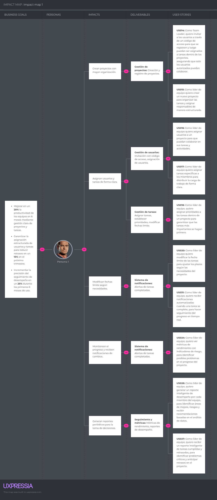

**Segmento Team member**

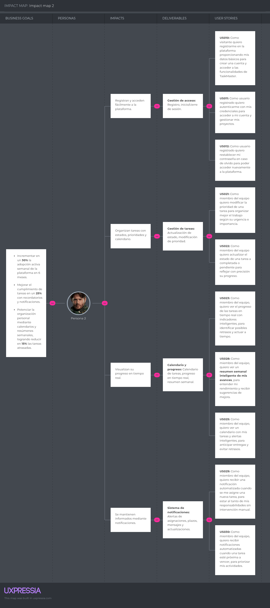

### 3.4. Product Backlog

El Product Backlog organiza todas las funcionalidades identificadas, priorizadas según su valor para el usuario y el negocio.

| Orden | User Story Id | Título                                      | Descripción                                                                                                                      | Story Points |
| ----- | ------------- | ------------------------------------------- | -------------------------------------------------------------------------------------------------------------------------------- | ------------ |
| 1     | US014         | Invitación de usuarios con código de acceso | Como Team Leader, deseo invitar usuarios mediante un código de acceso para que puedan registrarse y colaborar en los proyectos.  | 8            |
| 2     | US015         | Registro de nuevos proyectos                | Como líder de equipo, deseo crear nuevos proyectos para organizar tareas y asignar responsables de manera estructurada.          | 8            |
| 3     | US016         | Asignación de usuarios a proyectos          | Como líder de equipo, deseo asignar usuarios a proyectos para que puedan colaborar en las tareas.                                | 8            |
| 4     | US017         | Asignar tareas a usuarios                   | Como líder de equipo, deseo asignar tareas específicas a los miembros para distribuir la carga de trabajo.                       | 8            |
| 5     | US019         | Notificaciones de tareas asignadas          | Como miembro del equipo, deseo recibir notificaciones cuando se me asignen tareas para estar informado de mis responsabilidades. | 8            |
| 6     | US023         | Progreso de tareas en tiempo real           | Como miembro del equipo, deseo visualizar el progreso de tareas con indicadores inteligentes para identificar retrasos.          | 8            |
| 7     | US024         | Métricas de rendimiento con riesgo          | Como líder de equipo, deseo visualizar métricas con indicadores de riesgo para detectar problemas en el proyecto.                | 8            |
| 8     | US026         | Reporte inteligente por miembro             | Como líder de equipo, deseo generar reportes de desempeño por miembro para identificar mejoras y riesgos.                        | 8            |
| 9     | US027         | Reporte de tareas cumplidas y retrasadas    | Como líder de equipo, deseo obtener reportes de tareas para anticipar retrasos del proyecto.                                     | 8            |
| 10    | US029         | Notificación automatizada de tarea asignada | Como miembro del equipo, deseo recibir notificaciones automáticas al asignarse tareas para no depender de revisión manual.       | 8            |
| 11    | US030         | Notificación de fecha límite cercana        | Como miembro del equipo, deseo recibir alertas cuando una tarea esté por vencer para priorizar mi trabajo.                       | 8            |
| 12    | US031         | Notificación de tarea completada            | Como líder de equipo, deseo recibir notificaciones cuando una tarea se complete para hacer seguimiento del progreso.             | 8            |
| 13    | TS01          | Validación de seguridad en la API           | Como desarrollador, deseo validar la seguridad de la API para proteger los datos de los usuarios.                                | 8            |
| 14    | TS02          | Optimización de base de datos               | Como desarrollador, deseo optimizar consultas para mejorar el rendimiento del sistema.                                           | 8            |
| 15    | TS03          | Gestión de proyectos (backend)              | Como desarrollador, deseo implementar CRUD de proyectos para mantener la información organizada.                                 | 8            |
| 16    | TS04          | Gestión de tareas (backend)                 | Como desarrollador, deseo implementar operaciones de tareas para reflejar el flujo de trabajo.                                   | 8            |
| 17    | SS1           | Integración con Slack                       | Como miembro del equipo, deseo integrar TaskMaster con Slack para recibir notificaciones externas.                               | 8            |
| 18    | SS2           | Integración con Google Calendar             | Como miembro del equipo, deseo sincronizar tareas con Google Calendar para gestionar plazos.                                     | 8            |
| 19    | US010         | Registro de usuario                         | Como visitante, deseo registrarme en la plataforma para acceder a sus funcionalidades.                                           | 8            |
| 20    | US011         | Inicio de sesión                            | Como usuario, deseo autenticarme para acceder a mi cuenta y gestionar proyectos.                                                 | 8            |
| 21    | US012         | Recuperación de contraseña                  | Como usuario, deseo recuperar mi contraseña para volver a acceder a la plataforma.                                               | 5            |
| 22    | US018         | Establecer prioridad de tareas              | Como líder de equipo, deseo definir prioridades para organizar mejor el trabajo.                                                 | 5            |
| 23    | US020         | Modificación de fechas límite               | Como líder de equipo, deseo modificar fechas límite para ajustar plazos del proyecto.                                            | 5            |
| 24    | US021         | Modificación de prioridad                   | Como líder de equipo, deseo cambiar la prioridad de tareas según su importancia.                                                 | 5            |
| 25    | US022         | Actualización de estado de tareas           | Como miembro del equipo, deseo actualizar el estado de tareas para reflejar el progreso.                                         | 5            |
| 26    | US025         | Calendario con alertas inteligentes         | Como miembro del equipo, deseo visualizar tareas en un calendario con alertas para evitar retrasos.                              | 5            |
| 27    | US028         | Resumen semanal inteligente                 | Como miembro del equipo, deseo ver un resumen semanal de avances con recomendaciones.                                            | 5            |
| 28    | US032         | Notificación de mensajes                    | Como miembro del equipo, deseo recibir notificaciones de nuevos mensajes para estar actualizado.                                 | 5            |
| 29    | US033         | Notificación de cambios en tareas           | Como miembro del equipo, deseo recibir notificaciones cuando una tarea cambie.                                                   | 5            |
| 30    | TS05          | Administración de usuarios                  | Como desarrollador, deseo gestionar usuarios para mantener roles y permisos adecuados.                                           | 5            |
| 31    | TS06          | Manejo de reportes                          | Como desarrollador, deseo gestionar reportes para ofrecer información consistente.                                               | 5            |
| 32    | US013         | Cierre de sesión                            | Como usuario, deseo cerrar sesión para proteger mi cuenta.                                                                       | 3            |
| 33    | US05          | Adaptabilidad móvil                         | Como usuario, deseo navegar en móvil para acceder desde cualquier dispositivo.                                                   | 3            |
| 34    | US06          | Navegación por encabezado                   | Como usuario, deseo un menú claro para acceder a secciones fácilmente.                                                           | 3            |
| 35    | US09          | Pie de página                               | Como usuario, deseo ver enlaces útiles en el footer para acceder a información adicional.                                        | 3            |
| 36    | US01          | Información general                         | Como visitante, deseo conocer las características de TaskMaster para evaluar su uso.                                             | 8            |
| 37    | US02          | Llamado a la acción                         | Como visitante, deseo un botón claro para registrarme o descargar la app.                                                        | 8            |
| 38    | US08          | About the Team                              | Como visitante, deseo conocer al equipo para generar confianza en la plataforma.                                                 | 8            |
| 39    | US03          | Testimonios                                 | Como visitante, deseo ver opiniones de usuarios para confiar en el producto.                                                     | 5            |
| 40    | US04          | Planes y precios                            | Como visitante, deseo ver planes disponibles para elegir el más adecuado.                                                        | 5            |
| 41    | US07          | Misión y visión                             | Como visitante, deseo conocer la misión y visión para entender la empresa.                                                       | 5            |

LINK: https://trello.com/invite/b/69deac0397d45ae667e9bdc4/ATTI76344d0809c09e954f74835bddd259248D3D43FC/g2-arqui-emergentes

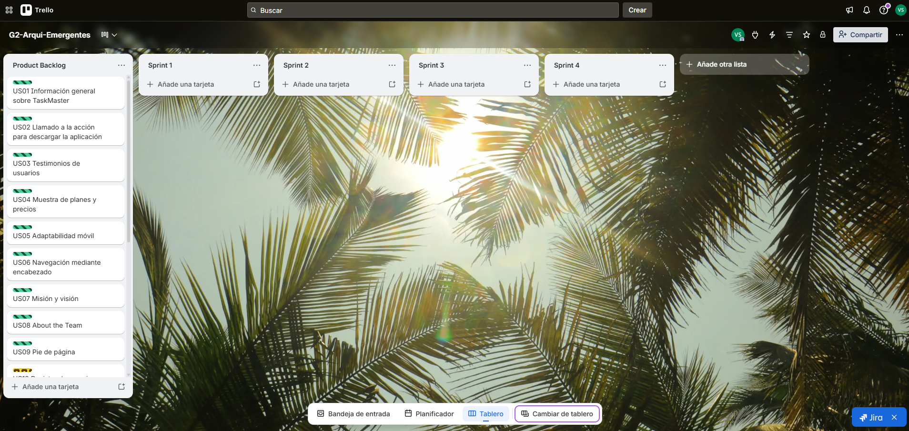

## Capítulo IV: Strategic-Level Software Design

### 4.1. Strategic-Level Attribute-Driven Design

En esta sección se presenta el proceso de diseño arquitectónico basado en Attribute-Driven Design (ADD), aplicado a la solución propuesta por la startup Apex Cybernetics con su producto TaskMaster.
Se describen los principales insumos del diseño, los drivers arquitectónicos, las decisiones tomadas y la forma en que se abordan los atributos de calidad, con el objetivo de definir una arquitectura alineada a las necesidades del negocio y de los usuarios.

#### 4.1.1. Design Purpose

El propósito del proceso de diseño arquitectónico es definir una solución de software robusta, escalable y alineada a los objetivos estratégicos de la startup Apex Cybernetics, mediante la aplicación del enfoque Attribute-Driven Design (ADD) dentro de un contexto de Domain-Driven Design (DDD).
Este proceso responde a la problemática identificada en el proyecto, relacionada con la ineficiente gestión de tareas, coordinación de equipos y seguimiento del progreso en entornos digitales, especialmente en organizaciones que requieren optimizar su productividad y mantener un control claro sobre sus actividades. La falta de herramientas integradas y adaptables genera desorganización, pérdida de información y baja eficiencia operativa.
A través del diseño estratégico, se busca construir una arquitectura para el producto TaskMaster que:

- Soporte las funcionalidades principales identificadas en las historias de usuario, como la gestión de tareas, asignación de responsabilidades, monitoreo de progreso y colaboración entre usuarios.

- Garantice atributos de calidad esenciales como escalabilidad, disponibilidad, rendimiento y usabilidad, considerando el crecimiento potencial de usuarios y la necesidad de acceso continuo a la plataforma.

- Permita una adecuada separación de responsabilidades mediante la identificación de Bounded Contexts, facilitando la evolución del sistema, su mantenibilidad y la integración con futuras funcionalidades.

Asimismo, este proceso de diseño está orientado a satisfacer las necesidades de los segmentos objetivo del producto, tales como equipos de trabajo, gestores de proyectos y organizaciones digitales, brindándoles una herramienta eficiente que centralice la gestión de tareas, mejore la colaboración y contribuya a una toma de decisiones más informada
#### 4.1.2. Attribute-Driven Design Inputs

En esta sección se presentan los principales insumos utilizados para el proceso de diseño arquitectónico basado en Attribute-Driven Design (ADD) para el producto **TaskMaster** de la startup Apex Cybernetics.
Estos insumos incluyen la funcionalidad principal del sistema, los escenarios de atributos de calidad y las restricciones del entorno, los cuales permiten identificar los drivers arquitectónicos que guían las decisiones de diseño.

##### 4.1.2.1. Primary Functionality (Primary User Stories)

En esta sección se presentan las User Stories más relevantes que tienen un impacto directo en la arquitectura del sistema. Estas fueron seleccionadas debido a que definen funcionalidades críticas como la gestión de tareas, colaboración entre usuarios y control del progreso, las cuales requieren decisiones importantes a nivel de diseño, escalabilidad y estructura del sistema.

A continuación, se detallan las historias de usuario seleccionadas:

| EPIC/USER STORY ID | TÍTULO | DESCRIPCIÓN | CRITERIO DE ACEPTACIÓN | RELACIONADO CON (EPIC ID) |
|--------------------|--------|-------------|------------------------|---------------------------|
| US023 | Ver progreso de tareas en tiempo real con indicadores inteligentes | Como miembro del equipo, quiero ver el progreso de las tareas en tiempo real con indicadores inteligentes, para identificar posibles retrasos y actuar a tiempo. | El sistema muestra estados actualizados en tiempo real y resalta tareas en riesgo o próximas a vencer mediante lógica inteligente. | EP04 |
| US024 | Ver métricas de rendimiento con indicadores de riesgo | Como líder de equipo, quiero ver métricas de rendimiento con indicadores de riesgo, para identificar problemas en el progreso del proyecto. | El sistema genera reportes con métricas de desempeño y niveles de riesgo (alto, medio, bajo). | EP04 |
|US026 | Generar reporte inteligente de desempeño por miembro | Como líder de equipo, quiero generar reportes inteligentes por miembro, para identificar áreas de mejora y recibir recomendaciones | El sistema genera reportes con métricas, riesgos y recomendaciones basadas en análisis mediante IA. | EP05 |
| US027 | Reporte inteligente de tareas cumplidas y retrasadas | Como líder de equipo, quiero recibir reportes de tareas cumplidas y retrasadas, para anticipar problemas del proyecto. | El sistema genera reportes con análisis de tendencias y predicción de cumplimiento usando IA. | EP05 |
| US030 | Notificación automatizada de fecha límite cercana | Como miembro del equipo, quiero recibir recordatorios automáticos de tareas próximas a vencer. | El sistema detecta tareas próximas a vencer y envía notificaciones automáticamente. | EP06 |

##### 4.1.2.2. Quality Attribute Scenarios

En esta sección se presentan los escenarios iniciales de atributos de calidad que tienen mayor impacto en la arquitectura del sistema TaskMaster.

Estos escenarios se enfocan en atributos clave como rendimiento, escalabilidad, disponibilidad, modificabilidad y automatización, considerando además el uso de tecnologías emergentes como Inteligencia Artificial (IA) y RPA, los cuales requieren procesamiento en tiempo real, análisis de datos y ejecución automática de eventos.

A continuación, se detallan los escenarios identificados:

| ATRIBUTO | FUENTE | ESTÍMULO | ARTEFACTO | ENTORNO | RESPUESTA | MEDIDA |
| ----- | ----- | ----- | ----- | ----- | ----- | ----- |
| Rendimiento | Usuario | Consulta el progreso de tareas en tiempo real | Sistema de visualización / backend | Operación normal con múltiples usuarios | El sistema procesa y muestra datos actualizados en tiempo real | Tiempo de respuesta ≤ 2 segundos |
| Escalabilidad | Sistema | Incremento simultáneo de usuarios activos | Infraestructura del sistema | Alta carga (muchos equipos usando la plataforma) | El sistema mantiene estabilidad y distribuye la carga | Soporta ≥ 1000 usuarios concurrentes sin degradación |
| Disponibilidad | Usuario | Accede a la plataforma para consultar tareas | Sistema completo | Operación continua (24/7) | El sistema se mantiene accesible sin interrupciones | Disponibilidad ≥ 99.5% |
| Modificabilidad | Desarrollador | Se requiere actualizar lógica de IA para análisis | Módulo de analítica (IA) | Sistema en mantenimiento/evolución | Se implementan cambios sin afectar otros módulos | Tiempo de implementación ≤ 2 días sin impacto en producción |
| Automatización (RPA) | Sistema | Se detecta una tarea próxima a vencer | Módulo de notificaciones | Ejecución automática programada | El sistema genera y envía notificaciones automáticamente | Notificación enviada en ≤ 5 segundos desde detección |
| Precisión (IA) | Sistema | Se analizan datos para generar reportes inteligentes | Módulo de analítica (IA) | Procesamiento de datos históricos | El sistema genera insights y predicciones | Precisión ≥ 85% en predicciones de riesgo |

##### 4.1.2.3. Constraints

En esta sección se presentan las principales restricciones del sistema **TaskMaster**, desarrollado por Apex Cybernetics, las cuales no son negociables y condicionan el diseño de la arquitectura.

Estas restricciones están relacionadas principalmente con el uso de tecnologías emergentes como Inteligencia Artificial (IA) y Automatización mediante RPA, así como con requerimientos de interoperabilidad, rendimiento y despliegue en entornos modernos. Dichos constraints guían las decisiones arquitectónicas y aseguran la viabilidad técnica de la solución.

A continuación, se detallan los constraints definidos como Technical Stories:

| TECHNICAL STORY ID | TÍTULO | DESCRIPCIÓN | CRITERIOS DE ACEPTACIÓN | RELACIONADO CON (EPIC ID) |
| ----- | ----- | ----- | ----- | ----- |
| TS01 | Integración obligatoria de IA | El sistema debe integrar módulos de Inteligencia Artificial para análisis de rendimiento, generación de reportes y predicción de riesgos | El sistema genera reportes inteligentes, métricas y predicciones basadas en datos de tareas | EP05 |
| TS02 | Automatización mediante RPA | El sistema debe automatizar el envío de notificaciones y alertas sin intervención manual | Las notificaciones se generan automáticamente ante eventos como asignaciones, vencimientos o cambios | EP06 |
| TS03 | Procesamiento en tiempo real | El sistema debe procesar y reflejar cambios en tareas en tiempo real | Los cambios en tareas se visualizan inmediatamente sin recarga manual | EP04 |
| TS04 | Arquitectura escalable | El sistema debe soportar crecimiento de usuarios y carga de trabajo sin degradación significativa | El sistema mantiene rendimiento estable con múltiples usuarios concurrentes | EP04 |
| TS05 | Interoperabilidad del sistema | El sistema debe permitir integración con servicios externos (correo, APIs, servicios de IA) | El sistema se integra correctamente con servicios externos para notificaciones y analítica | EP05 |
| TS06 | Despliegue en entorno cloud | El sistema debe ser desplegado en infraestructura cloud para garantizar disponibilidad y escalabilidad | El sistema está disponible en línea y soporta acceso remoto continuo | EP04 |

#### 4.1.3. Architectural Drivers Backlog

En esta sección se presenta el conjunto de Architectural Drivers definidos a partir del análisis de las Primary User Stories, los Quality Attribute Scenarios y los Constraints del sistema **TaskMaster**.

Estos drivers fueron identificados mediante un proceso iterativo inspirado en el enfoque de Quality Attribute Workshop (QAW), permitiendo priorizar aquellos elementos con mayor impacto tanto en los stakeholders como en la complejidad técnica de la arquitectura.

A continuación, se presenta el backlog de drivers arquitectónicos, ordenados según su nivel de importancia e impacto:

| DRIVER ID | TÍTULO DE DRIVER | DESCRIPCIÓN | IMPORTANCIA PARA STAKEHOLDERS | IMPACTO EN ARCHITECTURE TECHNICAL COMPLEXITY |
| ----- | ----- | ----- | ----- | ----- |
| AD01 | Procesamiento en tiempo real | El sistema debe reflejar cambios en tareas y estados en tiempo real para mejorar la toma de decisiones | HIGH | HIGH |
| AD02 | Analítica inteligente con IA | El sistema debe generar reportes, métricas y predicciones utilizando inteligencia artificial | HIGH | HIGH |
| AD03 | Automatización de notificaciones (RPA) | El sistema debe enviar notificaciones automáticas basadas en eventos sin intervención manual | HIGH | MEDIUM |
| AD04 | Escalabilidad del sistema | El sistema debe soportar un alto número de usuarios concurrentes sin degradación del rendimiento | HIGH | HIGH |
| AD05 | Alta disponibilidad | El sistema debe estar disponible de forma continua para los usuarios | HIGH | MEDIUM |
| AD06 | Integración con servicios externos | El sistema debe integrarse con APIs externas (correo, servicios de IA, etc.) | MEDIUM | HIGH |
| AD07 | Modificabilidad de módulos de IA | El sistema debe permitir actualizar modelos o lógica de IA sin afectar otros componentes | MEDIUM | HIGH |
| AD08 | Generación de alertas inteligentes | El sistema debe detectar riesgos y generar alertas basadas en el comportamiento de las tareas | HIGH | HIGH |
| AD09 | Visualización eficiente de datos | El sistema debe mostrar información clara y actualizada en dashboards y reportes | MEDIUM | MEDIUM |
| AD10 | Despliegue en entorno cloud | El sistema debe operar en infraestructura cloud para garantizar escalabilidad y acceso remoto | MEDIUM | MEDIUM |

#### 4.1.4. Architectural Design Decisions

En esta sección se presentan las decisiones de diseño arquitectónico para el sistema **TaskMaster**, basadas en el análisis de los Architectural Drivers identificados previamente.

Siguiendo un enfoque inspirado en el Quality Attribute Workshop (QAW), el equipo evaluó diferentes patrones arquitectónicos considerando su impacto en atributos de calidad como rendimiento, escalabilidad, disponibilidad y capacidad de integración con tecnologías emergentes como IA y RPA.

A continuación, se presenta la matriz de evaluación de patrones candidatos:

| DRIVER ID | TÍTULO DE DRIVER | PATTERN 1: DDD (Domain-Driven Design) |  | PATTERN 2: MVC |  | PATTERN 3: Event-Driven Architecture |  |
| ----- | ----- | ----- | ----- | ----- | ----- | ----- | ----- |
|  |  | **Pro** | **Contra** | **Pro** | **Contra** | **Pro** | **Contra** |
| AD01 | Procesamiento en tiempo real | Permite modelar dominios complejos y separar lógica | No gestiona eventos en tiempo real directamente | Simple de implementar | Limitado para tiempo real | Soporta eventos en tiempo real eficientemente | Mayor complejidad de implementación |
| AD02 | Analítica inteligente con IA | Facilita separar lógica de negocio de IA | Requiere integración adicional | Fácil de estructurar | No es adecuado para analítica avanzada | Permite procesamiento asíncrono de datos | Requiere manejo de eventos complejo |
| AD03 | Automatización de notificaciones (RPA) | Organiza lógica de negocio | No automatiza eventos por sí solo | Implementación rápida | Acoplamiento alto | Ideal para triggers automáticos y flujos RPA | Difícil de depurar |
| AD04 | Escalabilidad del sistema | Permite dividir por dominios | Puede volverse complejo | Estructura simple | Escalabilidad limitada | Alta escalabilidad mediante desacoplamiento | Requiere infraestructura adicional |
| AD05 | Alta disponibilidad | Facilita separación de componentes | No garantiza disponibilidad por sí solo | Fácil mantenimiento | No soporta failover | Permite sistemas resilientes distribuidos | Mayor costo operativo |

#### 4.1.5. Quality Attribute Scenario Refinements

En esta sección se presentan los escenarios de atributos de calidad refinados y priorizados para el sistema **TaskMaster**.

Como resultado del proceso de Quality Attribute Workshop (QAW), se priorizaron escenarios relacionados con procesamiento en tiempo real, analítica con IA y automatización mediante RPA, debido a su alto impacto en la arquitectura y en los objetivos del negocio.

| Scenario Refinement for Scenario 1 \- Tiempo Real |  |  |
| :---- | :---- | :---- |
| **Scenario(s):** |  |  Visualización del progreso de tareas en tiempo rea |
| **Business Goals:** |  | Mejorar el monitoreo y la toma de decisiones del equipo |
| **Relevant Quality Attributes:** |  | Rendimiento, Escalabilida |
|   | **Stimulus:** | Consulta de tareas en tiempo real |
| **Scenario Components** | **Stimulus Source:** |  Usuario |
|  | **Environment:** | Operación normal con múltiples usuarios concurrentes |
|  | **Artifact (if Known)** | Backend / sistema de eventos |
|  | **Response:** |  El sistema actualiza y muestra el estado de las tareas en tiempo real |
|  | **Response Measure:** | Tiempo de respuesta ≤ 2 segundos |
| **Questions:** |  | ¿Se usará WebSockets o polling para actualización en tiempo real? |
| **Issues:** |  | Posible sobrecarga del sistema con alta concurrencia |


| Scenario Refinement for Scenario 2 \- IA \- Analitica |  |  |
| :---- | :---- | :---- |
| **Scenario(s):** |  |  Generación de reportes inteligentes con predicción |
| **Business Goals:** |  |  Anticipar riesgos y mejorar la productividad |
| **Relevant Quality Attributes:** |  |  Precisión, Modificabilidad |
|   | **Stimulus:** |  Solicitud de reporte inteligente |
| **Scenario Components** | **Stimulus Source:** |  Líder de equipo |
|  | **Environment:** |  Procesamiento de datos históricos |
|  | **Artifact (if Known)** | Módulo de IA |
|  | **Response:** | El sistema genera reportes con métricas, riesgos y predicciones |
|  | **Response Measure:** | Precisión ≥ 85% en predicciones |
| **Questions:** |  | ¿Se usará IA propia o servicios externos? |
| **Issues:** |  |  Dependencia de la calidad de los datos |

| Scenario Refinement for Scenario 3 \- RPA \- Automatización |  |  |
| :---- | :---- | :---- |
| **Scenario(s):** |  |  Notificación automática por tareas próximas a vencer |
| **Business Goals:** |  |  Reducir retrasos y mejorar el cumplimiento de tareas |
| **Relevant Quality Attributes:** |  |  Disponibilidad, Automatización |
|   | **Stimulus:** | Detección automática de tarea próxima a vencer |
| **Scenario Components** | **Stimulus Source:** |  Sistema |
|  | **Environment:** | Ejecución automática programada |
|  | **Artifact (if Known)** | Módulo de notificaciones |
|  | **Response:** | El sistema envía notificaciones automáticas |
|  | **Response Measure:** | Notificación enviada ≤ 5 segundos |
| **Questions:** |  | ¿Se usará un scheduler interno o externo? |
| **Issues:** |  | Posible saturación de notificaciones si no se controla la frecuencia |


### 4.2. Strategic-Level Domain-Driven Design

En esta sección se describe el proceso seguido por el equipo para la toma de decisiones a nivel estratégico aplicando Domain-Driven Design (DDD). El objetivo fue comprender el dominio del sistema de gestión de proyectos, identificar sus principales subdominios y definir límites claros mediante Bounded Contexts.

Para ello, se utilizaron técnicas como EventStorming para explorar los eventos y flujos clave del negocio, así como el descubrimiento de contextos candidatos, el modelado de flujos de mensajes y la elaboración de Bounded Context Canvases. Finalmente, se estableció un Context Map que define las relaciones e interacciones entre los distintos contextos.

#### 4.2.1. EventStorming

El equipo realizó una sesión de EventStorming con una duración aproximada de entre 1 y 2 horas, con el objetivo de obtener una primera aproximación al modelado del dominio del sistema de gestión de proyectos. Esta actividad permitió identificar los eventos principales del negocio y establecer un punto de partida para comprender la dinámica de la aplicación.

Durante esta fase inicial, se llevó a cabo una lluvia de ideas, en la que se identificaron los eventos más significativos del dominio. Estos hechos, representados mediante post-its de color naranja, se redactaron en tiempo pasado para describir acciones que ya han ocurrido, tales como la creación de proyectos, el registro de tareas o la asignación de prioridades.

Este ejercicio facilitó la detección de conceptos clave y las primeras interacciones entre los roles de Team Leader y Team Member, estableciendo una base sólida para el posterior descubrimiento de subdominios y la definición de Bounded Contexts. A continuación, se presentan las capturas correspondientes a esta primera etapa de exploración.

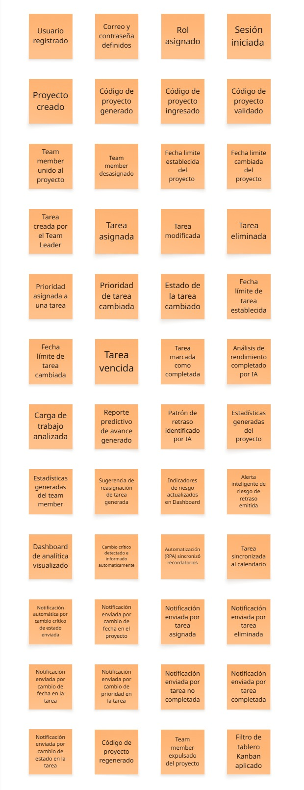

#### 4.2.2. Candidate Context Discovery

Tras la fase de exploración inicial, el equipo procedió a refinar el modelo del dominio mediante un proceso iterativo de diseño estratégico. Esta etapa se enfocó en dar estructura a los eventos identificados, analizando las causas, las reglas de negocio y las interacciones necesarias para consolidar la arquitectura del sistema de gestión de proyectos. A través de este refinamiento, se logró una transición fluida desde una lluvia de ideas desorganizada hacia la definición de límites de contexto claros y consistentes.

Inicialmente, los eventos de dominio se organizaron de forma cronológica para establecer el flujo de valor del sistema. Se priorizó el diseño del "happy path", representando el escenario ideal donde el líder crea el proyecto y los miembros completan sus tareas sin contratiempos. Posteriormente, se integraron flujos alternativos para cubrir casos como la expulsión de miembros o el vencimiento de tareas, asegurando que la línea de tiempo reflejara la realidad operativa del negocio.

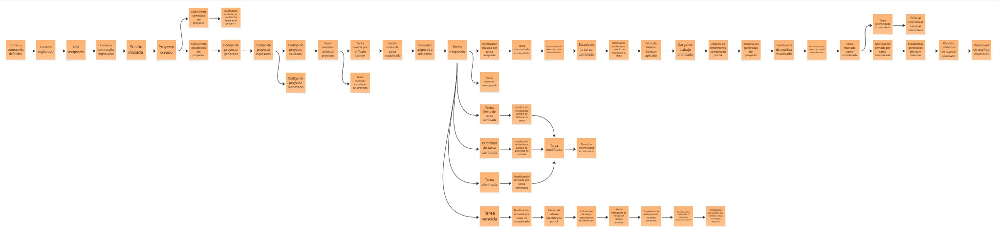

Una vez establecida la línea de tiempo, se analizaron los puntos de fricción o incertidumbre conocidos como pain points. En esta fase se identificaron cuellos de botella y riesgos potenciales, como la posible expiración de códigos de acceso o la sobrecarga de trabajo de los integrantes. Este análisis permitió detectar qué partes del proceso requerían una mayor atención a nivel de diseño o una automatización más robusta.

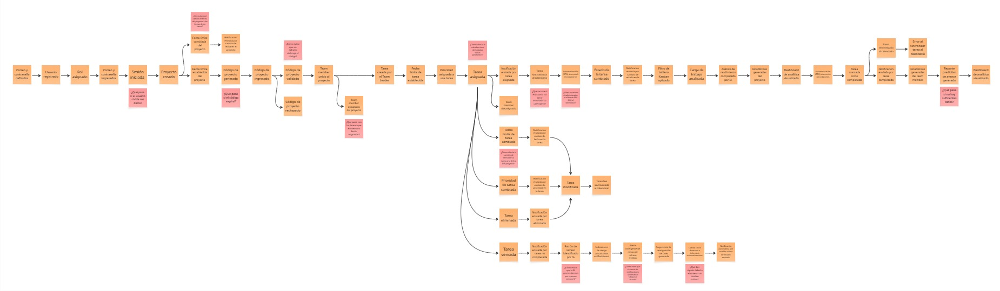

Posteriormente, se identificaron los eventos pivotales que marcan cambios significativos en el estado o contexto del negocio. Estos hitos sirvieron para dividir el flujo en fases lógicas, separando claramente el momento de configuración del proyecto del periodo de ejecución y seguimiento. Estos puntos de quiebre facilitaron la visualización de los límites naturales entre las diferentes etapas del ciclo de vida del software.

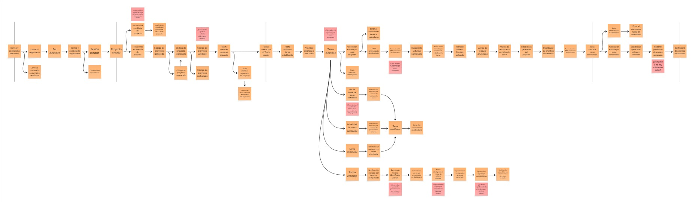

Con el flujo estructurado, se definieron los comandos que representan las intenciones de los usuarios y disparan los eventos del sistema. Estas acciones se formularon en modo imperativo, vinculándolas a los actores específicos, como el Team Leader o el Team Member. Este paso fue fundamental para entender qué operaciones debe exponer el sistema en cada interfaz para que los usuarios puedan interactuar con el dominio.

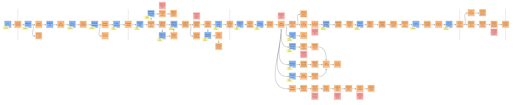

Para gestionar la lógica automática, se establecieron políticas de automatización que conectan eventos con comandos sin intervención humana directa. Estas reglas permiten que, ante un hecho específico como el cambio de estado de una tarea, el sistema responda automáticamente ejecutando análisis de rendimiento o enviando notificaciones, lo que garantiza una respuesta proactiva ante las dinámicas del equipo.

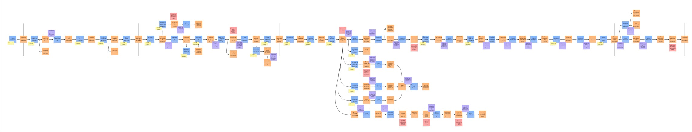

Asimismo, se identificaron los modelos de lectura o vistas necesarias para que los actores puedan tomar decisiones informadas. Estos representan la información visual, como el tablero Kanban o los dashboards de analítica, que los usuarios consultan antes de ejecutar cualquier comando. La definición de estos modelos asegura que el sistema proporcione los datos adecuados en el momento preciso del flujo.

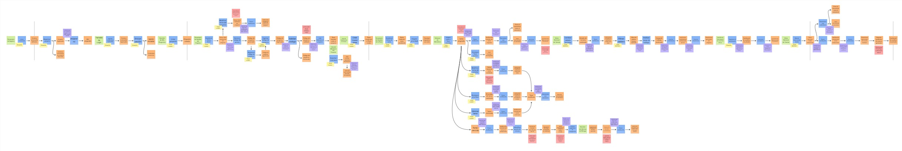

El modelo se complementó mediante la integración de sistemas externos que interactúan con el dominio pero no forman parte de su núcleo. Se mapearon servicios de terceros para la sincronización de calendarios y el envío de correos electrónicos, identificando cómo estos servicios externos reaccionan a los eventos internos o cómo inyectan información relevante hacia nuestro sistema.

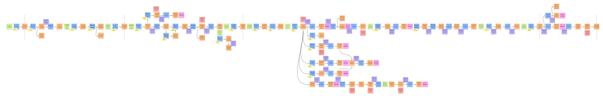

En una etapa avanzada de refinamiento, los elementos se organizaron en agregados para garantizar la consistencia y la integridad de los datos. Estos grupos de objetos de dominio actúan como una unidad, recibiendo comandos y produciendo eventos bajo reglas de negocio estrictas. Esto permitió encapsular la lógica relacionada con entidades clave como el proyecto, las tareas y la gestión de usuarios.

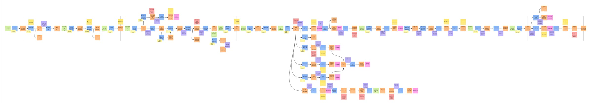

Finalmente, se determinaron los límites de los contextos delimitados analizando la cohesión entre los agregados y la influencia de las políticas de automatización. Esta agrupación final permitió segmentar el dominio en unidades lógicas independientes y manejables, resultando en la identificación de los cinco Bounded Contexts que estructuran la solución tecnológica.

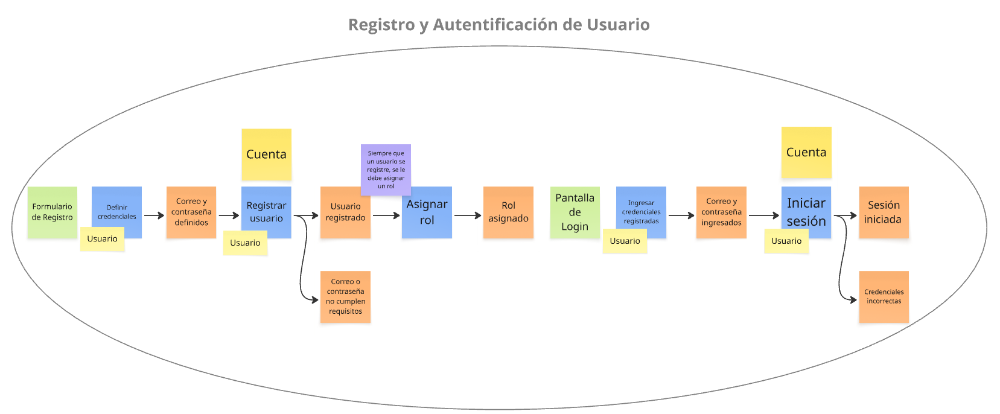
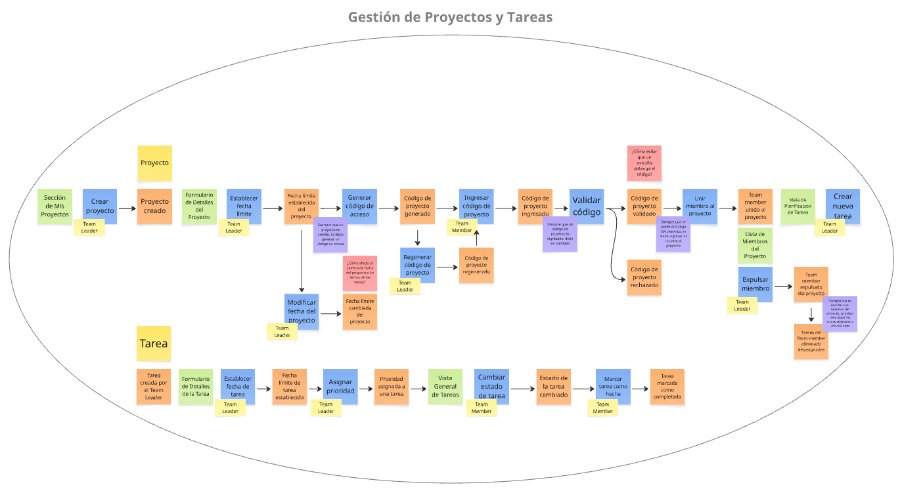
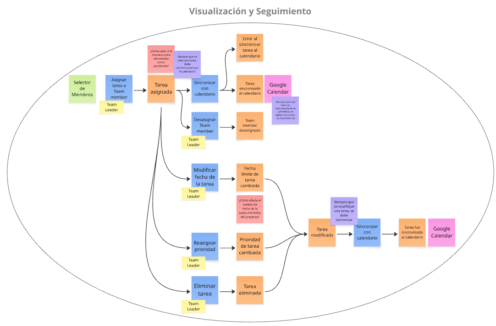
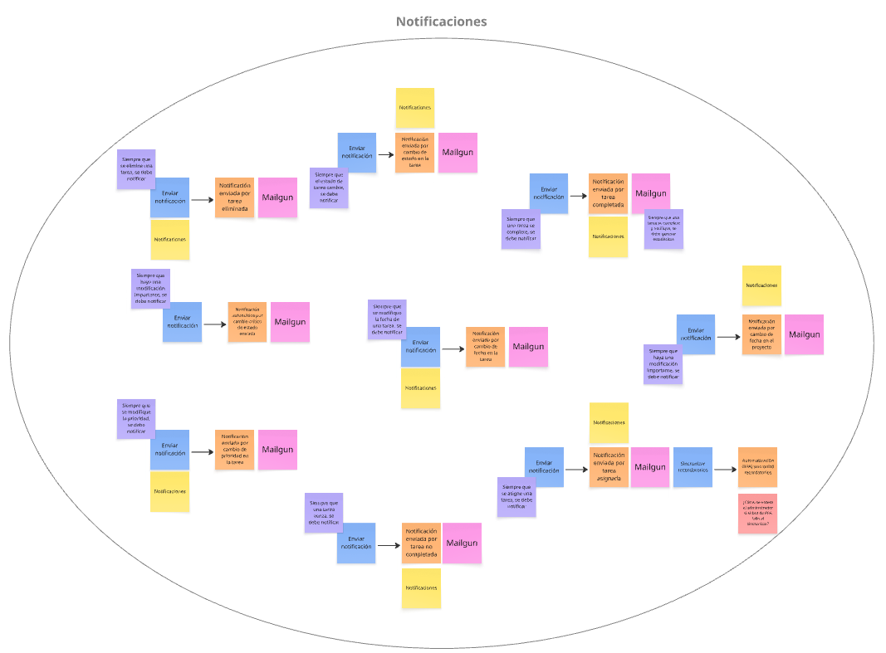
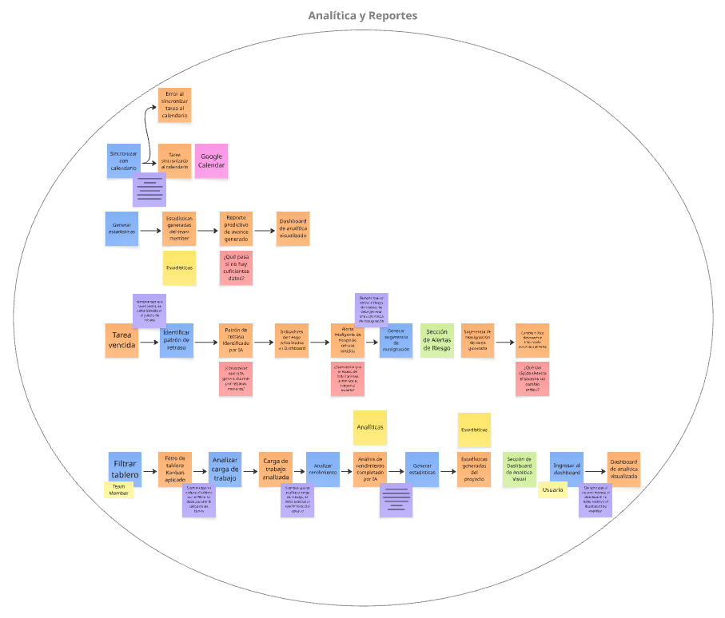

#### 4.2.3. Domain Message Flows Modeling

En esta sección se describe el proceso seguido para modelar la interacción entre los distintos Bounded Contexts del sistema, con el objetivo de entender cómo colaboran para resolver los principales escenarios del negocio. Para ello, se utilizó la técnica de Domain Storytelling, representando el flujo de mensajes mediante diagramas de tipo Domain Message Flow.

Estos diagramas permiten visualizar cómo se intercambian commands y events entre actores, sistemas y bounded contexts, facilitando la comprensión de la comunicación y reduciendo el acoplamiento entre componentes. A continuación, se presentan los escenarios más representativos del sistema.

**Escenario 1: Create and Assign Task**

Este escenario describe el proceso mediante el cual un Team Leader crea y asigna una nueva tarea dentro del sistema. El flujo inicia cuando el usuario envía un comando desde la aplicación, el cual es procesado por el bounded context de Gestión de Proyectos y Tareas, generando el evento Task Created.

A partir de este evento, otros bounded contexts reaccionan de forma independiente: Notificaciones envía alertas al usuario asignado, Visualización y Seguimiento actualiza los tableros de tareas, y Analítica y Reportes actualiza las métricas relacionadas con la carga de trabajo. Este escenario muestra claramente un flujo basado en eventos, donde un cambio en el dominio se propaga hacia otros contextos sin generar un fuerte acoplamiento.

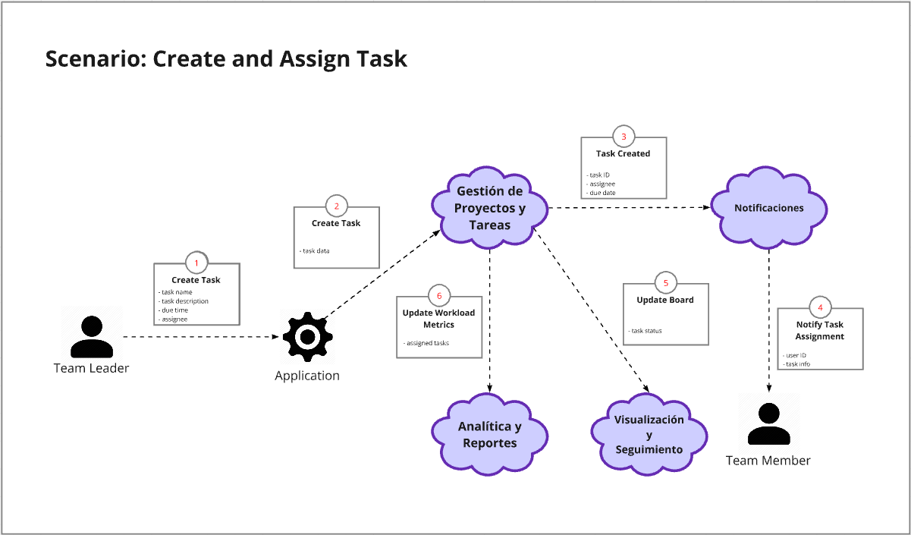

Escenario 2: Complete Task

En este escenario, un Team Member actualiza el estado de una tarea a completada. Esta acción genera un comando que es procesado por el bounded context de Gestión de Proyectos y Tareas, produciendo el evento Task Completed.

Como consecuencia, el bounded context de Analítica y Reportes recalcula las métricas de desempeño, Visualización y Seguimiento actualiza los dashboards para reflejar el nuevo estado de la tarea, y Notificaciones informa al líder del proyecto sobre la finalización. Este flujo evidencia cómo múltiples contextos colaboran a partir de un único evento de negocio.

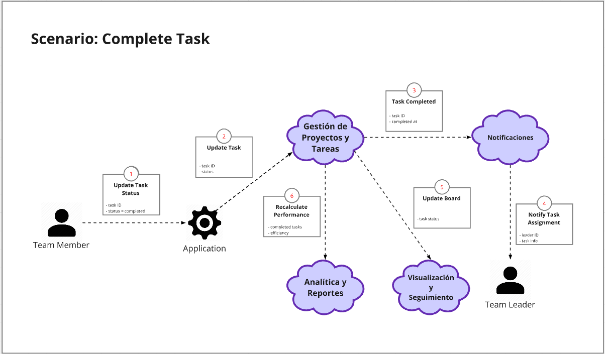

Escenario 3: Task Overdue Detection

Este escenario representa la detección automática de tareas vencidas dentro del sistema. El flujo es iniciado por un proceso interno (scheduler), que verifica periódicamente las fechas límite de las tareas. Cuando se detecta que una tarea ha superado su fecha de vencimiento, el bounded context de Gestión de Proyectos y Tareas emite el evento Task Overdue.

Este evento es consumido por Analítica y Reportes, que actualiza los indicadores de riesgo, por Visualización y Seguimiento, que muestra alertas en la interfaz, y por Notificaciones, que envía avisos a los usuarios correspondientes. Este escenario demuestra la automatización del sistema y la reacción de múltiples contextos ante eventos críticos.

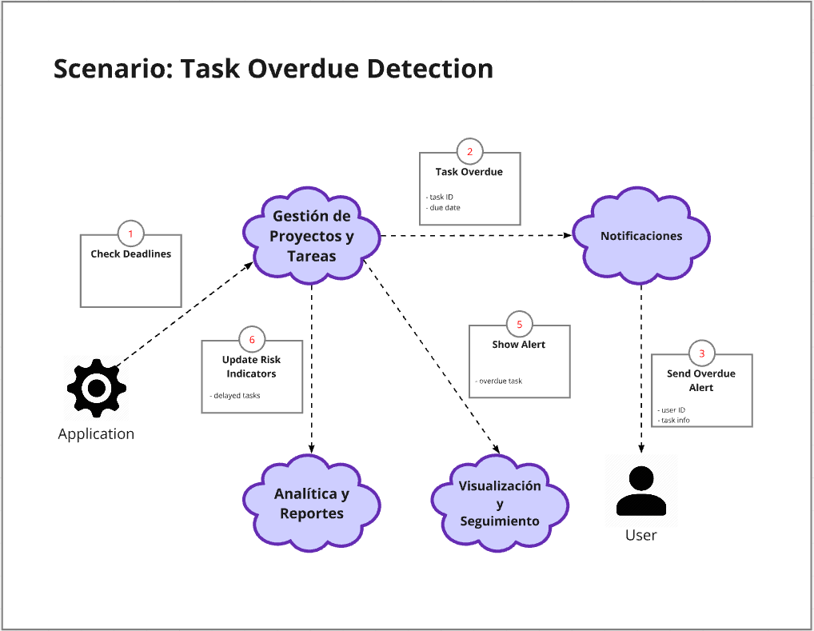

#### 4.2.4. Bounded Context Canvases

Con el fin de estructurar el dominio del sistema y delimitar responsabilidades claras, el equipo diseñó los Bounded Context Canvases correspondientes a cada contexto identificado. Para ello, se siguió un proceso iterativo que incluyó la definición del contexto, la identificación de reglas de negocio, el análisis de capacidades, el reconocimiento de dependencias y la evaluación del diseño.

Cada bounded context fue analizado considerando su propósito dentro del sistema, su lenguaje ubicuo, los mensajes que intercambia con otros contextos y las decisiones de negocio que gobiernan su comportamiento.

La separación en bounded contexts permite reducir la complejidad, facilitar la escalabilidad y mantener la coherencia del modelo, asegurando que cada parte del sistema responda a objetivos específicos con bajo acoplamiento.

A continuación, se describe cada uno de estos contextos, resaltando su propósito, responsabilidades y su rol dentro de la arquitectura del sistema.

**Registro y Autenticación de Usuario**

Este bounded context es responsable de la gestión de identidades dentro del sistema. Permite el registro de usuarios, el inicio de sesión y la validación de credenciales, así como la asignación de roles según el tipo de usuario.

Su función principal es garantizar que solo usuarios autorizados puedan acceder al sistema y realizar acciones dentro de él. Además, proporciona la información necesaria para que otros contextos puedan identificar correctamente a los actores involucrados en cada proceso.

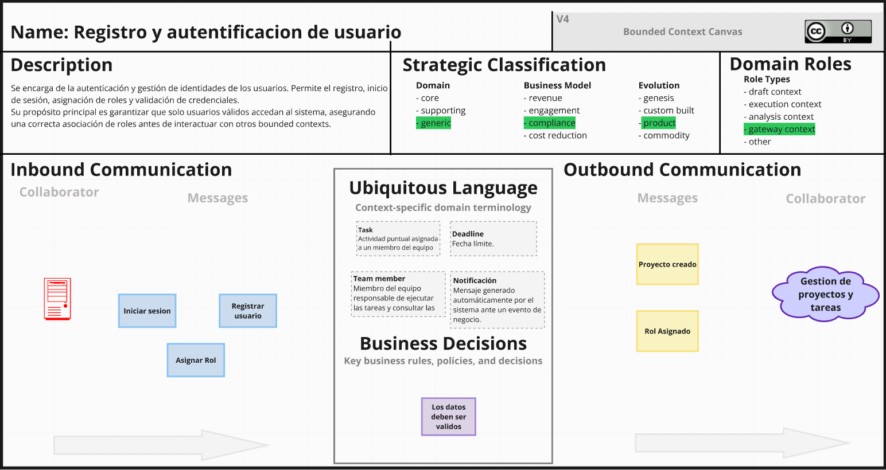

**Gestión de Proyectos y Tareas**

Este bounded context representa el núcleo del sistema, ya que se encarga de la creación, organización y gestión de proyectos y tareas. Permite a los Team Leaders definir fechas, prioridades y asignar responsables, mientras que los Team Members pueden actualizar el estado de sus tareas.

Asimismo, este contexto genera eventos clave del dominio, como la creación, actualización o vencimiento de tareas, los cuales son consumidos por otros bounded contexts. De esta manera, actúa como el principal emisor de información dentro del sistema y como punto central de coordinación de procesos.

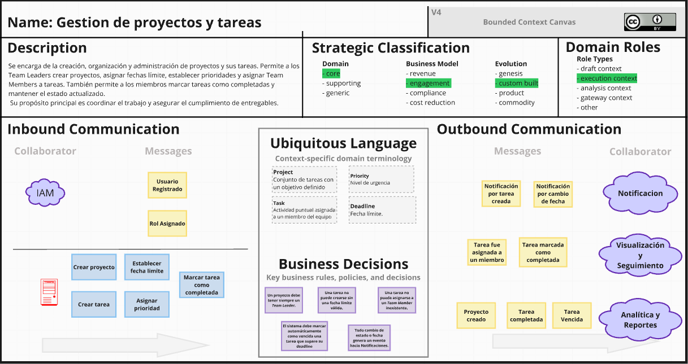

**Visualización y Seguimiento**

Este contexto se encarga de presentar la información del sistema de manera clara y organizada, utilizando herramientas visuales como tableros y calendarios. Su objetivo principal es facilitar el monitoreo del progreso de las tareas y proyectos por parte de los usuarios.

Adicionalmente, integra indicadores visuales que permiten identificar situaciones relevantes, como retrasos o posibles riesgos en la ejecución de tareas. Para ello, consume información tanto del contexto de Gestión de Proyectos y Tareas como de Analítica y Reportes.

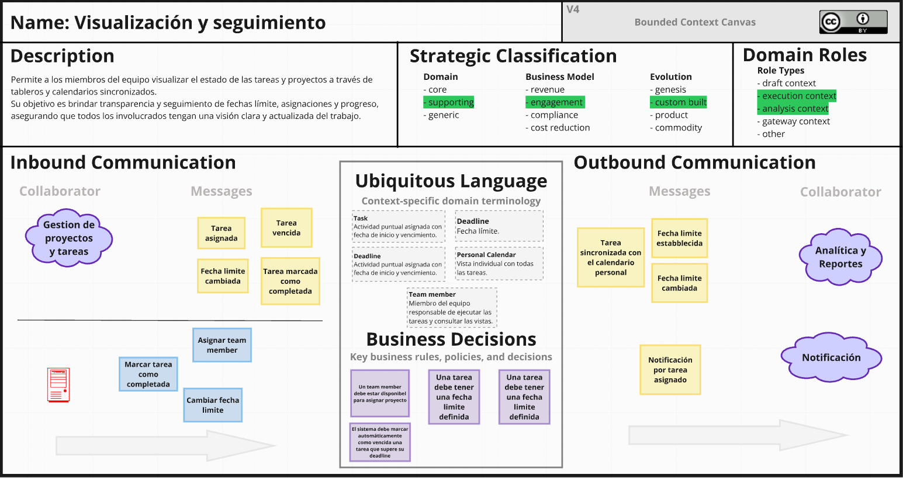

**Notificaciones**

Este bounded context gestiona la comunicación entre el sistema y los usuarios. Recibe eventos relevantes generados en otros contextos y los transforma en notificaciones que son enviadas en tiempo real.

Asimismo, incorpora mecanismos de automatización que permiten generar recordatorios automáticos, alertas por vencimiento y notificaciones inteligentes sin intervención manual. Esto asegura que los usuarios se mantengan informados de manera oportuna sobre los cambios y eventos importantes dentro del sistema.


**Analítica y Reportes**

Este bounded context tiene como finalidad procesar la información generada por el sistema para transformarla en métricas y reportes útiles para la toma de decisiones. A partir de los eventos recibidos, calcula indicadores relacionados con el desempeño del equipo y el estado de los proyectos.

Además, incorpora capacidades de análisis que permiten evaluar el rendimiento de los miembros, identificar tareas atrasadas y analizar la carga de trabajo. Estos resultados pueden ser utilizados por otros contextos, como Visualización y Seguimiento, para mejorar la interpretación de la información por parte de los usuarios.

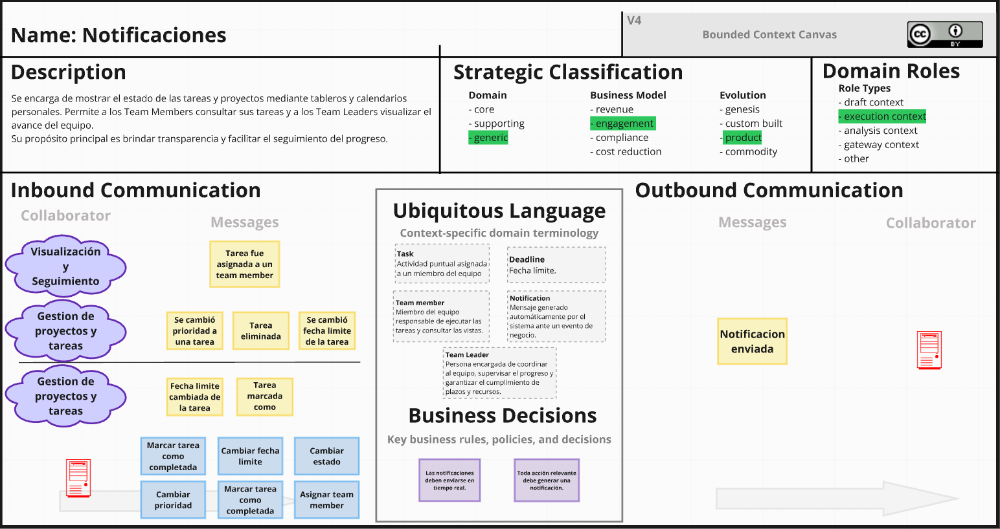


#### 4.2.5. Context Mapping

En esta sección, el equipo describe el proceso seguido para definir las relaciones entre los distintos Bounded Contexts del sistema, utilizando Context Mapping como herramienta para visualizar la interacción estructural entre ellos.

A partir de la información obtenida en las etapas anteriores, se analizaron múltiples alternativas de organización del dominio, evaluando cómo distribuir las responsabilidades y capacidades entre los contextos. Durante este proceso, se plantearon preguntas como: qué ocurriría si ciertas funcionalidades se movieran a otro contexto, si algunos contextos se dividieran en partes más pequeñas o si se centralizaran ciertas capacidades compartidas.

Inicialmente, se consideró la posibilidad de integrar funcionalidades como la visualización y la analítica dentro del contexto de Gestión de Proyectos y Tareas. Sin embargo, esto generaba un alto acoplamiento y dificultaba la escalabilidad del sistema. Por ello, se decidió separar estas capacidades en contextos independientes, permitiendo una mayor modularidad.

Asimismo, se evaluó la opción de centralizar la generación de notificaciones dentro del contexto principal. No obstante, se determinó que mantener un contexto independiente de Notificaciones permite desacoplar la lógica de comunicación del resto del sistema, facilitando su evolución y automatización.

También se analizó la posibilidad de compartir directamente modelos entre contextos. Sin embargo, esto podría generar dependencias fuertes, por lo que se optó por una comunicación basada en eventos, reduciendo el impacto de cambios entre contextos.

Como resultado de este proceso, se definieron las siguientes relaciones entre bounded contexts:

**Relaciones entre Bounded Contexts**

| Destino (Downstream)            | Origen (Upstream)              | Tipo de Relación   | Descripción                                                                 |
|--------------------------------|--------------------------------|--------------------|-----------------------------------------------------------------------------|
| Visualización y Seguimiento    | Gestión de Proyectos y Tareas  | Customer/Supplier  | Consume información de tareas y proyectos para mostrar el estado en tableros y calendarios. |
| Analítica y Reportes           | Gestión de Proyectos y Tareas  | Customer/Supplier  | Utiliza los eventos generados para calcular métricas y reportes.             |
| Notificaciones                 | Gestión de Proyectos y Tareas  | Customer/Supplier  | Recibe eventos para generar notificaciones en tiempo real.                  |
| Visualización y Seguimiento    | Analítica y Reportes           | Customer/Supplier  | Muestra métricas e indicadores generados por el contexto analítico.         |
| Notificaciones                 | Analítica y Reportes           | Partnership        | Colabora para generar alertas inteligentes basadas en métricas.             |
| Gestión de Proyectos y Tareas  | Registro y Autenticación       | Conformist         | Depende de este contexto para validar usuarios y roles sin modificar su modelo. |
| Todos los contextos            | Registro y Autenticación       | Shared Kernel      | Comparten información básica de usuarios y roles para garantizar consistencia. |

Finalmente, se consideró el uso de patrones de diseño de Domain-Driven Design, como Customer/Supplier, Conformist, Partnership y Shared Kernel, con el fin de definir claramente las responsabilidades y dependencias entre los contextos.

El resultado de este análisis se representa en el siguiente Context Map, el cual muestra de manera visual las relaciones estructurales entre los bounded contexts del sistema.

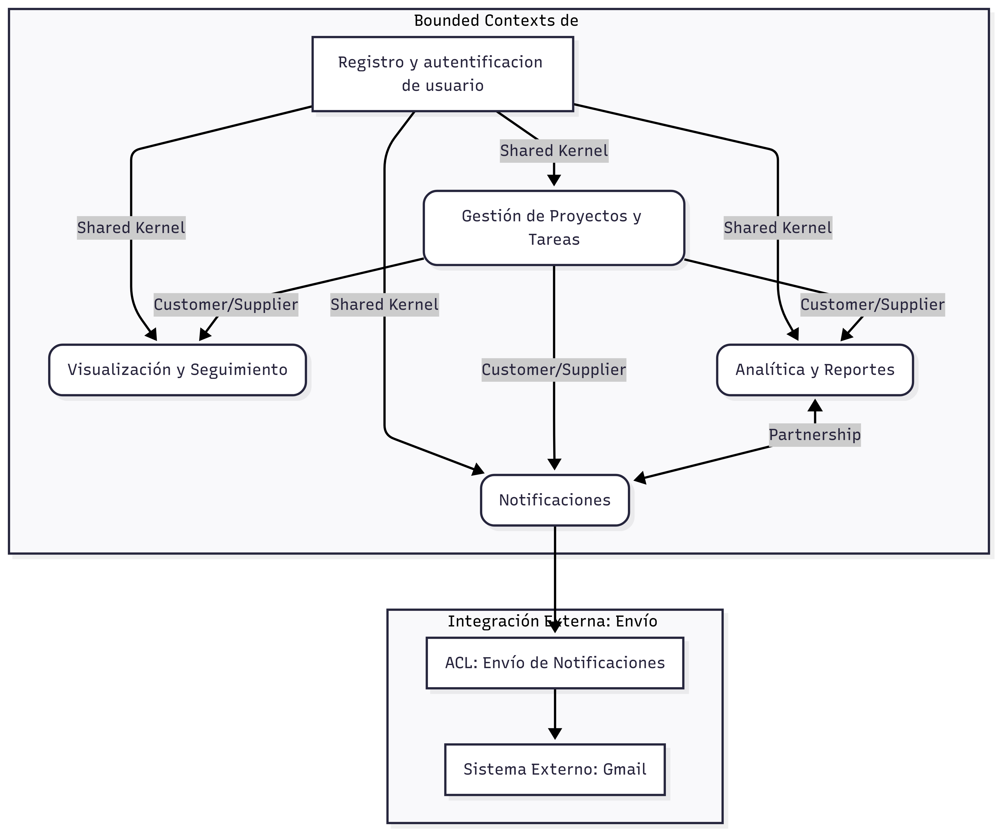


### 4.3. Software Architecture

En la arquitectura de software primero nos enfocamos en aterrizar la estructura técnica de TaskMaster. Para lograrlo, decidimos utilizar el Modelo C4, ya que nos permite explicar la arquitectura de forma progresiva, desde lo más general hasta los detalles técnicos. A través de estos diagramas mostramos cómo se ve el sistema por fuera y también cómo hemos dividido las responsabilidades internamente para que la solución sea escalable y eficiente.

#### 4.3.1. Software Architecture System Landscape Diagram

En esta sección se presenta el System Landscape Diagram, el cual permite visualizar el sistema dentro de un entorno más amplio, considerando no solo a los usuarios que interactúan con la solución, sino también a otros sistemas externos relevantes. Este diagrama ofrece una perspectiva general del ecosistema en el que se encuentra la aplicación, mostrando cómo se relaciona con actores y servicios externos. De esta manera, se facilita la comprensión del alcance del sistema, sus dependencias y las posibles integraciones con otros sistemas dentro del entorno digital.

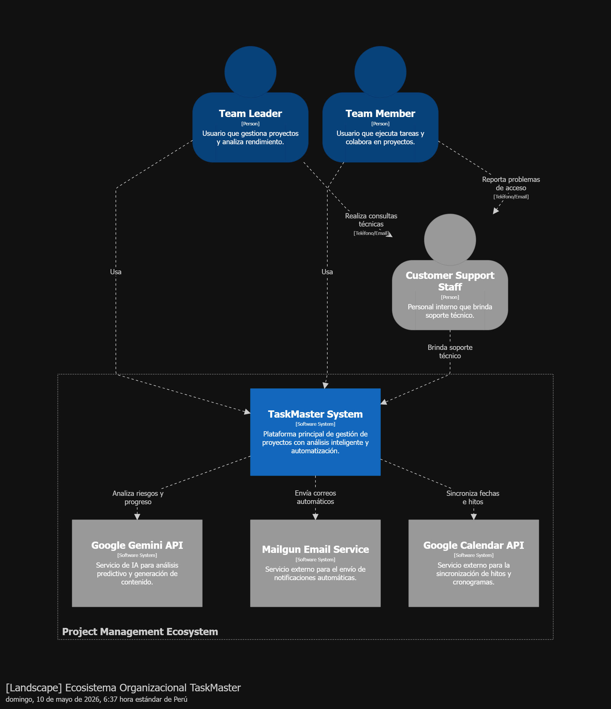

#### 4.3.2. Software Architecture Context Level Diagrams

El diagrama muestra a TaskMaster System en el centro de la interacción. Los usuarios gestionan proyectos y consultan análisis directamente en la plataforma, mientras que el sistema se encarga de orquestar la comunicación con servicios externos. La relación con Mailgun permite que el usuario reciba notificaciones automáticas, la integración con Google Calendar garantiza que los hitos del proyecto estén siempre sincronizados fuera de la aplicación y la integración con Google Gemini potencia la plataforma al proporcionar análisis predictivos sobre el rendimiento de los equipos, generación automática de resúmenes de proyectos y sugerencias inteligentes para la optimización de tareas.

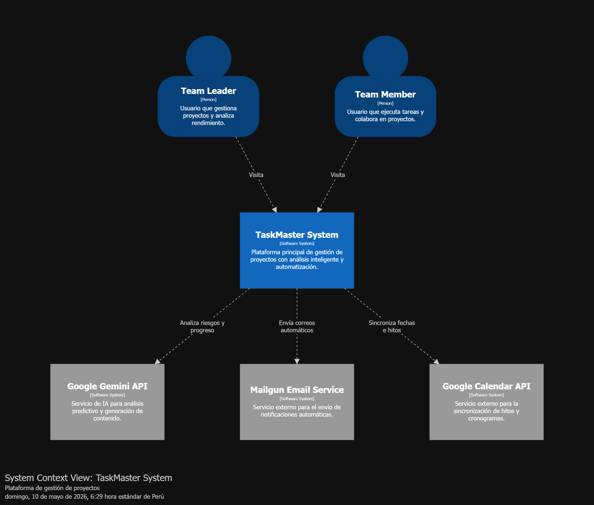

#### 4.3.3. Software Architecture Container Level Diagrams

En este nivel, se observa cómo el tráfico entra a través de una Landing Page o directamente a las aplicaciones (Vue para web y Flutter para móvil). Todas las peticiones pasan por un API Gateway que las redirige a los servicios correspondientes de Spring Boot. Todos estos servicios comparten una base de datos central en PostgreSQL, asegurando la integridad de la información mientras se mantiene una arquitectura modular y fácil de mantener.

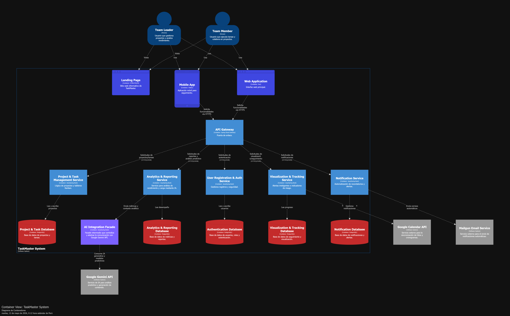

#### 4.3.4. Software Architecture Deployment Diagrams

Finalmente, presentamos el Diagrama de Despliegue, que ilustra cómo se distribuyen nuestros contenedores en la infraestructura real. Para esta solución, hemos optado por un ecosistema en la nube aprovechando la versatilidad de Vercel para el frontend, GitHub Pages para la landing informativa y Render para alojar tanto nuestros servicios de backend como la base de datos gestionada. Este esquema refleja una configuración de producción pensada en la disponibilidad y facilidad de despliegue continuo.

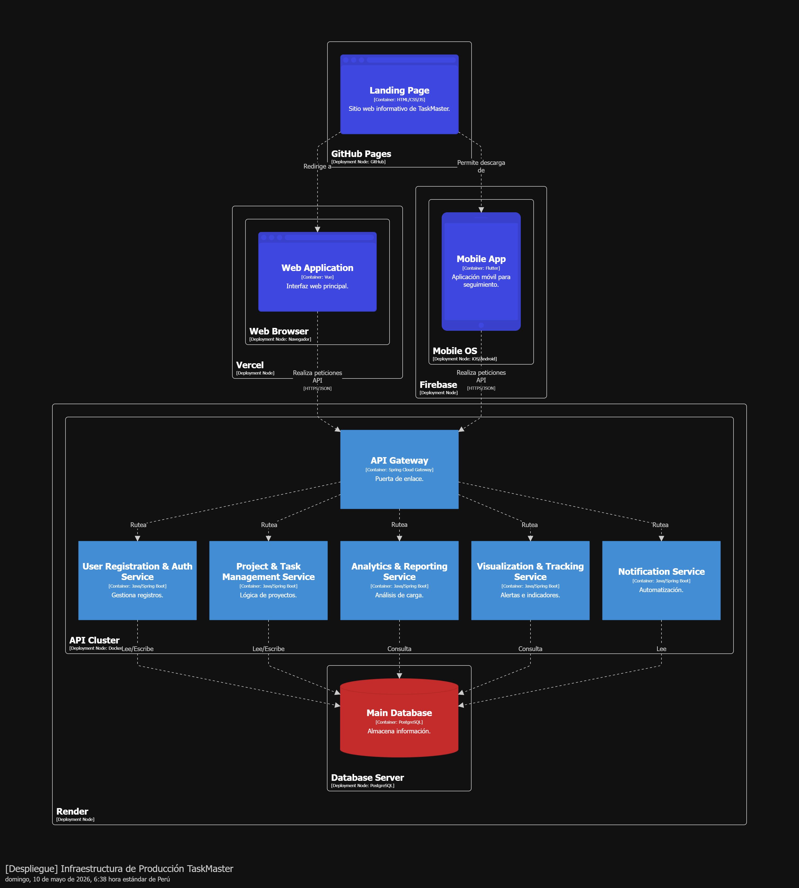

## Capítulo V: Tactical-Level Software Design.
### 5.1.	Bounded Context:  Registro y Autenticación de Usuario

El bounded context de Registro y Autenticación de Usuario es responsable de gestionar la identidad digital de los usuarios dentro de la plataforma TaskMaster. Este contexto encapsula los procesos de registro, autenticación, autorización y administración de roles, garantizando que únicamente usuarios válidos puedan acceder a los recursos y funcionalidades del sistema.

Asimismo, este bounded context ha sido diseñado considerando capacidades futuras de tecnologías emergentes, especialmente relacionadas con inteligencia artificial orientada a seguridad y automatización de procesos de autenticación mediante RPA.

---

#### 5.1.1.	Domain Layer.

La Domain Layer representa el núcleo del dominio relacionado con identidad y control de acceso. Aquí se modelan las entidades, objetos de valor y servicios encargados de mantener la consistencia y seguridad de los procesos de autenticación y autorización.

### Aggregate Root: User

**Descripción**
El agregado `User` representa la cuenta principal de un usuario dentro del sistema y actúa como raíz del agregado. Encapsula las credenciales, roles y estados de seguridad asociados al usuario.

**Atributos**

| Atributo | Tipo | Descripción |
|---|---|---|
| id | Long | Identificador único del usuario |
| username | String | Nombre de usuario único |
| passwordHash | String | Contraseña cifrada |
| email | EmailAddress | Correo electrónico validado |
| roles | Set<Role> | Roles asignados al usuario |
| status | UserStatus | Estado de la cuenta |
| createdAt | Date | Fecha de creación |
| updatedAt | Date | Fecha de actualización |

**Métodos principales**

- `register()`: Registra un nuevo usuario validando reglas de negocio.
- `assignRole(Role role)`: Asigna un rol al usuario.
- `changePassword(String newPassword)`: Actualiza la contraseña.
- `lockAccount()`: Bloquea la cuenta ante actividad sospechosa.
- `enableAccount()`: Reactiva la cuenta.
- `validatePassword(String password)`: Valida credenciales.

---

### Entity: Role

**Descripción**
Representa los permisos y niveles de acceso disponibles dentro de la plataforma.

**Atributos**

| Atributo | Tipo | Descripción |
|---|---|---|
| id | Long | Identificador del rol |
| name | RoleName | Nombre del rol |

**Valores de RoleName**

- TEAM_MEMBER
- TEAM_LEADER
- ADMIN

**Métodos**

- `isLeader()`
- `isAdmin()`

---

### Value Object: EmailAddress

**Descripción**
Objeto de valor encargado de representar una dirección de correo válida.

**Reglas de validación**

- Debe tener formato válido.
- No puede exceder la longitud permitida.
- Es inmutable.

---

### Value Object: UserStatus

**Valores**

- ACTIVE
- LOCKED
- DISABLED

---

### Domain Service: AuthenticationService

**Descripción**
Encapsula la lógica de autenticación independiente de infraestructura técnica.

**Métodos**

- `authenticate(username, password)`
- `validateCredentials(user, password)`
- `initiatePasswordReset(email)`

---

### Domain Service: SecurityPolicyService

**Descripción**
Gestiona reglas de seguridad y prepara el dominio para futuras capacidades de inteligencia artificial enfocadas en detección de accesos sospechosos.

**Métodos**

- `isLoginAttemptValid(user, metadata)`
- `evaluateRisk(loginData)`
- `detectAnomalousBehavior(userActivity)`

**Relación con tecnologías emergentes**

Este servicio permitirá integrar modelos de IA capaces de:

- Detectar patrones sospechosos de inicio de sesión.
- Identificar accesos inusuales.
- Generar alertas inteligentes de seguridad.

---

### Repository Interfaces

**UserRepository**

**Métodos:**

- `save(User user)`
- `findById(Long id)`
- `findByUsername(String username)`
- `findByEmail(String email)`

**RoleRepository**

**Métodos:**

- `save(Role role)`
- `findByName(String name)`
- `findAll()`

---

#### 5.1.2.	Interface Layer.

La Interface Layer expone los endpoints REST y gestiona la interacción entre los usuarios y el sistema.

---

### Controller: AuthenticationController

**Descripción**
Gestiona los procesos de autenticación y acceso.

| Método | Ruta | Descripción |
|---|---|---|
| signUp | POST /auth/sign-up | Registro de usuario |
| signIn | POST /auth/sign-in | Inicio de sesión |
| logout | POST /auth/logout | Cierre de sesión |
| resetPassword | POST /auth/reset-password | Recuperación de contraseña |

---

### Controller: UsersController

**Descripción**
Permite administrar usuarios registrados.

| Método | Ruta |
|---|---|
| getAllUsers | GET /users |
| getUserById | GET /users/{id} |
| updateUserStatus | PUT /users/{id}/status |

---

### Controller: RolesController

| Método | Ruta |
|---|---|
| getRoles | GET /roles |

---

### Assemblers y Resources

Se utilizan DTOs y assemblers para desacoplar la API del dominio.

**Resources principales**

- SignInResource
- SignUpResource
- UserResource
- RoleResource

**Assemblers principales**

- UserResourceAssembler
- SignInCommandAssembler

---

#### 5.1.3.	Application Layer.

La Application Layer orquesta los flujos de negocio y coordina comandos, consultas y eventos.

---

### Command Handlers

**SignUpCommandHandler**

Responsabilidades:

- Validar datos del usuario.
- Crear usuario.
- Generar eventos de registro.

**SignInCommandHandler**

Responsabilidades:

- Validar credenciales.
- Generar token JWT.
- Registrar actividad de acceso.

**AssignRoleCommandHandler**

Responsabilidades:

- Asignar roles.
- Validar permisos.

**ResetPasswordCommandHandler**

Responsabilidades:

- Generar solicitudes de recuperación.
- Disparar automatizaciones de notificación.

---

### Query Handlers

- GetUserByIdQueryHandler
- GetAllUsersQueryHandler
- GetRolesQueryHandler

---

### Domain Events

**UserRegisteredEvent**

Se genera cuando un usuario es registrado exitosamente.

**UserLoggedInEvent**

Se genera cuando un usuario inicia sesión.

**SuspiciousLoginDetectedEvent**

Evento preparado para integraciones futuras con servicios inteligentes de seguridad.

---

### Servicios de soporte

- TokenService
- HashingService

---

### Integración con tecnologías emergentes

**Inteligencia Artificial**

La Application Layer permite integrar servicios de IA orientados a:

- análisis de comportamiento de acceso
- evaluación de riesgo
- detección de accesos anómalos

**RPA**

Se incorporan automatizaciones para:

- recuperación automática de contraseña
- envío automático de correos
- notificaciones inteligentes de seguridad

---

#### 5.1.4.	Infrastructure Layer.

La Infrastructure Layer implementa los mecanismos técnicos de persistencia y conexión con servicios externos.

---

### Repository Implementations

**JpaUserRepository**

Implementación concreta del repositorio de usuarios.

**JpaRoleRepository**

Implementación concreta del repositorio de roles.

---

### Servicios técnicos

**BCryptHashingService**

Responsable del cifrado de contraseñas.

**JwtTokenService**

Encargado de generar y validar tokens JWT.

---

### Integraciones externas

**EmailService (Mailgun)**

Gestiona el envío de:

- recuperación de contraseña
- confirmaciones de registro
- alertas de seguridad

**NotificationAutomationService**

Servicio orientado a automatizaciones RPA.

**Funciones automatizadas**

- envío automático de recordatorios
- alertas inteligentes de acceso
- automatización de recuperación de cuenta

---

### Integración IA

**ExternalSecurityAnalysisService**

Servicio preparado para consumir modelos de inteligencia artificial relacionados con:

- análisis de riesgo
- comportamiento sospechoso
- patrones de acceso

---

#### 5.1.6.	Bounded Context Software Architecture Component Level Diagrams.

El siguiente Component Diagram representa la descomposición interna del bounded context de Registro y Autenticación de Usuario, mostrando los componentes pertenecientes a las capas Interface, Application, Domain e Infrastructure, así como la integración con servicios de Inteligencia Artificial (AI) y automatización RPA para validaciones de seguridad y notificaciones automáticas.

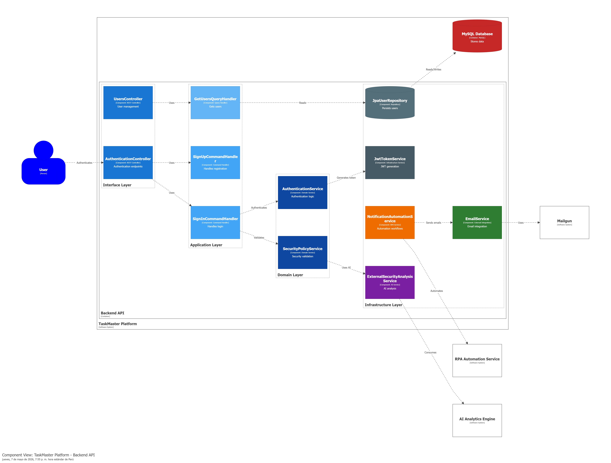

#### 5.1.7.	Bounded Context Software Architecture Code Level Diagrams.
##### 5.1.7.1.	Bounded Context Domain Layer Class Diagrams.

El siguiente diagrama de clases UML presenta las principales entidades, servicios de dominio, interfaces y relaciones correspondientes al Domain Layer del bounded context de Registro y Autenticación de Usuario, siguiendo principios de Domain-Driven Design (DDD).

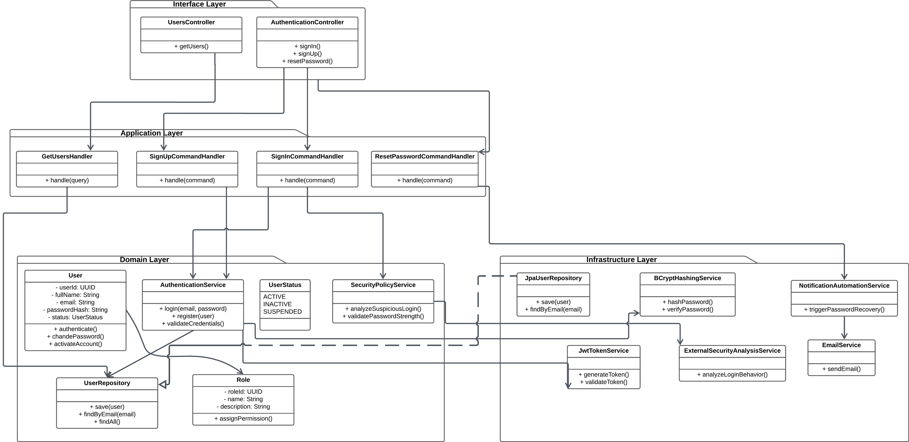


##### 5.1.7.2.	Bounded Context Database Design Diagram.

El siguiente Database Diagram muestra las entidades persistentes y relaciones utilizadas para gestionar usuarios, roles, intentos de inicio de sesión y procesos de recuperación de contraseña dentro del bounded context de Registro y Autenticación de Usuario.

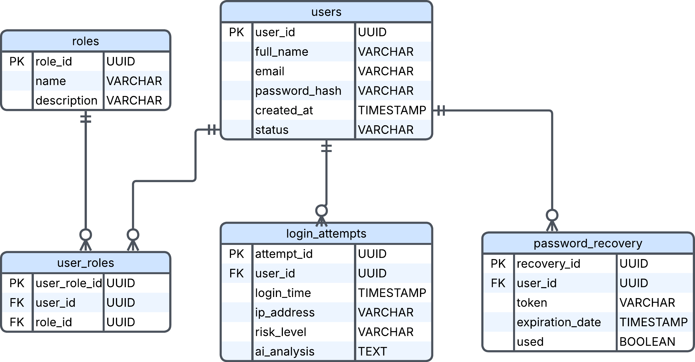

### 5.2.	Bounded Context:  Gestión de Proyectos y Tareas

El bounded context de Gestión de Proyectos y Tareas es responsable de administrar la planificación, organización, asignación y seguimiento operativo de proyectos y tareas dentro de la plataforma TaskMaster. Este contexto representa el núcleo funcional del sistema, ya que concentra las reglas de negocio relacionadas con la ejecución de actividades colaborativas entre equipos de trabajo.

Asimismo, este bounded context incorpora capacidades preparadas para tecnologías emergentes basadas en inteligencia artificial, orientadas al análisis predictivo de carga laboral, identificación de tareas críticas y evaluación automática de riesgos operativos. De igual manera, se integra con automatizaciones RPA para la generación de recordatorios y alertas inteligentes relacionadas con vencimientos y asignaciones.

---

#### 5.2.1.	Domain Layer.

La Domain Layer modela las entidades, agregados y servicios que representan las reglas de negocio asociadas a la gestión de proyectos, tareas y colaboración entre usuarios.

---

### Aggregate Root: Project

**Descripción**
El agregado `Project` representa un proyecto de trabajo dentro del sistema y actúa como raíz del agregado. Encapsula la información general del proyecto, sus miembros y las tareas asociadas.

**Atributos**

| Atributo | Tipo | Descripción |
|---|---|---|
| id | Long | Identificador del proyecto |
| name | String | Nombre del proyecto |
| description | String | Descripción general |
| status | ProjectStatus | Estado del proyecto |
| startDate | Date | Fecha de inicio |
| endDate | Date | Fecha límite |
| ownerId | Long | Identificador del líder |
| members | List<ProjectMember> | Miembros asociados |
| tasks | List<Task> | Tareas del proyecto |
| createdAt | Date | Fecha de creación |

**Métodos principales**

- `createTask()`
- `assignMember()`
- `removeMember()`
- `changeStatus()`
- `calculateProgress()`
- `closeProject()`

---

### Entity: Task

**Descripción**
Representa una actividad específica perteneciente a un proyecto.

**Atributos**

| Atributo | Tipo | Descripción |
|---|---|---|
| id | Long | Identificador de tarea |
| title | String | Título de la tarea |
| description | String | Descripción |
| status | TaskStatus | Estado actual |
| priority | TaskPriority | Nivel de prioridad |
| dueDate | Date | Fecha límite |
| assignedUserId | Long | Usuario asignado |
| estimatedHours | Integer | Tiempo estimado |
| completedAt | Date | Fecha de finalización |

**Métodos principales**

- `assignUser()`
- `updateStatus()`
- `markAsCompleted()`
- `changePriority()`
- `isOverdue()`
- `calculateDelayRisk()`

---

### Entity: ProjectMember

**Descripción**
Representa la participación de un usuario dentro de un proyecto.

**Atributos**

- id
- userId
- role
- joinedAt

---

### Value Object: ProjectStatus

**Valores**

- PLANNING
- ACTIVE
- COMPLETED
- CANCELLED

---

### Value Object: TaskStatus

**Valores**

- PENDING
- IN_PROGRESS
- COMPLETED
- BLOCKED
- OVERDUE

---

### Value Object: TaskPriority

**Valores**

- LOW
- MEDIUM
- HIGH
- CRITICAL

---

### Domain Service: WorkloadAnalysisService

**Descripción**
Servicio de dominio encargado de analizar la distribución de tareas y carga laboral de los miembros del proyecto.

**Métodos**

- `analyzeWorkload(projectId)`
- `detectOverloadedUsers()`
- `calculateTeamCapacity()`

**Relación con IA**

Este servicio será integrado con modelos de inteligencia artificial capaces de:

- analizar rendimiento del equipo
- identificar sobrecarga laboral
- detectar desequilibrio en asignaciones
- predecir retrasos operativos

---

### Domain Service: TaskRiskAnalysisService

**Descripción**
Servicio responsable de evaluar riesgos asociados al progreso de tareas.

**Métodos**

- `evaluateTaskRisk(task)`
- `predictDelayProbability(task)`
- `detectCriticalTasks(projectId)`

**Relación con IA**

Este servicio permitirá integrar algoritmos predictivos orientados a:

- detección temprana de retrasos
- clasificación automática de tareas críticas
- generación de alertas inteligentes

---

### Domain Service: ProjectCollaborationService

**Descripción**

Gestiona reglas relacionadas con colaboración y coordinación de equipos.

**Métodos**

- `validateAssignment()`
- `verifyMemberPermissions()`
- `recommendTaskDistribution()`

---

### Repository Interfaces

**ProjectRepository**

Métodos principales:

- `save(Project project)`
- `findById(Long id)`
- `findByOwnerId(Long ownerId)`
- `findAll()`

**TaskRepository**

Métodos principales:

- `save(Task task)`
- `findByProjectId(Long projectId)`
- `findOverdueTasks()`
- `findByAssignedUser(Long userId)`

**ProjectMemberRepository**

Métodos principales:

- `save(ProjectMember member)`
- `findByProjectId(Long projectId)`

---

#### 5.2.2.	Interface Layer.

La Interface Layer expone las funcionalidades relacionadas con proyectos y tareas mediante endpoints REST.

---

### Controller: ProjectsController

**Descripción**
Gestiona operaciones relacionadas con proyectos.

| Método | Ruta | Descripción |
|---|---|---|
| createProject | POST /projects | Crear proyecto |
| getProjects | GET /projects | Obtener proyectos |
| getProjectById | GET /projects/{id} | Obtener proyecto |
| updateProject | PUT /projects/{id} | Actualizar proyecto |
| closeProject | PUT /projects/{id}/close | Finalizar proyecto |

---

### Controller: TasksController

**Descripción**
Gestiona tareas asociadas a proyectos.

| Método | Ruta |
|---|---|
| createTask | POST /tasks |
| assignTask | PUT /tasks/{id}/assign |
| updateTaskStatus | PUT /tasks/{id}/status |
| getTasksByProject | GET /projects/{id}/tasks |

---

### Controller: ProjectMembersController

| Método | Ruta |
|---|---|
| addMember | POST /projects/{id}/members |
| removeMember | DELETE /projects/{id}/members/{memberId} |

---

### Assemblers y Resources

**Resources principales**

- ProjectResource
- TaskResource
- ProjectMemberResource
- CreateProjectResource
- CreateTaskResource

**Assemblers principales**

- ProjectResourceAssembler
- TaskResourceAssembler
- ProjectCommandAssembler

---

#### 5.2.3.	Application Layer.

La Application Layer coordina los procesos de negocio relacionados con proyectos y tareas mediante comandos, consultas y eventos.

---

### Command Handlers

**CreateProjectCommandHandler**

Responsabilidades:

- Crear proyectos.
- Validar reglas de negocio.
- Registrar eventos iniciales.

**CreateTaskCommandHandler**

Responsabilidades:

- Crear tareas.
- Validar asignaciones.
- Calcular prioridad inicial.

**AssignTaskCommandHandler**

Responsabilidades:

- Asignar usuarios.
- Validar carga laboral.
- Generar alertas inteligentes.

**UpdateTaskStatusCommandHandler**

Responsabilidades:

- Actualizar estado.
- Verificar vencimientos.
- Disparar automatizaciones.

**CloseProjectCommandHandler**

Responsabilidades:

- Finalizar proyectos.
- Validar tareas pendientes.
- Generar métricas finales.

### Query Handlers

- GetProjectsQueryHandler
- GetProjectByIdQueryHandler
- GetTasksByProjectQueryHandler
- GetOverdueTasksQueryHandler

---

### Domain Events

**ProjectCreatedEvent**

Se genera cuando un proyecto es creado.

**TaskAssignedEvent**

Se genera cuando una tarea es asignada.

**TaskOverdueEvent**

Evento emitido cuando una tarea excede su fecha límite.

**CriticalTaskDetectedEvent**

Evento generado cuando una tarea es clasificada como crítica mediante análisis inteligente.

**Integración con Inteligencia Artificial**

La Application Layer integra capacidades de IA orientadas a:

- análisis de productividad
- predicción de retrasos
- identificación de riesgos
- recomendaciones de asignación

**Integración con RPA**

Se implementan automatizaciones para:

- recordatorios automáticos
- alertas de vencimiento
- seguimiento automático de tareas críticas
- notificaciones inteligentes

**Servicios de soporte**

- NotificationService
- SchedulingService
- WorkloadMetricsService

---

#### 5.2.4.	Infrastructure Layer.

La Infrastructure Layer implementa persistencia, servicios externos y mecanismos técnicos necesarios para la ejecución del bounded context.

---

### Repository Implementations

**JpaProjectRepository**

Implementación concreta de persistencia de proyectos.

**JpaTaskRepository**

Implementación concreta de persistencia de tareas.

**JpaProjectMemberRepository**

Implementación concreta de persistencia de miembros.

---

### Servicios técnicos

**NotificationServiceImpl**

Gestiona envío de notificaciones.

**SchedulerService**

Gestiona tareas automáticas programadas.

**AIAnalyticsIntegrationService**

Servicio encargado de consumir modelos externos de inteligencia artificial.

**Funcionalidades**

- análisis predictivo
- evaluación de riesgos
- análisis de rendimiento
- cálculo inteligente de carga laboral

---

### Integraciones externas

**EmailService (Mailgun)**

Responsable de:

- envío de alertas
- recordatorios automáticos
- notificaciones inteligentes

**CalendarIntegrationService**

Permite sincronizar tareas y vencimientos con calendarios externos.

**RpaWorkflowAutomationService**

Servicio encargado de automatizar procesos repetitivos.

**Automatizaciones principales**

- envío automático de recordatorios
- generación de alertas por vencimiento
- seguimiento automatizado de tareas críticas
- escalamiento automático de incidencias

---

### Preparación para tecnologías emergentes

Este bounded context ha sido diseñado para integrar tecnologías emergentes relacionadas con:

**Inteligencia Artificial**

- predicción de retrasos
- análisis de productividad
- evaluación automática de riesgos
- recomendaciones inteligentes

**Robotic Process Automation (RPA)**

- automatización de notificaciones
- ejecución automática de recordatorios
- seguimiento inteligente de tareas vencidas

---

#### 5.2.6.	Bounded Context Software Architecture Component Level Diagrams.

El siguiente Component Diagram representa la arquitectura interna del bounded context de Gestión de Proyectos y Tareas, incluyendo componentes encargados de la administración de proyectos, tareas, análisis predictivo mediante AI y automatización de flujos utilizando RPA.

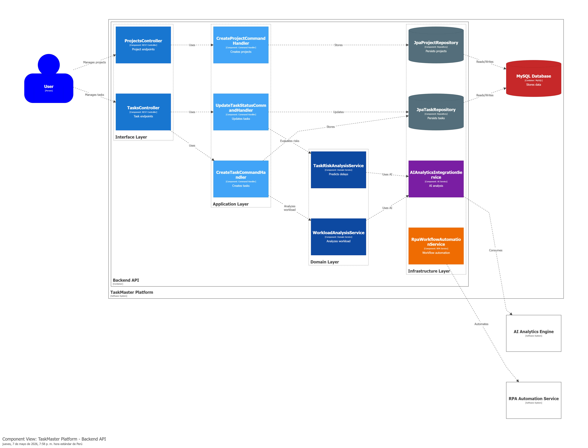

#### 5.2.7.	Bounded Context Software Architecture Code Level Diagrams.
##### 5.2.7.1.	Bounded Context Domain Layer Class Diagrams.

El siguiente diagrama de clases UML presenta las entidades, agregados, servicios de dominio y repositorios relacionados con la gestión de proyectos y tareas, así como los mecanismos de análisis de carga laboral y predicción de riesgos basados en AI.

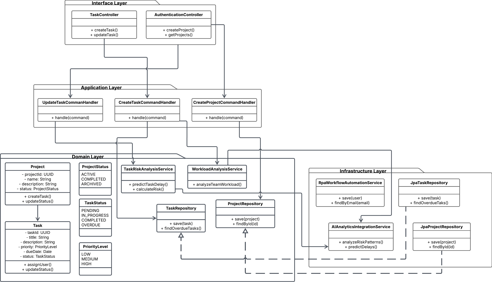

##### 5.2.7.2.	Bounded Context Database Design Diagram.

El siguiente Database Diagram representa la estructura de almacenamiento necesaria para gestionar proyectos, tareas, miembros de proyecto y predicciones de riesgo generadas mediante Inteligencia Artificial dentro del bounded context de Gestión de Proyectos y Tareas.

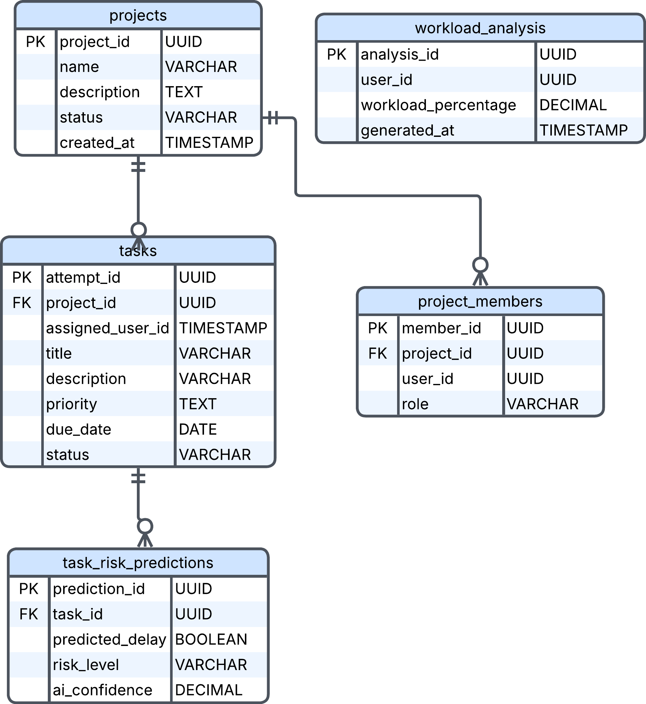

### 5.3.	Bounded Context:  Visualización y Seguimiento

El bounded context de Visualización y Seguimiento es responsable de consolidar, analizar y representar información relacionada con el estado operativo de proyectos, tareas y desempeño de equipos dentro de la plataforma TaskMaster. Su propósito principal es proporcionar visibilidad en tiempo real sobre el progreso de las actividades, facilitando la toma de decisiones estratégicas y operativas.

Este bounded context incorpora capacidades basadas en inteligencia artificial orientadas al análisis predictivo, generación de alertas inteligentes e identificación automática de riesgos, permitiendo transformar datos operativos en información útil para líderes y miembros de equipos.

Asimismo, integra automatizaciones basadas en RPA para el envío de reportes, alertas y seguimiento automatizado de incidencias críticas.

---

#### 5.3.1.	Domain Layer.

La Domain Layer modela las entidades, objetos de valor y servicios encargados de representar indicadores, métricas, alertas y análisis relacionados con el seguimiento de proyectos y tareas.

---

### Aggregate Root: Dashboard

**Descripción**
El agregado `Dashboard` representa un panel de visualización que consolida indicadores y métricas de seguimiento asociadas a proyectos y equipos de trabajo.

**Atributos**

| Atributo | Tipo | Descripción |
|---|---|---|
| id | Long | Identificador del dashboard |
| name | String | Nombre del dashboard |
| ownerId | Long | Usuario propietario |
| widgets | List<DashboardWidget> | Componentes visuales |
| createdAt | Date | Fecha de creación |
| updatedAt | Date | Fecha de actualización |

**Métodos principales**

- `addWidget()`
- `removeWidget()`
- `refreshMetrics()`
- `generateSummary()`

---

### Entity: DashboardWidget

**Descripción**
Representa un componente visual utilizado dentro del dashboard.

**Atributos**

| Atributo | Tipo |
|---|---|
| id | Long |
| title | String |
| widgetType | WidgetType |
| dataSource | String |
| position | Integer |

**Métodos principales**

- `updateData()`
- `renderVisualization()`

---

### Entity: RiskIndicator

**Descripción**
Representa un indicador de riesgo calculado automáticamente mediante análisis inteligente.

**Atributos**

| Atributo | Tipo |
|---|---|
| id | Long |
| projectId | Long |
| riskLevel | RiskLevel |
| probability | Double |
| generatedAt | Date |
| description | String |

**Métodos principales**

- `calculateRiskScore()`
- `classifyRiskLevel()`
- `generateRecommendation()`

---

### Entity: SmartAlert

**Descripción**
Representa una alerta inteligente generada automáticamente por análisis predictivos.

**Atributos**

| Atributo | Tipo |
|---|---|
| id | Long |
| type | AlertType |
| severity | AlertSeverity |
| message | String |
| createdAt | Date |
| isResolved | Boolean |


**Métodos principales**

- `markAsResolved()`
- `escalateAlert()`

---

### Value Object: RiskLevel

**Valores**

- LOW
- MEDIUM
- HIGH
- CRITICAL

---

### Value Object: WidgetType

**Valores**

- TASK_PROGRESS
- TEAM_PERFORMANCE
- WORKLOAD_ANALYSIS
- RISK_MONITORING
- PRODUCTIVITY_METRICS

---

### Value Object: AlertSeverity

**Valores**

- INFO
- WARNING
- HIGH
- CRITICAL

---

### Domain Service: RiskAnalysisService

**Descripción**
Servicio encargado de analizar información operativa para identificar riesgos dentro de proyectos y tareas.

**Métodos**

- `analyzeProjectRisk(projectId)`
- `detectOperationalRisks()`
- `calculateRiskProbability()`

**Relación con IA**

Este servicio integra modelos de inteligencia artificial capaces de:

- detectar patrones de retraso
- identificar tareas críticas
- calcular probabilidades de incumplimiento
- generar recomendaciones inteligentes

---

### Domain Service: TeamPerformanceAnalysisService

**Descripción**
Analiza métricas relacionadas con desempeño y productividad de equipos.

**Métodos**

- `analyzeTeamPerformance(teamId)`
- `calculateProductivityMetrics()`
- `identifyPerformanceIssues()`

**Relación con IA**

Permite implementar análisis predictivos relacionados con:

- productividad del equipo
- carga laboral
- tareas atrasadas
- eficiencia operativa

---

### Domain Service: SmartAlertService

**Descripción**
Gestiona la generación automática de alertas inteligentes.

### Métodos

- `generateAlert()`
- `prioritizeAlerts()`
- `escalateCriticalAlerts()`

---

### Repository Interfaces

**DashboardRepository**

Métodos principales:

- `save(Dashboard dashboard)`
- `findById(Long id)`
- `findByOwnerId(Long ownerId)`

**RiskIndicatorRepository**

Métodos principales:

- `save(RiskIndicator riskIndicator)`
- `findByProjectId(Long projectId)`
- `findCriticalRisks()`

**SmartAlertRepository**

Métodos principales:

- `save(SmartAlert alert)`
- `findActiveAlerts()`
- `findBySeverity(AlertSeverity severity)`

#### 5.3.2.	Interface Layer.

La Interface Layer expone dashboards, métricas y alertas mediante endpoints REST y componentes visuales.

---

### Controller: DashboardController

**Descripción**
Gestiona paneles de seguimiento y visualización.

| Método | Ruta |
|---|---|
| createDashboard | POST /dashboards |
| getDashboard | GET /dashboards/{id} |
| refreshDashboard | PUT /dashboards/{id}/refresh |

---

### Controller: RiskMonitoringController

**Descripción**
Gestiona indicadores de riesgo.

| Método | Ruta |
|---|---|
| getProjectRisks | GET /risks/project/{id} |
| getCriticalRisks | GET /risks/critical |

---

### Controller: SmartAlertsController

**Descripción**
Gestiona alertas inteligentes.

| Método | Ruta |
|---|---|
| getAlerts | GET /alerts |
| resolveAlert | PUT /alerts/{id}/resolve |

---

### Assemblers y Resources

**Resources principales**

- DashboardResource
- RiskIndicatorResource
- SmartAlertResource
- TeamPerformanceResource

**Assemblers principales**

- DashboardResourceAssembler
- RiskResourceAssembler
- AlertResourceAssembler

---

#### 5.3.3.	Application Layer.

La Application Layer coordina los flujos relacionados con métricas, análisis predictivo y seguimiento inteligente.

---

### Command Handlers

**CreateDashboardCommandHandler**

Responsabilidades:

- Crear dashboards personalizados.
- Configurar widgets iniciales.

**RefreshDashboardCommandHandler**

Responsabilidades:

- Actualizar métricas.
- Obtener información en tiempo real.
- Ejecutar análisis predictivos.

**ResolveAlertCommandHandler**

Responsabilidades:

- Resolver alertas.
- Registrar historial de incidencias.

---

### Query Handlers

- GetDashboardQueryHandler
- GetProjectRisksQueryHandler
- GetCriticalAlertsQueryHandler
- GetPerformanceMetricsQueryHandler

---

### Domain Events

**DashboardUpdatedEvent**

Evento generado al actualizar métricas del dashboard.

**RiskDetectedEvent**

Evento generado cuando se identifica un riesgo operativo.

**CriticalAlertGeneratedEvent**

Evento generado cuando una alerta crítica es detectada.

**TeamPerformanceAnalyzedEvent**

Evento generado tras analizar productividad del equipo.

---

**Integración con Inteligencia Artificial**

La Application Layer integra servicios de IA orientados a:

- análisis predictivo
- identificación de riesgos
- evaluación de desempeño
- generación de recomendaciones inteligentes
- detección automática de tareas críticas

---

**Integración con RPA**

Se implementan automatizaciones para:

- envío automático de reportes
- alertas inteligentes automatizadas
- escalamiento automático de incidencias
- seguimiento automatizado de riesgos críticos

---

**Servicios de soporte**

- MetricsAggregationService
- ReportGenerationService
- VisualizationService
- AlertNotificationService

---

#### 5.3.4.	Infrastructure Layer.

La Infrastructure Layer implementa mecanismos de persistencia, integración externa y conexión con servicios analíticos inteligentes.

---

### Repository Implementations

**JpaDashboardRepository**

Implementación de persistencia para dashboards.

**JpaRiskIndicatorRepository**

Implementación de persistencia para indicadores de riesgo.

**JpaSmartAlertRepository**

Implementación de persistencia para alertas inteligentes.

---

### Servicios técnicos

**DashboardMetricsService**

Gestiona consolidación y cálculo de métricas.

**DataVisualizationService**

Genera representaciones visuales y gráficas.

**AIAnalyticsEngineService**

Servicio encargado de consumir modelos de inteligencia artificial.

**Funcionalidades principales**

- análisis predictivo
- detección de riesgos
- evaluación de productividad
- identificación de anomalías
- generación de recomendaciones inteligentes

---

### Integraciones externas

**EmailService (Mailgun)**

Responsable del envío de:

- alertas críticas
- reportes automáticos
- notificaciones inteligentes

**ReportAutomationService**

Servicio orientado a automatización de reportes mediante RPA.

**Automatizaciones principales**

- generación automática de reportes
- envío programado de métricas
- alertas automáticas de riesgo
- escalamiento de incidencias críticas

**NotificationAutomationService**

Automatiza procesos relacionados con:

- seguimiento de alertas
- envío de recordatorios
- monitoreo automático de riesgos

---

### Preparación para tecnologías emergentes

Este bounded context ha sido diseñado específicamente para integrar tecnologías emergentes enfocadas en analítica avanzada y automatización inteligente.

**Inteligencia Artificial**

- análisis predictivo
- indicadores inteligentes de riesgo
- alertas automáticas
- análisis de desempeño
- identificación de anomalías operativas

**Robotic Process Automation (RPA)**

- automatización de reportes
- seguimiento automático de incidencias
- envío inteligente de notificaciones
- monitoreo automatizado de riesgos

---

#### 5.3.6.	Bounded Context Software Architecture Component Level Diagrams.

El siguiente Component Diagram muestra los componentes internos del bounded context de Visualización y Seguimiento, incluyendo módulos de dashboards, monitoreo de riesgos, alertas inteligentes y servicios de análisis predictivo basados en AI.

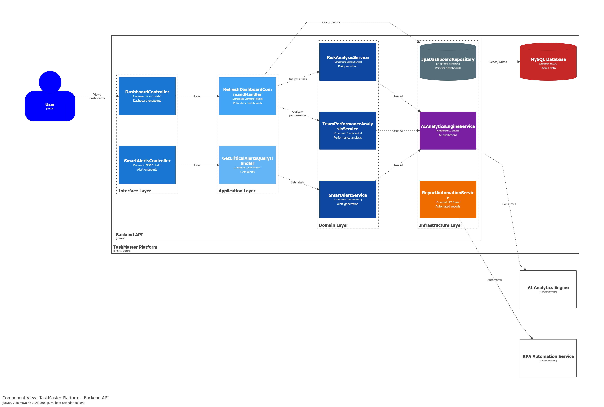

#### 5.3.7.	Bounded Context Software Architecture Code Level Diagrams.
##### 5.3.7.1.	Bounded Context Domain Layer Class Diagrams.

El siguiente diagrama de clases UML presenta las entidades y servicios de dominio responsables de la generación de dashboards, indicadores de riesgo, alertas inteligentes y análisis de desempeño dentro del bounded context de Visualización y Seguimiento.

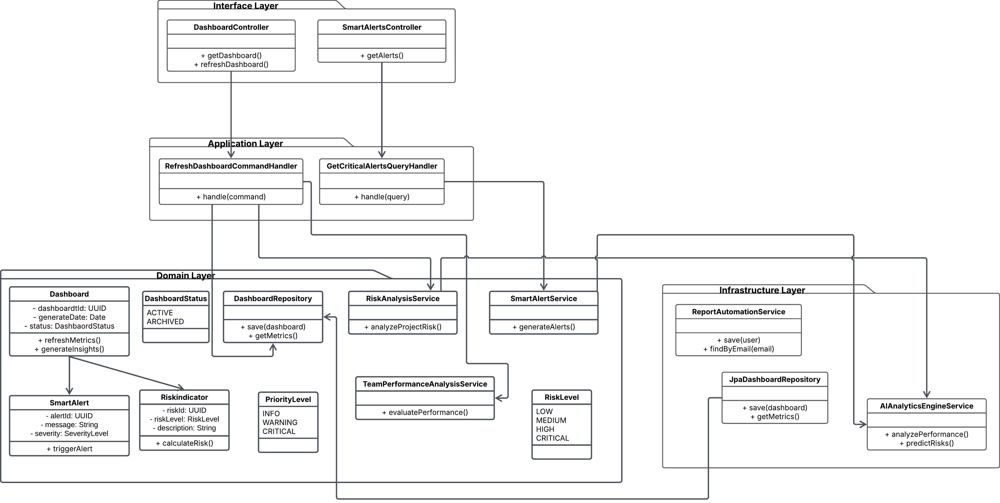

##### 5.3.7.2.	Bounded Context Database Design Diagram.

El siguiente Database Diagram representa las entidades persistentes relacionadas con dashboards, indicadores de riesgo, métricas de rendimiento, alertas inteligentes y reportes automatizados generados dentro del bounded context de Visualización y Seguimiento.

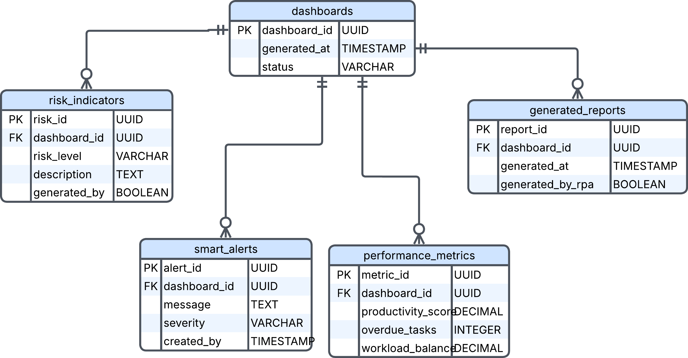

---


### 5.4.	Bounded Context:  Notificaciones

Este bounded context se encarga de crear, almacenar, consultar y eliminar notificaciones dentro de la plataforma. En el avance actual, ya no se presenta solo como un módulo de avisos, sino como un componente formal de comunicación reactiva entre eventos del sistema y el usuario autenticado. Su objetivo es mantener informado al usuario sobre acciones relevantes como asignaciones de tareas, cambios de estado, recordatorios o eventos internos generados por otros módulos.


#### 5.4.1.	Domain Layer.

La Domain Layer concentra las reglas de negocio relacionadas con la gestión de notificaciones. En este contexto, la entidad principal es `Notification`, la cual representa un mensaje asociado a un usuario, con información como identificador, contenido, estado de lectura y marca de tiempo. También se maneja la clasificación de notificaciones mediante `NotificationType` y estados como `READ` y `UNREAD`, permitiendo distinguir el tipo de evento y su situación dentro del flujo del usuario.

El dominio define que una notificación debe estar asociada a un usuario válido, contener un mensaje significativo y conservar trazabilidad temporal. Además, admite la generación de notificaciones a partir de eventos del sistema, manteniendo el comportamiento independiente de la interfaz y de la persistencia.


#### 5.4.2.	Interface Layer.

La Interface Layer expone los endpoints REST que permiten interactuar con el bounded context desde el frontend o desde servicios internos. En el trabajo actual, el controlador principal es `NotificationController`, construido bajo una estructura limpia y documentado con Swagger 3.0.


| Endpoint | Descripción | Método |
|---|---|---|
| `/api/v1/notifications/me` | Obtiene las notificaciones del usuario autenticado. | GET |
| `/api/v1/notifications` | Crea una nueva notificación dentro del sistema. | POST |

Esta capa recibe las solicitudes, valida los datos de entrada y los transforma en comandos o consultas para delegarlos a la capa de aplicación. No contiene lógica de negocio, solo coordinación de entrada y salida.


#### 5.4.3.	Application Layer.


La Application Layer orquesta los casos de uso del bounded context. Aquí se encuentran los servicios de comando y consulta que gestionan la creación y recuperación de notificaciones.

Los principales componentes son:

- `NotificationCommandService`
- `NotificationQueryService`
- `CreateNotificationCommandFromResourceAssembler`
- `NotificationResourceFromEntityAssembler`

Además, el módulo reacciona a eventos internos del sistema, como asignaciones de tareas o cambios de estado, para generar notificaciones automáticas.


#### 5.4.4.	Infrastructure Layer.


La Infrastructure Layer implementa la persistencia y las integraciones externas necesarias para que el contexto funcione. Aquí se concretan los repositorios que almacenan y recuperan notificaciones, además de adaptadores para comunicación con servicios externos de mensajería o envío, como correo o push, cuando aplique.

Sus responsabilidades principales son:

- guardar notificaciones nuevas;
- consultar notificaciones por usuario;
- recuperar una notificación específica;
- eliminar notificaciones;
- adaptar el envío hacia servicios externos.


#### 5.4.6.	Bounded Context Software Architecture Component Level Diagrams.

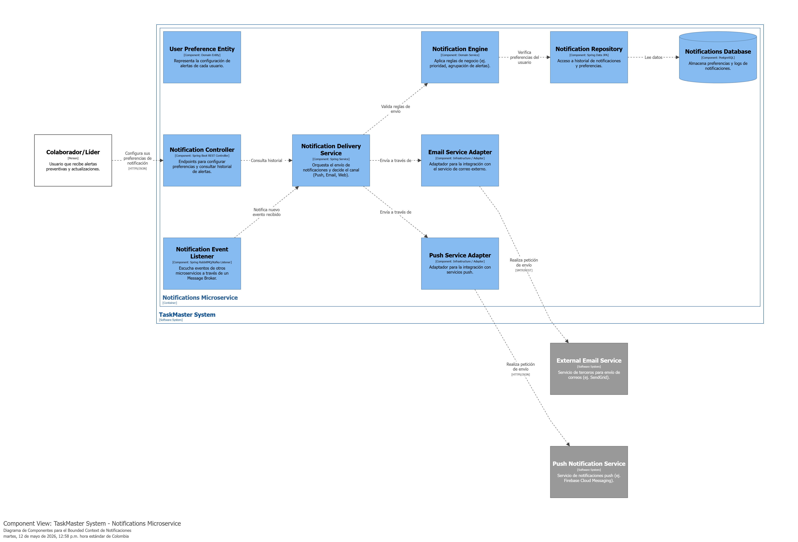

#### 5.4.7.	Bounded Context Software Architecture Code Level Diagrams.

Este nivel muestra cómo se materializa el bounded context en clases, entidades y estructuras de datos. La intención es evidenciar la separación entre dominio, aplicación e infraestructura, manteniendo bajo acoplamiento y alta cohesión.


##### 5.4.7.1.	Bounded Context Domain Layer Class Diagrams.


##### 5.4.7.2.	Bounded Context Database Design Diagram.


---


### 5.5.	Bounded Context:  Analítica y Reportes

Este bounded context está orientado al procesamiento de información operativa para convertirla en métricas útiles para la toma de decisiones. El módulo ya no se limita a “mostrar reportes”, sino que genera indicadores de proyecto y de miembro, calcula rankings, administra presupuesto y calcula tarifas por hora. Eso lo vuelve más robusto y más cercano a una solución analítica real dentro del sistema.


#### 5.5.1.	Domain Layer.


La Domain Layer concentra las reglas que permiten construir métricas confiables a partir de proyectos, tareas y miembros. Los agregados principales son:

- `ProjectAnalytics`
- `MemberAnalytics`

Estos agregados trabajan con objetos de valor como:

- `DateRange`
- `TaskStats`
- `AverageMetric`
- `BudgetUsage`

Además, el contexto maneja datos como `bestMemberId`, `worstMemberId` y `rankingReason`, que permiten resumir el desempeño del equipo de forma interpretables por el usuario.

La lógica de dominio se encarga de calcular conteos, promedios, horas invertidas, costo estimado, presupuesto usado y velocidad de trabajo, separando claramente el cálculo de negocio de la persistencia.


#### 5.5.2.	Interface Layer.


La Interface Layer expone los endpoints HTTP que permiten generar y consultar métricas vivas, tanto a nivel de proyecto como de miembro.

| Método | Ruta | Descripción |
|---|---|---|
| POST | `/api/v1/projects/{projectId}/analytics/generate` | Genera o actualiza las métricas del proyecto. |
| GET | `/api/v1/projects/{projectId}/analytics` | Obtiene las métricas actuales del proyecto. |
| POST | `/api/v1/projects/{projectId}/ranking/recalculate` | Recalcula el ranking del proyecto. |
| GET | `/api/v1/projects/{projectId}/ranking` | Obtiene el ranking actual. |
| PATCH | `/api/v1/projects/{projectId}/budget` | Actualiza el presupuesto del proyecto. |
| POST | `/api/v1/projects/{projectId}/members/{memberId}/analytics/generate` | Genera métricas de un miembro. |
| GET | `/api/v1/projects/{projectId}/members/{memberId}/analytics` | Obtiene las métricas de un miembro. |
| PATCH | `/api/v1/projects/{projectId}/members/{memberId}/hourly-rate` | Actualiza la tarifa por hora del miembro. |

Esta capa muestra con claridad el salto del trabajo actual: ahora el contexto analítico ya no es solo descriptivo, sino que permite consultar y recalcular información útil para seguimiento, presupuesto y desempeño.


#### 5.5.3.	Application Layer.


La Application Layer coordina el flujo de casos de uso mediante servicios de comando, consulta y eventos. Sus componentes principales son:

- `ProjectAnalyticsCommandService`
- `MemberAnalyticsCommandService`
- `ProjectAnalyticsQueryService`
- `MemberAnalyticsQueryService`

También utiliza assemblers para convertir recursos HTTP en comandos o DTOs de salida. La lógica de aplicación administra la ejecución de casos como:

- generar métricas de proyecto;
- generar métricas de miembro;
- recalcular ranking;
- actualizar presupuesto aprobado/usado;
- definir tarifa por hora;
- responder consultas de dashboards.

Esta capa funciona como el puente entre la interacción del usuario y el cálculo de negocio, manteniendo la arquitectura desacoplada y coherente con CQRS.


#### 5.5.4.	Infrastructure Layer.


La Infrastructure Layer implementa la persistencia de los agregados analíticos y las operaciones concretas sobre la base de datos. Los repositorios principales son:

- `ProjectAnalyticsRepository`
- `MemberAnalyticsRepository`

Sus funciones incluyen recuperar métricas por proyecto o por miembro, guardar agregados actualizados y sostener la información necesaria para que los dashboards se mantengan consistentes. En esta capa no se calcula la lógica de negocio; solo se materializa y consulta la información procesada por las capas superiores.


#### 5.5.6.	Bounded Context Software Architecture Component Level Diagrams.


#### 5.5.7.	Bounded Context Software Architecture Code Level Diagrams.

Refleja cómo se implementan los agregados analíticos, los servicios de aplicación y la persistencia de métricas. Se muestra la separación entre la lógica de cálculo y el acceso a datos.


##### 5.5.7.1.	Bounded Context Domain Layer Class Diagrams.


##### 5.5.7.2.	Bounded Context Database Design Diagram.


---


## Capítulo VI: Solution UX Design
### 6.1 Product design  

El diseño del producto de WorkHub se basa en un enfoque centrado en el usuario, priorizando la claridad visual, la accesibilidad y la eficiencia en la gestión colaborativa de proyectos. La interfaz busca ofrecer una experiencia intuitiva donde cada elemento, desde la navegación hasta la disposición de las tareas, responda a las necesidades reales de los equipos de trabajo. Este enfoque permite equilibrar estética y funcionalidad, garantizando una interacción fluida y coherente con los principios del diseño de experiencias digitales (Nielsen Norman Group, 2023).

### 6.1. Style Guidelines  

El diseño de estilo de WorkHub se fundamenta en la coherencia visual y la identidad de marca, garantizando una experiencia estética uniforme en todos los componentes de la interfaz. Se aplicó una paleta cromática equilibrada que combina tonos neutros con acentos contrastantes para resaltar acciones clave, junto con una tipografía moderna y legible que refuerza la claridad comunicativa. Asimismo, se definieron márgenes, espaciados y jerarquías visuales consistentes para mantener armonía entre las vistas de proyectos, tareas y estadísticas. Estas guías de estilo buscan no solo reforzar la identidad visual de la plataforma, sino también mejorar la usabilidad y la comprensión del contenido por parte del usuario (Interaction Design Foundation, 2022).

#### 6.1.1. General Style Guidelines  

**Branding**

La identidad de TaskMaster refleja organización, colaboración y eficiencia. Su diseño combina colores cálidos y suaves que transmiten equilibrio y dinamismo, mientras que el logotipo y la interfaz proyectan una estética moderna y accesible. El branding busca conectar con jóvenes profesionales y estudiantes que valoran la simplicidad y la claridad en la gestión de proyectos.


**Color:**

Para WorkHub, una plataforma de gestión colaborativa de proyectos y tareas, la paleta de colores busca reflejar claridad, accesibilidad y profesionalismo. Los tonos principales transmiten confianza y simplicidad, mientras que los secundarios se aplican en fondos, estados y tipografía para mantener equilibrio visual y una experiencia coherente.

- Colores Primarios:
  
La paleta de colores primarios de TaskMaster representa la esencia visual de la aplicación. Combina tonos cálidos y profundos como el RedWine600 y el Coral300, que transmiten energía, compromiso y dinamismo, con matices suaves como Blush100, que equilibran la intensidad visual y aportan armonía. Estos colores se utilizan principalmente en elementos de acción, encabezados y fondos clave, reforzando la identidad de marca y asegurando una interfaz coherente y atractiva.


| Nombre | Hex | Descripción |
|---------|------|--------------|
| Brownish900 | #332A2A | Fondo oscuro y texto principal en modo oscuro. |
| Brownish800 | #452B2B | Fondo alternativo o contenedores secundarios en modo oscuro. |
| AlertRed | #D90404 | Color de alerta o error para mensajes importantes o botones críticos. |
| Blush100 | #F2D0D3 | Fondo claro o elementos de contraste suave en interfaces limpias. |
| Coral300 | #F27979 | Color de acento cálido para destacar botones o indicadores secundarios. |
| RedWine600 | #A62424 | Color principal de marca, utilizado en headers, íconos y botones primarios. |
| RedWine500 | #733030 | Variante más oscura para hover states o sombreados de elementos activos. |

- Colores Secundarios:

Los colores secundarios complementan la identidad principal de TaskMaster, proporcionando versatilidad y contraste en la interfaz. Incluyen tonos neutros como Black, White y LightGray, que aportan claridad y estructura, junto con acentos vibrantes como BrightRed, VividGreen, SunYellow y los tonos Lavender, que añaden dinamismo y ayudan a resaltar estados o categorías dentro de la aplicación.


| Nombre          | Hex     | Descripción                                                                  |
| --------------- | ------- | ---------------------------------------------------------------------------- |
| **Black**       | #000000 | Usado para texto principal, íconos o elementos que requieren alto contraste. |
| **White**       | #FFFFFF | Fondo base para mantener limpieza y legibilidad en la interfaz.              |
| **LightGray**   | #EFEFEF | Fondo neutro o separador visual entre secciones y tarjetas.                  |
| **BrightRed**   | #FF0000 | Indicador de error, advertencia o acciones críticas.                         |
| **VividGreen**  | #00FF09 | Representa éxito, confirmaciones o tareas completadas.                       |
| **SunYellow**   | #FFD900 | Utilizado para advertencias suaves o resaltado de información importante.    |
| **Lavender600** | #A06FC3 | Color de acento decorativo en componentes secundarios.                       |
| **Lavender500** | #AC89C4 | Variante más clara del acento, aplicada en fondos o detalles visuales.       |


**Typography**

La tipografía de TaskMaster refuerza su enfoque en la claridad y la modernidad. Se emplea Sulphur Point para títulos y encabezados, transmitiendo fuerza y presencia visual, mientras que MS Reference Sans Serif se utiliza para textos descriptivos y funcionales, garantizando legibilidad en cualquier tamaño o dispositivo. La jerarquía tipográfica está cuidadosamente definida para guiar la atención del usuario y mantener una experiencia visual equilibrada.


#### 6.1.2. Web, Mobile & Devices Style Guidelines.

Para la interfaz móvil (Android e iOS) y web de TaskMaster se adopta un estilo de diseño minimalista, limpio y profesional, orientado a optimizar la claridad y la eficiencia en la interacción; considerando nuestros segmentos objetivo, se prioriza una estructura visual ordenada con una jerarquía bien definida, el uso de tipografía moderna y legible, y componentes correctamente alineados que faciliten una navegación intuitiva, buscando así reducir la carga cognitiva del usuario, permitir una rápida comprensión del estado de los proyectos y transmitir confianza, seriedad y profesionalismo en entornos empresariales.

Los principios clave de diseño incluyen:

- Uso predominante de **Sulphur Point** para títulos y encabezados, aportando fuerza y presencia visual. 
- Para textos descriptivos, funcionales y de lectura prolongada, se emplea **MS Reference Sans Serif**, garantizando una legibilidad óptima en cualquier dispositivo.
- Diseño centrado en la eficiencia con espaciado generoso, alineaciones consistentes y márgenes equilibrados para guiar la atención del usuario sin distracciones.
- Uso de íconos lineales que representan con claridad las funciones de productividad de la plataforma.
- Aplicación estratégica de la paleta de colores.

**iOS Mobile Style Guidelines**

Para los dispositivos iOS, se implementarán las directrices de Apple Human Interface Guidelines, integrando la identidad visual específica de TaskMaster:

- **Tipografía**: Se utiliza Sulphur Point para otorgar fuerza a los encabezados y títulos, mientras que MS Reference Sans Serif se emplea en el cuerpo de texto para asegurar una legibilidad superior.

- **Escala Tipográfica Sugerida:**

  - Título: 26 pt

  - Subtítulo: 18 pt

  - Cuerpo: 16 pt

- **Esquema Cromático:**

  - Acciones Principales: Botones con fondo RedWine 600 (#A62424) y texto en contraste claro.

  - Interfaz Base: Fondo general en blanco para una apariencia limpia.

  - Contenido Textual: Brownish 900 (#332A2A) para máxima claridad.

- **Interacción Táctil:** Los elementos interactivos mantendrán un área de contacto mínima de 66x66 pt.

- **Suavizado de Bordes:** Radio de 8–10 pt en tarjetas, contenedores y botones para una estética moderna.

- **Estructura de Navegación:** Implementación de una organización jerarquica, secuencial y matricial.

**Android Mobile Style Guidelines**

En la plataforma Android, se adoptarán los principios de Material Design, personalizados para el ecosistema visual de TaskMaster:

**Tipografía:** Sulphur Point para elementos de impacto visual (encabezados) y MS Reference Sans Serif para descripciones y textos funcionales.

- Escala de Fuente Recomendada:

  - Título: 22–26 sp

  - Subtítulo: 16–18 sp

  - Cuerpo: 16 sp

- **Esquema Cromático:**

  - Elementos Primarios: Uso de RedWine 600 (#A62424) con texto en blanco.

  - Acentos: Coral 300 (#F27979) para destacar indicadores secundarios o botones de menor jerarquía.

  - Superficie: Fondo general en blanco para una apariencia limpia.

  - Contenido Textual: Brownish 900 (#332A2A) para máxima claridad.

  - Ergonomía Digital: Espaciado táctil garantizado de al menos 66x66 dp por cada componente accionable.

- **Elevación y Relieve:** Uso de sombras suaves para distinguir botones flotantes (FAB) y tarjetas de información.

- **Navegación y Dinamismo:** Implementación de una organización jerarquica, secuencial y matricial.

### 6.2. Information Architecture  

La Arquitectura de la Información de TaskMaster se basa en una estructura jerárquica y organizada que permite al usuario acceder de manera intuitiva a las diferentes funciones del sistema. Como señalan Morville y Rosenfeld (2006), una buena arquitectura de la información “proporciona estructura, significado y contexto a los datos, facilitando su comprensión y uso eficiente”. En concordancia con este enfoque, TaskMaster organiza su contenido en secciones principales como proyectos, tareas, estadísticas y notificaciones, promoviendo una experiencia de navegación coherente, accesible y centrada en el usuario.

#### 6.2.1. Organization Systems  

En TaskMaster, se emplean diferentes sistemas de organización del contenido para garantizar una experiencia de uso clara, estructurada y enfocada en la productividad.

Organización Jerárquica: En la pantalla principal y en el panel de proyectos, se prioriza la información esencial, mostrando primero los proyectos activos, las tareas pendientes y los avances recientes. Esta jerarquía visual permite que los usuarios comprendan rápidamente el estado general de su trabajo y luego profundicen en detalles específicos de cada proyecto o tarea.

Organización Secuencial: Aplicada en los flujos de registro, creación de proyectos y asignación de tareas, donde el usuario avanza paso a paso siguiendo un orden lógico. Este enfoque facilita el aprendizaje inicial y evita errores durante la configuración o actualización de información.

Organización Matricial: Presente en la sección de tareas y estadísticas, donde el usuario puede filtrar y cruzar información por estado, prioridad, responsable o fecha límite. Esto permite visualizar los datos desde distintos enfoques, adaptándose a las necesidades de planificación y seguimiento de cada equipo.

En cuanto a los tipos de clasificación empleados:

Por proyecto: Todas las tareas, recursos y miembros se agrupan dentro de su respectivo proyecto, promoviendo la organización y el trabajo en equipo.

Por prioridad: Las tareas se categorizan según su nivel de urgencia o importancia, facilitando la gestión del tiempo y la toma de decisiones.

Cronológica: Las actividades y notificaciones se ordenan por fecha, lo que permite un control eficiente del progreso y las próximas entregas.


#### 6.2.2. Labelling Systems  

En TaskMaster, se implementó un sistema de etiquetas simple, directo y coherente con las funciones principales de la aplicación. El objetivo fue que los usuarios identifiquen rápidamente cada sección sin necesidad de aprendizaje previo, utilizando palabras cortas, comunes y de uso cotidiano.

Las etiquetas definidas son:

- Proyectos

- Calendario

- Notificaciones

- Tareas

- Perfil

- Membresías

Cada etiqueta fue seleccionada para reflejar de manera inmediata la acción o información que el usuario encontrará. Por ejemplo, en “Proyectos”, el usuario puede visualizar y gestionar todos sus proyectos activos; en “Calendario”, consultar plazos y entregas; mientras que “Notificaciones” concentra avisos sobre actualizaciones o colaboraciones recientes. Asimismo, se evitó el uso de tecnicismos o nombres abstractos, priorizando la claridad, consistencia y familiaridad con el lenguaje cotidiano del público objetivo.

#### 6.2.3. Searching Systems  

Las funciones de búsqueda en TaskMaster se han diseñado para que los usuarios puedan encontrar rápidamente información relevante sin sentirse abrumados por la cantidad de datos disponibles. El objetivo es ofrecer una navegación eficiente, precisa y centrada en la productividad dentro de la aplicación. A continuación, se detallan las principales opciones de búsqueda y los filtros implementados, así como la forma en que se muestran los resultados.

Barra de búsqueda global:
En la pantalla principal de la aplicación se implementa una barra de búsqueda que permite localizar proyectos, tareas o notificaciones específicas. Esta barra se encuentra en la parte superior, accesible en todo momento, y utiliza sugerencias automáticas para agilizar la búsqueda.

Búsqueda de notificaciones:
En el módulo de Notificaciones, los usuarios pueden ingresar palabras clave para filtrar avisos relacionados con actualizaciones de tareas, cambios de estado o nuevas asignaciones. Los resultados se muestran de manera cronológica, priorizando las notificaciones más recientes y relevantes.

Búsqueda de tareas:
En la sección de Tareas, los usuarios pueden buscar tareas por nombre, estado o prioridad. Además, es posible filtrar por fecha límite o miembro asignado. Al seleccionar una tarea, se despliega una vista detallada con la descripción, progreso y responsable, permitiendo acceder a toda la información sin salir del módulo principal.

Búsqueda de proyectos:
En el módulo de Proyectos, se permite localizar proyectos activos o archivados ingresando su nombre o identificador. Los resultados muestran el nombre del proyecto, presupuesto, fechas de inicio y fin, y estado actual. Esta funcionalidad ayuda a los usuarios a acceder de manera inmediata al proyecto que desean gestionar.

Búsqueda de proyectos con tareas asignadas:
TaskMaster incluye un filtro combinado que permite visualizar proyectos que contienen tareas activas asignadas a un usuario específico. Esto facilita el seguimiento del trabajo individual y grupal, permitiendo a los líderes de proyecto identificar rápidamente qué miembros tienen responsabilidades en curso y en qué proyectos están involucrados.

#### 6.2.4. SEO Tags and Meta Tags  

Esta sección define cómo se implementarán las etiquetas de optimización para motores de búsqueda en el sitio web y cómo se optimizará la presencia de TaskMaster en la Play Store. El objetivo es mejorar la visibilidad de la plataforma, atraer tráfico orgánico y asegurar que tanto los usuarios como los motores de búsqueda comprendan de inmediato el propósito de la aplicación.

Para Landing Page Web:

- Title: TaskMaster - Gestiona tus proyectos de manera colaborativa y eficiente

- Meta Description: Plataforma colaborativa para planificar, asignar y controlar tareas en equipo. Gestiona proyectos, establece prioridades y visualiza el progreso en tiempo real con TaskMaster.

- Meta Keywords: gestión de proyectos, tareas colaborativas, productividad, trabajo en equipo, organización digital, app de gestión, seguimiento de tareas

- Meta Author: WorkHub - TaskMaster Team

Para Mobile App (Play Store):

- App Title: TaskMaster: Gestión de Proyectos y Tareas

- App Keywords: proyectos, tareas, colaboración, productividad, organización, planificación, trabajo en equipo, gestión ágil

- App Subtitle: Organiza, planifica y colabora con tu equipo desde una sola aplicación.

- App Description: TaskMaster es una aplicación diseñada para optimizar la gestión de proyectos y tareas en equipos de trabajo. Permite asignar responsabilidades, definir fechas límite, establecer prioridades y monitorear el progreso en tiempo real. Con una interfaz moderna y accesible, TaskMaster impulsa la productividad, mejora la comunicación y ayuda a mantener el control total de cada proyecto, desde la planificación hasta la ejecución. Ideal para estudiantes, profesionales y equipos que buscan trabajar de forma organizada y eficiente.

#### 6.2.5. Navigation Systems  
La estructura de navegación de TaskMaster ha sido diseñada para ofrecer una experiencia de usuario intuitiva, fluida y coherente entre la versión web y la aplicación móvil. Su objetivo es facilitar el acceso a la información, garantizar una interacción eficiente y mantener una organización visual clara que optimice la productividad del usuario.

Landing Page (Web):

La barra de navegación principal, ubicada en la parte superior de la página, permite a los usuarios desplazarse rápidamente por las secciones informativas del sitio. Las secciones disponibles son:

Características: Presenta las principales funcionalidades de la plataforma y sus ventajas competitivas.

Beneficios: Explica cómo TaskMaster mejora la gestión de proyectos y la colaboración en equipo.

Nosotros: Muestra la historia, misión y valores del equipo desarrollador de WorkHub.

FAQ: Contiene preguntas frecuentes que resuelven dudas comunes sobre el uso de la plataforma.

Contáctanos: Proporciona formularios y datos de contacto para soporte y consultas directas.

Aplicación Móvil:

En la versión móvil, la navegación se organiza mediante una barra inferior fija con iconos intuitivos que representan las secciones más utilizadas por los usuarios. Las opciones principales son:

Proyectos: Permite visualizar, crear y gestionar proyectos activos.

Calendario: Muestra las fechas de inicio, vencimiento y progreso de las tareas programadas.

Tareas: Acceso directo a las tareas personales o asignadas dentro de los proyectos.

Notificaciones: Centraliza los avisos sobre actualizaciones, asignaciones o cambios de estado.

Perfil: Permite al usuario visualizar y editar su información personal, membresía y estadísticas.

### 6.3. Landing Page UI Design  

El wireframe de la Landing Page de TaskMaster representa la estructura base y la distribución visual del sitio web antes de su diseño final. Su propósito es definir la jerarquía de la información, la ubicación de los elementos clave y el flujo de navegación que guiará al usuario desde su primera interacción. Este esquema permite visualizar de forma clara cómo se organizan las secciones principales como Características, Beneficios, Nosotros, FAQ y Contáctanos, garantizando una experiencia coherente, intuitiva y alineada con los objetivos de comunicación y promoción de la plataforma.

#### 6.3.1. Landing Page Wireframe  

En esta sección se presenta la estructura base de la página principal del proyecto, mostrando la disposición inicial de los elementos visuales y la jerarquía de contenido. El wireframe permite definir la arquitectura de información antes de aplicar estilos gráficos o componentes interactivos.

  
  
  

  
  
  

#### 6.3.2. Landing Page Mock-up  

El mock-up de la Landing Page muestra la propuesta visual final, incorporando colores, tipografía y estilo gráfico definidos en la guía de diseño. Este prototipo de alta fidelidad permite visualizar la apariencia y coherencia estética del sitio web antes de su desarrollo.

  
  
  
  
  
  
  

### 6.4.	Applications UX/UI Design

Esta sección detalla el proceso de diseño de la experiencia (UX) y la interfaz de usuario (UI) de la aplicación móvil y web, enfocado en ofrecer una navegación intuitiva, coherente y funcional. Se abordan los lineamientos visuales, interacción y usabilidad general del sistema.

#### 6.4.1.	Applications Wireframes

**Web Applications Wireframes**  

Los wireframes de la aplicación web muestran la distribución estructural de los módulos, componentes y funcionalidades principales del sistema en un entorno de escritorio. El diseño propuesto aplica principios de arquitectura de información, consistencia visual y diseño centrado en el usuario, facilitando la navegación y comprensión de las distintas secciones de la plataforma. Además, se consideran elementos de diseño inclusivo y organización funcional para optimizar la experiencia de usuario y la interacción con el sistema.


**Mobile Applications Wireframes**

Los wireframes de la aplicación móvil presentan la estructura visual y funcional de las principales pantallas orientadas a la gestión de proyectos y tareas desde dispositivos móviles. En esta propuesta se consideran principios de usabilidad, jerarquía visual, accesibilidad y navegación intuitiva, permitiendo que los usuarios puedan interactuar de manera eficiente con las funcionalidades del sistema. Además, se evidencia la organización de la información y los flujos de interacción definidos para mejorar la experiencia de usuario en entornos móviles.


 
 
 
 
 


#### 6.4.2.	Applications Wireflow Diagrams

Esta sección presenta los diagramas de Wireflow de las aplicaciones móvil y web, los cuales representan el flujo de interacción de los usuarios a través de las diferentes pantallas del sistema. Cada Wireflow se desarrolla a partir de un User Goal y su correspondiente Task Flow, permitiendo visualizar la secuencia de acciones, navegación y cambios de estado entre interfaces. Asimismo, los diagramas evidencian la aplicación de principios de usabilidad, arquitectura de información y diseño centrado en el usuario.

**User Goal: Como usuario registrado quiero autenticarme con mis credenciales para acceder a mi cuenta y gestionar mis proyectos.**

El wireflow comienza cuando el usuario se encuentra en la pantalla de inicio de sesión. El flujo principal consiste en ingresar las credenciales (correo electrónico y contraseña) y presionar el botón "Iniciar sesión". El sistema valida la información y, si es correcta, redirige al usuario al dashboard principal de TaskMaster, donde puede comenzar a gestionar sus proyectos. Si las credenciales son inválidas, el sistema muestra un mensaje de error y permanece en la misma pantalla.

**Task Flow**


**Wireflows**


---

**User Goal: Como visitante quiero registrarme en la plataforma proporcionando mis datos básicos para crear una cuenta y acceder a las funcionalidades de TaskMaster.**

El wireflow inicia en la pantalla de inicio de sesión, donde el usuario selecciona la opción "Unirse" o "Registrarse". El sistema lo dirige al formulario de registro, donde debe completar los datos básicos (nombre, correo, contraseña, etc.). Al presionar "Registrarse", el sistema valida la información. Si el registro es exitoso, el sistema crea la cuenta y redirige al usuario al dashboard. Si el correo ya existe, se muestra un mensaje de error y se solicita un correo diferente.

**Task Flow**


**Wireflows**


---

**User Goal: Como usuario registrado quiero modificar mi información de perfil para mantener mis datos actualizados.**

El wireflow comienza en el dashboard principal. El usuario hace clic en la opción "Perfil". Se muestra su información actual. Luego, selecciona "Editar", modifica los campos deseados y hace clic en "Guardar". El sistema valida los cambios y los actualiza en la base de datos, mostrando la información actualizada en la pantalla de perfil.

**Task Flow**


**Wireflows**


---

**User Goal: Como líder de equipo quiero crear un nuevo proyecto para organizar las tareas y asignar responsables de manera estructurada.**

El wireflow inicia en la pantalla principal de "Proyectos". El usuario (Team Leader) hace clic en "Crear nuevo proyecto". Se abre un formulario donde completa los datos requeridos. Al hacer clic en "Crear", el sistema valida los datos. Si la validación es exitosa, el sistema registra el proyecto y lo muestra en la lista de proyectos del líder.

**Task Flow**


**Wireflows**


---

**User Goal: Como líder de equipo quiero modificar los detalles de un proyecto existente para mantener la información actualizada.**

El wireflow comienza en la pantalla de "Proyectos". El usuario selecciona un proyecto y hace clic en "Editar proyecto". Se muestra un formulario con los datos actuales. El usuario modifica la información y hace clic en "Editar". El sistema valida y actualiza los datos, mostrando la información del proyecto actualizada.

**Task Flow**


**Wireflows**


---

**User Goal: Como líder de equipo quiero eliminar un proyecto que ya no es necesario para mantener el espacio de trabajo organizado.**

El flujo inicia en la pantalla de "Proyectos". El usuario hace clic en "Eliminar proyecto" para un proyecto específico. El sistema muestra un diálogo de confirmación para evitar eliminaciones accidentales. Al hacer clic en "Confirmar", el sistema elimina el proyecto de la base de datos y lo remueve de la lista visible en la interfaz del usuario.

**Task Flow**


**Wireflows**


---

**User Goal: Como líder de equipo quiero crear una nueva tarea dentro de un proyecto para distribuir el trabajo.**

Este flujo comienza en la pantalla de "Proyectos". El usuario hace clic en un proyecto específico, accediendo a la "Pantalla de tareas". Luego, hace clic en "Añadir nueva tarea". Completa los datos y hace clic en "Crear". El sistema valida y registra la tarea, mostrándola en la lista de tareas del proyecto.

**Task Flow**


**Wireflows**


---

**User Goal: Como líder de equipo quiero modificar los detalles de una tarea, como su prioridad o fecha límite.**

Este flujo inicia en la pantalla de tareas de un proyecto. El usuario hace clic en "Editar tarea" para una tarea específica. Se muestra un formulario con los datos actuales. El usuario modifica los campos necesarios. Al hacer clic en "Editar", el sistema valida los cambios y los actualiza, mostrando la información de la tarea actualizada en la lista.

**Task Flow**


**Wireflows**


---

**User Goal: Como líder de equipo quiero eliminar una tarea que ya no es relevante para el proyecto.**

El wireflow comienza en la pantalla de tareas de un proyecto. El usuario identifica la tarea y hace clic en "Eliminar tarea". El sistema muestra un diálogo de confirmación para prevenir errores. Al confirmar, el sistema elimina la tarea de la base de datos y actualiza la interfaz, removiendo la tarea de la lista visible.

**Task Flow**


**Wireflows**


---

**User Goal: Como líder de equipo quiero ver métricas de rendimiento y visualizar análisis de un proyecto para identificar riesgos.**

Este comienza en el dashboard principal. El usuario (Team Leader) hace clic en la sección "Analíticas". Luego, debe seleccionar un proyecto específico del cual desea ver el rendimiento. El sistema procesa la solicitud y muestra una pantalla con gráficos y reportes del proyecto seleccionado, incluyendo tareas completadas, retrasadas, porcentaje de avance e indicadores de riesgo.

**Task Flow**


**Wireflows**


---

**User Goal: Como miembro del equipo quiero visualizar un calendario con mis tareas y alertas inteligentes para anticipar entregas.**

Este wireflow inicia en el dashboard principal del usuario (miembro del equipo o líder). El usuario hace clic en la sección "Calendario". El sistema carga todas las tareas asignadas al usuario con sus respectivas fechas límite y las muestra distribuidas en una vista de calendario. Las tareas próximas a vencer o con riesgo de retraso se resaltan visualmente, cumpliendo con el criterio de alertas inteligentes.

**Task Flow**


**Wireflows**


---

**User Goal: Como líder de equipo quiero ver la lista de miembros de un proyecto para gestionar el equipo.**

El wireflow comienza en el dashboard principal. El usuario hace clic en la sección "Equipo". Luego, selecciona un proyecto específico del cual desea ver los miembros. El sistema muestra una pantalla con la lista de todos los usuarios asignados a ese proyecto, junto con su rol y otra información relevante.

**Task Flow**


**Wireflows**


---

**User Goal: Como líder de equipo quiero eliminar un miembro de un proyecto para gestionar la composición del equipo.**

Inicia en la pantalla del equipo, con un proyecto seleccionado. El usuario localiza al miembro y hace clic en "Eliminar miembro". El sistema muestra un diálogo de confirmación. Al confirmar, el sistema elimina la asociación del usuario con el proyecto, removiéndolo de la lista de miembros visible y revocando su acceso a las tareas del proyecto.

**Task Flow**


**Wireflows**


---

**User Goal: Como miembro del equipo quiero unirme a un proyecto existente mediante un código de acceso para colaborar.**

Este wireflow comienza en la pantalla principal de "Proyectos". El usuario tiene la opción de "Ingresar código de proyecto". El usuario introduce el código de acceso único proporcionado por el Team Leader. El sistema valida el código. Si es válido y no ha caducado, la unión es exitosa y el proyecto aparece en la lista de proyectos del usuario.

**Task Flow**


**Wireflows**


---

**User Goal: Como miembro del equipo quiero actualizar el estado de una tarea a completada para reflejar mi progreso.**

Este wireflow comienza en la pantalla de tareas de un proyecto. El usuario localiza una tarea que le ha sido asignada. Al hacer clic en el checkbox correspondiente a esa tarea, el sistema cambia el estado de la tarea de "Pendiente" o "En progreso" a "Completada". Este cambio se refleja inmediatamente en la interfaz de usuario y en las métricas del proyecto para todos los miembros.

**Task Flow**


**Wireflows**


#### 6.4.3.	Applications Mock-ups

**Web Applications Mock-ups**

Los mock-ups de la aplicación web presentan la propuesta visual final de la plataforma, incorporando los componentes gráficos, la paleta de colores, la tipografía, la iconografía y los estilos definidos en el Design System del proyecto. Estas representaciones permiten visualizar con mayor precisión la experiencia de usuario esperada, evidenciando la aplicación de principios de diseño visual, jerarquía de información, consistencia, accesibilidad y diseño inclusivo. Asimismo, reflejan la arquitectura de información establecida para facilitar la navegación y la interacción eficiente de los usuarios dentro de los distintos módulos del sistema.


**Mobile Applications Mock-ups**

Los mock-ups de la aplicación móvil muestran el diseño visual final de las principales pantallas orientadas a la gestión de proyectos y tareas desde dispositivos móviles. En esta propuesta se integran los elementos visuales definidos en el Design System, garantizando consistencia entre las diferentes interfaces del producto digital. Además, se aplican principios de usabilidad, accesibilidad, diseño inclusivo y jerarquía visual para optimizar la experiencia del usuario, permitiendo una navegación intuitiva y una interacción eficiente con las funcionalidades disponibles en entornos móviles.


 

#### 6.4.4.	Applications User Flow Diagrams

Esta sección presenta los User Flow Diagrams de la aplicación web, los cuales representan la interacción completa del usuario utilizando las interfaces visuales finales (mock-ups) desarrolladas para el sistema. Estos diagramas se derivan directamente de los Wireflows previamente definidos, incorporando los mock-ups finales de la aplicación para representar la experiencia visual definitiva del usuario.

Cada User Flow se construye a partir de un User Goal y muestra tanto la ruta principal de éxito (Happy Path) como las posibles rutas alternativas o de error (Unhappy Paths). Asimismo, los diagramas evidencian la aplicación de principios de usabilidad, arquitectura de información, accesibilidad y diseño centrado en el usuario, garantizando una experiencia consistente y alineada con el Design System establecido para la solución.

**User Goal: Como usuario registrado quiero autenticarme con mis credenciales para acceder a mi cuenta y gestionar mis proyectos.**

El User Flow comienza cuando el usuario se encuentra en la pantalla de inicio de sesión. El flujo principal consiste en ingresar las credenciales (correo electrónico y contraseña) y presionar el botón "Iniciar sesión". El sistema valida la información y, si es correcta, redirige al usuario al dashboard principal de TaskMaster, donde puede comenzar a gestionar sus proyectos. Si las credenciales son inválidas, el sistema muestra un mensaje de error y permanece en la misma pantalla.

**Task Flow**


**User Flow**


---

**User Goal: Como visitante quiero registrarme en la plataforma proporcionando mis datos básicos para crear una cuenta y acceder a las funcionalidades de TaskMaster.**

El User Flow inicia en la pantalla de inicio de sesión, donde el usuario selecciona la opción "Unirse" o "Registrarse". El sistema lo dirige al formulario de registro, donde debe completar los datos básicos (nombre, correo, contraseña, etc.). Al presionar "Registrarse", el sistema valida la información. Si el registro es exitoso, el sistema crea la cuenta y redirige al usuario al dashboard. Si el correo ya existe, se muestra un mensaje de error y se solicita un correo diferente.

**Task Flow**


**User Flow**


---

**User Goal: Como usuario registrado quiero modificar mi información de perfil para mantener mis datos actualizados.**

El User Flow comienza en el dashboard principal. El usuario hace clic en la opción "Perfil". Se muestra su información actual. Luego, selecciona "Editar", modifica los campos deseados y hace clic en "Guardar". El sistema valida los cambios y los actualiza en la base de datos, mostrando la información actualizada en la pantalla de perfil.

**Task Flow**


**User Flow**


---

**User Goal: Como líder de equipo quiero crear un nuevo proyecto para organizar las tareas y asignar responsables de manera estructurada.**

El User Flow inicia en la pantalla principal de "Proyectos". El usuario (Team Leader) hace clic en "Crear nuevo proyecto". Se abre un formulario donde completa los datos requeridos. Al hacer clic en "Crear", el sistema valida los datos. Si la validación es exitosa, el sistema registra el proyecto y lo muestra en la lista de proyectos del líder.

**Task Flow**


**User Flow**


---

**User Goal: Como líder de equipo quiero modificar los detalles de un proyecto existente para mantener la información actualizada.**

El User Flow comienza en la pantalla de "Proyectos". El usuario selecciona un proyecto y hace clic en "Editar proyecto". Se muestra un formulario con los datos actuales. El usuario modifica la información y hace clic en "Editar". El sistema valida y actualiza los datos, mostrando la información del proyecto actualizada.

**Task Flow**


**User Flow**


---

**User Goal: Como líder de equipo quiero eliminar un proyecto que ya no es necesario para mantener el espacio de trabajo organizado.**

El flujo inicia en la pantalla de "Proyectos". El usuario hace clic en "Eliminar proyecto" para un proyecto específico. El sistema muestra un diálogo de confirmación para evitar eliminaciones accidentales. Al hacer clic en "Confirmar", el sistema elimina el proyecto de la base de datos y lo remueve de la lista visible en la interfaz del usuario.

**Task Flow**


**User Flow**


---

**User Goal: Como líder de equipo quiero crear una nueva tarea dentro de un proyecto para distribuir el trabajo.**

Este flujo comienza en la pantalla de "Proyectos". El usuario hace clic en un proyecto específico, accediendo a la "Pantalla de tareas". Luego, hace clic en "Añadir nueva tarea". Completa los datos y hace clic en "Crear". El sistema valida y registra la tarea, mostrándola en la lista de tareas del proyecto.

**Task Flow**


**User Flow**


---

**User Goal: Como líder de equipo quiero modificar los detalles de una tarea, como su prioridad o fecha límite.**

Este flujo inicia en la pantalla de tareas de un proyecto. El usuario hace clic en "Editar tarea" para una tarea específica. Se muestra un formulario con los datos actuales. El usuario modifica los campos necesarios. Al hacer clic en "Editar", el sistema valida los cambios y los actualiza, mostrando la información de la tarea actualizada en la lista.

**Task Flow**


**User Flow**


---

**User Goal: Como líder de equipo quiero eliminar una tarea que ya no es relevante para el proyecto.**

El User Flow comienza en la pantalla de tareas de un proyecto. El usuario identifica la tarea y hace clic en "Eliminar tarea". El sistema muestra un diálogo de confirmación para prevenir errores. Al confirmar, el sistema elimina la tarea de la base de datos y actualiza la interfaz, removiendo la tarea de la lista visible.

**Task Flow**


**User Flow**


---

**User Goal: Como líder de equipo quiero ver métricas de rendimiento y visualizar análisis de un proyecto para identificar riesgos.**

Este comienza en el dashboard principal. El usuario (Team Leader) hace clic en la sección "Analíticas". Luego, debe seleccionar un proyecto específico del cual desea ver el rendimiento. El sistema procesa la solicitud y muestra una pantalla con gráficos y reportes del proyecto seleccionado, incluyendo tareas completadas, retrasadas, porcentaje de avance e indicadores de riesgo.

**Task Flow**


**User Flow**


---

**User Goal: Como miembro del equipo quiero visualizar un calendario con mis tareas y alertas inteligentes para anticipar entregas.**

Este User Flow inicia en el dashboard principal del usuario (miembro del equipo o líder). El usuario hace clic en la sección "Calendario". El sistema carga todas las tareas asignadas al usuario con sus respectivas fechas límite y las muestra distribuidas en una vista de calendario. Las tareas próximas a vencer o con riesgo de retraso se resaltan visualmente, cumpliendo con el criterio de alertas inteligentes.

**Task Flow**


**User Flow**


---

**User Goal: Como líder de equipo quiero ver la lista de miembros de un proyecto para gestionar el equipo.**

El User Flow comienza en el dashboard principal. El usuario hace clic en la sección "Equipo". Luego, selecciona un proyecto específico del cual desea ver los miembros. El sistema muestra una pantalla con la lista de todos los usuarios asignados a ese proyecto, junto con su rol y otra información relevante.

**Task Flow**


**User Flow**


---

**User Goal: Como líder de equipo quiero eliminar un miembro de un proyecto para gestionar la composición del equipo.**

Inicia en la pantalla del equipo, con un proyecto seleccionado. El usuario localiza al miembro y hace clic en "Eliminar miembro". El sistema muestra un diálogo de confirmación. Al confirmar, el sistema elimina la asociación del usuario con el proyecto, removiéndolo de la lista de miembros visible y revocando su acceso a las tareas del proyecto.

**Task Flow**


**User Flow**


---

**User Goal: Como miembro del equipo quiero unirme a un proyecto existente mediante un código de acceso para colaborar.**

Este User Flow comienza en la pantalla principal de "Proyectos". El usuario tiene la opción de "Ingresar código de proyecto". El usuario introduce el código de acceso único proporcionado por el Team Leader. El sistema valida el código. Si es válido y no ha caducado, la unión es exitosa y el proyecto aparece en la lista de proyectos del usuario.

**Task Flow**


**User Flow**


---

**User Goal: Como miembro del equipo quiero actualizar el estado de una tarea a completada para reflejar mi progreso.**

Este User Flow comienza en la pantalla de tareas de un proyecto. El usuario localiza una tarea que le ha sido asignada. Al hacer clic en el checkbox correspondiente a esa tarea, el sistema cambia el estado de la tarea de "Pendiente" o "En progreso" a "Completada". Este cambio se refleja inmediatamente en la interfaz de usuario y en las métricas del proyecto para todos los miembros.

**Task Flow**


**User Flow**


### 6.5. Applications Prototyping.

Esta sección presenta los prototipos interactivos desarrollados para las aplicaciones web y móvil de la solución. Los prototipos permiten simular la navegación, las transiciones entre pantallas y las principales interacciones definidas en los User Flow Diagrams, proporcionando una representación cercana al comportamiento esperado del producto final.

Las decisiones de interacción fueron tomadas considerando principios de usabilidad, accesibilidad y diseño centrado en el usuario. Asimismo, se mantuvo coherencia con la arquitectura de información definida previamente, implementando sistemas de navegación intuitivos, consistentes y alineados con las necesidades de cada segmento objetivo. Los prototipos incluyen interacciones orientadas a facilitar la ejecución de tareas frecuentes, reducir la carga cognitiva del usuario y mejorar la experiencia de navegación dentro de la plataforma.

**Web Application Prototyping - Team Leader**

El prototipo de la aplicación web para el segmento objetivo Team Leader permite simular los principales flujos relacionados con la gestión de proyectos, administración de tareas, monitoreo del rendimiento del equipo y visualización de analíticas. Durante la demostración se evidencian los flujos de creación, edición y eliminación de proyectos y tareas, así como la gestión de miembros y el seguimiento del progreso de los proyectos.

**Screenshot del video:**


**Video de demostración:** [https://upcedupe-my.sharepoint.com/:v:/g/personal/u20211g641_upc_edu_pe/IQCr1_-wOG90Rqaijvb2kBE5AU9OV1wCJZSCvFKWNqYGd2g?nav=eyJyZWZlcnJhbEluZm8iOnsicmVmZXJyYWxBcHAiOiJPbmVEcml2ZUZvckJ1c2luZXNzIiwicmVmZXJyYWxBcHBQbGF0Zm9ybSI6IldlYiIsInJlZmVycmFsTW9kZSI6InZpZXciLCJyZWZlcnJhbFZpZXciOiJNeUZpbGVzTGlua0NvcHkifX0&e=UDqDXD](https://upcedupe-my.sharepoint.com/:v:/g/personal/u20211g641_upc_edu_pe/IQCr1_-wOG90Rqaijvb2kBE5AU9OV1wCJZSCvFKWNqYGd2g?nav=eyJyZWZlcnJhbEluZm8iOnsicmVmZXJyYWxBcHAiOiJPbmVEcml2ZUZvckJ1c2luZXNzIiwicmVmZXJyYWxBcHBQbGF0Zm9ybSI6IldlYiIsInJlZmVycmFsTW9kZSI6InZpZXciLCJyZWZlcnJhbFZpZXciOiJNeUZpbGVzTGlua0NvcHkifX0&e=UDqDXD)

---

**Web Application Prototyping - Team Member**

El prototipo de la aplicación web para el segmento objetivo Team Member permite simular las interacciones relacionadas con la participación en proyectos, actualización del estado de tareas, visualización de calendarios y consulta de actividades asignadas. El flujo presentado demuestra cómo un miembro del equipo interactúa con el sistema para gestionar sus responsabilidades y colaborar dentro de los proyectos asignados.

**Screenshot del video:**


**Video de demostración:** [https://upcedupe-my.sharepoint.com/:v:/g/personal/u20211g641_upc_edu_pe/IQD8LCeH4cg-QZZVZpMbuLENAYLtVk0VL2YBSOgZU9IhHdY?nav=eyJyZWZlcnJhbEluZm8iOnsicmVmZXJyYWxBcHAiOiJPbmVEcml2ZUZvckJ1c2luZXNzIiwicmVmZXJyYWxBcHBQbGF0Zm9ybSI6IldlYiIsInJlZmVycmFsTW9kZSI6InZpZXciLCJyZWZlcnJhbFZpZXciOiJNeUZpbGVzTGlua0NvcHkifX0&e=NrjexS](https://upcedupe-my.sharepoint.com/:v:/g/personal/u20211g641_upc_edu_pe/IQD8LCeH4cg-QZZVZpMbuLENAYLtVk0VL2YBSOgZU9IhHdY?nav=eyJyZWZlcnJhbEluZm8iOnsicmVmZXJyYWxBcHAiOiJPbmVEcml2ZUZvckJ1c2luZXNzIiwicmVmZXJyYWxBcHBQbGF0Zm9ybSI6IldlYiIsInJlZmVycmFsTW9kZSI6InZpZXciLCJyZWZlcnJhbFZpZXciOiJNeUZpbGVzTGlua0NvcHkifX0&e=NrjexS)

---

**Mobile Application Prototyping**

El prototipo de la aplicación móvil permite simular las principales funcionalidades del sistema en dispositivos móviles, manteniendo la consistencia visual y funcional con la versión web. Durante la demostración se presentan los flujos de autenticación, gestión de tareas, consulta de proyectos y visualización de información relevante para los usuarios, optimizando la experiencia de uso en entornos móviles.

**Screenshot del video:**


**Video de demostración:** [https://upcedupe-my.sharepoint.com/:v:/g/personal/u20211g641_upc_edu_pe/IQBkJ1-qZkPDQZ2yv8a8iyiYAb0l9v1VuxgcthokC60r8ss?nav=eyJyZWZlcnJhbEluZm8iOnsicmVmZXJyYWxBcHAiOiJPbmVEcml2ZUZvckJ1c2luZXNzIiwicmVmZXJyYWxBcHBQbGF0Zm9ybSI6IldlYiIsInJlZmVycmFsTW9kZSI6InZpZXciLCJyZWZlcnJhbFZpZXciOiJNeUZpbGVzTGlua0NvcHkifX0&e=UClIZJ](https://upcedupe-my.sharepoint.com/:v:/g/personal/u20211g641_upc_edu_pe/IQBkJ1-qZkPDQZ2yv8a8iyiYAb0l9v1VuxgcthokC60r8ss?nav=eyJyZWZlcnJhbEluZm8iOnsicmVmZXJyYWxBcHAiOiJPbmVEcml2ZUZvckJ1c2luZXNzIiwicmVmZXJyYWxBcHBQbGF0Zm9ybSI6IldlYiIsInJlZmVycmFsTW9kZSI6InZpZXciLCJyZWZlcnJhbFZpZXciOiJNeUZpbGVzTGlua0NvcHkifX0&e=UClIZJ)


## Capítulo VII: Product Implementation & Validation  

### 7.1. Software Configuration Management  
#### 7.1.1. Software Development Environment Configuration  
En este apartado se describe la configuración del entorno de desarrollo de Task Master, establecida para garantizar la correcta integración, colaboración y trazabilidad de las actividades realizadas por los miembros del equipo.  
Se definen las herramientas, plataformas y productos de software utilizados a lo largo del ciclo de vida del desarrollo, desde la gestión del proyecto hasta el despliegue y la documentación técnica.

| Plataforma / Herramienta | Descripción | Enlace |
|---------------------------|--------------|---------|
| GitHub | Plataforma de control de versiones basada en Git que permite la colaboración entre desarrolladores, la gestión de ramas, control de cambios y automatización del despliegue continuo (CI/CD). | [https://github.com](https://github.com) |
| Render | Servicio de despliegue automatizado para backend y frontend. Facilita la integración continua, escalado automático y monitoreo del sistema en producción. | [https://render.com](https://render.com) |
| Figma | Herramienta colaborativa de diseño de interfaces, utilizada para la creación de wireframes, mockups y prototipos interactivos de Task Master. Permite trabajo simultáneo entre diseñadores y desarrolladores. | [https://www.figma.com](https://www.figma.com) |
| Mural | Plataforma colaborativa para sesiones de ideación, flujo de usuario (user flow) y mapas de tareas. Ideal para estructurar el diseño de experiencias y estrategias de interacción del usuario. | [https://www.mural.co](https://www.mural.co) |
| Lucidchart | Herramienta para la creación de diagramas UML, diagramas de flujo de tareas y modelos de procesos de Task Master. Facilita la documentación visual y el análisis técnico. | [https://lucidchart.com](https://lucidchart.com) |
| Vertabelo | Plataforma especializada para el modelado y documentación de bases de datos relacionales, utilizada para diseñar la estructura de datos del sistema de gestión de tableros, columnas y tareas. | [https://vertabelo.com](https://vertabelo.com) |
| Structurizr | Herramienta usada para representar la arquitectura C4 de Task Master (Contexto, Contenedor, Componente, Código), mostrando la relación entre los módulos principales (Gestión de Tareas, Tableros, Usuarios, Visualización). | [https://structurizr.com](https://structurizr.com) |
| C4 Model | Modelo conceptual que permite documentar las decisiones arquitectónicas del sistema de manera jerárquica y comprensible para todo el equipo. | [https://c4model.com](https://c4model.com) |
| Postman | Herramienta para pruebas y validación de APIs REST del backend de Task Master. Permite automatizar test cases, analizar respuestas y validar endpoints de integración. | [https://www.postman.com](https://www.postman.com) |
| Trello | Plataforma de gestión de proyectos que facilita la organización de tareas y entregables mediante tableros, listas y tarjetas. Se emplea para la planificación ágil (sprints, backlogs, revisiones). | [https://trello.com](https://trello.com) |
| UXPressia | Utilizada para la creación de User Personas y Customer Journey Maps, ayudando a entender las necesidades, frustraciones y objetivos de los usuarios que gestionan tareas dentro de la app. | [https://uxpressia.com](https://uxpressia.com) |
| Canva | Aplicación complementaria para el diseño visual de materiales gráficos, como banners, íconos e imágenes promocionales de la marca Task Master. | [https://www.canva.com](https://www.canva.com) |
| Firebase (opcional) | Plataforma en la nube utilizada para autenticación de usuarios y almacenamiento en tiempo real en etapas tempranas del desarrollo o pruebas del módulo de notificaciones. | [https://firebase.google.com](https://firebase.google.com) |


#### 7.1.2. Source Code Management 

En esta sección, el equipo de desarrollo de Task Master establece los medios y el esquema de organización aplicados para el seguimiento de modificaciones, utilizando GitHub como plataforma principal de control de versiones.  
De esta manera, se configuró un repositorio remoto en GitHub para almacenar el código fuente, documentar los cambios y colaborar de manera eficiente entre los miembros del equipo durante todo el ciclo de desarrollo.

Se utiliza GitHub como sistema centralizado para el versionado y la colaboración.  
Los repositorios oficiales del proyecto Task Master son los siguientes:

- Landing Page: `https://github.com/G2-Arqui-Emergentes/TaskMaster-LandingPage.git`
- Wep Aplication: `https://github.com/G2-Arqui-Emergentes/Web-Frontend.git`
- Movile Application: `https://github.com/G2-Arqui-Emergentes/Native-Frontend.git`
- Backend Web Services: `https://github.com/G2-Arqui-Emergentes/Backend.git`

Cada repositorio cuenta con flujos de trabajo independientes, integraciones de despliegue automático en Render y acciones de CI/CD configuradas en GitHub Actions.


#### Implementación de GitFlow

Para mantener una estructura organizada y evitar conflictos durante el desarrollo colaborativo, el equipo adopta la estrategia **GitFlow**, con ramas bien definidas para diferentes etapas y propósitos del proyecto.

**Ramas base:**

- **main**: Contiene la versión estable del código desplegada en producción.  
- **develop**: Incluye las últimas actualizaciones y desarrollos en curso que eventualmente serán fusionados a `main`.

**Feature branches:**

Cada nueva funcionalidad o módulo inicia desde `develop`.  
Convención de nombres: `feature/nombre-descriptivo`  
Ejemplo: `feature/task-calendar-sync`

**Release branches:**

Cuando el proyecto alcanza una versión candidata para producción, se crea una rama de liberación desde `develop`.  
Convención: `release/x.y.z` (siguiendo versionado semántico)

**Hotfix branches:**

Si se detecta un error crítico en producción, se crea una rama desde `main` para solucionarlo de inmediato.  


#### Versionado Semántico (Semantic Versioning)

El proyecto Task Master aplica **versionado semántico** (SemVer) siguiendo el formato **MAJOR.MINOR.PATCH**, asegurando coherencia entre las actualizaciones y compatibilidad entre versiones.

| Parte  | Significado |
|--------|--------------|
| MAJOR  | Cambios incompatibles o refactorizaciones críticas que alteran el funcionamiento existente. |
| MINOR  | Nuevas funcionalidades agregadas de forma retrocompatible. |
| PATCH  | Corrección de errores menores sin alterar funcionalidades existentes. |

**Tipos comunes de commits:**

- `feat`: nueva funcionalidad o módulo implementado  
- `fix`: corrección de errores  
- `docs`: cambios en documentación  
- `style`: ajustes de formato o estilo (sin afectar el código)  
- `refactor`: reestructuración de código sin alterar el comportamiento  
- `test`: creación o modificación de pruebas unitarias  
- `chore`: tareas de mantenimiento o actualización de dependencias  


#### 7.1.3. Source Code Style Guide & Conventions  

El equipo ha definido las siguientes convenciones de nombres y estilos de codificación para el proyecto LearnHive, aplicadas en los lenguajes HTML, CSS, JavaScript, TypeScript y Java. Todas las nomenclaturas están en inglés, buscando claridad, estandarización y buenas prácticas de desarrollo. Se han adoptado guías de estilo reconocidas y actualizadas para cada tecnología.

## HTML

- Guía adoptada: [W3C HTML Style Guide](https://www.w3.org/TR/html5/)
- Nomenclatura y convenciones:
  - Minúsculas para etiquetas y atributos: `<div class="container">`
  - Indentación: 2 espacios
  - Atributos entre comillas dobles: ``
  - Uso semántico de etiquetas: `<header>`, `<section>`, `<footer>`
  - Comentarios HTML: `<!-- This is a comment -->`

## CSS

- Guía adoptada: [Google HTML/CSS Style Guide](https://google.github.io/styleguide/htmlcssguide.html)
- Nomenclatura y convenciones:
  - `kebab-case` para clases e IDs  
    Ejemplo: `.main-header`, `#footer-section`
  - Agrupación de estilos por componente
  - Evitar el uso de `!important` salvo en casos necesarios
  - Indentación: 2 espacios

## JavaScript

- Guía adoptada: [Google JavaScript Style Guide](https://google.github.io/styleguide/jsguide.html)
- Nomenclatura y convenciones:
  - `camelCase` para variables y funciones  
    Ejemplo: `let Name = 'Luis';`, `function calculateAverage() {}`
  - `PascalCase` para clases  
    Ejemplo: `class DashboardManager {}`
  - Evitar `snake_case`
  - Usar `const` y `let` en lugar de `var`

## TypeScript

- Guía adoptada: [Google TypeScript Style Guide](https://google.github.io/styleguide/tsguide.html)
- Nomenclatura y convenciones:
  - `camelCase` para variables, funciones y propiedades  
    Ejemplo: `let isActive: boolean = true;`, `function getUserData() {}`
  - `PascalCase` para clases, interfaces, enums y tipos  
    Ejemplo: `class CourseCard {}`, `interface UserProfileDTO {}`, `enum Role { Member,Leader  }`
  - Tipado estricto (`strict: true`) habilitado
  - Interfaces nombradas con sufijo `DTO` o `Props`
  - Uso de modificadores `readonly`, `private`, `public`

## Java

- Guía adoptada: [Google Java Style Guide](https://google.github.io/styleguide/javaguide.html)
- Nomenclatura y convenciones:
  - `PascalCase` para clases  
    Ejemplo: `public class CourseService {}`
  - `camelCase` para variables, métodos y atributos  
    Ejemplo: `int totalCourses;`, `calculateProgress();`
  - Constantes en MAYÚSCULAS con `snake_case`  
    Ejemplo: `public static final int MAX_MEMBERS = 50;`
  - Paquetes en minúsculas separados por punto  
    Ejemplo: `com.taskmaster.backend.controller`

## Gherkin Conventions for Readable Specifications

- Guía adoptada: [Gherkin Syntax and Conventions](https://cucumber.io/docs/gherkin/reference/)
- Nomenclatura y convenciones:
  - Estructura:
    - Given: Define el contexto o estado inicial
    - When: Define la acción o evento que ocurre
    - Then: Define el resultado o expectativa
  - Ejemplo:
    ```gherkin
    Feature: Member dashboard access
      Scenario: Successful login with valid credentials
        Given the Member is on the login page
        When the member enters valid credentials
        Then the member should be redirected to the dashboard
    ```
  - Uso de tablas para datos:
    ```gherkin
    Given the following users exist:
      | username | password |
      | member1 | pass123  |
      | leader1 | pass456  |
    ```

## SQL / Data Modeling (Vertabelo)

- Guía adoptada: [SQL Style Guide](https://www.sqlstyle.guide/)
- Nomenclatura y convenciones:
  - Nombres en inglés, en singular
  - Prefijos según entidad o módulo
  - Palabras reservadas en mayúsculas
  - Relaciones consistentes entre tablas
  - Ejemplo:
    ```sql
    CREATE TABLE Member (
      member_id INT PRIMARY KEY,
      first_name VARCHAR(50),
      last_name VARCHAR(50),
      enrollment_date DATE
    );
    ```

## Kotlin / XML (Aplicativo móvil – Android Studio)

- Guía adoptada: [Android Kotlin Style Guide](https://developer.android.com/kotlin/style-guide)
- Nomenclatura y convenciones:
  - Código limpio, reutilizable y seguro
  - `camelCase` para variables y funciones  
    Ejemplo: `val userName: String = "Eric"`
  - `PascalCase` para clases y componentes de UI  
    Ejemplo: `class DashboardActivity : AppCompatActivity()`
  - XML en `snake_case`  
    Ejemplo: `<TextView android:id="@+id/student_name_text" />`
  - Comentarios claros y concisos


#### 7.1.4. Software Deployment Configuration  

## Despliegue del Frontend (Landing Page)

La landing page de Task Master fue desarrollada utilizando HTML, CSS y JavaScript, enfocándose en un diseño responsivo, limpio y rápido.  
El sitio se publica mediante GitHub Pages, lo que permite una distribución gratuita, confiable y accesible desde cualquier navegador.  
Durante el proceso de preparación para producción, se aplican optimizaciones de carga como la reducción de archivos CSS y JS, la organización modular del código y la compresión de imágenes en formatos .jpg, .png y .svg.  

## Despliegue del Backend (API – Spring Boot)

El backend de Task Master está implementado con Java y el framework Spring Boot, siguiendo principios de arquitectura modular y escalable.  Actualmente, el entorno de despliegue se realiza en la nube en Render.  
Se manejan variables de entorno para gestionar las credenciales y configuraciones sensibles, manteniendo la seguridad y trazabilidad del sistema.  
La API REST está diseñada para gestionar tareas, usuarios y tableros de forma eficiente, garantizando una comunicación estable con el frontend y la aplicación móvil.

## Configuración del Aplicativo Móvil (Android)

La versión móvil de Task Master fue desarrollada en Android Studio, empleando Kotlin para la lógica y XML para el diseño de interfaces.  
En la etapa actual, las pruebas se realizan mediante emuladores locales y dispositivos físicos, asegurando la compatibilidad con diferentes versiones del sistema operativo Android.  
El despliegue se gestiona mediante la generación de archivos .apk y su distribución interna para pruebas cerradas.  
El aplicativo mantiene sincronización con el backend en tiempo real, permitiendo a los usuarios gestionar tareas, recibir actualizaciones y visualizar su progreso desde el móvil.

## Protocolo de Pruebas y Validación

Antes de cada despliegue, se ejecuta un conjunto de pruebas funcionales y de integración que validan la comunicación entre los módulos del sistema.  
También se realizan pruebas de rendimiento, validaciones de interfaz y revisiones de experiencia de usuario para garantizar una interacción fluida y coherente entre las plataformas.  
Finalmente, cada versión se documenta y se etiqueta en el repositorio, siguiendo un control de versiones ordenado que facilita la trazabilidad y el mantenimiento del proyecto.


### 7.2.	Solution Implementation.
#### 7.2.1.	Sprint 1

El Sprint 1 tuvo como objetivo construir el primer incremento funcional de Taskmaster, enfocándose en las capacidades esenciales que permiten presentar la propuesta de valor del producto y habilitar los principales flujos de interacción para los usuarios.

Durante este sprint se priorizó la implementación de componentes base relacionados con la autenticación de usuarios, navegación principal, gestión inicial de proyectos, administración de tareas y despliegue preliminar de los distintos componentes del ecosistema digital.

Asimismo, se establecieron los entornos de desarrollo, repositorios de trabajo y mecanismos de integración necesarios para soportar la evolución futura de la solución.

---

##### 7.2.1.1.	Sprint Planning 1.

| Elemento | Detalle |
|-----------|----------|
| Sprint # | Sprint 1 |
| Fecha | 10 de Junio de 2026 |
| Hora | 3:00 p.m. |
| Lugar | Virtual – Google Meet |
| Elaborado por | Luquillas Asto Omar |
| Participantes (Reunión de planificación) | Peña Riofrio, Maria Fernanda, Luquillas Asto Omar, Pilares Pocohuanca, Maria, Sandoval Paiva Valentino, Sanchez Silva, Luciana Celeste |
| Resumen de la revisión anterior | Al ser el primer sprint, aún no se completa|
| Resumen de la retrospectiva anterior |Al ser el primer sprint, aún no se completa |
| Objetivo del Sprint | El objetivo de este sprint es establecer la base técnica y visual del proyecto Task Master, desarrollando la landing page y los módulos principales del backend para la gestión de usuarios y tareas. Se busca garantizar que los usuarios puedan gestionar sus primeras tareas. Resultado esperado: Desplegar la primera versión funcional del sistema. Impacto: Validar la propuesta de valor e iniciar pruebas internas. Usuarios objetivo: Personas interesadas en organizar sus actividades y proyectos. Evento clave: Los usuarios pueden registrarse, iniciar sesión y visualizar sus tareas dentro del sistema. |
| Velocidad del Sprint | El equipo puede atender hasta 30 Story Points. |
| Suma de Story Points | La suma de Story Points planificados para este sprint es de 30 Story Points. |


##### 7.2.1.2.	Sprint Backlog 1.


En esta sección se presenta el Sprint Backlog correspondiente al Sprint 1, el cual contiene las historias de usuario seleccionadas y las tareas definidas por el equipo para alcanzar el Sprint Goal establecido. El objetivo de este sprint es desarrollar el 50% de la aplicación, lo que incluye la primera versión funcional de la Landing Page, el Backend, el Frontend Web y el Frontend Mobile, sentando así las bases del proyecto "TaskMaster".

Asimismo, se incluye el Board de trabajo utilizado para la gestión y seguimiento de las actividades del Sprint, permitiendo visualizar el estado de avance de cada tarea y la distribución del trabajo entre los integrantes del equipo durante el desarrollo de esta primera fase del proyecto.


Enlace público del Board en Trello: [https://trello.com/invite/b/69deac0397d45ae667e9bdc4/ATTI76344d0809c09e954f74835bddd259248D3D43FC/g2-arqui-emergentes](https://trello.com/invite/b/69deac0397d45ae667e9bdc4/ATTI76344d0809c09e954f74835bddd259248D3D43FC/g2-arqui-emergentes)

<table>
  <tr>
    <td colspan="1"><strong>Sprint #</strong></td>
    <td colspan="7"><strong>Sprint 1</strong></td>
  </tr>
  <tr>
    <td colspan="2"><strong>User Story</strong></td>
    <td colspan="6"><strong>Work-Item / Task</strong></td>
  </tr>
  <tr>
    <td colspan="1"><strong>Id</strong></td>
    <td colspan="1"><strong>Title</strong></td>
    <td colspan="1"><strong>Id</strong></td>
    <td colspan="1"><strong>Title</strong></td>
    <td colspan="1"><strong>Description</strong></td>
    <td colspan="1"><strong>Estimation (Hours)</strong></td>
    <td colspan="1"><strong>Assigned To</strong></td>
    <td colspan="1"><strong>Status (To-do / In-Process / To-Review / Done)</strong></td>
  </tr>
  <tr>
    <td rowspan="2">US01</td>
    <td rowspan="2">Información general sobre TaskMaster</td>
    <td>T-01</td>
    <td>Diseñar sección de características clave</td>
    <td>Crear una lista visual destacada con las funciones principales de la aplicación (gestión de tareas, reportes, etc.)</td>
    <td>3</td>
    <td>Luquillas Asto, Omar</td>
    <td>Done</td>
  </tr>
  <tr>
    <td>T-02</td>
    <td>Implementar animaciones al hacer scroll</td>
    <td>Añadir animaciones de entrada a los elementos de la sección "Características" para mejorar la experiencia de usuario.</td>
    <td>2</td>
    <td>Luquillas Asto, Omar</td>
    <td>Done</td>
  </tr>
  <tr>
    <td rowspan="2">US02</td>
    <td rowspan="2">Llamado a la acción para descargar la aplicación</td>
    <td>T-03</td>
    <td>Crear botón de registro/descarga</td>
    <td>Implementar un botón de "Registrarse" o "Descargar App" en la parte superior e inferior de la landing page, con estilo llamativo.</td>
    <td>1</td>
    <td>Peña Riofrio, Maria Fernanda</td>
    <td>Done</td>
  </tr>
  <tr>
    <td>T-04</td>
    <td>Configurar redirección a tienda de aplicaciones</td>
    <td>Asegurar que el botón de "Descargar App" redirija a las tiendas de aplicaciones correspondientes (App Store, Google Play).</td>
    <td>1</td>
    <td>Peña Riofrio, Maria Fernanda</td>
    <td>Done</td>
  </tr>
  <tr>
    <td rowspan="2">US03</td>
    <td rowspan="2">Testimonios de usuarios</td>
    <td>T-05</td>
    <td>Diseñar sección de testimonios</td>
    <td>Crear la estructura visual para mostrar testimonios de usuarios con foto, nombre y cita.</td>
    <td>2</td>
    <td>Pilares Pocohuanca, Maria</td>
    <td>Done</td>
  </tr>
  <tr>
    <td>T-06</td>
    <td>Poblar con testimonios de ejemplo</td>
    <td>Agregar testimonios de muestra (estáticos) en la sección para demostrar la funcionalidad.</td>
    <td>1</td>
    <td>Pilares Pocohuanca, Maria</td>
    <td>Done</td>
  </tr>
  <tr>
    <td rowspan="2">US04</td>
    <td rowspan="2">Muestra de planes y precios</td>
    <td>T-07</td>
    <td>Diseñar sección de planes de suscripción</td>
    <td>Crear una interfaz para mostrar los diferentes planes (Gratuito, Pro, Empresarial) con sus características.</td>
    <td>3</td>
    <td>Sanchez Silva, Luciana Celeste</td>
    <td>Done</td>
  </tr>
  <tr>
    <td>T-08</td>
    <td>Implementar botón de "Seleccionar plan"</td>
    <td>Añadir un botón en cada plan que redirija a la página de registro o a una página de detalles del plan.</td>
    <td>1</td>
    <td>Sanchez Silva, Luciana Celeste</td>
    <td>Done</td>
  </tr>
  <tr>
    <td rowspan="2">US05</td>
    <td rowspan="2">Adaptabilidad móvil</td>
    <td>T-09</td>
    <td>Implementar menú hamburguesa</td>
    <td>Crear un menú de navegación tipo hamburguesa que se active en dispositivos móviles.</td>
    <td>2</td>
    <td>Sandoval Paiva, Valentino</td>
    <td>Done</td>
  </tr>
  <tr>
    <td>T-10</td>
    <td>Configurar breakpoints y vista responsiva</td>
    <td>Ajustar el diseño de la landing page para que sea completamente responsiva en móviles, tablets y desktop.</td>
    <td>3</td>
    <td>Sandoval Paiva, Valentino</td>
    <td>Done</td>
  </tr>
  <tr>
    <td rowspan="2">US06</td>
    <td rowspan="2">Navegación mediante encabezado</td>
    <td>T-11</td>
    <td>Crear encabezado fijo</td>
    <td>Desarrollar una barra de navegación fija en la parte superior de la landing page con enlaces a las secciones clave.</td>
    <td>2</td>
    <td>Luquillas Asto, Omar</td>
    <td>Done</td>
  </tr>
  <tr>
    <td>T-12</td>
    <td>Implementar desplazamiento suave (smooth scroll)</td>
    <td>Añadir scroll animado al hacer clic en los enlaces del menú para navegar a las secciones correspondientes.</td>
    <td>1</td>
    <td>Luquillas Asto, Omar</td>
    <td>Done</td>
  </tr>
  <tr>
    <td rowspan="1">US07</td>
    <td rowspan="1">Misión y visión</td>
    <td>T-13</td>
    <td>Diseñar sección "Sobre la empresa"</td>
    <td>Crear una sección en la landing page que muestre la Misión y Visión de la empresa de manera clara y legible.</td>
    <td>2</td>
    <td>Peña Riofrio, Maria Fernanda</td>
    <td>Done</td>
  </tr>
  <tr>
    <td rowspan="2">US08</td>
    <td rowspan="2">About the Team</td>
    <td>T-14</td>
    <td>Diseñar sección del equipo</td>
    <td>Crear una sección para mostrar a los miembros del equipo con fotos, nombres, roles y descripciones breves.</td>
    <td>3</td>
    <td>Pilares Pocohuanca, Maria</td>
    <td>Done</td>
  </tr>
  <tr>
    <td>T-15</td>
    <td>Poblar con datos del equipo</td>
    <td>Agregar la información de los 5 integrantes del equipo (Luquillas, Peña, Pilares, Sanchez, Sandoval) en la sección.</td>
    <td>1</td>
    <td>Pilares Pocohuanca, Maria</td>
    <td>Done</td>
  </tr>
  <tr>
    <td rowspan="2">US09</td>
    <td rowspan="2">Pie de página</td>
    <td>T-16</td>
    <td>Crear estructura del footer</td>
    <td>Diseñar el pie de página con enlaces a secciones internas, políticas de privacidad, términos y condiciones, y enlaces a redes sociales.</td>
    <td>2</td>
    <td>Sanchez Silva, Luciana Celeste</td>
    <td>Done</td>
  </tr>
  <tr>
    <td>T-17</td>
    <td>Configurar redirecciones y validaciones</td>
    <td>Verificar que todos los enlaces del footer redirijan correctamente y que los campos de contacto (si existen) tengan validaciones básicas.</td>
    <td>2</td>
    <td>Sanchez Silva, Luciana Celeste</td>
    <td>Done</td>
  </tr>
  <tr>
    <td rowspan="3">US10</td>
    <td rowspan="3">Registro de usuario</td>
    <td>T-18</td>
    <td>Diseñar interfaz de registro</td>
    <td>Crear pantalla de registro con campos: nombre, email, contraseña y confirmación de contraseña.</td>
    <td>3</td>
    <td>Sandoval Paiva, Valentino</td>
    <td>Done</td>
  </tr>
  <tr>
    <td>T-19</td>
    <td>Implementar validaciones de campos</td>
    <td>Validar formato de email, longitud de contraseña, coincidencia de contraseñas y campos obligatorios.</td>
    <td>2</td>
    <td>Sandoval Paiva, Valentino</td>
    <td>Done</td>
  </tr>
  <tr>
    <td>T-20</td>
    <td>Conectar con API de registro</td>
    <td>Integrar la vista con el backend para enviar datos de registro y manejar respuestas (éxito o error).</td>
    <td>3</td>
    <td>Luquillas Asto, Omar</td>
    <td>Done</td>
  </tr>
  <tr>
    <td rowspan="2">US11</td>
    <td rowspan="2">Inicio de sesión</td>
    <td>T-21</td>
    <td>Diseñar interfaz de inicio de sesión</td>
    <td>Crear pantalla de login con campos de email, contraseña y un botón de "Iniciar sesión".</td>
    <td>2</td>
    <td>Peña Riofrio, Maria Fernanda</td>
    <td>Done</td>
  </tr>
  <tr>
    <td>T-22</td>
    <td>Integrar con API de login</td>
    <td>Conectar la vista con el backend para autenticar credenciales, manejar el token JWT y gestionar sesiones.</td>
    <td>3</td>
    <td>Luquillas Asto, Omar</td>
    <td>Done</td>
  </tr>
  <tr>
    <td rowspan="1">US13</td>
    <td rowspan="1">Cierre de sesión</td>
    <td>T-23</td>
    <td>Implementar funcionalidad de cierre de sesión</td>
    <td>Agregar un botón de "Cerrar sesión" en la interfaz de usuario que invalide el token de autenticación y redirija al login.</td>
    <td>1</td>
    <td>Peña Riofrio, Maria Fernanda</td>
    <td>Done</td>
  </tr>
  <tr>
    <td rowspan="2">US14</td>
    <td rowspan="2">Invitación de usuarios con código de acceso</td>
    <td>T-24</td>
    <td>Diseñar interfaz de ingreso de código</td>
    <td>Crear un campo en el registro o un flujo separado para que los usuarios ingresen un código de invitación.</td>
    <td>2</td>
    <td>Pilares Pocohuanca, Maria</td>
    <td>Done</td>
  </tr>
  <tr>
    <td>T-25</td>
    <td>Implementar validación de código en backend</td>
    <td>Desarrollar la lógica en el backend para validar códigos de acceso únicos y gestionar su estado (activo/caducado).</td>
    <td>3</td>
    <td>Luquillas Asto, Omar</td>
    <td>Done</td>
  </tr>
  <tr>
    <td rowspan="2">US15</td>
    <td rowspan="2">Registro de nuevos proyectos</td>
    <td>T-26</td>
    <td>Diseñar interfaz de creación de proyectos</td>
    <td>Crear un formulario para que el líder de equipo registre un nuevo proyecto con nombre, descripción, fechas de inicio y fin.</td>
    <td>3</td>
    <td>Sanchez Silva, Luciana Celeste</td>
    <td>Done</td>
  </tr>
  <tr>
    <td>T-27</td>
    <td>Conectar con API de proyectos</td>
    <td>Integrar el formulario con el backend para guardar el proyecto en la base de datos y listarlo en el tablero del líder.</td>
    <td>3</td>
    <td>Luquillas Asto, Omar</td>
    <td>Done</td>
  </tr>
  <tr>
    <td rowspan="2">US16</td>
    <td rowspan="2">Asignación de usuarios a proyectos</td>
    <td>T-28</td>
    <td>Diseñar interfaz de asignación de usuarios</td>
    <td>Crear una vista para que el líder pueda ver una lista de usuarios disponibles y seleccionar aquellos que pertenecerán al proyecto.</td>
    <td>3</td>
    <td>Sandoval Paiva, Valentino</td>
    <td>Done</td>
  </tr>
  <tr>
    <td>T-29</td>
    <td>Conectar con API para asociar usuarios</td>
    <td>Integrar la interfaz con el backend para guardar la relación entre usuarios y proyectos, evitando duplicados.</td>
    <td>3</td>
    <td>Luquillas Asto, Omar</td>
    <td>Done</td>
  </tr>
  <tr>
    <td rowspan="2">US17</td>
    <td rowspan="2">Asignar tareas para los usuarios</td>
    <td>T-30</td>
    <td>Diseñar interfaz de asignación de tareas</td>
    <td>Crear un componente para que el líder asigne un usuario responsable a cada tarea dentro del tablero de un proyecto.</td>
    <td>3</td>
    <td>Peña Riofrio, Maria Fernanda</td>
    <td>Done</td>
  </tr>
  <tr>
    <td>T-31</td>
    <td>Implementar lógica de asignación en backend</td>
    <td>Desarrollar la lógica para registrar la asignación de un usuario a una tarea y actualizar el estado de la tarea.</td>
    <td>3</td>
    <td>Luquillas Asto, Omar</td>
    <td>Done</td>
  </tr>
  <tr>
    <td rowspan="1">US18</td>
    <td rowspan="1">Establecer prioridad de tareas</td>
    <td>T-32</td>
    <td>Implementar selector de prioridad</td>
    <td>Añadir un campo de selección (Alta, Media, Baja) en la creación/edición de tareas y ordenar las tareas en el tablero según este valor.</td>
    <td>2</td>
    <td>Pilares Pocohuanca, Maria</td>
    <td>Done</td>
  </tr>
  <tr>
    <td rowspan="2">US19</td>
    <td rowspan="2">Notificaciones de tareas asignadas</td>
    <td>T-33</td>
    <td>Implementar sistema de notificaciones en app</td>
    <td>Crear un sistema que, al asignar una tarea a un usuario, genere una notificación visible dentro de la aplicación para ese usuario.</td>
    <td>3</td>
    <td>Sanchez Silva, Luciana Celeste</td>
    <td>Done</td>
  </tr>
  <tr>
    <td>T-34</td>
    <td>Configurar envío de correo electrónico</td>
    <td>Implementar el envío automático de un correo electrónico notificando al usuario sobre la tarea asignada.</td>
    <td>2</td>
    <td>Luquillas Asto, Omar</td>
    <td>Done</td>
  </tr>
  <tr>
    <td rowspan="1">US20</td>
    <td rowspan="1">Modificación de fechas límite de tareas</td>
    <td>T-35</td>
    <td>Implementar edición de fecha límite</td>
    <td>Permitir al líder modificar la fecha límite de una tarea y validar que la nueva fecha sea posterior a la actual. Enviar notificación al usuario.</td>
    <td>2</td>
    <td>Sandoval Paiva, Valentino</td>
    <td>Done</td>
  </tr>
  <tr>
    <td rowspan="1">US21</td>
    <td rowspan="1">Modificación de la prioridad de tareas</td>
    <td>T-36</td>
    <td>Implementar cambio de prioridad</td>
    <td>Permitir al líder modificar la prioridad de una tarea, reordenando el tablero automáticamente tras el cambio.</td>
    <td>2</td>
    <td>Peña Riofrio, Maria Fernanda</td>
    <td>Done</td>
  </tr>
  <tr>
    <td rowspan="1">US22</td>
    <td rowspan="1">Actualización de estado de tareas</td>
    <td>T-37</td>
    <td>Implementar cambio de estado de tarea</td>
    <td>Permitir a los miembros del equipo marcar una tarea como "Completada" o "Pendiente" y reflejar el cambio visualmente en el tablero.</td>
    <td>2</td>
    <td>Pilares Pocohuanca, Maria</td>
    <td>Done</td>
  </tr>
  <tr>
    <td rowspan="2">US25</td>
    <td rowspan="2">Visualizar calendario de tareas con alertas inteligentes</td>
    <td>T-38</td>
    <td>Diseñar e implementar vista de calendario</td>
    <td>Crear una vista de calendario que muestre todas las tareas del usuario con sus fechas límite.</td>
    <td>4</td>
    <td>Sanchez Silva, Luciana Celeste</td>
    <td>Done</td>
  </tr>
  <tr>
    <td>T-39</td>
    <td>Implementar alertas de tareas próximas a vencer</td>
    <td>Desarrollar una lógica que identifique tareas a 24 horas o menos de su fecha límite y las resalte en el calendario.</td>
    <td>3</td>
    <td>Luquillas Asto, Omar</td>
    <td>Done</td>
  </tr>
  <tr>
    <td rowspan="1">US29</td>
    <td rowspan="1">Notificación automatizada de tarea asignada</td>
    <td>T-40</td>
    <td>Automatizar notificaciones de asignación</td>
    <td>Configurar el sistema para que, tras la asignación de una tarea, se dispare automáticamente el envío de una notificación en app y por email.</td>
    <td>2</td>
    <td>Sandoval Paiva, Valentino</td>
    <td>Done</td>
  </tr>
  <tr>
    <td rowspan="1">US30</td>
    <td rowspan="1">Notificación automatizada de fecha límite cercana</td>
    <td>T-41</td>
    <td>Implementar notificaciones de vencimiento</td>
    <td>Crear un proceso programado o un trigger que, cuando una tarea esté a menos de 24 horas de vencer, notifique automáticamente al usuario asignado.</td>
    <td>3</td>
    <td>Luquillas Asto, Omar</td>
    <td>Done</td>
  </tr>
  <tr>
    <td rowspan="1">US31</td>
    <td rowspan="1">Notificación automatizada de tarea completada</td>
    <td>T-42</td>
    <td>Notificar al líder sobre tarea completada</td>
    <td>Implementar un flujo automático que envíe una notificación al líder del proyecto cuando un miembro del equipo marque una tarea como completada.</td>
    <td>2</td>
    <td>Peña Riofrio, Maria Fernanda</td>
    <td>Done</td>
  </tr>
  <tr>
    <td rowspan="1">US32</td>
    <td rowspan="1">Notificación automatizada de mensajes en proyecto</td>
    <td>T-43</td>
    <td>Notificar sobre nuevos mensajes</td>
    <td>Desarrollar un mecanismo que, cuando se agregue un nuevo mensaje en un proyecto, notifique a los miembros del equipo que tienen acceso.</td>
    <td>3</td>
    <td>Pilares Pocohuanca, Maria</td>
    <td>Done</td>
  </tr>
  <tr>
    <td rowspan="1">US33</td>
    <td rowspan="1">Notificación automatizada de actualización de tareas</td>
    <td>T-44</td>
    <td>Notificar sobre cambios en tareas</td>
    <td>Crear un sistema que, ante cualquier modificación de una tarea (prioridad, fecha, descripción, etc.), envíe una notificación a los usuarios involucrados.</td>
    <td>2</td>
    <td>Sanchez Silva, Luciana Celeste</td>
    <td>Done</td>
  </tr>
</table>


##### 7.2.1.3.	Development Evidence for Sprint Review.


Durante el Sprint 1 se desarrolló la primera versión funcional de los componentes que conforman el ecosistema TaskMaster. El trabajo realizado permitió construir una base sólida para las siguientes iteraciones, estableciendo la estructura inicial de la Landing Page, la aplicación web, la aplicación móvil y los servicios backend.

La implementación siguió una estrategia modular, permitiendo que cada componente evolucionara de manera independiente y facilitando futuras integraciones entre las distintas capas del sistema.

### Landing Page

La Landing Page fue desarrollada con el objetivo de presentar la propuesta de valor de TaskMaster a potenciales usuarios. Durante este sprint se implementaron las principales secciones informativas, incluyendo descripción del producto, beneficios, características, preguntas frecuentes y mecanismos de contacto.

Entre las funcionalidades implementadas destacan:

* Navegación entre secciones mediante menú principal.
* Diseño responsive para distintos tamaños de pantalla.
* Secciones informativas sobre las funcionalidades del producto.
* Llamados a la acción (Call to action) para incentivar el registro de usuarios.
* Organización visual alineada con la identidad gráfica definida para TaskMaster.

| Repository             | Branch | Commit Id | Commit Message                                   | Commit Message Body                                                            | Commited on (Date) |
| ---------------------- | ------ | --------- | ------------------------------------------------ | ------------------------------------------------------------------------------ | ------------------ |
| TaskMaster-LandingPage | main   | a1c4d7f   | Initial commit — Proyecto TaskMaster-LandingPage | Created initial repository structure, configured HTML, CSS and project assets. | 2026-05-28         |
| TaskMaster-LandingPage | main   | b2e5f81   | chore: update landing page structure             | Reorganized project folders and updated base page components.                  | 2026-05-29         |
| TaskMaster-LandingPage | main   | c3a7b92   | fix: color palette adjustments                   | Corrected color inconsistencies and improved visual accessibility.             | 2026-05-30         |
| TaskMaster-LandingPage | main   | d4f8c13   | fix: responsive layout improvements              | Adjusted breakpoints and optimized layout for mobile devices.                  | 2026-05-31         |
| TaskMaster-LandingPage | main   | e5d9a24   | fix: responsive navigation menu                  | Fixed navigation menu behavior on tablets and smartphones.                     | 2026-06-01         |
| TaskMaster-LandingPage | main   | f6b1e35   | fix: responsive cards section                    | Improved card alignment and spacing on smaller screens.                        | 2026-06-02         |
| TaskMaster-LandingPage | main   | g7c2f46   | feat: add product video section                  | Added promotional video section showcasing product features.                   | 2026-06-03         |
| TaskMaster-LandingPage | main   | h8d3a57   | feat: add external links                         | Added navigation links to repositories and project resources.                  | 2026-06-04         |
| TaskMaster-LandingPage | main   | i9e4b68   | feat: improve call-to-action links               | Enhanced download and contact links functionality.                             | 2026-06-05         |
| TaskMaster-LandingPage | main   | j1f5c79   | feat: add team presentation video                | Integrated team introduction video into About the Team section.                | 2026-06-06         |
| TaskMaster-LandingPage | main   | k2a6d80   | feat: add multimedia content                     | Added supporting videos and multimedia resources to the landing page.          | 2026-06-07         |
| TaskMaster-LandingPage | main   | l3b7e91   | fix: visual style corrections                    | Fixed styling issues detected during UI review.                                | 2026-06-08         |
| TaskMaster-LandingPage | main   | m4c8f02   | fix: update video content section                | Corrected video display and playback configuration.                            | 2026-06-09         |
| TaskMaster-LandingPage | main   | n5d9a13   | fix: final UI adjustments                        | Applied final interface corrections and minor bug fixes.                       | 2026-06-10         |
| TaskMaster-LandingPage | main   | o6e1b24   | fix: optimize landing page performance           | Improved loading times and optimized media resources.                          | 2026-06-11         |


### Web Application

La aplicación web concentró gran parte del esfuerzo de desarrollo del sprint. Se implementó la estructura base del proyecto utilizando tecnologías modernas orientadas al desarrollo frontend.

Los principales avances obtenidos fueron:

* Configuración inicial del proyecto.
* Implementación de componentes reutilizables.
* Desarrollo de vistas principales para navegación.
* Estructuración de módulos relacionados con proyectos y tareas.
* Configuración de rutas y navegación interna.
* Integración inicial con servicios backend y datos simulados.

| Repository                 | Branch         | Commit Id | Commit Message                                                | Commit Message Body                                                   | Commited on (Date) |
| -------------------------- | -------------- | --------- | ------------------------------------------------------------- | --------------------------------------------------------------------- | ------------------ |
| taskmaster-web-application | main           | a1f4d72   | Initial commit                                                | Created Vue project structure and configured initial dependencies.    | 2026-05-27         |
| taskmaster-web-application | feat/luquillas | b2e5c81   | feat: create authentication views                             | Added Login and Register views with routing configuration.            | 2026-06-01         |
| taskmaster-web-application | feat/luquillas | c3d6a92   | feat: implement project service                               | Created Vue services for project creation, editing and listing.       | 2026-06-03         |
| taskmaster-web-application | develop        | d4e7b13   | feat: implement task service                                  | Added CRUD functionality for task management.                         | 2026-06-05         |
| taskmaster-web-application | develop        | e5f8c24   | feat: create dashboard view                                   | Developed dashboard page with project metrics and summaries.          | 2026-06-07         |
| taskmaster-web-application | develop        | f6a9d35   | feat: add project listing page                                | Implemented project cards and search functionality.                   | 2026-06-09         |
| taskmaster-web-application | develop        | g7b1e46   | feat: update services and restructure views                   | Reorganized Vue views and optimized service communication.            | 2026-06-11         |
| taskmaster-web-application | develop        | h8c2f57   | feat: add task assignment feature                             | Enabled assignment of tasks to project members.                       | 2026-06-12         |
| taskmaster-web-application | develop        | i9d3a68   | fix: toolbar import                                           | Fixed import errors in Toolbar component.                             | 2026-06-15         |
| taskmaster-web-application | develop        | j1e4b79   | fix: login import                                             | Corrected LoginView imports and route references.                     | 2026-06-15         |
| taskmaster-web-application | develop        | k2f5c80   | fix: import                                                   | Resolved module import conflicts across Vue components.               | 2026-06-15         |
| taskmaster-web-application | develop        | l3a6d91   | Merge pull request #1 from G2-Arqui-Emergentes/feat/luquillas | Merged project and task management features into develop.             | 2026-06-15         |
| taskmaster-web-application | develop        | m4b7e02   | Merge pull request #2 from G2-Arqui-Emergentes/develop        | Integrated latest changes and resolved merge conflicts.               | 2026-06-15         |
| taskmaster-web-application | develop        | n5c8f13   | feat: implement project details page                          | Added detailed project view with progress tracking and task overview. | 2026-06-16         |
| taskmaster-web-application | develop        | o6d9a24   | feat: add member management module                            | Implemented member invitation and collaboration features.             | 2026-06-17         |


### Mobile Application

La aplicación móvil fue desarrollada con el propósito de ofrecer acceso a las funcionalidades principales de TaskMaster desde dispositivos Android.

Los avances alcanzados durante el sprint incluyen:

* Configuración inicial del entorno de desarrollo.
* Implementación de pantallas base.
* Navegación entre vistas principales.
* Organización modular del proyecto.
* Preparación para futuras integraciones con servicios backend.

| Repository       | Branch  | Commit Id | Commit Message                         | Commit Message Body                                                      | Commited on (Date) |
| ---------------- | ------- | --------- | -------------------------------------- | ------------------------------------------------------------------------ | ------------------ |
| Flutter-Frontend | main    | a8d2f41   | Initial commit                         | Created Flutter project structure and configured dependencies.           | 2026-05-25         |
| Flutter-Frontend | develop | b9e3c52   | feat: implement login screen           | Added login UI and authentication form validation.                       | 2026-05-28         |
| Flutter-Frontend | develop | c1f4d63   | feat: create registration screen       | Implemented user registration interface and navigation flow.             | 2026-05-30         |
| Flutter-Frontend | develop | d2a5e74   | feat: add project list screen          | Developed screen to display user projects with card-based layout.        | 2026-06-02         |
| Flutter-Frontend | develop | e3b6f85   | feat: implement task management module | Added task creation, update and deletion functionalities.                | 2026-06-04         |
| Flutter-Frontend | develop | f4c7a96   | feat: integrate REST API services      | Connected mobile application with backend endpoints using HTTP requests. | 2026-06-06         |
| Flutter-Frontend | develop | g5d8b07   | feat: create project details screen    | Added project information view with associated task list.                | 2026-06-08         |
| Flutter-Frontend | develop | h6e9c18   | feat: implement user profile screen    | Developed profile page with account information and settings.            | 2026-06-10         |
| Flutter-Frontend | develop | i7f1d29   | feat: add project member management    | Enabled viewing and managing project participants.                       | 2026-06-12         |
| Flutter-Frontend | develop | j8a2e30   | fix: navigation issues                 | Corrected route transitions between project and task screens.            | 2026-06-13         |
| Flutter-Frontend | develop | k9b3f41   | fix: form validation                   | Improved validation for login, registration and project forms.           | 2026-06-14         |
| Flutter-Frontend | develop | l1c4a52   | feat: add task progress indicators     | Implemented visual indicators for task completion tracking.              | 2026-06-15         |
| Flutter-Frontend | develop | m2d5b63   | feat: implement notifications module   | Added local notifications for task deadlines and updates.                | 2026-06-16         |
| Flutter-Frontend | develop | n3e6c74   | fix: responsive layouts                | Optimized UI rendering for different mobile screen sizes.                | 2026-06-17         |
| Flutter-Frontend | develop | o4f7d85   | feat: finalize mobile dashboard        | Added dashboard with project summaries, pending tasks and statistics.    | 2026-06-17         |


### Backend Services

Los servicios backend fueron estructurados para soportar las operaciones principales del sistema y servir como punto de integración entre las aplicaciones cliente y la lógica de negocio.

Durante este sprint se trabajó en:

* Configuración inicial del proyecto backend.
* Definición de la estructura de servicios.
* Organización de controladores y rutas.
* Preparación de endpoints para futuras funcionalidades.
* Configuración de dependencias y entorno de ejecución.

| Repository | Branch  | Commit Id | Commit Message                        | Commit Message Body                                              | Commited on (Date) |
| ---------- | ------- | --------- | ------------------------------------- | ---------------------------------------------------------------- | ------------------ |
| Backend    | main    | a5d2f71   | Initial commit                        | Created backend project structure and configured dependencies.   | 2026-05-24         |
| Backend    | develop | b6e3a82   | feat: configure database connection   | Configured database connectivity and environment variables.      | 2026-05-27         |
| Backend    | develop | c7f4b93   | feat: create user entity              | Added User entity, repository and database mappings.             | 2026-05-29         |
| Backend    | develop | d8a5c14   | feat: implement authentication module | Added login, registration and JWT authentication services.       | 2026-06-01         |
| Backend    | develop | e9b6d25   | feat: create project entity           | Implemented Project entity and relationships with users.         | 2026-06-03         |
| Backend    | develop | f1c7e36   | feat: implement project endpoints     | Added REST endpoints for project creation, update and retrieval. | 2026-06-05         |
| Backend    | develop | g2d8f47   | feat: create task entity              | Developed Task entity and associations with projects.            | 2026-06-07         |
| Backend    | develop | h3e9a58   | feat: implement task service          | Added business logic for task management operations.             | 2026-06-09         |
| Backend    | develop | i4f1b69   | feat: add task CRUD endpoints         | Implemented endpoints for creating, updating and deleting tasks. | 2026-06-11         |
| Backend    | develop | j5a2c70   | feat: implement member management     | Added project member assignment and collaboration features.      | 2026-06-13         |
| Backend    | develop | k6b3d81   | fix: database configuration           | Corrected environment variable loading and connection settings.  | 2026-06-14         |
| Backend    | develop | l7c4e92   | fix: authentication validation        | Fixed token validation and user session handling issues.         | 2026-06-15         |
| Backend    | develop | m8d5f03   | feat: add project statistics service  | Implemented service for dashboard metrics and project summaries. | 2026-06-16         |
| Backend    | develop | n9e6a14   | fix: optimize task queries            | Improved performance of task retrieval and filtering operations. | 2026-06-17         |
| Backend    | develop | o1f7b25   | feat: finalize API integration        | Completed endpoint integration for web and mobile applications.  | 2026-06-17         |


---


##### 7.2.1.4.	Testing Suite Evidence for Sprint Review.


**Unit Tests**

Durante el desarrollo del sprint se implementaron pruebas unitarias orientadas a validar el correcto funcionamiento de las clases principales del backend. Estas pruebas se enfocaron en verificar los métodos responsables de la creación, actualización y eliminación de entidades dentro del sistema, garantizando que la lógica de negocio se ejecute de manera consistente. Además, se utilizaron frameworks de testing como JUnit y Mockito para simular dependencias y asegurar la cobertura individual de cada componente.

Prueba de las Test de creación de tareas:
              

              
Prueba de Test de creación de usuarios (IAM)
              


**Integration Tests**

En cuanto a las pruebas de integración, se realizaron con el objetivo de comprobar la correcta interacción entre los distintos módulos del sistema. Se validó el flujo completo desde el controlador hasta las capas de servicio y repositorio, asegurando la comunicación adecuada con la base de datos y los servicios REST. Estas pruebas permitieron detectar posibles fallos en la configuración de dependencias y en la transferencia de datos entre componentes.


**BDD Tests**

Finalmente, se desarrollaron pruebas de aceptación bajo el enfoque BDD (Behavior Driven Development), utilizando archivos .feature escritos en lenguaje Gherkin. Estas pruebas reflejan los escenarios definidos en las historias de usuario, permitiendo validar el comportamiento del sistema desde la perspectiva del usuario final. Cada escenario fue automatizado mediante pasos (Steps) programados, comprobando que las funcionalidades entregadas cumplen con los criterios de aceptación definidos en el sprint.


| Repository | Branch  | Commit Id | Commit Message                                   | Commit Message Body                                                                  | Commited on (Date) |
| ---------- | ------- | --------- | ------------------------------------------------ | ------------------------------------------------------------------------------------ | ------------------ |
| Backend    | develop | t1a4b72   | test: task creation unit test                    | Added JUnit and Mockito test cases to validate task creation service behavior.       | 2026-06-12         |
| Backend    | develop | t2b5c83   | test: IAM user creation unit test                | Implemented unit tests for user registration and validation processes in IAM module. | 2026-06-12         |
| Backend    | develop | t3c6d94   | test: service layer validation                   | Added tests for business logic execution and service methods.                        | 2026-06-13         |
| Backend    | develop | t4d7e15   | test: integration between controller and service | Validated data flow from REST controllers to service layer.                          | 2026-06-14         |
| Backend    | develop | t5e8f26   | test: repository integration                     | Verified repository operations and database interactions.                            | 2026-06-14         |
| Backend    | develop | t6f9a37   | test: integration with REST endpoints            | Executed integration tests for API endpoints and request handling.                   | 2026-06-14         |
| Backend    | develop | t7a1b48   | test: bdd user registration scenario             | Added Gherkin scenario and step definitions for user registration acceptance test.   | 2026-06-15         |
| Backend    | develop | t8b2c59   | test: bdd task creation scenario                 | Implemented BDD scenario validating task creation workflow.                          | 2026-06-15         |
| Backend    | develop | t9c3d60   | test: bdd project management scenarios           | Added acceptance tests for project creation and management features.                 | 2026-06-16         |
| Backend    | develop | t1d4e71   | test: bdd sprint review validation               | Executed complete acceptance test suite covering sprint user stories.                | 2026-06-17         |


##### 7.2.1.5.	Execution Evidence for Sprint Review.

Demostramos el funcionamiento de los componentes desarrollados durante la iteración y validar que el incremento entregado cumple con los objetivos establecidos durante la planificación.

### Evidencia de ejecución de la Landing Page

La Landing Page se encuentra disponible públicamente y permite a los usuarios conocer las principales características de TaskMaster mediante una interfaz moderna y responsiva.

Durante la revisión se verificó:

* Correcta carga de la página.
* Navegación entre secciones.
* Visualización de contenido informativo.
* Adaptación a dispositivos móviles.

LINK LANDIG PAGE: https://g2-arqui-emergentes.github.io/TaskMaster-LandingPage/


### Evidencia de ejecución de la Web Application

La aplicación web permite navegar entre los módulos implementados durante el Sprint 1, evidenciando el avance funcional del producto.

Las funcionalidades demostradas incluyen:

* Navegación principal.
* Visualización de proyectos.
* Gestión inicial de tareas.
* Componentes reutilizables.
* Interfaz gráfica consistente.

LINK WEB APPLICATION: taskmaster-web-application.vercel.app


### Evidencia de ejecución de la Mobile Application

La aplicación móvil permitió validar la estructura inicial del sistema en dispositivos Android y confirmar la correcta navegación entre pantallas implementadas.

vistas de nuestra aplicación móvil del **Lider de equipo** - jetpack compose: 

<div style="display: flex; gap: 10px;">
  
  
</div>


Vistas de nuestra aplicación móvil del **Miembro de equipo** - flutter: 

<div style="display: flex; gap: 10px;">
  
  
</div>


**VISTA DE PROYECTOS Y TAREAS**


**Vista de miembros del proyecto**


**Vista de configuración del proyecto**


**NOTIFICACIONES**


##### 7.2.1.6.	Services Documentation Evidence for Sprint Review.


Durante este sprint no se realizaron cambios en la documentación de los servicios backend, ya que todas las funcionalidades necesarias habían sido completadas en los sprints anteriores.

En esta sección, el equipo define los endpoints implementados en el desarrollo del Backend API:
Enlance del Backend: https://backend-taskmaster-1.onrender.com/swagger-ui/index.html

### **Sección IAM (Identity and Access Management)**


El módulo **IAM (Identity and Access Management)** de **TaskMaster** proporciona una gestión centralizada y segura de usuarios, roles y autenticación, asegurando el control de acceso a los distintos recursos del sistema.
Durante este *Sprint*, se implementaron los controladores principales para autenticación, usuarios y roles, siguiendo los principios de **arquitectura limpia** y **Domain-Driven Design (DDD)**.

A continuación, se detallan los **endpoints desarrollados**, sus funcionalidades principales y la documentación técnica generada mediante **Swagger (OpenAPI 3.0)**.

---

## Tabla de Endpoints IAM

| **Bounded Context** | **Endpoint**                     | **Acción**                     | **Verbo HTTP** | **Parámetros**                                                                        | **Ejemplo de Respuesta**                                          | **Documentación** |
| ------------------- | -------------------------------- | ------------------------------ | -------------- | ------------------------------------------------------------------------------------- | ----------------------------------------------------------------- | ----------------- |
| **Autenticación**   | `/api/v1/authentication/sign-in` | Iniciar sesión                 | POST           | `{"email": "string", "password": "string"}`                                           | `{"id": 1, "email": "user@mail.com", "token": "jwt_token"}`       | Swagger           |
|                     | `/api/v1/authentication/sign-up` | Registrar usuario              | POST           | `{"email": "string","password": "string","firstName": "string","lastName": "string"}` | `{"id": 1,"email": "user@mail.com","fullName": "string"}`         | Swagger           |
| **Usuarios**        | `/api/v1/users`                  | Listar todos los usuarios      | GET            | -                                                                                     | `[{"id": 1,"email": "user@mail.com","roles": ["ROLE_USER"]}]`     | Swagger           |
|                     | `/api/v1/users/{userId}`         | Obtener usuario por ID         | GET            | `userId: Long`                                                                        | `{"id": 1,"email": "user@mail.com","roles": ["ROLE_USER"]}`       | Swagger           |
|                     | `/api/v1/users/email/{email}`    | Buscar usuario por email       | GET            | `email: String`                                                                       | `{"id": 1,"email": "user@mail.com","roles": ["ROLE_ADMIN"]}`      | Swagger           |
|                     | `/api/v1/users`                  | Actualizar usuario autenticado | PUT            | `{"firstName": "string","lastName": "string"}`                                        | `{"message": "User updated successfully"}`                        | Swagger           |
|                     | `/api/v1/users/{userId}`         | Eliminar usuario por ID        | DELETE         | `userId: Long`                                                                        | `204 No Content`                                                  | Swagger           |
| **Roles**           | `/api/v1/roles`                  | Listar roles disponibles       | GET            | -                                                                                     | `[{"id": 1,"name": "ROLE_USER"}, {"id": 2,"name": "ROLE_ADMIN"}]` | Swagger           |

---

## Ejemplos de Uso

### 1. Autenticación (JWT)

**Request:**

```http
POST /api/v1/authentication/sign-in
Content-Type: application/json
```

**Body:**

```json
{
  "email": "admin@taskmaster.com",
  "password": "123456"
}
```

**Response (200 OK):**

```json
{
  "id": 1,
  "email": "admin@taskmaster.com",
  "token": "eyJhbGciOiJIUzI1NiIsInR..."
}
```

---

### 2. Registro de Usuario

**Request:**

```http
POST /api/v1/authentication/sign-up
```

**Body:**

```json
{
  "email": "newuser@taskmaster.com",
  "password": "password123",
  "firstName": "Valentino",
  "lastName": "Sandoval"
}
```

**Response (201 Created):**

```json
{
  "id": 2,
  "email": "newuser@taskmaster.com",
  "fullName": "Valentino Sandoval"
}
```

---

### 3. Gestión de Usuarios

#### Actualizar Usuario Autenticado

**Request:**

```http
PUT /api/v1/users
```

**Body:**

```json
{
  "firstName": "Valentino",
  "lastName": "Sandoval Paiva"
}
```

**Response (200 OK):**

```json
{
  "message": "User updated successfully"
}
```

#### Eliminar Usuario

**Request:**

```http
DELETE /api/v1/users/2
```

**Response (204 No Content)**

---

## Arquitectura y Patrones

### CQRS (Command Query Responsibility Segregation)

Separación clara entre operaciones de lectura y escritura:

* **UserCommandService:** Manejo de comandos como `sign-up`, `updateUser`, `deleteUser`.
* **UserQueryService:** Consultas como `getAllUsers`, `getUserById`, `getUserByEmail`.

---

### DTO Pattern (Data Transfer Object)

Uso de *Resource* y *Command* para desacoplar las entidades del dominio y las representaciones REST:

```java
public record UserResource(Long id, String email, String firstName, String lastName) {}
public record SignInResource(String email, String password) {}
```

---

### Swagger Integration

Documentación automática generada mediante anotaciones `@Tag`, `@Operation`, y `@ApiResponses` en cada endpoint.

La interfaz **Swagger UI** se encuentra disponible en:
🔗 [https://managewise-api.onrender.com/swagger-ui/index.html](https://managewise-api.onrender.com/swagger-ui/index.html)

---

## Seguridad

### Autenticación JWT

Implementada en `AuthenticationController`, garantizando la validación segura de credenciales y la emisión de tokens firmados.

### Validaciones

* Validación de entrada con `@Valid`.
* Respuestas de error estandarizadas (400, 404, 401).
* Control de acceso basado en roles (`ROLE_USER`, `ROLE_ADMIN`).

### Manejo de Sesión Segura

Se utiliza `SecurityContextHolder` para obtener el contexto de autenticación actual dentro de `UsersController`.

**Ejemplo:**

```java
var auth = SecurityContextHolder.getContext().getAuthentication();
var userDetails = (UserDetailsImpl) auth.getPrincipal();
Long userId = userDetails.getId();
```

---

## Conclusión

El módulo **IAM** constituye el núcleo de la **seguridad y gestión de identidades** en *TaskMaster*, proporcionando:

- Autenticación segura mediante JWT.
- Gestión estructurada de usuarios y roles.
- Desacoplamiento mediante CQRS y DTO Pattern.
- Documentación automatizada con Swagger (OpenAPI 3.0).

### **Sección Project Management**


Durante este Sprint, se completó la **documentación y despliegue de los servicios web asociados al módulo de Project Management**, encargados de la **gestión integral de proyectos, miembros y códigos de acceso** dentro de la plataforma **TaskMaster**.

El controlador `ProjectsController` fue implementado siguiendo los principios de **arquitectura limpia (Clean Architecture)** y **CQRS (Command Query Responsibility Segregation)**, separando claramente las operaciones de lectura (Query) y escritura (Command).

Toda la documentación fue generada utilizando **OpenAPI (Swagger 3.0)** para describir la estructura, los verbos HTTP, parámetros y ejemplos de respuesta de cada endpoint.
A continuación, se detalla la relación completa de los endpoints desarrollados.

---

## Tabla de Endpoints – `ProjectsController`

| **Endpoint**                                      | **Descripción / Acción**                                                       | **Verbo HTTP** | **Parámetros / Body**                                                                | **Ejemplo de Respuesta (Resumen)**                                 | **Documentación** |
| ------------------------------------------------- | ------------------------------------------------------------------------------ | -------------- | ------------------------------------------------------------------------------------ | ------------------------------------------------------------------ | ------------------------- |
| `/api/v1/projects`                                | Crea un nuevo proyecto asociado al usuario autenticado (rol Leader).           | **POST**       | `{"name": "Project Alpha", "description": "Test project", "deadline": "2025-12-31"}` | `{"id":1,"name":"Project Alpha","leaderId":5}`                     | Swagger                         |
| `/api/v1/projects/{id}`                           | Actualiza un proyecto existente.                                               | **PUT**        | `id: Long`, `{"name": "Updated name", "description": "New desc"}`                    | `{"id":1,"name":"Updated name","description":"New desc"}`          | Swagger                         |
| `/api/v1/projects/{id}`                           | Elimina un proyecto por ID.                                                    | **DELETE**     | `id: Long`                                                                           | `204 No Content`                                                   | Swagger                         |
| `/api/v1/projects/join/{key}`                     | Permite a un miembro unirse a un proyecto mediante un código único.            | **GET**        | `key: String`                                                                        | `{"id":2,"name":"Project Beta","members":[...]}`                   | Swagger                         |
| `/api/v1/projects/{projectId}/members/{memberId}` | Elimina un usuario del proyecto (solo el líder del proyecto puede hacerlo).    | **DELETE**     | `projectId: Long`, `memberId: Long`                                                  | `204 No Content`                                                   | Swagger                         |
| `/api/v1/projects/{projectId}/code`               | Asigna un código único de acceso al proyecto.                                  | **PUT**        | `{"keycode": "ABC123", "expiration": "2025-12-31"}`                                  | `{"keycode":"ABC123","expiration":"2025-12-31"}`                   | Swagger                         |
| `/api/v1/projects`                                | Obtiene la lista completa de proyectos existentes.                             | **GET**        | —                                                                                    | `[{"id":1,"name":"Project Alpha"},{"id":2,"name":"Project Beta"}]` | Swagger                         |
| `/api/v1/projects/{projectId}`                    | Obtiene la información detallada de un proyecto por su ID.                     | **GET**        | `projectId: Long`                                                                    | `{"id":1,"name":"Project Alpha","description":"Details"}`          | Swagger                         |
| `/api/v1/projects/member`                         | Devuelve los proyectos a los que pertenece el usuario autenticado (según JWT). | **GET**        | —                                                                                    | `[{"id":3,"name":"Project Gamma"}]`                                | Swagger                         |
| `/api/v1/projects/leader`                         | Devuelve los proyectos donde el usuario autenticado es líder.                  | **GET**        | —                                                                                    | `[{"id":4,"name":"Project Delta"}]`                                | Swagger                         |

---

## Arquitectura y Diseño

El `ProjectsController` utiliza los siguientes **servicios internos** para la gestión de datos:

* `ProjectCommandService`: Maneja comandos del dominio (Create, Update, Delete, AddUser, RemoveUser, SetCode).
* `ProjectQueryService`: Ejecuta consultas del dominio (GetAll, GetById, GetByLeader, GetByMember).

Cada comando y consulta se define como un objeto inmutable, siguiendo el patrón **Command Pattern** para operaciones seguras y predecibles.

### Clases y ensambladores utilizados:

* `CreateProjectCommandFromResourceAssembler`
* `UpdateProjectCommandFromResourceAssembler`
* `ProjectResourceFromEntityAssembler`
* `SetCodeCommandFromResourceAssembler`

Estos ensambladores garantizan la correcta transformación entre **DTOs (recursos REST)** y **entidades de dominio**, manteniendo la separación de capas.

---

## Ejemplo de Interacción

### Crear un Proyecto

**Request:**

```http
POST /api/v1/projects
Content-Type: application/json
Authorization: Bearer <JWT>

{
  "name": "Project Alpha",
  "description": "Initial testing project",
  "deadline": "2025-12-31"
}
```

**Response:**

```json
{
  "id": 1,
  "name": "Project Alpha",
  "description": "Initial testing project",
  "leaderId": 5,
  "members": []
}
```

---

### Unirse a un Proyecto

**Request:**

```http
GET /api/v1/projects/join/ABC123
Authorization: Bearer <JWT>
```

**Response:**

```json
{
  "id": 2,
  "name": "Project Beta",
  "members": [
    { "id": 5, "username": "jdoe" },
    { "id": 7, "username": "vpaiva" }
  ]
}
```

---

### Asignar Código de Proyecto

**Request:**

```http
PUT /api/v1/projects/1/code
Content-Type: application/json
Authorization: Bearer <JWT>

{
  "keycode": "NEW123",
  "expiration": "2026-01-01"
}
```

**Response:**

```json
{
  "keycode": "NEW123",
  "expiration": "2026-01-01"
}
```


### **Sección Task Management**


Se desarrolló e implementó la **documentación y despliegue de los servicios web correspondientes al módulo de Task Management**, responsable de la **gestión integral de tareas, asignación de usuarios, actualización de estados y control de prioridades** dentro de la plataforma **TaskMaster**.

El controlador `TasksController` fue construido siguiendo los principios de **arquitectura limpia (Clean Architecture)** y **CQRS (Command Query Responsibility Segregation)**, separando las operaciones de lectura (Query) y escritura (Command) a través de servicios especializados.

Toda la documentación fue generada utilizando **OpenAPI (Swagger 3.0)**, permitiendo describir con precisión los endpoints, verbos HTTP, parámetros requeridos y ejemplos de respuesta.

---

## Tabla de Endpoints – `TasksController`

| **Endpoint**                                            | **Descripción / Acción**                                                        | **Verbo HTTP** | **Parámetros / Body**                                                                            | **Ejemplo de Respuesta (Resumen)**                                   | **Documentación** |
| ------------------------------------------------------- | ------------------------------------------------------------------------------- | -------------- | ------------------------------------------------------------------------------------------------ | -------------------------------------------------------------------- | ----------------- |
| `/api/v1/tasks`                                         | Crea una nueva tarea dentro de un proyecto existente.                           | **POST**       | `{"title":"Design UI","description":"Create interface mockups","projectId":1,"priority":"HIGH"}` | `{"id":1,"title":"Design UI","status":"PENDING"}`                    | Swagger           |
| `/api/v1/tasks`                                         | Obtiene la lista completa de tareas registradas.                                | **GET**        | —                                                                                                | `[{"id":1,"title":"Design UI"},{"id":2,"title":"Setup Database"}]`   | Swagger           |
| `/api/v1/tasks/{taskId}`                                | Obtiene una tarea específica por su ID.                                         | **GET**        | `taskId: Long`                                                                                   | `{"id":3,"title":"Fix bugs","status":"IN_PROGRESS"}`                 | Swagger           |
| `/api/v1/tasks/project/{projectId}`                     | Lista todas las tareas asociadas a un proyecto determinado.                     | **GET**        | `projectId: Long`                                                                                | `[{"id":1,"title":"Create API"},{"id":2,"title":"Frontend Layout"}]` | Swagger           |
| `/api/v1/tasks/user/{userId}`                           | Muestra todas las tareas asignadas a un usuario específico.                     | **GET**        | `userId: Long`                                                                                   | `[{"id":1,"title":"Code Review","assignedTo":5}]`                    | Swagger           |
| `/api/v1/tasks/project/{projectId}/user/{userId}`       | Obtiene las tareas asignadas a un usuario dentro de un proyecto.                | **GET**        | `projectId: Long`, `userId: Long`                                                                | `[{"id":1,"title":"Database Setup"}]`                                | Swagger           |
| `/api/v1/tasks/project/{projectId}/status/{status}`     | Filtra tareas de un proyecto según su estado (PENDING, IN_PROGRESS, COMPLETED). | **GET**        | `projectId: Long`, `status: String`                                                              | `[{"id":4,"status":"IN_PROGRESS"}]`                                  | Swagger           |
| `/api/v1/tasks/project/{projectId}/priority/{priority}` | Filtra tareas por prioridad (LOW, MEDIUM, HIGH).                                | **GET**        | `projectId: Long`, `priority: String`                                                            | `[{"id":3,"priority":"HIGH"}]`                                       | Swagger           |
| `/api/v1/tasks/{taskId}`                                | Actualiza los datos de una tarea específica.                                    | **PUT**        | `taskId: Long`, `{"title":"Update UI","description":"New layout","priority":"MEDIUM"}`           | `{"id":1,"title":"Update UI","priority":"MEDIUM"}`                   | Swagger           |
| `/api/v1/tasks/{taskId}/status`                         | Actualiza el estado de una tarea existente.                                     | **PUT**        | `{"status":"COMPLETED"}`                                                                         | `{"id":2,"title":"Design DB","status":"COMPLETED"}`                  | Swagger           |
| `/api/v1/tasks/{taskId}/assign`                         | Asigna un usuario a una tarea.                                                  | **PUT**        | `{"userId":5}`                                                                                   | `{"id":1,"title":"API Integration","assignedTo":5}`                  | Swagger           |
| `/api/v1/tasks/{taskId}/unassign`                       | Remueve un usuario asignado a una tarea.                                        | **PUT**        | `{"userId":5}`                                                                                   | `{"id":1,"title":"API Integration","assignedTo":null}`               | Swagger           |
| `/api/v1/tasks/{taskId}`                                | Elimina una tarea específica del sistema.                                       | **DELETE**     | `taskId: Long`                                                                                   | `200 OK - "Task deleted successfully"`                               | Swagger           |

---

## Arquitectura y Diseño

El `TasksController` se apoya en los siguientes **servicios de dominio** para ejecutar las operaciones de negocio:

* **`TaskCommandService`**: maneja los comandos relacionados con la creación, actualización, asignación y eliminación de tareas.
* **`TaskQueryService`**: ejecuta las consultas que permiten obtener información filtrada o detallada de las tareas.

El diseño sigue el patrón **Command Pattern** para asegurar la consistencia de las operaciones y mantener la trazabilidad de las acciones dentro del dominio.

### Clases y ensambladores utilizados:

* `CreateTaskCommandFromResourceAssembler`
* `UpdateTaskCommandFromResourceAssembler`
* `UpdateTaskStatusCommandFromResourceAssembler`
* `AssignUserToTaskCommandFromResourceAssembler`
* `RemoveUserFromTaskCommandFromResourceAssembler`
* `TaskResourceFromEntityAssembler`

Estos ensambladores se encargan de transformar objetos de transporte (`Resource`) en comandos o entidades de dominio, garantizando una capa de comunicación desacoplada entre la API REST y la lógica del negocio.

---

## Ejemplo de Interacción

### Crear una Nueva Tarea

**Request:**

```http
POST /api/v1/tasks
Content-Type: application/json
Authorization: Bearer <JWT>

{
  "title": "Implement Login",
  "description": "Develop login page with Firebase auth",
  "projectId": 1,
  "priority": "HIGH"
}
```

**Response:**

```json
{
  "id": 7,
  "title": "Implement Login",
  "description": "Develop login page with Firebase auth",
  "status": "PENDING",
  "priority": "HIGH"
}
```

---

### Actualizar Estado de Tarea

**Request:**

```http
PUT /api/v1/tasks/7/status
Content-Type: application/json
Authorization: Bearer <JWT>

{
  "status": "COMPLETED"
}
```

**Response:**

```json
{
  "id": 7,
  "title": "Implement Login",
  "status": "COMPLETED",
  "priority": "HIGH"
}
```

---

### Asignar Usuario a Tarea

**Request:**

```http
PUT /api/v1/tasks/7/assign
Content-Type: application/json
Authorization: Bearer <JWT>

{
  "userId": 5
}
```

**Response:**

```json
{
  "id": 7,
  "title": "Implement Login",
  "assignedTo": {
    "id": 5,
    "username": "vpaiva"
  },
  "status": "PENDING"
}
```

# Sección Notification Management


Se desarrolló e implementó la documentación y despliegue de los servicios web correspondientes al módulo **Notification Management**, encargado de la gestión y recuperación de notificaciones personalizadas dentro de la plataforma **ManageWise Horizon**.  
Este módulo garantiza que los usuarios autenticados reciban y consulten sus notificaciones de acuerdo con los eventos del sistema (asignación de tareas, cambios de estado, recordatorios, entre otros).

El controlador **`NotificationController`** fue construido bajo los principios de **arquitectura limpia (Clean Architecture)** y el patrón **CQRS (Command Query Responsibility Segregation)**, separando las operaciones de lectura (*Query*) y escritura (*Command*) en servicios de dominio especializados, promoviendo la escalabilidad y mantenibilidad del módulo.

Toda la documentación de los endpoints fue generada utilizando **OpenAPI (Swagger 3.0)**, lo que permite describir con precisión las rutas, verbos HTTP, parámetros de entrada y ejemplos de respuesta esperados.

---

## Tabla de Endpoints – NotificationController

| Endpoint | Descripción / Acción | Verbo HTTP | Parámetros / Body | Ejemplo de Respuesta (Resumen) | Documentación |
|-----------|----------------------|-------------|-------------------|--------------------------------|----------------|
| `/api/v1/notifications/me` | Obtiene todas las notificaciones del usuario autenticado. | `GET` | — | `[{"id":1,"message":"Nueva tarea asignada","status":"UNREAD"}]` | Swagger |
| `/api/v1/notifications` | Crea una nueva notificación dentro del sistema (evento interno o acción automatizada). | `POST` | `{"userId":5,"message":"Tu tarea fue completada"}` | `{"id":10,"userId":5,"message":"Tu tarea fue completada","status":"UNREAD"}` | Swagger |

---

## Arquitectura y Diseño

El **`NotificationController`** se apoya en los siguientes servicios de dominio para manejar las operaciones de negocio:

- **`NotificationCommandService`**: Gestiona los comandos relacionados con la creación y registro de nuevas notificaciones.  
- **`NotificationQueryService`**: Procesa las consultas y recupera las notificaciones asociadas a un usuario en particular.

El diseño del módulo sigue los principios del **Command Pattern**, asegurando la trazabilidad y consistencia de las operaciones de notificación, y garantizando que las acciones del dominio sean independientes de la capa de presentación.

### Clases y ensambladores utilizados:

- **`CreateNotificationCommandFromResourceAssembler`**  
- **`NotificationResourceFromEntityAssembler`**

Estos ensambladores son responsables de transformar objetos *Resource* en *Comandos* o *Entidades de dominio*, desacoplando la capa REST de la lógica interna del sistema y promoviendo la reutilización del código.

---

## Ejemplo de Interacción

### Obtener Notificaciones del Usuario Autenticado

**Request:**

```http
GET /api/v1/notifications/me
Content-Type: application/json
Authorization: Bearer <JWT>
```

**Response**

```json
[
  {
    "id": 5,
    "message": "Se te asignó una nueva tarea: Diseño del Dashboard",
    "status": "UNREAD",
    "timestamp": "2025-11-07T14:30:00Z"
  },
  {
    "id": 6,
    "message": "Tu tarea 'API Integration' fue marcada como COMPLETED",
    "status": "READ",
    "timestamp": "2025-11-07T15:00:00Z"
  }
]
```

### **Crear una Nueva Notificación (Evento Interno)**

**Request:**

```http
POST /api/v1/notifications
Content-Type: application/json
Authorization: Bearer <JWT>

{
  "userId": 5,
  "message": "Tu reunión comienza en 10 minutos"
}
```
**Response:**

```json
{
  "id": 12,
  "userId": 5,
  "message": "Tu reunión comienza en 10 minutos",
  "status": "UNREAD",
  "timestamp": "2025-11-07T16:20:00Z"
}

```

##### 7.2.1.7.	Software Deployment Evidence for Sprint Review.


Desing:

Accedemos a Figma: https://www.figma.com/login

En el apartado o creamos un nuevo proyecto o nos unimos a un proyecto


Deployment
Ingresamos a Github: https://www.github.com

Nos registramos o ingresamos a una cuenta

Ingresamos al repositorio que queremos publicar

Ingresamos a "Settings" y luego a "Pages"

Desplegamos la página y ya tendremos un link


Accedamos a Render

Ponemos nuestro repositorio de Backend

Lanzamos el web Services


##### 7.2.1.8.	Team Collaboration Insights during Sprint


La colaboración entre los integrantes del equipo fue un factor clave para alcanzar los objetivos definidos para el Sprint 1. Durante la iteración se promovió una comunicación constante y una distribución equilibrada de responsabilidades, permitiendo avanzar simultáneamente en distintos componentes del sistema.

### Herramientas de colaboración utilizadas

| Herramienta        | Propósito                                       |
| ------------------ | ----------------------------------------------- |
| GitHub             | Control de versiones y gestión de repositorios. |
| GitHub Projects    | Seguimiento de actividades y tareas.            |
| Figma              | Diseño de interfaces y validación visual.       |
| WhatsApp           | Coordinación y comunicación del equipo.         |
| Google Meet        | Reuniones de seguimiento y revisión.            |

**Landing Page**


**Frontend- APP WEB**


#### 7.2.2.	Sprint 2
##### 7.2.2.1.	Sprint Planning 2.

Si el **Sprint 2** estuvo enfocado en **terminar la implementación de la IA (backend + frontend)** y completar las vistas inteligentes, la tabla podría quedar así:

| **Elemento**                                 | **Detalle**                                                                                                                                                                                                                                                                                                                                                                                                                                                                                                                                                                                                                                                                                                                                                                                                                                                                                                                                                                     |
| -------------------------------------------- | ------------------------------------------------------------------------------------------------------------------------------------------------------------------------------------------------------------------------------------------------------------------------------------------------------------------------------------------------------------------------------------------------------------------------------------------------------------------------------------------------------------------------------------------------------------------------------------------------------------------------------------------------------------------------------------------------------------------------------------------------------------------------------------------------------------------------------------------------------------------------------------------------------------------------------------------------------------------------------- |
| **Sprint #**                                 | Sprint 2                                                                                                                                                                                                                                                                                                                                                                                                                                                                                                                                                                                                                                                                                                                                                                                                                                                                                                                                                                        |
| **Fecha**                                    | 01/07/2026                                                                                                                                                                                                                                                                                                                                                                                                                                                                                                                                                                                                                                                                                                                                                                                                                                                                                                            |
| **Hora**                                     | 3:00 p.m.                                                                                                                                                                                                                                                                                                                                                                                                                                                                                                                                                                                                                                                                                                                                                                                                                                                                                                                                                                       |
| **Lugar**                                    | Virtual – Google Meet                                                                                                                                                                                                                                                                                                                                                                                                                                                                                                                                                                                                                                                                                                                                                                                                                                                                                                                                                           |
| **Elaborado por**                            | Sandoval Paiva Valentino                                                                                                                                                                                                                                                                                                                                                                                                                                                                                                                                                                                                                                                                                                                                                                                                                                                                                                       |
| **Participantes (Reunión de planificación)** | Peña Riofrio, Maria Fernanda; Luquillas Asto Omar; Pilares Pocohuanca, Maria; Sandoval Paiva Valentino; Sanchez Silva, Luciana Celeste                                                                                                                                                                                                                                                                                                                                                                                                                                                                                                                                                                                                                                                                                                                                                                                                                                          |
| **Resumen de la revisión anterior**          | Durante el Sprint 1 se completó la implementación de la autenticación de usuarios, la gestión de proyectos y tareas, además del desarrollo de la estructura base del backend y frontend. Asimismo, se dejaron preparadas las interfaces y servicios necesarios para integrar las funcionalidades inteligentes en el siguiente sprint.                                                                                                                                                                                                                                                                                                                                                                                                                                                                                                                                                                                                                                           |
| **Resumen de la retrospectiva anterior**     | El equipo concluyó que la comunicación y distribución de tareas fueron adecuadas. Como mejora, se acordó fortalecer la integración entre frontend y backend desde etapas tempranas, realizar pruebas de integración de forma continua y coordinar con mayor frecuencia el desarrollo de las funcionalidades de Inteligencia Artificial para reducir tiempos de corrección.                                                                                                                                                                                                                                                                                                                                                                                                                                                                                                                                                                                                      |
| **Objetivo del Sprint**                      | El objetivo de este sprint es implementar e integrar las funcionalidades de Inteligencia Artificial de TaskMaster, desarrollando la lógica inteligente en el backend y conectándola con el frontend para completar las vistas analíticas del sistema. Se busca ofrecer indicadores inteligentes, métricas de rendimiento, reportes automáticos y recomendaciones basadas en IA que ayuden a los usuarios a realizar un mejor seguimiento de sus proyectos. **Resultado esperado:** disponer de una versión funcional de los módulos inteligentes completamente integrada. **Impacto:** mejorar la toma de decisiones mediante análisis automáticos y visualizaciones inteligentes. **Usuarios objetivo:** Team Leaders y miembros del equipo que requieren monitorear el progreso y desempeño de sus proyectos. **Evento clave:** los usuarios pueden visualizar métricas, indicadores de riesgo, reportes y recomendaciones generadas por IA directamente desde la aplicación. |
| **Velocidad del Sprint**                     | El equipo puede atender hasta **30 Story Points**.                                                                                                                                                                                                                                                                                                                                                                                                                                                                                                                                                                                                                                                                                                                                                                                                                                                                                                                              |
| **Suma de Story Points**                     | La suma de Story Points planificados para este sprint es de **30 Story Points**.                                                                                                                                                                                                                                                                                                                                                                                                                                                                                                                                                                                                                                                                                                                                                                                                                                                                                                |

##### 7.2.2.2.	Sprint Backlog 2.

En esta sección se presenta el Sprint Backlog correspondiente al Sprint 2, el cual contiene las historias de usuario seleccionadas y las tareas definidas por el equipo para alcanzar el Sprint Goal establecido.

El objetivo de este sprint fue completar la implementación de las funcionalidades inteligentes de TaskMaster, desarrollando la lógica de Inteligencia Artificial en el backend, integrando los servicios mediante APIs y finalizando las interfaces del frontend encargadas de mostrar métricas, indicadores de riesgo, reportes inteligentes y recomendaciones generadas automáticamente. Asimismo, se realizaron pruebas de integración para validar el correcto funcionamiento entre los distintos componentes del sistema.

De igual manera, se incluye el Board de trabajo utilizado para el seguimiento de las actividades del Sprint, permitiendo visualizar el progreso de cada tarea y la distribución del trabajo entre los integrantes del equipo durante esta segunda fase de desarrollo.}

| User Story | Work-Item / Task                                                   |        |                                                  |                                                                                         |                        |                                    |            |
| ---------- | ------------------------------------------------------------------ | ------ | ------------------------------------------------ | --------------------------------------------------------------------------------------- | ---------------------- | ---------------------------------- | ---------- |
| **Id**     | **Title**                                                          | **Id** | **Title**                                        | **Description**                                                                         | **Estimation (Hours)** | **Assigned To**                    | **Status** |
| US023      | Ver progreso de tareas en tiempo real con indicadores inteligentes | T-09   | Implementar servicio de indicadores inteligentes | Desarrollar la lógica backend para calcular indicadores de progreso y riesgo de tareas. | 6                      | **Luquillas Asto, Omar**           | Done       |
|            |                                                                    | T-10   | Diseñar interfaz de indicadores inteligentes     | Implementar la vista que muestra los indicadores inteligentes en tiempo real.           | 4                      | **Sandoval Paiva, Valentino**      | Done       |
| US024      | Ver métricas de rendimiento con indicadores de riesgo              | T-11   | Implementar API de métricas inteligentes         | Desarrollar los servicios para calcular métricas y niveles de riesgo del proyecto.      | 6                      | **Luquillas Asto, Omar**           | Done       |
|            |                                                                    | T-12   | Diseñar dashboard de métricas                    | Implementar gráficos e indicadores inteligentes en el Dashboard.                        | 5                      | **Peña Riofrio, Maria Fernanda**   | Done       |
| US025      | Visualizar calendario de tareas con alertas inteligentes           | T-13   | Implementar lógica de alertas inteligentes       | Desarrollar el análisis de fechas límite y generación de alertas.                       | 5                      | **Pilares Pocohuanca, Maria**      | Done       |
|            |                                                                    | T-14   | Integrar calendario inteligente                  | Mostrar alertas e indicadores inteligentes dentro del calendario.                       | 4                      | **Sandoval Paiva, Valentino**      | Done       |
| US026      | Generar reporte inteligente de desempeño por miembro               | T-15   | Implementar servicio de reportes inteligentes    | Desarrollar la generación automática de reportes mediante IA.                           | 6                      | **Luquillas Asto, Omar**           | Done       |
|            |                                                                    | T-16   | Diseñar interfaz de reportes inteligentes        | Implementar la pantalla para visualizar reportes y recomendaciones.                     | 5                      | **Sanchez Silva, Luciana Celeste** | Done       |
| US027      | Reporte inteligente de tareas cumplidas y retrasadas               | T-17   | Implementar análisis inteligente de tareas       | Desarrollar la lógica para analizar tareas cumplidas y retrasadas.                      | 5                      | **Pilares Pocohuanca, Maria**      | Done       |
|            |                                                                    | T-18   | Integrar reporte de tareas                       | Mostrar el reporte inteligente en la aplicación.                                        | 4                      | **Sandoval Paiva, Valentino**      | Done       |
| US028      | Visualizar resumen semanal inteligente de avances                  | T-19   | Implementar resumen semanal inteligente          | Desarrollar el servicio que genera el resumen semanal con IA.                           | 5                      | **Luquillas Asto, Omar**           | Done       |
|            |                                                                    | T-20   | Diseñar vista del resumen semanal                | Implementar la interfaz que muestra el resumen semanal y recomendaciones.               | 4                      | **Peña Riofrio, Maria Fernanda**   | Done       |

##### 7.2.2.3.	Development Evidence for Sprint Review.

Durante el Sprint 2 se desarrollaron e integraron las funcionalidades de Inteligencia Artificial que conforman la principal propuesta de valor de TaskMaster. El trabajo realizado permitió implementar los servicios inteligentes en el backend, integrarlos con la aplicación web y la aplicación móvil, y finalizar las vistas encargadas de presentar métricas, indicadores de riesgo, reportes inteligentes y recomendaciones generadas automáticamente.

La implementación siguió una arquitectura desacoplada basada en servicios, permitiendo que la lógica de Inteligencia Artificial pudiera ser consumida tanto por la aplicación web como por la aplicación móvil mediante APIs REST. Esto facilitó la reutilización de la lógica de negocio y aseguró la consistencia de la información presentada en las diferentes plataformas.

#### **Landing Page**

En el Sprint 2 no se realizaron modificaciones significativas en la Landing Page, ya que el esfuerzo del equipo estuvo enfocado en el desarrollo e integración de las funcionalidades de Inteligencia Artificial dentro del backend, la aplicación web y la aplicación móvil. La Landing Page mantuvo la estructura desarrollada durante el Sprint 1, sirviendo como punto de acceso e información del producto.

Este enfoque refleja de forma coherente que en el Sprint 2 el trabajo principal fue añadir IA en backend, frontend web y frontend móvil, dejando la Landing prácticamente sin cambios.

#### **Backend Services**

Durante el Sprint 2, el backend concentró el mayor esfuerzo de desarrollo al incorporar los módulos de Inteligencia Artificial responsables del análisis de datos y la generación de recomendaciones inteligentes.

Los principales avances fueron:

Implementación de los servicios de Inteligencia Artificial.
Desarrollo de algoritmos para calcular indicadores de riesgo.
Generación automática de métricas de desempeño.
Implementación de reportes inteligentes por proyecto y por integrante.
Desarrollo de recomendaciones automáticas basadas en el estado de las tareas.
Creación de endpoints REST para consumir las funcionalidades inteligentes desde las aplicaciones web y móvil.
Optimización de consultas y procesamiento de datos para reducir tiempos de respuesta.
Integración completa entre los módulos de IA y el resto de servicios del sistema.

| Repository | Branch  | Commit Id | Commit Message                          | Commit Message Body                                                             | Commited on (Date) |
| ---------- | ------- | --------- | --------------------------------------- | ------------------------------------------------------------------------------- | ------------------ |
| Backend    | develop | p9c2a71   | feat: create AI analysis module         | Added initial intelligent analysis service architecture.                        | 2026-06-18         |
| Backend    | develop | q1d3b82   | feat: implement risk prediction service | Developed service to calculate project risk indicators.                         | 2026-06-19         |
| Backend    | develop | r2e4c93   | feat: add intelligent metrics endpoints | Created REST endpoints for AI performance metrics.                              | 2026-06-20         |
| Backend    | develop | s3f5d14   | feat: implement recommendation engine   | Added recommendation engine based on task completion patterns.                  | 2026-06-21         |
| Backend    | develop | t4a6e25   | feat: generate intelligent reports      | Implemented report generation service with AI insights.                         | 2026-06-22         |
| Backend    | develop | u5b7f36   | feat: optimize AI processing            | Improved performance of intelligent analysis algorithms.                        | 2026-06-23         |
| Backend    | develop | v6c8a47   | fix: improve AI endpoint validation     | Added request validation and exception handling for AI services.                | 2026-06-24         |
| Backend    | develop | w7d9b58   | feat: finalize AI integration API       | Completed integration of intelligent services with Web and Mobile applications. | 2026-06-25         |


#### **Web Application**

Durante este sprint, la aplicación web incorporó todas las funcionalidades relacionadas con Inteligencia Artificial, permitiendo visualizar análisis inteligentes sobre el estado de los proyectos y el rendimiento de los equipos.

Entre las funcionalidades implementadas destacan:

Integración con los servicios de IA desarrollados en el backend.
Visualización de indicadores inteligentes de progreso.
Dashboard con métricas de desempeño y niveles de riesgo.
Reportes inteligentes con recomendaciones automáticas.
Calendario con alertas inteligentes.
Resumen semanal generado automáticamente.
Optimización de la comunicación entre frontend y backend.
Corrección de errores de integración y mejoras en la experiencia de usuario.

| Repository                 | Branch  | Commit Id | Commit Message                           | Commit Message Body                                                          | Commited on (Date) |
| -------------------------- | ------- | --------- | ---------------------------------------- | ---------------------------------------------------------------------------- | ------------------ |
| taskmaster-web-application | develop | p7d3a91   | feat: integrate AI dashboard services    | Connected frontend dashboard with AI backend services for project analytics. | 2026-06-18         |
| taskmaster-web-application | develop | q8e4b02   | feat: implement intelligent metrics view | Added intelligent performance metrics and risk indicators to dashboard.      | 2026-06-19         |
| taskmaster-web-application | develop | r9f5c13   | feat: add AI recommendations panel       | Implemented recommendations section generated by AI services.                | 2026-06-20         |
| taskmaster-web-application | develop | s1a6d24   | feat: integrate intelligent reports      | Connected frontend with intelligent reports API endpoints.                   | 2026-06-21         |
| taskmaster-web-application | develop | t2b7e35   | feat: implement smart calendar alerts    | Added intelligent alerts for upcoming deadlines in calendar view.            | 2026-06-22         |
| taskmaster-web-application | develop | u3c8f46   | fix: improve AI service integration      | Optimized API communication and handled asynchronous AI responses.           | 2026-06-23         |
| taskmaster-web-application | develop | v4d9a57   | fix: update analytics components         | Improved charts and intelligent indicators rendering.                        | 2026-06-24         |
| taskmaster-web-application | develop | w5e1b68   | feat: finalize AI frontend integration   | Completed integration of all AI-powered views and performed UI refinements.  | 2026-06-25         |


#### **Mobile Application**

La aplicación móvil fue extendida para incorporar las nuevas funcionalidades inteligentes, permitiendo que los usuarios consulten la información analítica desde dispositivos móviles.

Los principales avances fueron:

Integración con los servicios inteligentes del backend.
Implementación de indicadores de progreso.
Visualización de métricas de desempeño.
Consulta de reportes inteligentes.
Incorporación de alertas inteligentes sobre tareas próximas a vencer.
Optimización del consumo de APIs para mejorar el rendimiento.
Adaptación de las nuevas vistas al diseño responsive de la aplicación.

| Repository       | Branch  | Commit Id | Commit Message                             | Commit Message Body                                               | Commited on (Date) |
| ---------------- | ------- | --------- | ------------------------------------------ | ----------------------------------------------------------------- | ------------------ |
| Flutter-Frontend | develop | p8a2d31   | feat: integrate AI services                | Connected Flutter application with intelligent backend services.  | 2026-06-18         |
| Flutter-Frontend | develop | q9b3e42   | feat: implement AI dashboard               | Added intelligent dashboard showing project insights.             | 2026-06-19         |
| Flutter-Frontend | develop | r1c4f53   | feat: add intelligent reports screen       | Created reports page displaying AI-generated analysis.            | 2026-06-20         |
| Flutter-Frontend | develop | s2d5a64   | feat: implement smart notifications        | Added intelligent alerts for delayed and upcoming tasks.          | 2026-06-21         |
| Flutter-Frontend | develop | t3e6b75   | feat: integrate recommendation module      | Displayed AI recommendations within project overview.             | 2026-06-22         |
| Flutter-Frontend | develop | u4f7c86   | fix: improve API response handling         | Optimized mobile communication with AI endpoints.                 | 2026-06-23         |
| Flutter-Frontend | develop | v5a8d97   | fix: responsive AI dashboard               | Improved visualization across different mobile devices.           | 2026-06-24         |
| Flutter-Frontend | develop | w6b9e08   | feat: finalize intelligent mobile features | Completed all AI-powered mobile interfaces and integration tests. | 2026-06-25         |


##### 7.2.2.4.	Testing Suite Evidence for Sprint Review.

#### **Unit Tests**

Durante el desarrollo del Sprint 2 se implementaron pruebas unitarias enfocadas en validar el correcto funcionamiento de los nuevos módulos de Inteligencia Artificial incorporados al backend de TaskMaster. Las pruebas verificaron la generación de métricas inteligentes, el cálculo de indicadores de riesgo, la generación de reportes inteligentes y las recomendaciones automáticas producidas por los servicios de análisis.

Asimismo, se realizaron pruebas sobre los controladores y servicios REST encargados de exponer estas funcionalidades, asegurando que las respuestas entregadas a las aplicaciones web y móvil fueran consistentes y cumplieran con los formatos esperados. Para ello, se utilizaron JUnit 5 y Mockito, permitiendo aislar las dependencias mediante objetos simulados (mocks), validar la lógica de negocio de forma independiente y garantizar el correcto comportamiento de cada componente antes de su integración con el frontend y la aplicación móvil.

Finalmente, las pruebas unitarias contribuyeron a detectar errores de manera temprana, mejorar la calidad del código y asegurar la estabilidad de las funcionalidades inteligentes desarrolladas durante este sprint.

Prueba de las Test de creación de tareas:
              

              
Prueba de Test de creación de usuarios (IAM)
              


**Integration Tests**

En cuanto a las pruebas de integración, se realizaron con el objetivo de comprobar la correcta interacción entre los distintos módulos del sistema. Se validó el flujo completo desde el controlador hasta las capas de servicio y repositorio, asegurando la comunicación adecuada con la base de datos y los servicios REST. Estas pruebas permitieron detectar posibles fallos en la configuración de dependencias y en la transferencia de datos entre componentes.


**BDD Tests**

Finalmente, se desarrollaron pruebas de aceptación bajo el enfoque BDD (Behavior Driven Development), utilizando archivos .feature escritos en lenguaje Gherkin. Estas pruebas reflejan los escenarios definidos en las historias de usuario, permitiendo validar el comportamiento del sistema desde la perspectiva del usuario final. Cada escenario fue automatizado mediante pasos (Steps) programados, comprobando que las funcionalidades entregadas cumplen con los criterios de aceptación definidos en el sprint.


| Repository | Branch  | Commit Id | Commit Message                                   | Commit Message Body                                                                  | Commited on (Date) |
| ---------- | ------- | --------- | ------------------------------------------------ | ------------------------------------------------------------------------------------ | ------------------ |
| Backend    | develop | t1a4b72   | test: task creation unit test                    | Added JUnit and Mockito test cases to validate task creation service behavior.       | 2026-06-12         |
| Backend    | develop | t2b5c83   | test: IAM user creation unit test                | Implemented unit tests for user registration and validation processes in IAM module. | 2026-06-12         |
| Backend    | develop | t3c6d94   | test: service layer validation                   | Added tests for business logic execution and service methods.                        | 2026-06-13         |
| Backend    | develop | t4d7e15   | test: integration between controller and service | Validated data flow from REST controllers to service layer.                          | 2026-06-14         |
| Backend    | develop | t5e8f26   | test: repository integration                     | Verified repository operations and database interactions.                            | 2026-06-14         |
| Backend    | develop | t6f9a37   | test: integration with REST endpoints            | Executed integration tests for API endpoints and request handling.                   | 2026-06-14         |
| Backend    | develop | t7a1b48   | test: bdd user registration scenario             | Added Gherkin scenario and step definitions for user registration acceptance test.   | 2026-06-15         |
| Backend    | develop | t8b2c59   | test: bdd task creation scenario                 | Implemented BDD scenario validating task creation workflow.                          | 2026-06-15         |
| Backend    | develop | t9c3d60   | test: bdd project management scenarios           | Added acceptance tests for project creation and management features.                 | 2026-06-16         |
| Backend    | develop | t1d4e71   | test: bdd sprint review validation               | Executed complete acceptance test suite covering sprint user stories.                | 2026-06-17         |


##### 7.2.2.5.	Execution Evidence for Sprint Review.

Durante la Sprint Review se demostró el funcionamiento de las funcionalidades desarrolladas durante el Sprint 2, verificando que la integración de los módulos de Inteligencia Artificial en el backend, la aplicación web y la aplicación móvil cumpliera con los objetivos definidos durante la planificación.

La revisión permitió validar el correcto funcionamiento de los servicios inteligentes, la comunicación entre las diferentes capas del sistema y la visualización de los resultados generados por la IA en las distintas plataformas.

### **Landing Page**

Durante el Sprint 2 no se realizaron cambios funcionales en la Landing Page, ya que el esfuerzo del equipo estuvo enfocado en el desarrollo e integración de las funcionalidades inteligentes del sistema. No obstante, la Landing Page continuó disponible públicamente como medio de presentación de la propuesta de valor de TaskMaster.

Durante la revisión se verificó:

Correcta carga de la página.
Navegación entre secciones.
Visualización del contenido informativo.
Diseño responsive en diferentes dispositivos.

LINK LANDING PAGE: https://g2-arqui-emergentes.github.io/TaskMaster-LandingPage/


### **Web Application**

Durante la Sprint Review se validó el correcto funcionamiento de las nuevas funcionalidades inteligentes incorporadas a la aplicación web.

Las funcionalidades demostradas incluyen:

Integración completa con los servicios de Inteligencia Artificial del backend.
Dashboard con métricas inteligentes e indicadores de riesgo.
Visualización del progreso de tareas mediante indicadores inteligentes.
Reportes inteligentes con recomendaciones automáticas.
Calendario con alertas inteligentes para tareas próximas a vencer.
Resumen semanal inteligente generado automáticamente.
Correcta comunicación entre frontend y backend mediante APIs REST.
Interfaz gráfica consistente y completamente integrada con las nuevas funcionalidades de IA.

LINK WEB APPLICATION: https://taskmaster-web-application.vercel.app


### **Mobile Application**

Durante la Sprint Review se verificó la correcta integración de las funcionalidades inteligentes dentro de la aplicación móvil desarrollada en Jetpack Compose, permitiendo a los usuarios acceder a la información analítica desde dispositivos Android.

Las funcionalidades demostradas incluyen:

Visualización del Dashboard inteligente.
Consulta de métricas de desempeño del proyecto.
Visualización de indicadores de riesgo.
Reportes inteligentes generados por IA.
Alertas inteligentes sobre tareas próximas a vencer.
Resumen semanal inteligente.
Consumo correcto de los servicios REST desarrollados en el backend.
Navegación fluida entre las diferentes vistas de la aplicación.

Vistas de nuestra aplicación móvil (Team Leader - Jetpack Compose):


- Vistas para el usuario leader:


<br>

- Vistas para el usuario member:


##### 7.2.2.6.	Services Documentation Evidence for Sprint Review.

Durante el Sprint 2 se actualizó la documentación del Backend API para incorporar los nuevos endpoints relacionados con las funcionalidades de Inteligencia Artificial. Esta documentación permite consultar y validar los servicios utilizados por la aplicación web y la aplicación móvil.

Enlace del Backend (Swagger):

https://backend-taskmaster-1.onrender.com/swagger-ui/index.html

##### 7.2.2.7.	Software Deployment Evidence for Sprint Review.

Desing:

Accedemos a Figma: https://www.figma.com/login

En el apartado o creamos un nuevo proyecto o nos unimos a un proyecto


Deployment
Ingresamos a Github: https://www.github.com

Nos registramos o ingresamos a una cuenta

Ingresamos al repositorio que queremos publicar

Ingresamos a "Settings" y luego a "Pages"

Desplegamos la página y ya tendremos un link


Accedamos a Render

Ponemos nuestro repositorio de Backend

Lanzamos el web Services


##### 7.2.2.8.	Team Collaboration Insights during Sprint. Versión final de Conclusiones, Bibliografía y Anexos.

La colaboración del equipo fue fundamental para cumplir los objetivos del Sprint 2. Durante esta iteración se mantuvo una comunicación constante para coordinar la implementación de las funcionalidades de Inteligencia Artificial en el backend y su integración con las aplicaciones web y móvil. Asimismo, se realizaron revisiones periódicas para validar el correcto funcionamiento de los servicios y las interfaces desarrolladas.

**Herramientas de colaboración utilizadas**

| **Herramienta** | **Propósito**                                                       |
| --------------- | ------------------------------------------------------------------- |
| GitHub          | Control de versiones y gestión de repositorios.                     |
| GitHub Projects | Seguimiento del Sprint y gestión de tareas.                         |
| Figma           | Diseño y actualización de las interfaces con funcionalidades de IA. |
| WhatsApp        | Comunicación y coordinación del equipo.                             |
| Google Meet     | Reuniones de planificación, seguimiento y Sprint Review.            |

**Lading Page:**

**Web Application**

**Mobile Application**

**Backend Services**


## Capítulo VII: Product Implementation, Validation & Deployment


### 7.3.	Validation Interviews.
#### 7.3.1.	Diseño de Entrevistas.

En esta sección se definen los elementos a validar para cada segmento objetivo, incluyendo la Landing Page, las aplicaciones (web y móvil) y los user flows correspondientes. Las preguntas están orientadas a obtener retroalimentación sobre la usabilidad, claridad, utilidad y experiencia general de los prototipos y funcionalidades implementadas.

---

**Segmento Objetivo 1: Líder o Gerente de Empresa**

**User Flows a validar:**

  1. Creación de un nuevo proyecto con asignación de usuarios.
  2. Creación, edición y eliminación de tareas con prioridades y fechas límite.
  3. Visualización de métricas de rendimiento con indicadores de riesgo (IA).
  4. Gestión de miembros del equipo (agregar/eliminar).
  5. Generación de reporte inteligente de desempeño por miembro y por proyecto.
  6. Visualización de calendario con alertas inteligentes.

**Preguntas de validación:**

*Landing Page:*

1. ¿La información presentada en la Landing Page explica claramente los beneficios de TaskMaster para la gestión de proyectos en su empresa?
2. ¿Los planes y precios mostrados le parecen acordes al valor que ofrece la plataforma?
3. ¿La sección de testimonios y About the Team le genera confianza para considerar la adopción del producto?

*Aplicación Web y Móvil:*

4. ¿Le resulta intuitivo el flujo de creación de un nuevo proyecto y asignación de miembros del equipo? ¿Qué mejoraría?
5. ¿La interfaz para crear, editar y priorizar tareas le parece clara y eficiente?
6. ¿Las métricas de rendimiento y los indicadores de riesgo (alto, medio, bajo) le ayudan a identificar rápidamente el estado de sus proyectos?
7. ¿La generación de reportes inteligentes le proporciona la información que necesita para la toma de decisiones?
8. ¿El calendario con alertas inteligentes le resulta útil para anticipar retrasos en las entregas?
9. ¿La funcionalidad de gestión de miembros del equipo (invitar, asignar roles, eliminar) cubre sus necesidades?
10. ¿Considera que la aplicación móvil le permite realizar las mismas tareas de supervisión que la versión web?
11. ¿La navegación entre módulos (Proyectos, Tareas, Analíticas, Equipo, Calendario) le parece clara y sin fricción?
12. ¿Los filtros de búsqueda de proyectos y tareas le permiten encontrar rápidamente lo que necesita?
13. ¿Las alertas y notificaciones que recibe como líder le parecen suficientes para mantenerse informado sin saturarlo?
14. ¿El diseño visual (colores, tipografía, iconos) le resulta profesional y adecuado para un entorno empresarial?
15. ¿Cómo calificaría la velocidad y capacidad de respuesta del prototipo durante la navegación?
16. ¿Le parece útil la función de exportar reportes en PDF o Excel? ¿En qué contexto la usaría?
17. ¿Confiaría en los indicadores de riesgo generados por IA para tomar decisiones sobre el rumbo de un proyecto?
18. ¿Qué tan importante es para usted la integración con herramientas externas (Slack, Google Calendar, correo) y ve factible usarlas desde TaskMaster?
19. ¿Qué funcionalidad adicional considera indispensable para su rol que no esté presente en el prototipo actual?

---

**Segmento Objetivo 2: Equipo de Desarrollo de Proyectos**


**User Flows a validar:**

  1. Registro e inicio de sesión en la plataforma.
  2. Unión a un proyecto mediante código de acceso.
  3. Visualización de tareas asignadas en tablero Kanban.
  4. Actualización del estado de una tarea (pendiente → en progreso → completada).
  5. Visualización de calendario personal con tareas y alertas inteligentes.
  6. Recepción y gestión de notificaciones automáticas (asignación, vencimiento, cambios).

**Preguntas de validación:**

*Landing Page:*
1. ¿La Landing Page le comunica claramente cómo TaskMaster puede facilitar su trabajo diario y la colaboración en equipo?
2. ¿La información sobre las características de la aplicación móvil le resulta atractiva para su uso diario?

*Aplicación Web y Móvil:* 

3. ¿El proceso de registro e inicio de sesión le parece sencillo y rápido?
4. ¿La opción de unirse a un proyecto mediante código de acceso le resulta clara y útil?
5. ¿El tablero Kanban le permite visualizar fácilmente sus tareas pendientes, en progreso y completadas?
6. ¿Actualizar el estado de una tarea (marcar como completada) es intuitivo y se refleja correctamente?
7. ¿El calendario con alertas inteligentes le ayuda a organizar sus plazos de entrega?
8. ¿Las notificaciones automáticas (nueva tarea asignada, fecha límite próxima, cambios en tareas) le parecen oportunas y útiles para priorizar su trabajo?
9. ¿La aplicación móvil le resulta cómoda y funcional para actualizar tareas sobre la marcha?
10. ¿Considera que la interfaz es fácil de aprender sin necesidad de capacitación previa?
11. ¿La organización de la información en el tablero y en las listas le parece clara o siente que hay demasiados elementos visuales?
12. ¿Le resulta fácil distinguir entre tareas de alta, media y baja prioridad en la interfaz?
13. ¿El formulario de creación de tareas cubre todos los campos que usted considera necesarios?
14. ¿Las alertas de vencimiento le parecen tempranas, tardías o en el momento adecuado?
15. ¿La navegación entre las secciones de la aplicación móvil (barra inferior) le resulta accesible e intuitiva?
16. ¿Ha tenido dificultad para encontrar alguna funcionalidad o sección específica dentro del prototipo?
17. ¿Le gustaría poder personalizar la vista del tablero (por ejemplo, cambiar entre Kanban, lista o calendario)?
18. ¿Considera útil recibir un resumen semanal inteligente de su desempeño y avances como el planteado en el prototipo?
19. ¿Qué funcionalidad adicional cree que mejoraría su productividad diaria y no está contemplada en el prototipo?

#### 7.3.2.	Registro de Entrevistas.


**Segmento Objetivo 1: Líder o Gerente de Empresa**

| **ENTREVISTA 1** | |
|------------------|----------------------------|
| **Nombre completo entrevistado** | Paula Pilares |
| **Edad** | 25 |
| **Profesión** | Ingeniera de Software/Scrum Master |
| **Departamento** | Lima |
| **Inicio del video** | 00:00:05 |
| **Fin del video** |  00:08:25 |
| **Link del video** | [Entrevista 3](https://onedrive.live.com/?sw=bypass&bypassReason=abandoned&qt=allmyphotos&photosData=%2Fshare%2FA3BEBBB4408387F0%21s2ae3eefbc91b4edb9be2b8b3cb3d5e53%3Fithint%3Dvideo%26e%3DzuEaKN%26migratedtospo%3Dtrue&cid=A3BEBBB4408387F0&id=A3BEBBB4408387F0%21s2ae3eefbc91b4edb9be2b8b3cb3d5e53&redeem=aHR0cHM6Ly8xZHJ2Lm1zL3YvYy9hM2JlYmJiNDQwODM4N2YwL0lRRDc3dU1xRzhuYlRwdml1TFBMUFY1VEFhVExudURMa0VqSlgwcDZNRWlQV09zP2U9enVFYUtO&startedResponseCatch=true&v=photos) |
| **Foto entrevista** |  |
| **Resumen** | La entrevistada nos cuenta que tiene una reseña positiva respecto al diseño de la web, considera util un resumen con el avance de los proyectos y el desempeño de los compañeros de equipo, aparte cree que se debería añadir una opción de chatbot donde se pueda comentar de alguna iniciativa y además de saber algún riesgo que se tiene otro proyecto. |


**Segmento Objetivo 2: Equipo de Desarrollo de Proyectos**


| **ENTREVISTA 1** | |
|------------------|----------------------------|
| **Nombre completo entrevistado** | Josep Eliu Melgarejo Quiroz |
| **Edad** | 22 |
| **Profesión** | Ingeniero de Software |
| **Departamento** | Lima |
| **Inicio del video** | 00:04:57 |
| **Fin del video** | 00:12:16  |
| **Link del video** | [Link entrevista 1](https://upcedupe-my.sharepoint.com/:v:/g/personal/u202215979_upc_edu_pe/IQDPJrhonhEURJUvjhxP6-zVAQuUPwS2ewjBo9v-t9dcTFc?nav=eyJyZWZlcnJhbEluZm8iOnsicmVmZXJyYWxBcHAiOiJPbmVEcml2ZUZvckJ1c2luZXNzIiwicmVmZXJyYWxBcHBQbGF0Zm9ybSI6IldlYiIsInJlZmVycmFsTW9kZSI6InZpZXciLCJyZWZlcnJhbFZpZXciOiJNeUZpbGVzTGlua0NvcHkifX0&e=mYkJ5T) |
| **Foto entrevista** |  |
| **Resumen** | El entrevistado percibió a TaskMaster como una solución práctica para mantener organizadas las tareas y mejorar la coordinación dentro del equipo. Destacó la facilidad de uso de la aplicación móvil, la claridad del tablero Kanban y la utilidad de las alertas y notificaciones para cumplir plazos de entrega. Además, consideró que la interfaz es intuitiva y que las funcionalidades propuestas aportan valor al seguimiento diario de los proyectos. Como sugerencia, mencionó que sería beneficioso integrar la plataforma con herramientas de desarrollo como GitHub o GitLab para automatizar procesos y optimizar el flujo de trabajo. |


| **ENTREVISTA 2** | |
|------------------|----------------------------|
| **Nombre completo entrevistado** | Kaori Portocarrero Palacios |
| **Edad** | 21 |
| **Profesión** | Ingeniera de Sistemas |
| **Departamento** | Lima |
| **Inicio del video** | 00:06:20 |
| **Fin del video** |  00:12:23 |
| **Link del video** | [Entrevista 2](https://upcedupe-my.sharepoint.com/:v:/g/personal/u202215979_upc_edu_pe/IQDaJb9hfDoETI6sI3_A8ukXAfWVow6LDhiSxVlzlmfDrjU?nav=eyJyZWZlcnJhbEluZm8iOnsicmVmZXJyYWxBcHAiOiJTdHJlYW1XZWJBcHAiLCJyZWZlcnJhbFZpZXciOiJTaGFyZURpYWxvZy1MaW5rIiwicmVmZXJyYWxBcHBQbGF0Zm9ybSI6IldlYiIsInJlZmVycmFsTW9kZSI6InZpZXcifX0%3D&e=nNBUxI) |
| **Foto entrevista** |  |
| **Resumen** | El entrevistado valoró positivamente la propuesta de TaskMaster, destacando la claridad de la Landing Page y la utilidad de la aplicación móvil para gestionar tareas desde cualquier lugar. Consideró que el registro, la incorporación a proyectos mediante código de acceso y la navegación general son procesos intuitivos y fáciles de aprender. Además, resaltó la utilidad del tablero Kanban, las alertas inteligentes, las notificaciones automáticas y el resumen semanal de desempeño para mejorar la organización y productividad. Como sugerencia de mejora, propuso incorporar una función de búsqueda avanzada para localizar tareas, proyectos y fechas de manera más eficiente. |


### 7.3.3.	Evaluaciones según heurísticas.

A continuación, se presenta la evaluación heurística de la solución:

**App a evaluar:**
TaskMaster

**Tareas a evaluar:**

1. Navegar por la Landing Page y revisar la información principal del proyecto.
2. Registrarse e iniciar sesión en la plataforma.
3. Crear un nuevo proyecto.
4. Crear, editar y eliminar tareas.
5. Asignar tareas a miembros del equipo.
6. Consultar y filtrar tareas en el tablero de trabajo.
7. Configurar fechas límite y visualizar el calendario de actividades.
8. Generar reportes y revisar métricas de rendimiento.
9. Gestionar roles y miembros dentro de un proyecto.
10. Unirse a un proyecto mediante código de acceso (aplicación móvil).
11. Actualizar el estado de una tarea desde la aplicación móvil.
12. Recibir y gestionar notificaciones relacionadas con tareas y proyectos.

**Escala de severidad:**
| Nivel | Descripción |
|-------|-------------|
| 1 | Problema superficial: puede ser fácilmente superado por el usuario u ocurre con muy poca frecuencia. No necesita ser arreglado a no ser que exista disponibilidad de tiempo. |
| 2 | Problema menor: puede ocurrir un poco más frecuentemente o es un poco más difícil de superar para el usuario. Se le debería asignar una prioridad baja para resolverlo de cara al siguiente release. |
| 3 | Problema mayor: ocurre frecuentemente o los usuarios no son capaces de resolverlos. Es importante que sean corregidos y se les debe asignar una prioridad alta. |
| 4 | Problema muy grave: un error de gran impacto que impide al usuario continuar con el uso de la herramienta. Es imperativo que sea corregido antes del lanzamiento. |

**Evaluación de la Landing Page:**

| # | Problema | Escala de severidad | Heurística/Principio violada(o) |
|---|----------|---------------------|----------------------------------|
| 1 | Los botones de llamado a la acción "Descargar App" no especifican la plataforma (Android/iOS) antes de redirigir. | 1 | Usability: Libertad y control del usuario |
| 2 | La Landing Page no presenta testimonios, casos de éxito o evidencia de uso por parte de usuarios reales. | 2 | Information Architecture: Is it clear? |
| 3 | La interfaz presenta elementos en inglés y español simultáneamente (por ejemplo, "Features", "Benefits", "About Us", junto con "Empieza Gratis"), lo que puede generar confusión y afectar la consistencia de la experiencia. | 2 | Usability: Consistencia y estándares |

**Evaluación de la Aplicación Móvil:**

| # | Problema | Escala de severidad | Heurística/Principio violada(o) |
|---|----------|---------------------|----------------------------------|
| 1 | El botón de crear nueva tarea está ubicado en la parte superior, dificultando el alcance con una mano en dispositivos de pantalla grande. | 2 | Usability: Eficiencia y flexibilidad de uso |
| 2 | Las notificaciones push no distinguen visualmente entre "nueva tarea asignada" y "cambio de estado" mediante iconos diferentes. | 1 | Usability: Consistencia y estándares |
| 3 | Al unirse a un proyecto con código de acceso, no hay retroalimentación visual inmediata si el código es inválido, solo un mensaje de texto pequeño. | 2 | Usability: Visibilidad del estado del sistema |
| 4 | La vista de calendario en móvil recarga completamente al cambiar de mes, perdiendo la posición de scroll. | 2 | Usability: Libertad y control del usuario |
| 5 | El tamaño de los botones de prioridad (alta, media, baja) en la pantalla de edición de tareas es pequeño para interacción táctil precisa. | 2 | Inclusive Design: Proporciona experiencias comparables |
| 6 | No hay opción de deshacer el cambio de estado de una tarea inmediatamente después de marcarla como completada. | 2 | Usability: Prevención de errores |
| 7 | La barra de navegación inferior no indica claramente en qué sección se encuentra el usuario cuando hay notificaciones no leídas. | 1 | Usability: Reconocimiento antes que recuerdo |

**Evaluación de la Aplicación Web**

| # | Problema | Escala de severidad | Heurística/Principio violada(o) |
|---|---|---:|---|
| 1 | Algunas secciones importantes como **Projects** y **Analytics** muestran mensajes vacíos como “No projects found” o espacios en blanco, sin explicar claramente qué debe hacer el usuario para continuar. | 2 | Usability: Visibilidad del estado del sistema |
| 2 | La interfaz mezcla elementos en inglés y español, como “Calendar”, “Manage your tasks deadlines”, “Log out”, “ESP” y “No projects found”, lo que puede afectar la consistencia de la experiencia. | 2 | Usability: Consistencia y estándares |
| 3 | En la vista de **Projects**, el botón “Join Project” está disponible, pero no se muestra una guía, mensaje o ayuda breve sobre cómo obtener o usar el código del proyecto. | 2 | Usability: Ayuda y documentación |
| 4 | La vista de **Analytics** depende de seleccionar un proyecto, pero si no existen proyectos asociados solo muestra “No projects found”, sin sugerir crear o unirse a uno. | 2 | Usability: Reconocimiento antes que recuerdo |
| 5 | En el **Dashboard** se muestran métricas como “0 active tasks”, “0 upcoming deadlines” y “0% weekly targets”, pero no hay un mensaje orientador para motivar al usuario a crear tareas o proyectos. | 1 | Usability: Visibilidad del estado del sistema |
| 6 | En **Calendar**, la leyenda indica que los puntos rojos representan fechas con tareas pendientes, pero en la vista mostrada no se visualizan puntos ni ejemplos claros, lo que puede generar confusión. | 1 | Usability: Correspondencia entre el sistema y el mundo real |
| 7 | La pantalla de **Account Settings** muestra campos como Phone, Age, Salary y Bio en “Not provided”, pero no queda del todo claro si todos son necesarios o editables desde la misma vista. | 1 | Usability: Claridad y arquitectura de información |
| 8 | El botón de edición del perfil se representa solo con un ícono pequeño, lo que podría pasar desapercibido para algunos usuarios. | 1 | Usability: Reconocimiento antes que recuerdo |
| 9 | En la navegación lateral, algunas secciones están bien diferenciadas, pero no siempre se evidencia un cambio fuerte de estado activo al navegar por todas las páginas. | 1 | Usability: Libertad y control del usuario |
| 10 | Algunos espacios de la interfaz se ven poco aprovechados, especialmente en **Projects** y **Analytics**, generando una percepción de pantalla incompleta o falta de contenido. | 2 | UI Design: Uso eficiente del espacio y jerarquía visual |


## 7.4.	Video About-the-Product.

  

 [https://upcedupe-my.sharepoint.com/:v:/g/personal/u20211g641_upc_edu_pe/IQB_Dz-m6JcvT5bpoVZLoK2HAXBBlTeElSyzU-4jr8xde2o?nav=eyJyZWZlcnJhbEluZm8iOnsicmVmZXJyYWxBcHAiOiJPbmVEcml2ZUZvckJ1c2luZXNzIiwicmVmZXJyYWxBcHBQbGF0Zm9ybSI6IldlYiIsInJlZmVycmFsTW9kZSI6InZpZXciLCJyZWZlcnJhbFZpZXciOiJNeUZpbGVzTGlua0NvcHkifX0&e=UutCEJ](https://upcedupe-my.sharepoint.com/:v:/g/personal/u20211g641_upc_edu_pe/IQB_Dz-m6JcvT5bpoVZLoK2HAXBBlTeElSyzU-4jr8xde2o?nav=eyJyZWZlcnJhbEluZm8iOnsicmVmZXJyYWxBcHAiOiJPbmVEcml2ZUZvckJ1c2luZXNzIiwicmVmZXJyYWxBcHBQbGF0Zm9ybSI6IldlYiIsInJlZmVycmFsTW9kZSI6InZpZXciLCJyZWZlcnJhbFZpZXciOiJNeUZpbGVzTGlua0NvcHkifX0&e=UutCEJ)

<div style="page-break-after: always;"></div>

## Conclusiones

**TB1**

- El desarrollo de TaskMaster demuestra que la centralización de la gestión de proyectos, junto con el uso de metodologías modernas como Lean UX y Domain-Driven Design, permite abordar eficazmente los problemas de fragmentación, baja visibilidad y desorganización en equipos de trabajo; además, la incorporación de tecnologías emergentes como inteligencia artificial para analítica y alertas, y RPA para automatización de notificaciones, posiciona la solución como innovadora y competitiva. Se recomienda continuar fortaleciendo estas capacidades mediante una mayor integración de IA y automatización, validaciones constantes con usuarios reales y mejoras progresivas en la experiencia de usuario, con el fin de asegurar una adopción efectiva y escalabilidad del producto en el mercado.

**TP**

- En esta segunda entrega del proyecto se consolidó el paso de una visión estratégica a un enfoque táctico, permitiendo definir con mayor precisión la estructura interna de TaskMaster mediante la identificación de Bounded Contexts y su organización en capas (Domain, Application, Interface e Infrastructure), lo que asegura una arquitectura modular, escalable y alineada a los principios de Domain-Driven Design. Además, la elaboración de diagramas a nivel de componentes, código, clases y base de datos permitió materializar las decisiones arquitectónicas en representaciones técnicas claras y coherentes con los requerimientos del sistema. Paralelamente, el desarrollo del Solution UX Design complementó esta base técnica al incorporar lineamientos de diseño, arquitectura de información y prototipos que garantizan una experiencia de usuario intuitiva y consistente. En conjunto, esta fase integra de manera efectiva la arquitectura de software con el diseño centrado en el usuario, dejando una base sólida y validada para la futura implementación del sistema.

**TB2**

- En esta tercera fase del proyecto se logró materializar la propuesta planteada en las etapas anteriores mediante la implementación y validación de la solución TaskMaster. La configuración del entorno de desarrollo, la gestión del código fuente y el despliegue de la aplicación permitieron establecer una base sólida para el desarrollo colaborativo y sostenible del sistema. Asimismo, la ejecución del Sprint 1 evidenció la capacidad del equipo para transformar los requerimientos definidos en funcionalidades concretas, integrando componentes web y móviles alineados con la arquitectura diseñada previamente.

- Por otro lado, las entrevistas de validación y las evaluaciones heurísticas permitieron obtener retroalimentación relevante sobre la usabilidad, funcionalidad y experiencia de usuario de la solución, identificando oportunidades de mejora y validando el valor de la propuesta frente a las necesidades de los usuarios. La elaboración de prototipos, el desarrollo de evidencias de implementación y la presentación del producto consolidaron una visión integral del sistema, demostrando la viabilidad técnica y funcional de TaskMaster. En conjunto, esta entrega representa un avance significativo hacia la consolidación de una plataforma capaz de optimizar la gestión de proyectos y equipos de trabajo, dejando una base preparada para futuras iteraciones, mejoras continuas y escalamiento de la solución.

**TF**

- En esta entrega final se culminó la implementación de TaskMaster con un enfoque en la integración de funcionalidades impulsadas por inteligencia artificial, tanto en la aplicación web como en la aplicación móvil. Durante el sprint final, se desarrollaron e incorporaron capacidades de IA generativa para la sugerencia inteligente de tareas, predicción de plazos y análisis predictivo de productividad, lo que permitió ofrecer una experiencia más adaptativa y proactiva a los usuarios. La aplicación web fue robustecida con dashboards inteligentes y recomendaciones contextuales, mientras que la aplicación móvil permitió el acceso a estas funcionalidades desde cualquier lugar, garantizando una experiencia consistente y multiplataforma. Asimismo, se realizaron pruebas de integración y validación con usuarios reales para asegurar la correcta operación de los componentes de IA dentro de la arquitectura existente. Esta fase consolida a TaskMaster como una solución innovadora que combina la gestión de proyectos con inteligencia artificial, sentando las bases para su evolución continua y escalabilidad en entornos empresariales.


<div style="page-break-after: always;"></div>

## Bibliografía

-Chandrasekaran, P. (2024, 9 agosto). Remote EventStorming in Practice. Domain-driven Design: A Practitioner’s Guide. https://ddd-practitioners.com/2023/03/20/remote-eventstorming-workshop/

-Ddd-Crew. (s. f.). GitHub - ddd-crew/bounded-context-canvas: A structured approach to designing and documenting each of your bounded contexts. GitHub. https://github.com/ddd-crew/bounded-context-canvas

Miro. (n.d.). Miro | Bounded context Canvas. Miro. Recuperado el 19 de septiembre de 2025, de https://miro.com/app/board/uXjVJHX-IGk=/

Miro. (n.d.). Miro | Event storming. Miro. Recuperado el 19 de septiembre de 2025, de https://miro.com/app/board/uXjVJIJqxgg=/

-Biblioteca UPC. (2024). Biblioteca virtual de la Universidad Peruana de Ciencias Aplicadas. https://biblioteca.upc.edu.pe

-Miro. (2024). Miro. Miro Corporation. https://miro.com

-LucidChart. (2024). LucidChart. Lucid Software Inc. https://www.lucidchart.com

-Cohn, M. (2006). Historias de usuario: Un enfoque ágil. Pearson Educación. https://www.scrummanager.com/files/scrum_manager_historias_usuario.pdf

-Pressman, R. S. (2010). Ingeniería de Software: Un enfoque práctico. McGraw-Hill. https://www.javier8a.com/itc/bd1/ld-Ingenieria.de.software.enfoque.practico.7ed.Pressman.PDF

-The C4 model for visualising software architecture. (2024). https://c4model.com/.

-Structurizr. (2024). https://www.structurizr.com/

-Nielsen Norman Group. (2023). 10 Usability Heuristics for User Interface Design. https://www.nngroup.com.

-Interaction Design Foundation. (2022). What is User Interface (UI) Design. https://www.interaction-design.org

<div style="page-break-after: always;"></div>

## Anexos

**Anexo A. Videos de exposición**

- TB1: https://upcedupe-my.sharepoint.com/:v:/g/personal/u202215979_upc_edu_pe/IQAZO_cMWAd4RKKDMOsWrQU2ATJEeBNgs32C3dapT3eS7Zk 
- TP1: https://upcedupe-my.sharepoint.com/:v:/g/personal/u202215979_upc_edu_pe/IQDhWrwc9qytQovTEzgimi-oAQFp6YQIkF9BUpwvAKKM69w?nav=eyJyZWZlcnJhbEluZm8iOnsicmVmZXJyYWxBcHAiOiJTdHJlYW1XZWJBcHAiLCJyZWZlcnJhbFZpZXciOiJTaGFyZURpYWxvZy1MaW5rIiwicmVmZXJyYWxBcHBQbGF0Zm9ybSI6IldlYiIsInJlZmVycmFsTW9kZSI6InZpZXcifX0%3D&e=aSrcbu
- TB2: https://upcedupe-my.sharepoint.com/:v:/g/personal/u202215979_upc_edu_pe/IQBvS155n_fWTpJpHZKWw2Z0AZAmNVyr3e_callUmUUsueY?nav=eyJyZWZlcnJhbEluZm8iOnsicmVmZXJyYWxBcHAiOiJPbmVEcml2ZUZvckJ1c2luZXNzIiwicmVmZXJyYWxBcHBQbGF0Zm9ybSI6IldlYiIsInJlZmVycmFsTW9kZSI6InZpZXciLCJyZWZlcnJhbFZpZXciOiJNeUZpbGVzTGlua0NvcHkifX0&e=Y22iRO
- TF:

<div style="page-break-after: always;"></div> 

**Anexo B. Video About-The-Product**

- Enlace: https://upcedupe-my.sharepoint.com/:v:/g/personal/u20211g641_upc_edu_pe/IQB_Dz-m6JcvT5bpoVZLoK2HAXBBlTeElSyzU-4jr8xde2o?nav=eyJyZWZlcnJhbEluZm8iOnsicmVmZXJyYWxBcHAiOiJPbmVEcml2ZUZvckJ1c2luZXNzIiwicmVmZXJyYWxBcHBQbGF0Zm9ybSI6IldlYiIsInJlZmVycmFsTW9kZSI6InZpZXciLCJyZWZlcnJhbFZpZXciOiJNeUZpbGVzTGlua0NvcHkifX0&e=UutCEJ
